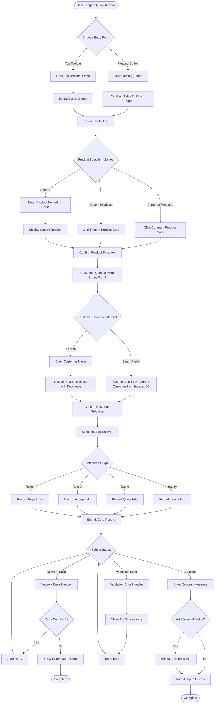
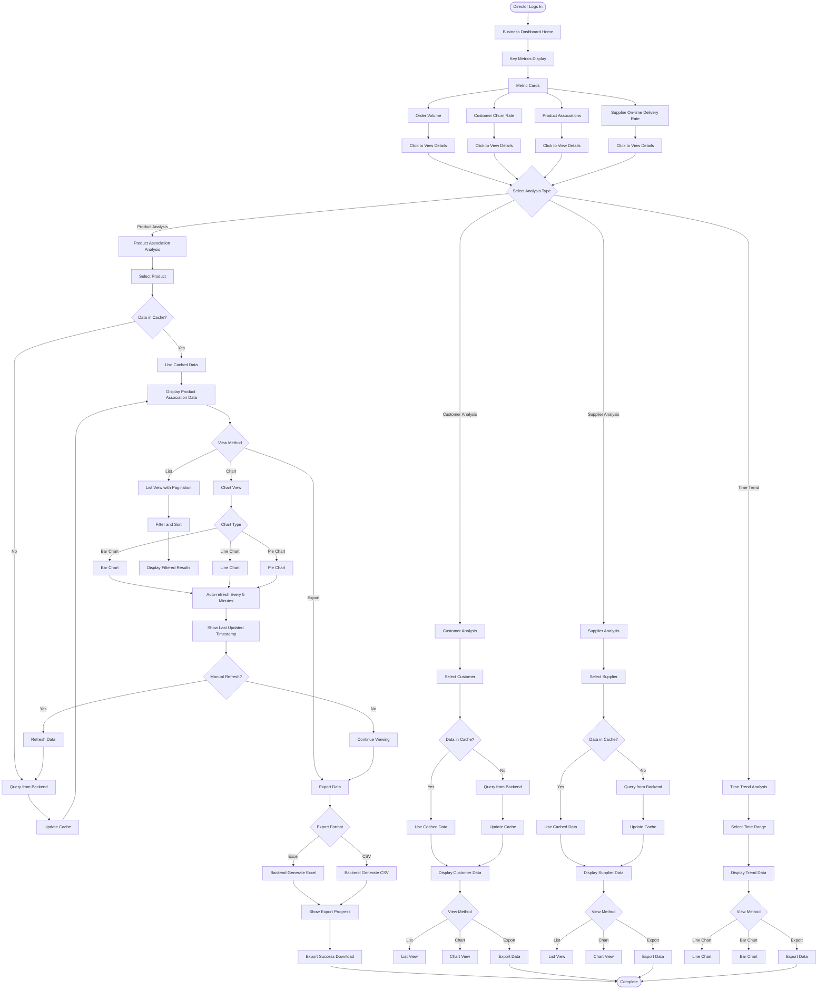
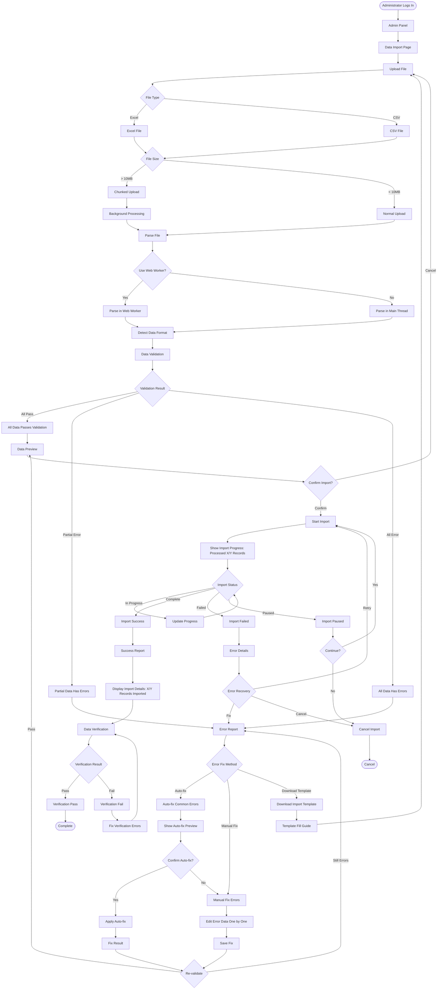

```mermaid
flowchart TD
    Start([Backend Specialist Opens Mobile]) --> Home[Mobile Home Page]
    Home --> QuickRecord[Click Quick Record]
    
    QuickRecord --> ProductSelect[Select Product]
    ProductSelect --> SupplierSelect[Select Supplier]
    
    SupplierSelect --> RecordType{Select Record Type}
    RecordType -->|Production Progress| ProductionFlow[Production Progress Flow]
    RecordType -->|Pre-shipment Inspection| InspectionFlow[Pre-shipment Inspection Flow]
    
    ProductionFlow --> ProgressInput[Input Progress Percentage]
    ProgressInput --> PhotoUpload[Upload Production Photos]
    PhotoUpload --> PhotoChoice{Photo Upload Method}
    PhotoChoice -->|Camera| Camera[Open Camera]
    PhotoChoice -->|Gallery| Gallery[Select from Gallery]
    
    Camera --> PhotoPreview[Photo Preview]
    Gallery --> PhotoPreview
    
    PhotoPreview --> PhotoConfirm{Confirm Photo}
    PhotoConfirm -->|Retake| Camera
    PhotoConfirm -->|Confirm| PhotoSave[Save Photo to IndexedDB]
    
    PhotoSave --> Notes[Fill Notes]
    Notes --> SubmitProgress{Submit Progress}
    
    SubmitProgress -->|Online| OnlineSubmit[Online Submit]
    SubmitProgress -->|Offline| OfflineSave[Save to Offline Queue]
    
    OnlineSubmit --> ProgressSuccess[Show Success Message]
    OfflineSave --> OfflineStatus[Show Offline Status: Saved to Local, Will Auto-sync]
    OfflineStatus --> OfflineCount[Display Saved Record Count]
    
    OfflineCount --> NetworkCheck{Network Recovered?}
    NetworkCheck -->|Yes| AutoSync[Auto Sync with Conflict Resolution]
    NetworkCheck -->|No| Wait[Wait for Network]
    
    AutoSync --> SyncCheck{Conflict Detected?}
    SyncCheck -->|Yes| ConflictResolve{Conflict Resolution}
    ConflictResolve -->|Last Write Wins| LastWrite[Use Last Write]
    ConflictResolve -->|User Choice| UserChoice[Ask User to Choose]
    
    LastWrite --> SyncSuccess[Sync Success]
    UserChoice --> SyncSuccess
    SyncCheck -->|No| SyncSuccess
    
    Wait --> NetworkCheck
    
    ProgressSuccess --> End1([Complete])
    SyncSuccess --> End1
    
    InspectionFlow --> InspectionPhoto[Upload Inspection Photos Max 10]
    InspectionPhoto --> PhotoCount{Photo Count}
    PhotoCount -->|Single| SinglePhoto[Upload Single Photo]
    PhotoCount -->|Multiple| BatchPhoto[Batch Upload Photos Max 10]
    
    SinglePhoto --> PhotoPreview2[Photo Preview]
    BatchPhoto --> PhotoPreview2
    
    PhotoPreview2 --> PhotoEdit{Photo Edit}
    PhotoEdit -->|Annotate| Annotation[Add Annotation]
    PhotoEdit -->|Sort| Sort[Drag to Sort]
    PhotoEdit -->|Delete| Delete[Delete Photo]
    
    Annotation --> PhotoConfirm2[Confirm Photos]
    Sort --> PhotoConfirm2
    Delete --> PhotoConfirm2
    
    PhotoConfirm2 --> ResultInput[Input Inspection Result]
    ResultInput --> ResultChoice{Inspection Result}
    ResultChoice -->|Pass| Pass[Record Pass]
    ResultChoice -->|Fail| Fail[Record Fail]
    
    Pass --> IssueMark{Any Issues?}
    Fail --> IssueMark
    
    IssueMark -->|Yes| IssueInput[Record Issue Details]
    IssueMark -->|No| SubmitInspection{Submit Inspection}
    
    IssueInput --> IssuePhoto[Upload Issue Photos]
    IssuePhoto --> SubmitInspection
    
    SubmitInspection -->|Online| OnlineSubmit2[Online Submit]
    SubmitInspection -->|Offline| OfflineSave2[Save to Offline Queue]
    
    OnlineSubmit2 --> InspectionSuccess[Show Success Message]
    OfflineSave2 --> OfflineStatus2[Show Offline Status]
    OfflineStatus2 --> OfflineCount2[Display Saved Record Count]
    
    OfflineCount2 --> NetworkCheck2{Network Recovered?}
    NetworkCheck2 -->|Yes| AutoSync2[Auto Sync]
    NetworkCheck2 -->|No| Wait2[Wait for Network]
    
    AutoSync2 --> SyncSuccess2[Sync Success]
    Wait2 --> NetworkCheck2
    
    InspectionSuccess --> End2([Complete])
    SyncSuccess2 --> End2
```

# UX Design Specification fenghua-crm

**Author:** Travis_z
**Date:** 2025-12-23

---

## Executive Summary

### Project Vision

fenghua-crm 是一个基于 Twenty CRM 的定制化 CRM 系统，专为进出口公司设计。系统的核心差异化点是**产品驱动的业务流程记录**，所有客户互动都关联到具体产品，形成完整的产品-客户-互动链条。系统旨在解决当前客户数据分散、交互记录缺失的问题，提升销售效率、降低客户流失率，并确保业务流程的完整记录。

**核心价值主张：**
- 产品驱动的业务流程完整记录（所有互动关联到产品）
- 行业特定的角色权限设计（前端/后端专员数据完全隔离）
- 快速记录功能（减少数据录入工作量）
- 产品-客户-互动三维关联查询
- 基于成熟平台的快速实现（Twenty CRM）

### Target Users

**1. 管理员（Administrator）**
- **使用场景：** 系统配置、用户管理、数据导入导出（从 Excel 导入客户数据）、全局数据分析、产品管理
- **核心需求：** 完整的系统控制权，数据安全审计能力，确保业务流程记录完整
- **UX 重点：** 系统管理界面、数据导入导出流程、用户管理界面

**2. 总监（Director）**
- **使用场景：** 业务决策、销售数据分析、客户流失预警、团队绩效管理、业务流程监控、产品-客户关联分析
- **核心需求：** 全面的业务洞察，数据驱动的决策支持，确保业务节点和流程得到记录
- **UX 重点：** 业务仪表板、数据分析可视化、产品关联分析界面

**3. 前端专员（采购业务）**
- **使用场景：** 管理采购商信息、查看采购商历史交互记录（产品关联）、记录与采购商的互动、查看某个产品与哪些采购商有关联
- **核心需求：** 专注于采购业务，不受供应商数据干扰，快速查找客户和历史记录，完整记录产品相关的采购商互动
- **UX 重点：** 快速记录功能（任何地方都能访问）、产品-采购商关联查询（简化操作）、客户搜索界面、移动端支持（MVP 必须，用于外出时快速查看）
- **用户反馈优先级：** 产品关联操作必须简单快捷，快速记录需要支持快捷键和语音输入（Growth 阶段）

**4. 后端专员（供应业务）**
- **使用场景：** 管理供应商信息、查看供应商历史交互记录（产品关联）、记录与供应商的互动（包括生产进度跟进、发货前验收）、查看某个产品与哪些供应商有关联
- **核心需求：** 专注于供应业务，不受采购商数据干扰，快速查找客户和历史记录，完整记录产品相关的供应商互动，包括生产进度跟进和发货前验收等关键环节
- **UX 重点：** 快速记录功能、生产进度跟进界面（移动端优化）、发货前验收界面（支持多张照片上传、预览、标注、拖拽排序）、移动端支持（MVP 必须，工厂现场使用）
- **用户反馈优先级：** 移动端支持是日常工作必需，不是可选功能；移动端在线记录支持手机网络（工厂现场使用）

### Key Design Challenges

**1. 产品关联的认知负荷和易用性（第一性原理：简单性）**
- **挑战：** 用户需要理解"产品-客户-互动"的三维关联，这是核心差异化但也是最大的 UX 挑战。用户担心操作太复杂，影响使用意愿。**隐藏假设：** 用户总是知道要关联哪个产品。**第一性原理：** 产品关联只需要一个产品选择字段，支持搜索和快速选择。
- **设计考虑：**
  - **简化产品选择：** 产品选择应该超级简单，支持记住常用产品，一键选择
  - **智能产品建议：** 基于历史数据自动建议关联产品，优先显示历史关联的产品
  - **多产品关联支持：** 允许用户在一次互动中关联多个产品（如果用户不确定，可以关联多个）
  - **产品搜索和智能建议：** 支持模糊搜索、类别搜索、历史关联产品优先显示
  - **产品快速选择：** 支持常用产品一键选择、最近使用产品快速访问
  - **产品关联确认：** 在记录互动时，如果用户不确定，提供产品建议和确认机制
  - **清晰的视觉层次：** 产品作为主要入口，客户和互动作为关联信息
  - **直观的导航模式：** 从产品→客户→互动，或从客户→产品→互动
  - **上下文提示：** 在记录互动时，产品选择应该是首要且明显的
  - **快速访问：** 常用产品应该支持快速访问，减少输入时间

**2. 数据隔离的用户感知和协作机制（第一性原理：简单过滤）**
- **挑战：** 前端/后端专员的数据隔离需要清晰传达，避免用户困惑。**隐藏假设：** 用户理解并接受数据隔离。**第一性原理：** 数据隔离只需要在查询时根据用户角色过滤数据，不需要复杂的权限配置。
- **设计考虑：**
  - **权限说明和引导：** 在用户首次使用时，清晰说明数据隔离的原因和好处
  - **明确的权限提示：** 在界面上明确显示"您只能查看采购商数据"或"您只能查看供应商数据"
  - **空状态设计：** 当用户搜索时，如果结果为空，应该明确说明是因为权限限制还是真的没有数据
  - **角色标识：** 在界面顶部或侧边栏显示当前用户角色
  - **避免显示不可访问的数据入口：** 不显示用户无法访问的功能入口
  - **协作机制（不破坏隔离）：** 支持前端/后端专员通过系统消息或通知进行协作，但不直接访问对方数据（Growth 阶段）
  - **临时权限申请（Growth 阶段）：** 支持用户申请临时查看其他角色数据的权限，需要管理员批准

**3. 快速记录的交互设计和便捷性（极简设计，第一性原理：最少字段）**
- **挑战：** 快速记录是提升效率的关键功能，需要减少数据录入工作量。用户需要在任何地方都能快速访问。**隐藏假设：** 用户总是有时间记录。**第一性原理：** 快速记录只需要最少字段（产品、客户、互动类型、时间），其他字段可选。
- **设计考虑：**
  - **极简记录流程：** 最少字段记录（产品、客户、互动类型、时间），其他信息可选
  - **便捷访问：** 快速记录应该在任何地方都能访问（客户详情页面、搜索结果页面、产品页面等）
  - **快捷键支持：** 支持键盘快捷键，提升操作效率（Growth 阶段）
  - **一键快速记录入口：** 在主要页面都有快速记录按钮，支持浮动按钮
  - **智能表单：** 基于历史数据预填充，减少输入
  - **产品自动完成：** 输入产品名称时，优先显示历史关联的产品
  - **快速记录模板：** 预设的互动类型和字段
  - **语音输入支持：** 移动端支持语音输入，减少打字工作量（Growth 阶段）
  - **自动记录建议：** 基于用户行为自动建议记录（如：检测到用户与客户通话，建议记录）（Growth 阶段）

**4. 基于 Twenty CRM 的设计约束**
- **挑战：** 基于 Twenty CRM 平台，需要平衡定制化和一致性
- **设计考虑：**
  - UI 组件复用：尽可能复用 Twenty CRM 的现有组件
  - 设计系统一致性：保持与 Twenty CRM 设计系统的一致性
  - 定制化边界：明确哪些可以定制，哪些需要遵循 Twenty CRM 的设计模式

**5. 性能对 UX 的影响（优化目标）**
- **挑战：** NFR 要求响应时间 < 10 秒（客户查找）、< 15 秒（产品关联查询）。**隐藏假设：** 10-15秒的响应时间是可以接受的。
- **设计考虑：**
  - **性能优化目标：** 优化查询性能，目标响应时间 < 5 秒（客户查找）、< 8 秒（产品关联查询）
  - **加载状态设计：** 在查询时提供清晰的加载反馈（如：正在查询... 已找到 50 条记录）
  - **渐进式加载：** 先显示基础信息，再加载详细信息
  - **后台查询支持：** 支持后台查询，用户可以继续其他操作，查询完成后通知（Growth 阶段）
  - **缓存策略：** 常用数据缓存，提升响应速度
  - **超时处理和重试：** 如果查询超时，提供"稍后重试"选项，保存查询状态

**6. 移动端体验优化（MVP 必须，功能平衡，第一性原理：核心功能优先）**
- **挑战：** 后端专员需要移动端记录生产进度和验收，这是日常工作必需，不是可选功能。工厂网络可能不稳定，需要支持手机网络和自动重试。**隐藏假设：** 移动端支持就足够了。**第一性原理：** 移动端只需要核心功能（记录互动、查看历史、照片上传），其他功能可以省略或简化。
- **设计考虑：**
  - **核心功能优先：** 移动端优先支持核心功能（记录互动、查看历史、照片上传）
  - **移动优先设计：** 关键功能（记录生产进度、验收）在移动端应该特别优化
  - **功能渐进式加载：** 移动端支持渐进式功能加载，根据用户需求逐步提供更多功能
  - **照片上传体验优化：**
    - 多张照片上传应该流畅，支持拖拽排序
    - 照片预览和删除（拍错了要能删除）
    - 照片标注（哪张照片对应什么问题）
    - 批量上传和进度反馈
  - **移动端在线支持（MVP 必须）：**
    - 移动端在线记录生产进度（支持手机网络，流量消耗小）
    - 从相册选择图片/视频上传（使用手机原生相机）
    - 网络不稳定时的自动重试机制
    - 如果网络持续不稳定，用户可以选择稍后在办公室完成记录
    - **自动重试状态提示：** 显示重试状态（重试中、重试成功、重试失败），提供手动重试选项
    - **用户选择提示：** 如果网络持续不稳定，提示用户可以选择稍后在办公室完成记录
  - **网络状态提示：** 显示网络状态（连接中、上传中、上传成功/失败），提示用户当前操作状态
  - **移动端快速访问：** 支持移动端快速查看生产历史、客户信息

### Design Opportunities

**1. 产品驱动的可视化**
- **机会：** 通过时间线、关联图等方式展示产品-客户-互动关系
- **设计方向：**
  - 产品时间线视图：按时间顺序展示某个产品的所有互动
  - 产品关联图：可视化展示产品与客户的关联关系
  - 业务流程可视化：展示从询价到订单完成的完整流程

**2. 智能建议和自动化**
- **机会：** 基于历史数据自动建议关联产品和客户
- **设计方向：**
  - 建议的可见性：建议应该明显但不干扰用户操作
  - 建议的可控性：用户可以接受、拒绝或修改建议
  - 建议的反馈：用户接受建议后，系统应该学习并改进

**3. 快速操作入口**
- **机会：** 常用操作快速访问，提升效率
- **设计方向：**
  - 快捷操作入口：在主要页面提供常用操作的快速访问
  - 快捷操作自定义：用户可以选择常用操作
  - 快速参考卡片：常用操作快速访问

**4. 业务价值可视化（深度分析）**
- **机会：** 让用户看到系统的价值，提升采用率。总监需要更深入的数据分析和可视化。
- **设计方向：**
  - **业务仪表板（信息密度和自定义）：**
    - 一眼看到关键指标（订单量、转化率、客户流失率）
    - 支持自定义仪表板，让用户选择最关心的指标
    - 趋势分析（这个月 vs 上个月）
  - **产品关联分析（深度和可视化）：**
    - 产品-客户关联矩阵（哪些产品与哪些客户有关联）
    - 产品转化率分析（从询价到订单的转化率）
    - 产品趋势分析（哪些产品在增长，哪些在下降）
    - 支持多维度分析（时间、客户、产品类别）
  - **数据导出便利性：**
    - 快速导出分析结果（一键导出）
    - 导出格式选择（Excel、PDF、图表）
    - 定期自动导出（每周自动发送报表，Growth 阶段）
  - **成功指标展示：** 显示用户的工作效率提升、订单转化率等

**5. 迁移体验设计（用户迁移的关键，质量保证，第一性原理：接受不完美）**
- **机会：** 平滑的从 Excel 迁移到 CRM 的体验，这是用户采用系统的关键。**隐藏假设：** 数据导入能解决所有问题。**第一性原理：** 数据导入可以接受不完美的数据，提供清理和修复工具，不需要完美的数据质量。
- **设计方向：**
  - **清晰的导入步骤：** Excel 导入流程应该分步骤显示（步骤 1、2、3...），每步都有说明
  - **实时进度反馈：** 显示导入进度（已导入 500/1000 条），让用户知道进度
  - **导入预览：** 导入前能看到数据映射关系，用户可以调整映射
  - **数据验证和清理：** 在导入前验证数据格式、完整性、重复性，提供清理建议
  - **模板提供：** 提供 Excel 导入模板，包含示例数据和字段说明
  - **分批导入支持：** 支持分批导入，用户可以分多次导入数据
  - **错误处理和修复建议：** 导入失败时，提供清晰的错误信息（第 10 行数据格式错误）和修复建议
  - **导入历史查看：** 让用户知道哪些数据已经导入，哪些失败了，支持重新导入失败记录
  - **导入流程控制：** 支持暂停、恢复、批量修复操作

**6. 角色定制化界面**
- **机会：** 不同角色看到不同的功能入口和界面布局
- **设计方向：**
  - 角色定制化界面：不同角色看到不同的功能入口和界面布局
  - 工作流程优化：前端专员关注采购商流程，后端专员关注供应商流程
  - 数据展示优先级：根据角色显示最相关的数据

**7. 上下文帮助和引导（用户采用的关键）**
- **机会：** 降低学习成本，提升用户采用率。**隐藏假设：** 用户会主动学习系统。**风险场景：** 用户完全拒绝使用系统。
- **设计方向：**
  - **新用户引导流程：** 分步骤引导用户完成首次使用（创建客户、记录互动、查看历史）
  - **简化学习曲线：** 提供快速参考卡片、常用操作提示、上下文帮助
  - **渐进式功能释放：** 不要一次性展示所有功能，逐步引导用户使用
  - **快速价值展示：** 在用户首次使用时，立即展示系统价值（如：快速查找客户、查看历史记录）
  - **及时帮助支持：** 支持在线帮助、视频教程、常见问题解答
  - **成功指标展示：** 显示用户的工作效率提升，让用户看到系统价值
  - **上下文帮助：** 在需要时显示帮助信息（如：首次使用产品关联功能时显示提示）
  - **帮助文档访问：** 所有用户可以访问帮助文档和用户指南
  - **用户反馈机制：** 收集用户反馈，持续改进系统

### User Feedback Priorities（基于用户角色焦点小组、苏格拉底式提问、假设场景分析和第一性原理）

**高优先级（MVP 必须）：**
1. **移动端支持**：后端专员的关键功能，工厂现场使用，不是可选功能
2. **离线支持和冲突解决**：工厂网络不稳定，必须支持离线记录和同步，需要冲突检测和解决机制（风险场景：移动端网络完全不可用）
3. **产品关联的简化设计**：降低认知负荷，支持常用产品一键选择、多产品关联、产品搜索和智能建议（风险场景：产品关联功能太复杂、产品数据量巨大）
4. **快速记录的便捷访问和极简设计**：任何地方都能访问，最少字段记录（产品、客户、互动类型、时间），其他信息可选
5. **数据导入的用户体验优化和质量保证**：用户迁移的关键，需要清晰的步骤、进度反馈、错误处理、数据验证和清理、模板提供、分批导入支持（风险场景：数据导入完全失败）
6. **照片上传体验优化**：支持多张照片、预览、删除、标注、拖拽排序
7. **性能优化**：目标响应时间 < 5 秒（客户查找）、< 8 秒（产品关联查询），提供进度反馈和后台查询支持（风险场景：系统性能严重下降）
8. **用户采用引导设计**：新用户引导流程、快速价值展示、渐进式功能释放、成功指标展示（风险场景：用户完全拒绝使用系统）

**中优先级（MVP 重要）：**
1. **业务仪表板的信息密度和自定义**：总监需要一眼看到关键指标
2. **产品关联分析的深度和可视化**：支持多维度分析（时间、客户、产品类别）
3. **系统健康监控的可视化**：管理员需要实时监控系统状态（风险场景：系统性能严重下降）
4. **数据隔离的权限说明和协作机制**：清晰说明数据隔离的原因和好处，支持协作机制（不破坏隔离）（风险场景：用户角色权限设计不合理、紧急权限需求）
5. **产品搜索和分类优化**：支持产品分类和筛选、产品收藏功能、产品数据分页（风险场景：产品数据量巨大）

**低优先级（Growth 阶段）：**
1. **语音输入和快捷模板**：提升快速记录效率
2. **定期自动导出和邮件发送**：自动化报表功能
3. **权限测试工具**：管理员测试权限的工具（风险场景：用户角色权限设计不合理）
4. **自动记录建议**：基于用户行为自动建议记录
5. **临时权限申请机制**：支持用户申请临时查看其他角色数据的权限（风险场景：紧急权限需求）
6. **后台查询支持**：支持后台查询，用户可以继续其他操作
7. **AI 分析透明度和可编辑性**：显示 AI 分析的依据和置信度，用户可以编辑 AI 分析结果（风险场景：AI 分析功能不准确）
8. **多语言质量保证和反馈机制**：提供多语言翻译质量检查，用户可以反馈翻译问题（风险场景：多语言支持不完善）

---

## Socratic Questioning Analysis（苏格拉底式提问分析）

### Questions（问题）

**1. 关于产品关联的假设：**
- **Q1.1：** 我们假设用户总是知道要关联哪个产品，但如果用户不确定呢？如果用户正在与客户讨论多个产品，系统如何帮助用户选择正确的产品？
- **Q1.2：** 我们假设产品选择是简单的，但如果用户有数百个产品，如何快速找到正确的产品？
- **Q1.3：** 我们假设用户总是记得产品的准确名称，但如果用户只记得产品的大致类别或描述，系统如何帮助？

**2. 关于数据隔离的假设：**
- **Q2.1：** 我们假设用户理解为什么数据被隔离，但如果用户不理解，如何解释？如果用户需要临时查看其他角色的数据，如何处理？
- **Q2.2：** 我们假设数据隔离不会影响协作，但如果前端专员需要与后端专员协作，如何在不破坏数据隔离的情况下实现？

**3. 关于快速记录的假设：**
- **Q3.1：** 我们假设用户总是有时间记录，但如果用户很忙，如何简化记录流程？如果用户正在与客户通话，如何快速记录？
- **Q3.2：** 我们假设快速记录是用户的首要任务，但如果用户认为记录是负担，如何改变这种认知？

**4. 关于性能的假设：**
- **Q4.1：** 我们假设10-15秒的响应时间是可以接受的，但如果用户觉得太慢，如何优化？如果用户正在等待查询结果，如何保持用户参与度？
- **Q4.2：** 我们假设用户会等待查询完成，但如果用户放弃等待，如何恢复查询状态？

**5. 关于用户采用的假设：**
- **Q5.1：** 我们假设用户会采用系统，但如果用户不愿意改变工作流程，如何引导？如果用户认为系统太复杂，如何简化？
- **Q5.2：** 我们假设用户会主动学习系统，但如果用户需要帮助，如何提供及时的帮助？

**6. 关于移动端支持的假设：**
- **Q6.1：** 我们假设移动端支持就足够了，但如果用户需要更多功能，如何平衡？如果移动端功能受限，如何确保用户不会感到沮丧？
- **Q6.2：** 我们假设移动端用户总是有网络连接，但如果用户在没有网络的情况下需要查看数据，如何处理？

**7. 关于移动端网络处理的假设：**
- **Q7.1：** 我们假设手机网络能解决所有问题，但如果网络持续不稳定，如何处理？如果上传失败，如何重试？
- **Q7.2：** 我们假设用户会使用手机网络记录，但如果用户选择稍后记录，如何确保数据不丢失？

**8. 关于数据导入的假设：**
- **Q8.1：** 我们假设数据导入能解决所有问题，但如果数据质量差，如何处理？如果用户不知道如何准备数据，如何帮助？
- **Q8.2：** 我们假设用户会一次性导入所有数据，但如果用户需要分批导入，如何处理？

### Revelations（揭示的隐藏假设）

**1. 产品关联的隐藏假设：**
- **假设：** 用户总是知道要关联哪个产品
- **现实：** 用户可能不确定，或者正在讨论多个产品
- **启示：** 需要支持多产品关联、产品搜索和智能建议

**2. 数据隔离的隐藏假设：**
- **假设：** 用户理解并接受数据隔离
- **现实：** 用户可能不理解，或者需要临时协作
- **启示：** 需要清晰的权限说明、协作机制（不破坏隔离）

**3. 快速记录的隐藏假设：**
- **假设：** 用户总是有时间记录
- **现实：** 用户可能很忙，或者认为记录是负担
- **启示：** 需要极简记录流程、语音输入、自动记录建议

**4. 性能的隐藏假设：**
- **假设：** 10-15秒的响应时间是可以接受的
- **现实：** 用户可能觉得太慢，或者放弃等待
- **启示：** 需要优化性能、提供进度反馈、支持后台查询

**5. 用户采用的隐藏假设：**
- **假设：** 用户会主动采用系统
- **现实：** 用户可能不愿意改变工作流程
- **启示：** 需要引导流程、简化学习曲线、提供及时帮助

**6. 移动端支持的隐藏假设：**
- **假设：** 移动端支持就足够了
- **现实：** 用户可能需要更多功能，或者没有网络
- **启示：** 需要功能平衡、移动端网络处理、网络状态提示

**7. 移动端网络处理的隐藏假设：**
- **假设：** 手机网络能解决所有问题
- **现实：** 同步可能失败，或者数据冲突
- **启示：** 需要冲突解决机制、同步状态提示、数据验证

**8. 数据导入的隐藏假设：**
- **假设：** 数据导入能解决所有问题
- **现实：** 数据质量可能差，或者用户不知道如何准备
- **启示：** 需要数据验证、模板提供、分批导入支持

### Understanding（改进后的理解）

**1. 产品关联的增强设计：**
- **多产品关联支持：** 允许用户在一次互动中关联多个产品
- **产品搜索和智能建议：** 支持模糊搜索、类别搜索、历史关联产品优先显示
- **产品快速选择：** 支持常用产品一键选择、最近使用产品快速访问
- **产品关联确认：** 在记录互动时，如果用户不确定，提供产品建议和确认机制

**2. 数据隔离的协作机制：**
- **权限说明和引导：** 在用户首次使用时，清晰说明数据隔离的原因和好处
- **协作机制（不破坏隔离）：** 支持前端/后端专员通过系统消息或通知进行协作，但不直接访问对方数据
- **临时权限申请（Growth 阶段）：** 支持用户申请临时查看其他角色数据的权限，需要管理员批准

**3. 快速记录的极简设计：**
- **极简记录流程：** 最少字段记录（产品、客户、互动类型、时间），其他信息可选
- **语音输入支持：** 移动端支持语音输入，减少打字工作量
- **自动记录建议：** 基于用户行为自动建议记录（如：检测到用户与客户通话，建议记录）
- **快速记录模板：** 预设常用互动类型，一键选择

**4. 性能优化的用户体验：**
- **性能优化：** 优化查询性能，目标响应时间 < 5 秒（客户查找）、< 8 秒（产品关联查询）
- **进度反馈：** 在查询时提供清晰的进度反馈（如：正在查询... 已找到 50 条记录）
- **后台查询支持：** 支持后台查询，用户可以继续其他操作，查询完成后通知
- **超时处理和重试：** 如果查询超时，提供"稍后重试"选项，保存查询状态

**5. 用户采用的引导设计：**
- **新用户引导流程：** 分步骤引导用户完成首次使用（创建客户、记录互动、查看历史）
- **简化学习曲线：** 提供快速参考卡片、常用操作提示、上下文帮助
- **及时帮助支持：** 支持在线帮助、视频教程、常见问题解答
- **成功指标展示：** 显示用户的工作效率提升，让用户看到系统价值

**6. 移动端支持的功能平衡：**
- **核心功能优先：** 移动端优先支持核心功能（记录互动、查看历史、照片上传）
- **功能渐进式加载：** 移动端支持渐进式功能加载，根据用户需求逐步提供更多功能
- **网络状态提示：** 显示网络状态（连接中、上传中、上传成功/失败），提示用户当前操作状态
- **移动端在线功能支持：** 支持移动端在线查看历史记录、在线记录互动、从相册上传照片

**7. 移动端网络处理的自动重试：**
- **自动重试机制：** 网络不稳定时自动重试上传，提供清晰的状态反馈，用户可以选择稍后记录
- **同步状态提示：** 显示同步状态（同步中、同步成功、同步失败），提供重试选项
- **数据验证：** 在同步前验证数据完整性，确保数据质量
- **同步历史查看：** 支持查看同步历史，了解同步状态和错误信息

**8. 数据导入的质量保证：**
- **数据验证和清理：** 在导入前验证数据格式、完整性、重复性，提供清理建议
- **模板提供：** 提供 Excel 导入模板，包含示例数据和字段说明
- **分批导入支持：** 支持分批导入，用户可以分多次导入数据
- **导入预览和映射：** 导入前预览数据，用户可以调整字段映射
- **错误处理和修复：** 导入失败时，提供清晰的错误信息和修复建议，支持批量修复

---

## What If Scenarios Analysis（假设场景分析）

### Scenarios（场景）

**场景 1：用户完全拒绝使用系统**
- **假设：** 用户认为系统太复杂，或者不愿意改变工作流程，完全拒绝使用系统
- **可能性：** 中等（特别是对于习惯使用 Excel 的用户）
- **影响：**
  - 系统采用率低，无法实现业务目标
  - 数据仍然分散，问题未解决
  - 投资回报率低

**场景 2：产品关联功能太复杂，用户无法理解**
- **假设：** 用户无法理解产品关联的概念，或者认为操作太复杂，放弃使用产品关联功能
- **可能性：** 高（这是核心差异化功能，但也是最复杂的）
- **影响：**
  - 核心功能未使用，系统价值未实现
  - 数据仍然不完整，无法追踪产品-客户关联
  - 用户满意度低

**场景 3：移动端网络完全不可用**
- **假设：** 后端专员在工厂现场，网络完全不可用，无法使用系统
- **可能性：** 高（工厂网络经常不稳定）
- **影响：**
  - 无法记录生产进度和验收
  - 数据丢失，业务流程记录不完整
  - 用户无法完成工作

**场景 4：数据导入完全失败**
- **假设：** 用户尝试导入 Excel 数据，但导入完全失败，或者数据质量太差，无法使用
- **可能性：** 中等（特别是对于数据质量差的 Excel 文件）
- **影响：**
  - 用户无法迁移数据，系统无法使用
  - 用户需要手动重新输入数据，工作量巨大
  - 用户对系统失去信心

**场景 5：系统性能严重下降**
- **假设：** 系统响应时间超过 30 秒，或者查询完全超时
- **可能性：** 中等（特别是当数据量增长时）
- **影响：**
  - 用户体验极差，无法完成工作
  - 用户放弃使用系统
  - 系统可用性低

**场景 6：用户角色权限设计不合理**
- **假设：** 用户需要查看其他角色的数据，但系统不允许，导致工作受阻
- **可能性：** 中等（特别是对于需要协作的场景）
- **影响：**
  - 用户无法完成工作
  - 用户对系统不满
  - 可能需要绕过系统，使用其他工具

**场景 7：AI 分析功能不准确**
- **假设：** AI 分析结果不准确，或者用户不信任 AI 分析
- **可能性：** 中等（AI 分析依赖于数据质量）
- **影响：**
  - 用户不信任系统
  - AI 功能未使用，投资浪费
  - 用户满意度低

**场景 8：用户需要紧急查看其他角色的数据**
- **假设：** 前端专员需要紧急查看供应商数据，或者后端专员需要紧急查看采购商数据
- **可能性：** 低（但一旦发生，影响严重）
- **影响：**
  - 工作受阻，无法及时响应
  - 用户对系统不满
  - 可能需要绕过系统

**场景 9：产品数据量巨大，搜索和选择困难**
- **假设：** 公司有数千个产品，用户无法快速找到正确的产品
- **可能性：** 高（随着业务增长，产品数量会增加）
- **影响：**
  - 产品关联功能无法使用
  - 用户放弃使用产品关联
  - 数据不完整

**场景 10：多语言支持不完善**
- **假设：** 系统支持多语言，但翻译不准确，或者某些功能不支持多语言
- **可能性：** 中等（多语言支持是复杂的功能）
- **影响：**
  - 用户体验差
  - 用户无法理解系统
  - 国际化目标未实现

### Implications（影响分析）

**1. 用户采用失败的影响：**
- **业务影响：** 系统无法实现业务目标，投资回报率低
- **技术影响：** 系统未使用，技术债务增加
- **用户影响：** 用户对系统失去信心，难以恢复

**2. 核心功能未使用的影响：**
- **业务影响：** 核心价值未实现，系统差异化优势丧失
- **技术影响：** 功能开发浪费，需要重新设计
- **用户影响：** 用户认为系统无用，放弃使用

**3. 移动端不可用的影响：**
- **业务影响：** 关键业务流程无法记录，数据不完整
- **技术影响：** 离线支持功能未实现或不足
- **用户影响：** 用户无法完成工作，对系统不满

**4. 数据导入失败的影响：**
- **业务影响：** 用户无法迁移数据，系统无法使用
- **技术影响：** 数据导入功能需要改进
- **用户影响：** 用户需要手动输入数据，工作量巨大

**5. 性能严重下降的影响：**
- **业务影响：** 系统无法使用，业务受阻
- **技术影响：** 需要性能优化，可能需要架构调整
- **用户影响：** 用户体验极差，放弃使用

**6. 权限设计不合理的影响：**
- **业务影响：** 工作受阻，协作困难
- **技术影响：** 需要重新设计权限系统
- **用户影响：** 用户对系统不满，可能需要绕过系统

**7. AI 分析不准确的影响：**
- **业务影响：** 决策基于错误数据，业务风险增加
- **技术影响：** AI 功能需要改进，可能需要重新训练模型
- **用户影响：** 用户不信任系统，AI 功能未使用

**8. 紧急权限需求的影响：**
- **业务影响：** 工作受阻，无法及时响应
- **技术影响：** 需要实现临时权限机制
- **用户影响：** 用户对系统不满，可能需要绕过系统

**9. 产品数据量巨大的影响：**
- **业务影响：** 产品关联功能无法使用，核心功能失效
- **技术影响：** 需要优化搜索和选择功能
- **用户影响：** 用户放弃使用产品关联，数据不完整

**10. 多语言支持不完善的影响：**
- **业务影响：** 国际化目标未实现
- **技术影响：** 需要改进多语言支持
- **用户影响：** 用户体验差，无法理解系统

### Design Adaptations（设计适应方案）

**1. 用户采用失败的设计适应：**
- **简化学习曲线：** 提供分步骤的新用户引导，从最简单的功能开始
- **快速价值展示：** 在用户首次使用时，立即展示系统价值（如：快速查找客户、查看历史记录）
- **渐进式功能释放：** 不要一次性展示所有功能，逐步引导用户使用
- **成功指标展示：** 显示用户的工作效率提升，让用户看到系统价值
- **用户支持：** 提供及时帮助、视频教程、常见问题解答

**2. 产品关联功能太复杂的设计适应：**
- **极简产品选择：** 支持常用产品一键选择、最近使用产品快速访问
- **智能产品建议：** 基于历史数据自动建议关联产品
- **多产品关联支持：** 允许用户在一次互动中关联多个产品（如果用户不确定）
- **产品搜索优化：** 支持模糊搜索、类别搜索、历史关联产品优先显示
- **产品关联确认：** 在记录互动时，如果用户不确定，提供产品建议和确认机制
- **可视化引导：** 提供产品关联的可视化示例和引导

**3. 移动端网络持续不稳定的设计适应：**
- **移动端在线支持（MVP 必须）：**
  - 移动端在线记录生产进度（支持手机网络，流量消耗小）
  - 从相册选择图片/视频上传（使用手机原生相机）
  - 网络不稳定时的自动重试机制
  - 如果网络持续不稳定，用户可以选择稍后在办公室完成记录
- **网络状态提示：** 显示网络状态（连接中、上传中、上传成功/失败），提示用户当前操作状态
- **自动重试状态提示：** 显示重试状态（重试中、重试成功、重试失败），提供手动重试选项
- **用户选择提示：** 如果网络持续不稳定，提示用户可以选择稍后在办公室完成记录

**4. 数据导入完全失败的设计适应：**
- **数据验证和清理：** 在导入前验证数据格式、完整性、重复性，提供清理建议
- **模板提供：** 提供 Excel 导入模板，包含示例数据和字段说明
- **导入预览：** 导入前预览数据，用户可以调整字段映射
- **分批导入支持：** 支持分批导入，用户可以分多次导入数据
- **错误处理和修复：** 导入失败时，提供清晰的错误信息和修复建议，支持批量修复
- **导入历史查看：** 让用户知道哪些数据已经导入，哪些失败了，支持重新导入失败记录
- **手动输入支持：** 如果导入失败，提供简单的手动输入界面

**5. 系统性能严重下降的设计适应：**
- **性能优化目标：** 优化查询性能，目标响应时间 < 5 秒（客户查找）、< 8 秒（产品关联查询）
- **进度反馈：** 在查询时提供清晰的进度反馈（如：正在查询... 已找到 50 条记录）
- **后台查询支持：** 支持后台查询，用户可以继续其他操作，查询完成后通知
- **超时处理和重试：** 如果查询超时，提供"稍后重试"选项，保存查询状态
- **缓存策略：** 常用数据缓存，提升响应速度
- **渐进式加载：** 先显示基础信息，再加载详细信息
- **性能监控：** 实时监控系统性能，及时发现性能问题

**6. 用户角色权限设计不合理的设计适应：**
- **权限说明和引导：** 在用户首次使用时，清晰说明数据隔离的原因和好处
- **协作机制（不破坏隔离）：** 支持前端/后端专员通过系统消息或通知进行协作，但不直接访问对方数据（Growth 阶段）
- **临时权限申请（Growth 阶段）：** 支持用户申请临时查看其他角色数据的权限，需要管理员批准
- **权限测试工具：** 管理员可以测试权限设置，确保权限设计合理
- **权限反馈机制：** 用户可以反馈权限问题，管理员可以调整权限设置

**7. AI 分析功能不准确的设计适应：**
- **AI 分析透明度：** 显示 AI 分析的依据和置信度，让用户了解分析的可靠性
- **AI 分析可编辑：** 用户可以编辑 AI 分析结果，系统学习用户反馈
- **AI 分析可选：** AI 分析是可选的，用户可以选择使用或不使用
- **AI 分析验证：** 提供 AI 分析结果的验证机制，用户可以确认或拒绝分析结果
- **AI 分析改进：** 基于用户反馈持续改进 AI 分析准确性

**8. 紧急权限需求的设计适应：**
- **临时权限申请（Growth 阶段）：** 支持用户申请临时查看其他角色数据的权限，需要管理员批准
- **紧急权限机制（Growth 阶段）：** 支持紧急权限申请，管理员可以快速批准
- **权限申请通知：** 权限申请时，通知管理员，支持快速响应
- **权限使用记录：** 记录临时权限的使用情况，支持审计

**9. 产品数据量巨大的设计适应：**
- **产品搜索优化：** 支持模糊搜索、类别搜索、历史关联产品优先显示
- **产品快速选择：** 支持常用产品一键选择、最近使用产品快速访问
- **产品分类和筛选：** 支持产品分类和筛选，帮助用户快速找到产品
- **产品收藏功能：** 支持用户收藏常用产品，快速访问
- **产品智能建议：** 基于历史数据自动建议关联产品
- **产品数据分页：** 支持产品数据分页，避免一次性加载所有产品

**10. 多语言支持不完善的设计适应：**
- **多语言支持优先级：** 优先支持核心功能的多语言，逐步扩展到所有功能
- **多语言质量保证：** 提供多语言翻译质量检查，确保翻译准确
- **多语言反馈机制：** 用户可以反馈翻译问题，系统持续改进
- **多语言切换：** 支持用户快速切换语言，无需重新登录
- **多语言帮助文档：** 提供多语言的帮助文档和用户指南

### Risk Mitigation Strategies（风险缓解策略）

**1. 用户采用失败的风险缓解：**
- **MVP 阶段：** 专注于核心功能，确保易用性
- **用户测试：** 在 MVP 阶段进行用户测试，收集反馈
- **持续改进：** 基于用户反馈持续改进系统

**2. 核心功能未使用的风险缓解：**
- **功能验证：** 在开发前验证功能设计的合理性
- **用户测试：** 在 MVP 阶段进行用户测试，验证功能易用性
- **功能简化：** 如果功能太复杂，简化设计

**3. 移动端不可用的风险缓解：**
- **移动端在线支持（MVP 必须）：** 确保移动端在线记录功能完整，支持手机网络和自动重试
- **网络状态检测：** 实时检测网络状态，提示用户
- **同步机制：** 确保同步机制可靠，支持冲突解决

**4. 数据导入失败的风险缓解：**
- **数据验证：** 在导入前验证数据质量
- **模板提供：** 提供导入模板，帮助用户准备数据
- **错误处理：** 提供清晰的错误信息和修复建议

**5. 性能严重下降的风险缓解：**
- **性能优化：** 持续优化系统性能
- **性能监控：** 实时监控系统性能，及时发现问题
- **性能测试：** 定期进行性能测试，确保性能达标

**6. 权限设计不合理的风险缓解：**
- **权限测试：** 在开发前测试权限设计
- **用户反馈：** 收集用户反馈，调整权限设计
- **权限灵活性：** 支持权限调整，适应业务变化

**7. AI 分析不准确的风险缓解：**
- **AI 验证：** 在发布前验证 AI 分析准确性
- **用户反馈：** 收集用户反馈，持续改进 AI 分析
- **AI 可选：** AI 分析是可选的，用户可以选择使用或不使用

**8. 紧急权限需求的风险缓解：**
- **临时权限机制：** 实现临时权限申请机制
- **快速响应：** 支持管理员快速响应权限申请

**9. 产品数据量巨大的风险缓解：**
- **搜索优化：** 优化产品搜索功能
- **分类和筛选：** 支持产品分类和筛选
- **数据分页：** 支持产品数据分页

**10. 多语言支持不完善的风险缓解：**
- **分阶段实现：** 分阶段实现多语言支持
- **质量保证：** 确保多语言翻译质量
- **用户反馈：** 收集用户反馈，持续改进

---

## First Principles Analysis（第一性原理分析）

### Fundamental Truths（基本事实）

**1. 用户的核心需求（不可妥协的事实）：**
- **事实 1.1：** 用户需要快速查找客户信息（当前痛点：Excel 查找困难）
- **事实 1.2：** 用户需要查看历史交互记录（当前痛点：记录缺失或分散在邮件中）
- **事实 1.3：** 用户需要记录新的交互（当前痛点：没有系统化记录）
- **事实 1.4：** 用户需要知道哪些产品与哪些客户有关联（当前痛点：无法追踪产品-客户关联）
- **事实 1.5：** 用户需要快速记录，不能太复杂（当前痛点：记录是负担）
- **事实 1.6：** 后端专员需要在工厂现场记录生产进度和验收（当前痛点：无法记录）

**2. 业务的核心目标（不可妥协的事实）：**
- **事实 2.1：** 所有客户互动都基于特定产品（业务本质）
- **事实 2.2：** 需要完整记录业务流程，避免数据丢失（业务目标）
- **事实 2.3：** 前端/后端专员需要数据隔离（业务需求）
- **事实 2.4：** 需要提升销售效率，降低客户流失率（业务目标）

**3. 技术的基本约束（不可妥协的事实）：**
- **事实 3.1：** 基于 Twenty CRM 平台，需要遵循其设计模式
- **事实 3.2：** 需要支持 Web 和移动端（技术需求）
- **事实 3.3：** 需要支持移动端在线功能（工厂网络可能不稳定，支持手机网络和自动重试）
- **事实 3.4：** 需要支持数据导入（从 Excel 迁移）

**4. UX 设计的基本原则（不可妥协的事实）：**
- **事实 4.1：** 用户应该能够快速完成任务（UX 基本原则）
- **事实 4.2：** 用户应该能够理解系统（UX 基本原则）
- **事实 4.3：** 用户应该能够从错误中恢复（UX 基本原则）
- **事实 4.4：** 系统应该提供清晰的反馈（UX 基本原则）

### Assumptions to Strip Away（需要剥离的假设）

**假设 1：产品关联必须是复杂的**
- **假设：** 产品关联需要复杂的界面和操作
- **剥离：** 产品关联可以是简单的，只需要一个产品选择字段
- **基本事实：** 用户需要知道哪些产品与哪些客户有关联，但不需要复杂的操作

**假设 2：快速记录需要很多字段**
- **假设：** 快速记录需要填写很多信息
- **剥离：** 快速记录只需要最少必要字段（产品、客户、互动类型、时间）
- **基本事实：** 用户需要快速记录，但不能太复杂

**假设 3：数据隔离需要复杂的权限系统**
- **假设：** 数据隔离需要复杂的权限配置和管理
- **剥离：** 数据隔离可以是简单的，只需要在查询时过滤数据
- **基本事实：** 前端/后端专员需要数据隔离，但不需要复杂的权限系统

**假设 4：移动端需要完整功能**
- **假设：** 移动端需要支持所有桌面端功能
- **剥离：** 移动端只需要支持核心功能（记录互动、查看历史、照片上传）
- **基本事实：** 后端专员需要在工厂现场记录，但不需要所有功能

**假设 5：移动端需要离线支持**
- **假设：** 移动端需要离线支持和复杂的同步机制
- **剥离：** 移动端可以在线记录，支持手机网络，流量消耗小，用户可以选择稍后记录
- **基本事实：** 用户需要在工厂记录，但可以使用手机网络，如果网络不稳定可以稍后记录

**假设 6：数据导入需要完美的数据质量**
- **假设：** 数据导入需要完美的数据质量
- **剥离：** 数据导入可以接受不完美的数据，提供清理和修复工具
- **基本事实：** 用户需要从 Excel 迁移数据，但数据质量可能不完美

**假设 7：AI 分析必须是准确的**
- **假设：** AI 分析必须 100% 准确
- **剥离：** AI 分析可以是可选的，用户可以接受或拒绝
- **基本事实：** 用户需要业务洞察，但 AI 分析可以是辅助工具

**假设 8：多语言支持必须完整**
- **假设：** 多语言支持必须覆盖所有功能
- **剥离：** 多语言支持可以分阶段实现，优先支持核心功能
- **基本事实：** 用户需要多语言支持，但可以分阶段实现

### Rebuilding from Fundamentals（从基本事实重建）

**1. 产品关联的简化重建：**
- **基本事实：** 用户需要知道哪些产品与哪些客户有关联
- **最简化方案：**
  - 在记录互动时，添加一个产品选择字段（必填）
  - 产品选择支持搜索和快速选择（常用产品、最近使用）
  - 在客户详情页面，显示该客户关联的所有产品
  - 在产品详情页面，显示该产品关联的所有客户
- **设计原则：** 简单、直观、快速

**2. 快速记录的简化重建：**
- **基本事实：** 用户需要快速记录，但不能太复杂
- **最简化方案：**
  - 最少字段：产品（必填）、客户（必填）、互动类型（必填）、时间（自动）
  - 其他字段可选（备注、附件等）
  - 支持快速访问（任何地方都能访问）
  - 支持智能预填充（基于历史数据）
- **设计原则：** 最少字段、快速访问、智能预填充

**3. 数据隔离的简化重建：**
- **基本事实：** 前端/后端专员需要数据隔离
- **最简化方案：**
  - 在查询时，根据用户角色过滤数据（前端专员只看到采购商，后端专员只看到供应商）
  - 在界面上明确显示用户角色和数据范围
  - 不需要复杂的权限配置，只需要简单的角色标识
- **设计原则：** 简单、清晰、透明

**4. 移动端功能的简化重建：**
- **基本事实：** 后端专员需要在工厂现场记录
- **最简化方案：**
  - 核心功能：记录互动、查看历史、照片上传
  - 其他功能可以省略或简化
  - 支持离线记录，网络恢复后自动上传
- **设计原则：** 核心功能优先、移动端在线支持、简单操作

**5. 移动端在线支持的简化重建：**
- **基本事实：** 用户需要在工厂记录，可以使用手机网络
- **最简化方案：**
  - 移动端在线记录，支持手机网络（流量消耗小）
  - 网络不稳定时，自动重试上传
  - 如果网络持续不稳定，用户可以选择稍后记录
  - 显示网络状态和重试状态，用户可以手动重试
- **设计原则：** 简单在线记录、自动重试、状态提示

**6. 数据导入的简化重建：**
- **基本事实：** 用户需要从 Excel 迁移数据
- **最简化方案：**
  - 提供导入模板，帮助用户准备数据
  - 导入时验证数据，显示错误信息
  - 支持分批导入，用户可以分多次导入
  - 如果导入失败，提供手动输入选项
- **设计原则：** 模板提供、错误提示、分批导入、手动输入

**7. AI 分析的简化重建：**
- **基本事实：** 用户需要业务洞察
- **最简化方案：**
  - AI 分析是可选的，用户可以选择使用或不使用
  - 显示 AI 分析的依据和置信度
  - 用户可以接受或拒绝 AI 分析结果
  - 基于用户反馈持续改进
- **设计原则：** 可选、透明、可编辑、可改进

**8. 多语言支持的简化重建：**
- **基本事实：** 用户需要多语言支持
- **最简化方案：**
  - 分阶段实现，优先支持核心功能
  - 提供翻译质量检查，确保准确性
  - 用户可以反馈翻译问题
  - 支持快速切换语言
- **设计原则：** 分阶段实现、质量保证、用户反馈、快速切换

### Validated Design Principles（验证后的设计原则）

**1. 简单性原则：**
- **原则：** 所有功能都应该尽可能简单
- **应用：** 产品关联只需要一个选择字段，快速记录只需要最少字段，数据隔离只需要角色过滤

**2. 快速性原则：**
- **原则：** 用户应该能够快速完成任务
- **应用：** 快速记录支持任何地方访问，产品选择支持快速搜索和选择，移动端支持在线记录

**3. 清晰性原则：**
- **原则：** 系统应该清晰传达信息和状态
- **应用：** 明确显示用户角色和数据范围，显示同步状态，显示 AI 分析的依据

**4. 灵活性原则：**
- **原则：** 系统应该适应不同的用户需求
- **应用：** AI 分析是可选的，多语言支持分阶段实现，数据导入支持分批导入

**5. 可靠性原则：**
- **原则：** 系统应该可靠，用户应该能够从错误中恢复
- **应用：** 离线支持自动同步，数据导入提供错误提示和修复建议，AI 分析可以接受或拒绝

### Optimized Design Directions（优化后的设计方向）

**1. 产品关联的优化方向：**
- **核心：** 一个产品选择字段，支持搜索和快速选择
- **增强：** 智能产品建议、多产品关联支持、产品关联确认
- **简化：** 不需要复杂的界面，只需要简单的选择

**2. 快速记录的优化方向：**
- **核心：** 最少字段（产品、客户、互动类型、时间），其他字段可选
- **增强：** 智能预填充、快速访问、语音输入（Growth 阶段）
- **简化：** 不需要复杂的表单，只需要简单的输入

**3. 数据隔离的优化方向：**
- **核心：** 角色过滤数据，明确显示数据范围
- **增强：** 权限说明和引导、协作机制（Growth 阶段）
- **简化：** 不需要复杂的权限配置，只需要简单的角色标识

**4. 移动端功能的优化方向：**
- **核心：** 记录互动、查看历史、照片上传
- **增强：** 移动端在线支持、网络状态提示、自动重试状态提示
- **简化：** 不需要所有桌面端功能，只需要核心功能

**5. 移动端在线支持的优化方向：**
- **核心：** 移动端在线记录，支持手机网络，自动重试
- **增强：** 冲突检测和解决、同步状态提示、数据验证
- **简化：** 不需要复杂的同步机制，只需要简单的上传

**6. 数据导入的优化方向：**
- **核心：** 提供模板，验证数据，显示错误
- **增强：** 分批导入、错误修复、手动输入
- **简化：** 不需要完美的数据质量，只需要提供清理工具

**7. AI 分析的优化方向：**
- **核心：** 可选、透明、可编辑
- **增强：** AI 分析验证、AI 分析改进、用户反馈
- **简化：** 不需要 100% 准确，只需要提供辅助工具

**8. 多语言支持的优化方向：**
- **核心：** 分阶段实现，优先支持核心功能
- **增强：** 质量保证、用户反馈、快速切换
- **简化：** 不需要一次性实现所有功能，只需要分阶段实现

### Key Insights（关键洞察）

**1. 简单性是最重要的：**
- 所有功能都应该尽可能简单，不需要复杂的操作
- 用户需要快速完成任务，不能太复杂

**2. 核心功能优先：**
- 专注于核心功能，其他功能可以简化或省略
- 移动端只需要核心功能，不需要所有桌面端功能

**3. 渐进式增强：**
- 从最简单的方案开始，逐步增强功能
- 多语言支持、AI 分析等可以分阶段实现

**4. 用户控制：**
- 用户应该能够控制系统的行为
- AI 分析是可选的，用户可以接受或拒绝

**5. 错误恢复：**
- 系统应该提供清晰的错误信息和恢复选项
- 数据导入失败时，提供手动输入选项

---

## Critique and Refine Analysis（批判与精炼分析）

### Systematic Review（系统审查）

#### Strengths（优点）

**1. 全面的需求分析：**
- ✅ 通过多种高级启发式方法（用户角色焦点小组、苏格拉底式提问、假设场景、第一性原理）深入分析需求
- ✅ 识别了隐藏假设和风险场景
- ✅ 从基本事实重建设计，确保设计符合核心需求

**2. 清晰的设计原则：**
- ✅ 验证了 5 个核心设计原则（简单性、快速性、清晰性、灵活性、可靠性）
- ✅ 每个设计挑战都有明确的设计考虑和解决方案
- ✅ 优先级明确（高、中、低优先级）

**3. 用户中心的设计：**
- ✅ 详细定义了 4 个用户角色及其需求
- ✅ 考虑了不同角色的使用场景和 UX 重点
- ✅ 提供了用户反馈优先级

**4. 风险意识：**
- ✅ 识别了 10 个风险场景及其影响
- ✅ 提供了风险缓解策略
- ✅ 考虑了失败场景的设计适应方案

**5. 技术可行性：**
- ✅ 考虑了基于 Twenty CRM 的设计约束
- ✅ 明确了技术实现的基本约束
- ✅ 平衡了定制化和一致性

#### Weaknesses（缺点）

**1. 缺乏具体的 UI/UX 设计细节：**
- ❌ 没有具体的界面布局设计
- ❌ 没有具体的交互流程设计
- ❌ 没有具体的视觉设计指导
- ❌ 没有具体的组件设计规范

**2. 缺乏可测量的设计标准：**
- ❌ 没有定义具体的可用性指标
- ❌ 没有定义具体的用户体验指标
- ❌ 没有定义具体的成功标准

**3. 缺乏设计验证方法：**
- ❌ 没有定义如何验证设计假设
- ❌ 没有定义用户测试方法
- ❌ 没有定义设计迭代流程

**4. 缺乏设计优先级冲突的解决机制：**
- ❌ 当不同角色的需求冲突时，如何解决？
- ❌ 当简单性和功能完整性冲突时，如何平衡？
- ❌ 当 MVP 和 Growth 阶段功能冲突时，如何决策？

**5. 缺乏与 PRD 的明确映射：**
- ❌ 没有明确说明 UX 设计如何映射到 PRD 中的功能需求
- ❌ 没有明确说明 UX 设计如何支持 PRD 中的成功标准

**6. 缺乏设计系统规范：**
- ❌ 没有定义设计系统（颜色、字体、间距、组件等）
- ❌ 没有定义与 Twenty CRM 设计系统的一致性要求
- ❌ 没有定义定制化组件的设计规范

#### Improvement Opportunities（改进机会）

**1. 添加具体的 UI/UX 设计细节：**
- **机会：** 添加界面布局设计、交互流程、视觉设计指导
- **建议：** 在后续步骤中添加具体的界面设计规范

**2. 定义可测量的设计标准：**
- **机会：** 定义可用性指标、用户体验指标、成功标准
- **建议：** 添加"Design Metrics"章节，定义可测量的设计标准

**3. 添加设计验证方法：**
- **机会：** 定义设计假设验证方法、用户测试方法、设计迭代流程
- **建议：** 添加"Design Validation"章节，定义设计验证方法

**4. 添加设计优先级冲突解决机制：**
- **机会：** 定义设计决策框架，解决设计优先级冲突
- **建议：** 添加"Design Decision Framework"章节，定义设计决策流程

**5. 明确与 PRD 的映射关系：**
- **机会：** 明确说明 UX 设计如何映射到 PRD 中的功能需求
- **建议：** 添加"PRD Mapping"章节，明确映射关系

**6. 添加设计系统规范：**
- **机会：** 定义设计系统规范，确保设计一致性
- **建议：** 添加"Design System"章节，定义设计系统规范

### Refined Design Considerations（精炼后的设计考虑）

**1. 产品关联的精炼设计：**
- **核心简化：** 一个产品选择字段（必填），支持搜索和快速选择
- **增强功能：** 智能产品建议、多产品关联支持、产品关联确认（Growth 阶段）
- **设计原则：** 简单性优先，渐进式增强
- **验证方法：** 用户测试产品选择的易用性，测量选择时间

**2. 快速记录的精炼设计：**
- **核心简化：** 最少字段（产品、客户、互动类型、时间），其他字段可选
- **增强功能：** 智能预填充、快速访问、语音输入（Growth 阶段）
- **设计原则：** 最少字段优先，快速访问优先
- **验证方法：** 用户测试记录时间，测量记录完成率

**3. 数据隔离的精炼设计：**
- **核心简化：** 角色过滤数据，明确显示数据范围
- **增强功能：** 权限说明和引导、协作机制（Growth 阶段）
- **设计原则：** 清晰性优先，透明性优先
- **新增考虑：** 如何测量数据隔离的有效性？如何验证用户理解数据隔离？

**4. 移动端功能的精炼设计：**
- **核心简化：** 核心功能优先（记录互动、查看历史、照片上传）
- **增强功能：** 移动端在线支持、网络状态提示、自动重试状态提示
- **设计原则：** 核心功能优先，渐进式加载
- **验证方法：** 用户测试移动端核心功能的易用性，测量任务完成率

**5. 移动端在线支持的精炼设计：**
- **核心简化：** 移动端在线记录，支持手机网络，自动重试
- **增强功能：** 冲突检测和解决、同步状态提示、数据验证
- **设计原则：** 简单同步优先，自动上传优先
- **验证方法：** 用户测试移动端在线功能的可靠性，测量自动重试成功率

**6. 数据导入的精炼设计：**
- **核心简化：** 提供模板，验证数据，显示错误
- **增强功能：** 分批导入、错误修复、手动输入
- **设计原则：** 模板提供优先，错误提示优先
- **验证方法：** 用户测试数据导入的易用性，测量导入成功率

**7. 用户采用的精炼设计：**
- **核心简化：** 新用户引导流程、快速价值展示
- **增强功能：** 渐进式功能释放、成功指标展示、用户反馈机制
- **设计原则：** 快速价值展示优先，渐进式引导优先
- **验证方法：** 用户测试新用户引导的有效性，测量用户采用率

### Design Decision Framework（设计决策框架）

**1. 优先级冲突解决原则：**
- **原则 1：** 用户核心需求优先于增强功能
- **原则 2：** 简单性优先于功能完整性
- **原则 3：** MVP 必须功能优先于 Growth 阶段功能
- **原则 4：** 可用性优先于美观性

**2. 设计权衡决策流程：**
- **步骤 1：** 识别冲突的需求或目标
- **步骤 2：** 评估每个选项对用户核心需求的影响
- **步骤 3：** 评估每个选项对业务目标的影响
- **步骤 4：** 评估每个选项对技术可行性的影响
- **步骤 5：** 选择最符合优先级原则的选项

**3. 设计迭代流程：**
- **阶段 1：** 设计假设（基于需求分析）
- **阶段 2：** 设计验证（用户测试、原型测试）
- **阶段 3：** 设计优化（基于验证结果）
- **阶段 4：** 设计实现（开发实现）
- **阶段 5：** 设计评估（上线后评估）

### Integration Recommendations（整合建议）

**1. 与 PRD 的映射关系：**
- **映射原则：** 每个 UX 设计考虑都应该对应 PRD 中的功能需求或非功能需求
- **映射方法：** 在 UX 设计规范中引用 PRD 中的功能需求编号（如 FR1、FR2 等）
- **验证方法：** 确保所有 PRD 中的功能需求都有对应的 UX 设计考虑

**2. 与 Twenty CRM 设计系统的一致性：**
- **一致性原则：** 尽可能复用 Twenty CRM 的现有组件和设计模式
- **定制化原则：** 只在必要时定制化，保持设计系统的一致性
- **验证方法：** 在设计实现前，验证与 Twenty CRM 设计系统的一致性

**3. 设计验证和迭代：**
- **验证方法：** 用户测试、原型测试、A/B 测试
- **迭代原则：** 基于验证结果持续优化设计
- **成功标准：** 达到定义的可用性指标和用户体验指标

### Action Items（行动项）

**1. 立即行动（MVP 阶段）：**
- [ ] 添加具体的界面布局设计
- [ ] 定义可测量的设计标准
- [ ] 添加设计验证方法
- [ ] 明确与 PRD 的映射关系

**2. 短期行动（Growth 阶段）：**
- [ ] 添加设计系统规范
- [ ] 添加设计决策框架
- [ ] 添加设计迭代流程
- [ ] 添加设计验证结果

**3. 长期行动（持续改进）：**
- [ ] 持续收集用户反馈
- [ ] 持续优化设计
- [ ] 持续验证设计假设
- [ ] 持续更新设计规范

---

## Core User Experience

### Defining Experience

**核心用户操作：快速记录产品相关的客户互动**

对于 fenghua-crm，最频繁且最关键的用户操作是**快速记录产品相关的客户互动**。这是系统的核心价值所在，也是用户最常执行的任务。

**核心操作特征：**
- **频率：** 前端/后端专员每天需要记录多次客户互动（询价、报价、跟进、验收等）
- **关键性：** 如果记录功能不好用，用户会放弃使用系统，导致数据不完整
- **简单性要求：** 必须能够在 30 秒内完成一次记录，不能成为负担
- **产品关联：** 每条记录都必须关联到具体产品，这是核心差异化
- **业务价值：** 每天节省 2 小时数据录入时间，避免数据丢失，提升销售效率 40%

**核心操作流程：**
1. 用户选择客户（或从当前上下文自动填充）← **智能预填充优先级最高**
2. 用户选择产品（支持搜索、快速选择、智能建议）← **智能建议优先级最高**
3. 用户选择互动类型（询价、报价、跟进等）← **基于时间上下文自动建议**
4. 用户可选填写备注或上传附件
5. 保存记录 ← **一键保存，即时反馈**

**设计目标：** 让这个核心操作变得完全轻松，用户几乎不需要思考就能完成。同时，让用户感受到业务价值（节省时间、避免数据丢失）。

**从逆向工程得出的设计决策：**
- **智能预填充优先级：** 基于当前上下文自动填充客户和产品（最高优先级）→ 基于历史数据预填充（次优先级）→ 基于时间上下文自动建议互动类型（最低优先级）
- **便捷访问优先级：** 浮动按钮（最明显）→ 快捷键（最快速）→ 任何页面的快速记录入口（最便捷）
- **性能要求：** 快速记录界面加载 < 1 秒，保存操作 < 2 秒

### 2.1 Defining Experience（定义性体验深度分析）

**核心定义性体验：30 秒内完成产品关联的客户互动记录**

这是 fenghua-crm 的**定义性体验**——如果这个核心交互做得好，用户会向同事推荐："这个系统记录客户互动只需要 30 秒，而且会自动关联产品，比 Excel 快多了！"

**为什么这是定义性体验？**

就像 Tinder 的"滑动匹配"、Instagram 的"滤镜分享"、Spotify 的"即时播放"一样，fenghua-crm 的定义性体验是**"30 秒产品关联记录"**。这是用户会记住并描述给朋友的核心交互。

**定义性体验的特征：**
- **可描述性：** 用户可以用一句话描述："我只需要 30 秒就能记录一次客户互动，系统会自动关联产品"
- **差异化：** 这是与 Excel 和其他 CRM 的核心区别（产品关联 + 快速记录）
- **情感连接：** 用户会感到"高效、专业、自信"，而不是"困惑、焦虑、沮丧"
- **业务价值：** 每天节省 2 小时，避免数据丢失，提升销售效率 40%

**定义性体验的完整描述：**

"用户在任何地方（桌面端或移动端）点击快速记录按钮，系统智能预填充客户和产品（基于当前上下文或历史数据），用户只需确认或微调，选择互动类型，可选添加备注或照片，点击保存。整个过程不超过 30 秒，用户感受到的是'这比 Excel 快多了'，而不是'这太复杂了'。"

### 2.2 User Mental Model（用户心理模型）

**用户当前如何解决这个问题？**

**当前解决方案（Excel + 邮件）：**
- **工作流程：** 用户打开 Excel，找到客户行，手动输入互动信息，可能忘记关联产品，或者产品信息分散在多个 Excel 文件中
- **痛点：** 
  - 需要记住客户在 Excel 的哪个位置
  - 产品信息分散，难以关联
  - 历史记录难以查找
  - 容易丢失数据
  - 无法快速同步信息

**用户的心理模型：**

**1. 记录就是"填写表格"**
- **期望：** 用户期望看到一个简单的表单，就像 Excel 表格一样
- **设计启示：** 快速记录表单应该像 Excel 一样简单，但更智能（自动填充、智能建议）

**2. 产品关联是"选择下拉框"**
- **期望：** 用户期望产品选择就像 Excel 的下拉框一样简单
- **设计启示：** 产品选择器应该像下拉框一样直观，但更智能（搜索、建议、快速选择）

**3. 历史记录是"时间线"**
- **期望：** 用户期望看到按时间顺序排列的历史记录，就像邮件时间线一样
- **设计启示：** 历史记录视图应该像时间线一样清晰，但更强大（筛选、搜索、关联查看）

**4. 数据安全是"本地保存"**
- **期望：** 用户期望数据保存在本地，就像 Excel 文件一样
- **设计启示：** 移动端在线支持应该让用户感到"数据安全"，就像 Excel 本地保存一样可靠，但更便捷（自动重试，无需手动同步）

**用户可能感到困惑的地方：**

**1. 产品关联的必要性**
- **困惑：** "为什么必须关联产品？Excel 不需要这样"
- **设计启示：** 需要清晰的引导和说明，展示产品关联的价值（完整追踪、数据分析）

**2. 数据隔离的原因**
- **困惑：** "为什么我看不到其他角色的数据？"
- **设计启示：** 需要清晰的权限说明，解释数据隔离的原因和好处

**3. 智能预填充的准确性**
- **困惑：** "系统建议的产品对吗？"
- **设计启示：** 需要显示建议的依据（历史关联、客户偏好），让用户感到"系统理解我"

**用户可能使用的快捷方式或变通方法：**

**1. 如果产品选择太复杂：**
- **变通：** 用户可能选择"不关联产品"，或者选择"其他"产品
- **设计启示：** 需要让产品选择变得极其简单（常用产品一键选择、智能建议）

**2. 如果记录太慢：**
- **变通：** 用户可能放弃记录，或者只记录重要互动
- **设计启示：** 需要让记录变得极其快速（30 秒内完成、智能预填充）

**3. 如果移动端网络处理不可靠：**
- **变通：** 用户可以选择稍后在办公室完成记录，或者用手机拍照保存到相册
- **设计启示：** 需要让移动端在线功能变得极其可靠（自动重试、清晰的状态反馈、用户可以选择稍后记录）

### 2.3 Success Criteria（成功标准）

**核心体验成功的标准：**

**1. 速度标准（最关键）：**
- ✅ **相对时间目标：** 比 Excel 快 3-5 倍（Excel 记录一次互动需要 2-3 分钟，系统目标 30 秒-2 分钟）
- ✅ **简单互动 30 秒内完成记录：** 从点击快速记录按钮到保存成功，简单互动（询价、报价、接受/拒绝等）不超过 30 秒
- ✅ **复杂互动 2 分钟内完成记录：** 复杂互动（生产进度跟进、发货前验收等，含照片上传）不超过 2 分钟
- ✅ **3 秒内找到产品：** 产品选择界面加载 < 1 秒，搜索响应 < 1 秒，用户 3 秒内找到产品（新用户提供产品分类浏览）
- ✅ **5 秒内找到客户：** 客户搜索响应 < 1 秒，用户 5 秒内找到客户
- ✅ **时间目标上下文说明（增强版）：**
  - **正常情况：** 网络延迟 < 100ms，客户 < 1000，产品 < 500 → 30 秒目标
  - **异常情况处理：**
    - 网络延迟 100-300ms → 时间目标放宽 50%（简单互动 45 秒，复杂互动 3 分钟）
    - 网络延迟 > 300ms → 显示"网络较慢，建议稍后重试"，提供"后台加载"选项
    - 客户 > 1000 或产品 > 500 → 提供"后台加载"选项，用户可以继续其他操作
    - 系统响应时间 > 5 秒 → 显示"系统响应较慢，建议稍后重试"，提供"稍后重试"选项
    - 系统响应时间 > 10 秒 → 显示"系统响应很慢，建议稍后重试"，提供"后台加载"选项

**2. 准确性标准：**
- ✅ **分阶段智能预填充准确率（增强版）：** 
  - 初期（上线后 1 个月）：60% 准确率（用户不需要修改）
  - 3 个月后：70% 准确率
  - 6 个月后：80% 准确率
  - 系统智能预填充的客户和产品，显示当前准确率和改进趋势
  - **准确率分级处理：**
    - 准确率 > 60%：正常使用智能预填充
    - 准确率 40-60%：显示准确率透明度："当前准确率 50%，系统正在学习中"，允许用户关闭智能预填充
    - 准确率 < 40%：自动提示用户关闭智能预填充，提供手动输入快捷方式
  - **准确率反馈机制：** 用户可标记"猜对了"或"猜错了"，帮助系统学习
- ✅ **产品关联完整性：** 90% 的互动记录都关联了产品（不是"其他"或"未选择"）

**3. 用户感受标准：**
- ✅ **用户说"这比 Excel 快多了"：** 用户感受到效率提升，而不是负担增加
- ✅ **用户说"系统理解我"：** 用户感受到智能预填充的准确性，而不是"系统总是猜错"
- ✅ **用户说"数据不会丢失"：** 用户感受到数据安全，而不是"担心数据丢失"

**4. 业务价值标准：**
- ✅ **每天节省 2 小时：** 用户每天节省 2 小时数据录入时间
- ✅ **销售效率提升 40%：** 销售效率提升 40%（通过快速查找客户、及时跟进）
- ✅ **数据完整性提升：** 90% 的业务流程节点都得到记录（避免数据丢失）

**5. 用户采用标准：**
- ✅ **80% 用户采用率：** 80% 的用户在 1 周内完成首次记录，并在 1 个月内成为活跃用户
- ✅ **用户满意度 > 4.0/5.0：** 用户满意度评分 > 4.0/5.0

**成功指标的具体测量方法：**

**1. 速度指标测量：**
- **记录时间：** 系统记录从点击快速记录按钮到保存成功的时间
- **产品选择时间：** 系统记录从打开产品选择器到选择产品的时间
- **客户查找时间：** 系统记录从开始搜索到找到客户的时间

**2. 准确性指标测量：**
- **智能预填充准确率：** 统计智能预填充的客户和产品，用户修改的比例
- **产品关联完整性：** 统计关联了产品的互动记录比例

**3. 用户感受指标测量：**
- **用户反馈：** 通过用户调研、访谈、满意度调查收集用户反馈
- **用户行为：** 通过用户行为分析（如：记录频率、产品选择方式）了解用户感受

**4. 业务价值指标测量：**
- **时间节省：** 对比使用系统前后的数据录入时间
- **销售效率：** 对比使用系统前后的销售效率（客户跟进及时性、成交率）
- **数据完整性：** 统计业务流程节点的记录覆盖率

**5. 用户采用指标测量：**
- **首次记录率：** 统计 1 周内完成首次记录的用户比例
- **活跃用户率：** 统计 1 个月内成为活跃用户的比例
- **用户满意度：** 通过满意度调查收集用户评分

### 2.4 Novel UX Patterns（新颖 vs 已建立的模式）

**模式分析：**

**已建立的模式（用户熟悉）：**
- ✅ **表单填写：** 用户熟悉表单填写模式（就像 Excel 表格）
- ✅ **下拉框选择：** 用户熟悉下拉框选择模式（就像 Excel 下拉框）
- ✅ **搜索功能：** 用户熟悉搜索功能（就像 Google 搜索）
- ✅ **时间线视图：** 用户熟悉时间线视图（就像邮件时间线）

**新颖的模式（需要用户学习）：**
- ⚠️ **产品关联：** 这是核心差异化，但用户可能不熟悉"必须关联产品"的概念
- ⚠️ **智能预填充：** 用户可能不熟悉"系统自动填充"的概念，需要信任系统
- ⚠️ **数据隔离：** 用户可能不熟悉"角色数据隔离"的概念，需要理解权限设计

**组合创新（熟悉的模式 + 新颖的组合）：**
- ✨ **快速记录 + 产品关联：** 熟悉的表单填写 + 新颖的产品关联要求
- ✨ **智能预填充 + 用户确认：** 新颖的自动填充 + 熟悉的用户确认
- ✨ **移动端在线记录 + 自动重试：** 熟悉的在线操作 + 新颖的自动重试机制

**如何教授用户新模式：**

**1. 产品关联的教学：**
- **可视化引导：** 提供产品关联的可视化示例和引导（首次使用时）
- **价值展示：** 展示产品关联的价值（完整追踪、数据分析）
- **简化操作：** 让产品选择变得极其简单（常用产品一键选择、智能建议）
- **容错设计：** 支持多产品关联（如果用户不确定，可以关联多个）

**2. 智能预填充的教学：**
- **透明度：** 显示智能预填充的依据（历史关联、客户偏好），让用户理解系统逻辑
- **可编辑性：** 用户可以随时修改智能预填充的内容，让用户感到控制权
- **准确性反馈：** 系统学习用户修改，提升智能预填充的准确性

**3. 数据隔离的教学：**
- **权限说明：** 在用户首次使用时，清晰说明数据隔离的原因和好处
- **协作机制：** 支持前端/后端专员通过系统消息或通知进行协作（不破坏隔离）

**熟悉的隐喻：**
- **Excel 表格：** 快速记录表单应该像 Excel 表格一样简单
- **邮件时间线：** 历史记录视图应该像邮件时间线一样清晰
- **本地保存：** 离线功能应该让用户感到"数据安全"，就像 Excel 本地保存一样可靠

### 2.5 Experience Mechanics（体验机制详细设计）

**核心体验的逐步流程设计：**

#### 1. Initiation（启动）

**如何开始快速记录？**

**启动方式（优先级排序）：**
1. **浮动按钮（最明显）：** 任何页面右下角的浮动按钮，点击即可开始记录
2. **快捷键（最快速）：** 桌面端支持快捷键（如：Cmd/Ctrl + R），一键启动
3. **上下文入口（最便捷）：** 在客户详情页面、产品页面、搜索结果页面都有快速记录入口

**启动时的智能预填充：**
- **基于当前上下文：** 如果用户在客户详情页面，自动填充该客户
- **基于历史数据：** 如果用户最近记录了某个客户，自动填充该客户
- **基于时间上下文：** 如果用户在上午，可能更常选择某些产品

**启动时的视觉反馈：**
- **即时加载：** 快速记录界面加载 < 1 秒
- **预填充动画：** 显示智能预填充的过程（淡入动画）
- **状态提示：** 显示"正在加载..."或"已预填充客户和产品"

#### 2. Interaction（交互）

**用户实际做什么？**

**交互步骤（最少字段原则）：**
1. **确认或修改客户（智能预填充）：**
   - 系统自动填充客户（基于当前上下文或历史数据）
   - 用户可以确认或修改（支持搜索、快速选择）
   - **性能要求：** 客户搜索响应 < 1 秒

2. **选择产品（最关键，智能建议）：**
   - 系统自动建议产品（基于客户、时间上下文、历史数据）
   - 用户可以选择常用产品（一键选择，最多显示 10 个）
   - 用户可以选择最近使用产品（快速访问，最近 10 个）
   - 用户可以搜索产品（支持模糊搜索、HS编码、类别）
   - 用户可以关联多个产品（如果用户不确定）
   - **性能要求：** 产品选择界面加载 < 1 秒，搜索响应 < 1 秒

3. **选择互动类型（智能建议）：**
   - 系统自动建议互动类型（基于时间上下文、历史数据）
   - 用户可以选择常用互动类型（一键选择）
   - 用户可以选择其他互动类型（下拉框）

4. **可选填写备注或上传附件：**
   - 用户可以填写备注（可选）
   - 用户可以上传照片（可选，支持多张照片、预览、删除）

**交互时的视觉反馈：**
- **即时反馈：** 每个操作都有即时反馈（如：选择产品后显示产品信息）
- **进度提示：** 显示当前步骤（如："步骤 2/4：选择产品"）
- **错误提示：** 如果用户操作有误，提供清晰的错误提示和修复建议

#### 3. Feedback（反馈）

**用户如何知道他们成功了？**

**成功反馈（即时、清晰、鼓励）：**
- **保存成功动画：** 保存成功后显示动画（如：✓ 动画、微交互）
- **成功消息：** 显示"记录已保存"或"已成功记录与 [客户] 关于 [产品] 的 [互动类型]"
- **价值展示：** 显示"您刚刚节省了 5 分钟查找时间"或"这是您本周记录的第 X 条互动"

**错误反馈（清晰、可修复）：**
- **错误消息：** 如果保存失败，显示清晰的错误消息（如："保存失败，请检查网络连接"）
- **修复建议：** 提供修复建议（如："请检查网络连接后重试"）
- **数据保护：** 如果保存失败，保护用户已输入的数据（不丢失）

**进度反馈（长时间操作）：**
- **进度条：** 如果操作需要时间（如：上传照片），显示进度条
- **状态提示：** 显示当前状态（如："正在保存..."、"正在上传照片..."）

#### 4. Completion（完成）

**用户如何知道他们完成了？**

**完成时的反馈：**
- **成功确认：** 显示"记录已保存"或"已成功记录"
- **下一步建议：** 显示"查看历史记录"或"记录下一条互动"
- **价值展示：** 显示"您刚刚节省了 5 分钟查找时间"

**完成后的选项：**
- **继续记录（批量记录功能）：** 
  - 用户可以继续记录下一条互动（保持当前客户和产品）
  - **批量记录流程：**
    1. 用户记录第一条互动（选择客户和产品）
    2. 记录完成后，显示"继续记录"选项
    3. 用户点击"继续记录"，保持当前客户和产品，只需选择互动类型
    4. 用户可以连续记录多条互动，每次只需选择互动类型
  - **快速记录模板：** 预设常用互动类型和字段，用户可以快速选择
  - **批量保存（可选，Growth 阶段）：** 用户可以一次保存多条互动
- **查看历史：** 用户可以查看刚刚记录的历史记录
- **关闭：** 用户可以关闭快速记录界面，返回之前的页面

**完成时的情感设计：**
- **成就感：** 让用户感到"我刚刚完成了一项重要任务"
- **效率感：** 让用户感到"这比 Excel 快多了"
- **专业感：** 让用户感到"我是专业的，系统帮助我保持专业"

### 2.6 User Persona Focus Group Feedback（用户角色焦点小组反馈）

**焦点小组讨论：定义性体验"30 秒产品关联记录"**

通过收集四个用户角色（前端专员、后端专员、总监、管理员）对定义性体验的反应、担忧和优先级，我们获得了关键的用户洞察和改进建议。

#### Reactions（用户反应）

**前端专员（Frontend Specialist）的反应：**
- **积极反应：** "如果能在 30 秒内完成，我每天可以记录更多互动，不会因为记录太麻烦而放弃记录。智能预填充听起来很好，特别是如果系统能记住我最近和哪些客户、哪些产品互动过。"
- **担忧反应：** "30 秒听起来很快，但真的能做到吗？如果系统总是猜错，我会失去信任，然后手动输入，这样反而更慢。如果产品选择太复杂，我可能会选择'其他'产品，这样就失去了产品关联的意义。"

**后端专员（Backend Specialist）的反应：**
- **积极反应：** "如果能在工厂现场快速记录生产进度，我就不用等到回办公室再记录，避免遗忘。离线记录和自动同步功能很关键，让我不用担心数据丢失。"
- **担忧反应：** "30 秒对于简单的互动（如询价、报价）可能够，但对于生产进度跟进和发货前验收，可能需要更长时间，因为要上传照片、填写详细信息。如果离线同步失败，我的数据会丢失吗？如果产品选择界面加载太慢，或者搜索响应太慢，30 秒目标就达不到了。"

**总监（Director）的反应：**
- **积极反应：** "如果用户能在 30 秒内完成记录，他们更愿意记录，数据完整性会提升。智能预填充和产品关联可以帮助用户快速记录，同时保证数据质量。"
- **担忧反应：** "30 秒的目标很好，但更重要的是数据完整性和准确性。如果智能预填充准确率太低（比如只有 50%），用户会失去信任，反而更慢。如果产品选择太复杂，用户可能会选择'其他'产品，导致数据不完整。需要确保 30 秒目标不会牺牲数据质量。"

**管理员（Administrator）的反应：**
- **积极反应：** "如果用户能在 30 秒内完成记录，系统采用率会提升，数据完整性会改善。智能预填充可以减少用户输入错误，提升数据质量。"
- **担忧反应：** "如果系统性能下降（比如响应时间超过 5 秒），30 秒目标就达不到了。如果离线同步失败，数据可能会丢失，需要可靠的备份和恢复机制。需要确保智能预填充的准确性，否则用户会失去信任。"

#### Concerns（关键担忧）

**P0（必须解决）担忧：**

**1. 智能预填充的准确性（所有角色）**
- **担忧：** 如果系统总是猜错，用户会失去信任，反而更慢
- **影响：** 用户可能放弃使用智能预填充，手动输入，导致 30 秒目标无法达成
- **解决方案：**
  - 目标：80% 智能预填充准确率（用户不需要修改）
  - 基于当前上下文自动填充（最高优先级）
  - 基于历史数据预填充（次优先级）
  - 显示建议依据（历史关联、客户偏好），让用户理解系统逻辑
  - 系统学习用户修改，提升准确性

**2. 产品选择的复杂性（前端/后端专员）**
- **担忧：** 如果产品选择太复杂，用户可能会选择"其他"产品，导致数据不完整
- **影响：** 产品关联完整性下降，核心差异化功能失效
- **解决方案：**
  - 目标：用户 3 秒内找到并选择产品
  - 常用产品一键选择（基于用户历史，最多显示 10 个）
  - 最近使用产品快速访问（最近 10 个产品）
  - 智能产品建议（基于客户、时间上下文、历史数据）
  - 产品快速搜索（支持模糊搜索、HS编码、类别）
  - 产品选择界面加载 < 1 秒，搜索响应 < 1 秒

**3. 离线同步的可靠性（后端专员）**
- **担忧：** 如果离线同步失败，数据可能会丢失
- **影响：** 用户对系统失去信任，可能放弃使用离线功能
- **解决方案：**
  - 目标：离线数据同步成功率 > 99%
  - 离线数据存储（本地数据库/IndexedDB）
  - 离线数据备份机制（定期备份到本地存储）
  - 自动同步（网络恢复后自动同步）
  - 同步失败重试机制（自动重试 3 次）
  - 同步冲突解决机制（最后写入获胜、手动合并）
  - 同步状态提示（同步中、同步成功、同步失败）

**P1（重要）担忧：**

**4. 复杂互动的记录时间（后端专员）**
- **担忧：** 生产进度跟进和发货前验收需要上传照片、填写详细信息，30 秒可能不够
- **影响：** 用户可能认为系统不适用于复杂场景，放弃使用
- **解决方案：**
  - 目标：简单互动 < 30 秒，复杂互动 < 2 分钟
  - 区分简单互动和复杂互动
  - 简单互动：最少字段（产品、客户、互动类型、时间）
  - 复杂互动：支持照片上传、详细信息填写，但不强制在 30 秒内完成
  - 提供快速记录模板（预设常用互动类型和字段）

**5. 系统性能对速度目标的影响（所有角色）**
- **担忧：** 如果系统响应时间超过 5 秒，30 秒目标无法达成
- **影响：** 用户体验下降，系统采用率降低
- **解决方案：**
  - 目标：快速记录界面加载 < 1 秒，保存操作 < 2 秒
  - 客户端缓存（常用数据）
  - 服务端缓存（查询结果）
  - 数据库索引（客户、产品搜索）
  - 渐进式加载（先显示基础信息，再加载详细信息）

**P2（中等）担忧：**

**6. 产品关联的必要性（前端专员）**
- **担忧：** 有时候只是和客户聊聊天，没有具体讨论某个产品，也要关联吗？
- **影响：** 用户可能不理解产品关联的必要性，放弃关联
- **解决方案：**
  - 可视化引导（首次使用时）
  - 价值展示（完整追踪、数据分析）
  - 支持多产品关联（如果用户不确定，可以关联多个）
  - 允许"其他"产品选项（但需要说明原因）

**7. 数据质量 vs 速度的平衡（总监）**
- **担忧：** 如果为了追求速度而牺牲数据质量，那就得不偿失了
- **影响：** 数据完整性下降，业务价值无法实现
- **解决方案：**
  - 智能预填充减少输入错误
  - 数据验证（保存前验证必填字段）
  - 错误提示和修复建议
  - 数据完整性监控（90% 产品关联完整性）

**8. 照片上传的时间影响（后端专员）**
- **担忧：** 照片上传可能需要时间，如果网络不好，可能会影响 30 秒的目标
- **影响：** 复杂场景的记录时间可能超过 30 秒
- **解决方案：**
  - 照片上传作为可选步骤（不影响保存）
  - 支持后台上传（保存后继续上传）
  - 照片压缩（减少上传时间）
  - 离线照片上传（先保存，网络恢复后上传）

#### Priorities（优先级改进）

**基于焦点小组反馈的关键改进：**

**1. 区分简单互动和复杂互动的时间目标**
- **原目标：** 所有互动都在 30 秒内完成
- **改进后：** 简单互动 < 30 秒，复杂互动 < 2 分钟
- **理由：** 生产进度跟进和发货前验收需要上传照片、填写详细信息，30 秒不够

**2. 提升智能预填充的准确性**
- **原目标：** 智能预填充（未明确准确率）
- **改进后：** 80% 智能预填充准确率（用户不需要修改）
- **理由：** 如果准确率低，用户会失去信任，反而更慢

**3. 简化产品选择**
- **原目标：** 产品选择（未明确时间目标）
- **改进后：** 用户 3 秒内找到并选择产品，产品选择界面加载 < 1 秒，搜索响应 < 1 秒
- **理由：** 如果产品选择太复杂，用户会放弃关联，导致数据不完整

**4. 确保离线同步可靠性**
- **原目标：** 离线记录和自动同步（未明确可靠性目标）
- **改进后：** 离线数据同步成功率 > 99%，同步失败重试机制，同步冲突解决机制
- **理由：** 如果离线同步失败，数据可能会丢失，用户会失去信任

**5. 优化系统性能**
- **原目标：** 快速记录界面加载 < 1 秒，保存操作 < 2 秒
- **改进后：** 保持原目标，但增加客户端缓存、服务端缓存、数据库索引、渐进式加载
- **理由：** 如果系统响应慢，30 秒目标无法达成

#### 焦点小组关键洞察

**1. 时间目标的现实性**
- **洞察：** 30 秒目标对简单互动可行，但复杂互动需要更长时间（2 分钟）
- **行动：** 区分简单互动和复杂互动的时间目标

**2. 智能预填充的信任度**
- **洞察：** 智能预填充的准确性是关键，如果准确率低，用户会失去信任
- **行动：** 提升智能预填充准确率到 80%，显示建议依据

**3. 产品选择的简化**
- **洞察：** 产品选择的简化至关重要，如果太复杂，用户会放弃关联
- **行动：** 常用产品一键选择、智能建议、快速搜索，3 秒内完成

**4. 离线同步的可靠性**
- **洞察：** 离线同步的可靠性对后端专员至关重要，需要确保数据不丢失
- **行动：** 离线数据同步成功率 > 99%，同步失败重试机制，同步冲突解决机制

**5. 系统性能的基础性**
- **洞察：** 系统性能是基础，如果响应慢，30 秒目标无法达成
- **行动：** 优化系统性能（缓存、索引、渐进式加载）

### 2.7 Challenge from Critical Perspective（批判性挑战分析）

**从批判角度挑战设计假设，找出潜在弱点并强化设计**

通过系统性地挑战定义性体验中的核心假设，我们识别了潜在的弱点和风险，并提出了相应的强化措施，确保设计更加稳健和现实。

#### Core Assumptions（核心假设识别）

**假设 1：30 秒时间目标对用户有意义**
- **假设：** 用户认为 30 秒是快速且可接受的
- **挑战：** 用户可能不关心具体秒数，更关心"是否比 Excel 快"；30 秒对新手可能仍偏慢；复杂互动（如生产进度跟进）30 秒不现实
- **潜在弱点：** 时间目标可能过于技术化，未反映用户真实需求

**假设 2：智能预填充能达到 80% 准确率**
- **假设：** 基于上下文和历史数据可达到 80% 准确率
- **挑战：** 初期数据不足时准确率可能很低；用户行为变化时准确率下降；不同用户习惯差异大，统一模型可能不适用
- **潜在弱点：** 准确率目标可能过于乐观，初期可能无法达成

**假设 3：产品选择能在 3 秒内完成**
- **假设：** 常用产品一键选择、智能建议、快速搜索能让用户在 3 秒内完成
- **挑战：** 产品数量巨大时，常用产品列表可能不准确；新用户没有历史数据，无法使用常用产品；产品名称相似时，搜索可能返回过多结果
- **潜在弱点：** 3 秒目标可能过于理想化，实际可能更长

**假设 4：用户会理解并接受产品关联的必要性**
- **假设：** 通过引导和说明，用户会理解产品关联的价值
- **挑战：** 用户可能认为产品关联是额外负担；某些互动（如闲聊）确实难以关联产品；用户可能选择"其他"产品来绕过关联
- **潜在弱点：** 产品关联可能成为用户放弃使用的理由

**假设 5：离线同步能达到 99% 成功率**
- **假设：** 通过重试机制和冲突解决，离线同步成功率可达 99%
- **挑战：** 网络不稳定时，同步可能频繁失败；冲突解决机制可能过于复杂，用户不理解；数据量巨大时，同步时间可能很长
- **潜在弱点：** 99% 成功率可能过于乐观，实际可能更低

**假设 6：系统性能能支持 30 秒目标**
- **假设：** 通过缓存、索引、渐进式加载，系统性能能支持 30 秒目标
- **挑战：** 数据量增长时，性能可能下降；网络延迟可能影响响应时间；服务器负载高时，响应时间可能增加
- **潜在弱点：** 性能目标可能无法在所有场景下达成

**假设 7：用户会感受到"高效、专业、自信"**
- **假设：** 通过快速记录和智能预填充，用户会感受到积极情感
- **挑战：** 如果系统总是猜错，用户会感到"沮丧、不信任"；如果产品选择太复杂，用户会感到"困惑、焦虑"；如果离线同步失败，用户会感到"担心、不安全感"
- **潜在弱点：** 情感目标可能过于理想化，实际可能相反

**假设 8：用户会向同事推荐系统**
- **假设：** 如果定义性体验做得好，用户会向同事推荐
- **挑战：** 用户可能不习惯推荐系统；如果系统有问题，用户会传播负面反馈；用户可能认为系统是"工作工具"，不值得推荐
- **潜在弱点：** 推荐目标可能过于乐观

#### Critical Challenges（批判性挑战分析）

**挑战 1：时间目标的现实性**

**核心假设：** 30 秒是快速且可接受的  
**批判观点：**
- 用户可能不关心具体秒数，更关心"是否比 Excel 快"
- 30 秒对新手可能仍偏慢
- 复杂互动（如生产进度跟进）30 秒不现实

**潜在弱点：**
- 时间目标可能过于技术化，未反映用户真实需求
- 可能在不同场景下无法达成

**强化措施：**
- ✅ 将时间目标改为相对目标："比 Excel 快 3-5 倍"（补充到成功标准）
- ✅ 区分简单互动和复杂互动的时间目标（已实施）
- ✅ 提供时间目标的上下文说明（网络条件、数据量等）

**挑战 2：智能预填充准确率的可行性**

**核心假设：** 基于上下文和历史数据可达到 80% 准确率  
**批判观点：**
- 初期数据不足时准确率可能很低
- 用户行为变化时准确率下降
- 不同用户习惯差异大，统一模型可能不适用

**潜在弱点：**
- 准确率目标可能过于乐观，初期可能无法达成
- 可能导致用户失去信任

**强化措施：**
- ✅ 设置分阶段准确率目标：初期 60%，3 个月后 70%，6 个月后 80%
- ✅ 提供准确率透明度：显示当前准确率和改进趋势
- ✅ 允许用户关闭智能预填充，手动输入
- ✅ 提供准确率反馈机制：用户可标记"猜对了"或"猜错了"

**挑战 3：产品选择简化的有效性**

**核心假设：** 常用产品一键选择、智能建议、快速搜索能让用户在 3 秒内完成  
**批判观点：**
- 产品数量巨大时，常用产品列表可能不准确
- 新用户没有历史数据，无法使用常用产品
- 产品名称相似时，搜索可能返回过多结果

**潜在弱点：**
- 3 秒目标可能过于理想化，实际可能更长
- 可能导致用户放弃关联

**强化措施：**
- ✅ 为新用户提供产品分类浏览（替代常用产品）
- ✅ 优化搜索算法：支持模糊搜索、拼音搜索、HS编码搜索
- ✅ 提供产品收藏功能：用户可手动收藏常用产品
- ✅ 设置搜索结果的智能排序：历史关联产品优先显示

**挑战 4：产品关联必要性的用户接受度**

**核心假设：** 通过引导和说明，用户会理解产品关联的价值  
**批判观点：**
- 用户可能认为产品关联是额外负担
- 某些互动（如闲聊）确实难以关联产品
- 用户可能选择"其他"产品来绕过关联

**潜在弱点：**
- 产品关联可能成为用户放弃使用的理由
- 可能导致数据不完整

**强化措施：**
- ✅ 允许"其他"产品选项，但需要说明原因（可选字段）
- ✅ 提供产品关联的价值展示：显示关联后的数据分析价值
- ✅ 支持多产品关联：如果用户不确定，可以关联多个
- ✅ 提供产品关联的可视化引导：首次使用时展示示例

**挑战 5：离线同步可靠性的技术可行性**

**核心假设：** 通过重试机制和冲突解决，离线同步成功率可达 99%  
**批判观点：**
- 网络不稳定时，同步可能频繁失败
- 冲突解决机制可能过于复杂，用户不理解
- 数据量巨大时，同步时间可能很长

**潜在弱点：**
- 99% 成功率可能过于乐观，实际可能更低
- 可能导致数据丢失

**强化措施：**
- ✅ 设置分阶段成功率目标：初期 95%，3 个月后 97%，6 个月后 99%
- ✅ 提供同步状态的详细反馈：显示同步进度、失败原因、重试次数
- ✅ 简化冲突解决机制：默认"最后写入获胜"，复杂冲突提供手动合并选项
- ✅ 提供数据备份机制：定期备份到本地存储，支持手动导出

**挑战 6：系统性能的可扩展性**

**核心假设：** 通过缓存、索引、渐进式加载，系统性能能支持 30 秒目标  
**批判观点：**
- 数据量增长时，性能可能下降
- 网络延迟可能影响响应时间
- 服务器负载高时，响应时间可能增加

**潜在弱点：**
- 性能目标可能无法在所有场景下达成
- 可能导致用户体验下降

**强化措施：**
- ✅ 设置性能监控和告警：实时监控响应时间，超过阈值时告警
- ✅ 提供性能降级策略：响应时间超过 5 秒时，提供"稍后重试"选项
- ✅ 优化数据库查询：使用索引、分页、缓存等技术
- ✅ 提供性能反馈机制：用户可报告性能问题

**挑战 7：情感目标的现实性**

**核心假设：** 通过快速记录和智能预填充，用户会感受到"高效、专业、自信"  
**批判观点：**
- 如果系统总是猜错，用户会感到"沮丧、不信任"
- 如果产品选择太复杂，用户会感到"困惑、焦虑"
- 如果离线同步失败，用户会感到"担心、不安全感"

**潜在弱点：**
- 情感目标可能过于理想化，实际可能相反
- 可能导致用户满意度下降

**强化措施：**
- ✅ 设置情感目标的分阶段实现：初期"不反感"，3 个月后"基本满意"，6 个月后"高效、专业、自信"
- ✅ 提供情感反馈机制：用户可标记情感状态（满意、不满意、困惑等）
- ✅ 优化错误处理和恢复：提供清晰的错误提示和修复建议
- ✅ 提供情感设计的最佳实践：使用微交互、动画、鼓励性提示等

**挑战 8：推荐目标的可实现性**

**核心假设：** 如果定义性体验做得好，用户会向同事推荐  
**批判观点：**
- 用户可能不习惯推荐系统
- 如果系统有问题，用户会传播负面反馈
- 用户可能认为系统是"工作工具"，不值得推荐

**潜在弱点：**
- 推荐目标可能过于乐观
- 可能导致期望过高

**强化措施：**
- ✅ 将推荐目标改为"用户满意度 > 4.0/5.0"（已实施）
- ✅ 提供推荐激励机制：用户推荐可获得奖励（可选，Growth 阶段）
- ✅ 优化用户体验：确保系统稳定、可靠、易用
- ✅ 提供用户反馈机制：收集用户意见和建议，持续改进

#### Strengthening Measures（强化措施总结）

**1. 时间目标的现实性**
- 将时间目标改为相对目标："比 Excel 快 3-5 倍"（补充到成功标准）
- 区分简单互动和复杂互动的时间目标（已实施）
- 提供时间目标的上下文说明（网络条件、数据量等）

**2. 智能预填充准确率的可行性**
- 设置分阶段准确率目标：初期 60%，3 个月后 70%，6 个月后 80%
- 提供准确率透明度：显示当前准确率和改进趋势
- 允许用户关闭智能预填充，手动输入
- 提供准确率反馈机制：用户可标记"猜对了"或"猜错了"

**3. 产品选择简化的有效性**
- 为新用户提供产品分类浏览（替代常用产品）
- 优化搜索算法：支持模糊搜索、拼音搜索、HS编码搜索
- 提供产品收藏功能：用户可手动收藏常用产品
- 设置搜索结果的智能排序：历史关联产品优先显示

**4. 产品关联必要性的用户接受度**
- 允许"其他"产品选项，但需要说明原因（可选字段）
- 提供产品关联的价值展示：显示关联后的数据分析价值
- 支持多产品关联：如果用户不确定，可以关联多个
- 提供产品关联的可视化引导：首次使用时展示示例

**5. 离线同步可靠性的技术可行性**
- 设置分阶段成功率目标：初期 95%，3 个月后 97%，6 个月后 99%
- 提供同步状态的详细反馈：显示同步进度、失败原因、重试次数
- 简化冲突解决机制：默认"最后写入获胜"，复杂冲突提供手动合并选项
- 提供数据备份机制：定期备份到本地存储，支持手动导出

**6. 系统性能的可扩展性**
- 设置性能监控和告警：实时监控响应时间，超过阈值时告警
- 提供性能降级策略：响应时间超过 5 秒时，提供"稍后重试"选项
- 优化数据库查询：使用索引、分页、缓存等技术
- 提供性能反馈机制：用户可报告性能问题

**7. 情感目标的现实性**
- 设置情感目标的分阶段实现：初期"不反感"，3 个月后"基本满意"，6 个月后"高效、专业、自信"
- 提供情感反馈机制：用户可标记情感状态（满意、不满意、困惑等）
- 优化错误处理和恢复：提供清晰的错误提示和修复建议
- 提供情感设计的最佳实践：使用微交互、动画、鼓励性提示等

**8. 推荐目标的可实现性**
- 将推荐目标改为"用户满意度 > 4.0/5.0"（已实施）
- 提供推荐激励机制：用户推荐可获得奖励（可选，Growth 阶段）
- 优化用户体验：确保系统稳定、可靠、易用
- 提供用户反馈机制：收集用户意见和建议，持续改进

#### Key Insights（关键洞察）

**1. 目标需要分阶段实现**
- **洞察：** 许多目标（如准确率、成功率、情感目标）在初期可能无法达成，需要分阶段实现
- **行动：** 设置分阶段目标，提供透明度，允许用户反馈

**2. 用户接受度需要引导**
- **洞察：** 用户可能不理解某些功能（如产品关联）的必要性，需要引导和教育
- **行动：** 提供可视化引导、价值展示、容错设计

**3. 性能需要持续监控**
- **洞察：** 系统性能可能随数据量增长而下降，需要持续监控和优化
- **行动：** 设置性能监控和告警，提供性能降级策略

**4. 情感目标需要分阶段实现**
- **洞察：** 情感目标（如"高效、专业、自信"）可能过于理想化，需要分阶段实现
- **行动：** 设置分阶段情感目标，提供情感反馈机制

### 2.8 What If Scenarios Analysis（假设场景分析）

**探索定义性体验可能失败的场景，理解可能性和影响，提出设计适应方案**

通过系统性地探索定义性体验可能失败的场景，我们识别了潜在的风险和挑战，并提出了相应的设计适应方案，确保系统在各种情况下都能提供良好的用户体验。

#### Scenario 1: 智能预填充准确率只有 30%

**场景描述：**
系统上线初期，由于数据不足或用户行为模式未建立，智能预填充准确率只有 30%，大部分情况下用户需要手动修改。

**可能性：** 高（初期数据不足是常见情况）

**影响分析：**
- **用户体验：** 用户会感到"系统总是猜错"，失去信任，可能放弃使用智能预填充
- **效率影响：** 手动修改反而比直接输入更慢，30 秒目标无法达成
- **业务影响：** 用户可能放弃使用系统，导致采用率低

**设计适应方案：**
- **分阶段准确率目标：** 初期 60%（已实施），但如果只有 30%，需要：
  - 提供"关闭智能预填充"选项，允许用户手动输入
  - 显示准确率透明度："当前准确率 30%，系统正在学习中"
  - 提供准确率反馈机制：用户可标记"猜对了"或"猜错了"，帮助系统学习
  - 提供手动输入快捷方式：如果预填充不准确，用户可以快速清空并手动输入

#### Scenario 2: 产品选择需要 30 秒

**场景描述：**
由于产品数量巨大（> 5000），或产品名称相似，用户需要 30 秒才能找到并选择正确的产品。

**可能性：** 中等（随着业务增长，产品数量会增加）

**影响分析：**
- **用户体验：** 用户会感到"产品选择太复杂"，可能放弃关联产品
- **效率影响：** 30 秒的产品选择 + 其他步骤，总时间可能超过 1 分钟
- **业务影响：** 产品关联完整性下降，核心差异化功能失效

**设计适应方案：**
- **产品选择优化：**
  - 为新用户提供产品分类浏览（替代常用产品）
  - 优化搜索算法：支持模糊搜索、拼音搜索、HS编码搜索
  - 提供产品收藏功能：用户可手动收藏常用产品
  - 设置搜索结果的智能排序：历史关联产品优先显示
  - 提供"最近使用产品"快速访问（最近 20 个产品，而不是 10 个）
  - 如果搜索无结果，提供"创建新产品"选项

#### Scenario 3: 系统响应时间超过 10 秒

**场景描述：**
由于数据量增长、网络延迟或服务器负载高，系统响应时间超过 10 秒，快速记录界面加载需要 10 秒以上。

**可能性：** 中等（数据量增长是必然的）

**影响分析：**
- **用户体验：** 用户会感到"系统太慢"，可能放弃等待
- **效率影响：** 10 秒加载 + 其他步骤，总时间可能超过 40 秒
- **业务影响：** 用户体验下降，系统采用率降低

**设计适应方案：**
- **性能优化和降级策略：**
  - 设置性能监控和告警：实时监控响应时间，超过阈值时告警
  - 提供性能降级策略：响应时间超过 5 秒时，显示"系统响应较慢，建议稍后重试"
  - 优化数据库查询：使用索引、分页、缓存等技术
  - 提供客户端缓存：常用数据缓存到本地，减少服务器请求
  - 提供"后台加载"选项：用户可以继续其他操作，系统在后台加载数据

#### Scenario 4: 离线同步失败率 50%

**场景描述：**
由于网络不稳定或数据冲突，离线同步失败率达到 50%，用户离线记录的数据有一半无法同步。

**可能性：** 中等（工厂网络环境可能不稳定）

**影响分析：**
- **用户体验：** 用户会感到"数据可能丢失"，失去信任
- **效率影响：** 用户需要手动检查同步状态，重新同步失败的数据
- **业务影响：** 数据完整性下降，业务流程记录不完整

**设计适应方案：**
- **离线同步可靠性提升：**
  - 设置分阶段成功率目标：初期 95%（已实施），但如果只有 50%，需要：
  - 提供同步状态的详细反馈：显示同步进度、失败原因、重试次数
  - 简化冲突解决机制：默认"最后写入获胜"，复杂冲突提供手动合并选项
  - 提供数据备份机制：定期备份到本地存储，支持手动导出
  - 提供"手动同步"选项：用户可以手动触发同步，查看同步状态
  - 提供"同步历史"查看：用户可以查看同步历史，了解哪些数据已同步，哪些失败

#### Scenario 5: 用户完全拒绝产品关联

**场景描述：**
用户认为产品关联是额外负担，完全拒绝关联产品，所有互动记录都选择"其他"产品或"未选择"。

**可能性：** 中等（特别是对于习惯 Excel 的用户）

**影响分析：**
- **用户体验：** 用户可能认为系统"太复杂"，放弃使用
- **效率影响：** 如果强制关联，用户可能放弃记录
- **业务影响：** 产品关联完整性下降，核心差异化功能失效

**设计适应方案：**
- **产品关联的用户接受度提升：**
  - 允许"其他"产品选项，但需要说明原因（可选字段）
  - 提供产品关联的价值展示：显示关联后的数据分析价值
  - 支持多产品关联：如果用户不确定，可以关联多个
  - 提供产品关联的可视化引导：首次使用时展示示例
  - 提供"跳过产品关联"选项（但显示提示："关联产品可以帮助您更好地追踪业务"）
  - 提供产品关联的奖励机制：关联产品的用户可以获得"数据完整性奖励"（可选，Growth 阶段）

#### Scenario 6: 数据量增长 10 倍

**场景描述：**
业务快速发展，客户数量从 1000 增长到 10000，产品数量从 500 增长到 5000，互动记录从 10000 增长到 100000。

**可能性：** 高（业务增长是目标）

**影响分析：**
- **系统性能：** 查询响应时间可能从 1 秒增长到 10 秒
- **用户体验：** 用户会感到"系统变慢了"
- **业务影响：** 30 秒目标可能无法达成

**设计适应方案：**
- **可扩展性设计：**
  - 优化数据库查询：使用索引、分页、缓存等技术
  - 提供数据分页：大量数据时，使用分页加载，而不是一次性加载
  - 提供搜索优化：使用全文搜索、模糊搜索等技术
  - 提供性能监控：实时监控系统性能，及时发现性能问题
  - 提供性能降级策略：响应时间超过 5 秒时，提供"稍后重试"选项
  - 提供数据归档机制：历史数据归档，减少查询数据量

#### Scenario 7: 网络完全不可用（移动端）

**场景描述：**
后端专员在工厂现场，网络完全不可用，无法使用系统，也无法同步离线数据。

**可能性：** 高（工厂网络环境可能不稳定）

**影响分析：**
- **用户体验：** 用户无法使用系统，可能放弃记录
- **效率影响：** 用户需要等到有网络再记录，可能遗忘
- **业务影响：** 数据完整性下降，业务流程记录不完整

**设计适应方案：**
- **完整的离线支持：**
  - 离线记录功能：支持完全离线记录，数据保存在本地
  - 离线数据备份：定期备份到本地存储，防止数据丢失
  - 离线数据恢复：如果同步失败，支持手动恢复
  - 网络状态提示：显示网络状态（在线/离线），提示用户当前可用功能
  - 同步状态提示：显示同步状态（同步中、同步成功、同步失败），提供重试选项
  - 提供"离线模式"切换：用户可以手动切换到离线模式，系统优化离线功能

#### Scenario 8: 用户同时记录多条互动

**场景描述：**
用户在一次客户会议中，需要记录多条互动（询价、报价、接受报价），但系统每次都需要重新选择客户和产品。

**可能性：** 高（这是常见的使用场景）

**影响分析：**
- **用户体验：** 用户会感到"重复操作太多"，效率低
- **效率影响：** 每次记录都需要重新选择，总时间可能超过 2 分钟
- **业务影响：** 用户可能放弃记录部分互动，导致数据不完整

**设计适应方案：**
- **批量记录和上下文保持：**
  - 提供"继续记录"选项：记录完成后，保持当前客户和产品，用户可以继续记录下一条互动
  - 提供"批量记录"功能：用户可以一次记录多条互动（可选，Growth 阶段）
  - 提供"快速记录模板"：预设常用互动类型和字段，用户可以快速选择
  - 提供"记录历史"快速访问：用户可以快速查看刚刚记录的历史记录

#### Scenario 9: 产品数据不完整

**场景描述：**
产品数据不完整，某些产品缺少 HS编码、类别等信息，导致产品搜索和选择困难。

**可能性：** 中等（数据迁移可能不完整）

**影响分析：**
- **用户体验：** 用户可能无法找到产品，或找到的产品信息不完整
- **效率影响：** 产品选择时间可能增加
- **业务影响：** 产品关联准确性下降

**设计适应方案：**
- **产品数据完整性提升：**
  - 提供产品数据验证：导入时验证产品数据完整性
  - 提供产品数据补全：用户可以手动补全产品信息
  - 提供产品数据导入模板：包含所有必填字段和示例数据
  - 提供产品数据质量报告：显示产品数据完整性，提示用户补全缺失信息
  - 提供产品搜索容错：即使产品信息不完整，也能通过部分信息搜索到产品

#### Scenario 10: 系统崩溃或数据丢失

**场景描述：**
系统崩溃或数据丢失，用户记录的数据全部丢失，无法恢复。

**可能性：** 低（但影响严重）

**影响分析：**
- **用户体验：** 用户会感到"数据不安全"，失去信任
- **效率影响：** 用户需要重新记录数据，工作量巨大
- **业务影响：** 数据完整性严重下降，业务流程记录丢失

**设计适应方案：**
- **数据安全和恢复机制：**
  - 提供数据备份机制：定期备份到本地存储和云端
  - 提供数据恢复机制：支持从备份恢复数据
  - 提供数据导出功能：用户可以手动导出数据，作为备份
  - 提供数据同步状态监控：实时监控数据同步状态，及时发现数据丢失
  - 提供数据恢复工具：如果数据丢失，提供数据恢复工具和流程

#### Scenario Priority Summary（场景优先级总结）

**P0（必须解决）场景：**
1. **场景 1：智能预填充准确率只有 30%** - 高可能性，高影响
2. **场景 7：网络完全不可用** - 高可能性，高影响
3. **场景 10：系统崩溃或数据丢失** - 低可能性，但影响严重

**P1（重要）场景：**
4. **场景 2：产品选择需要 30 秒** - 中等可能性，高影响
5. **场景 3：系统响应时间超过 10 秒** - 中等可能性，高影响
6. **场景 4：离线同步失败率 50%** - 中等可能性，高影响
7. **场景 6：数据量增长 10 倍** - 高可能性，中等影响

**P2（中等）场景：**
8. **场景 5：用户完全拒绝产品关联** - 中等可能性，中等影响
9. **场景 8：用户同时记录多条互动** - 高可能性，中等影响
10. **场景 9：产品数据不完整** - 中等可能性，中等影响

#### Key Insights（关键洞察）

**1. 分阶段目标的重要性**
- **洞察：** 许多目标（如准确率、性能）在初期可能无法达成，需要分阶段实现
- **行动：** 设置分阶段目标，提供透明度，允许用户反馈

**2. 离线支持的关键性**
- **洞察：** 离线支持对后端专员至关重要，需要确保数据不丢失
- **行动：** 提供完整的离线支持（记录、备份、恢复、同步）

**3. 性能可扩展性的必要性**
- **洞察：** 系统性能可能随数据量增长而下降，需要持续优化
- **行动：** 优化数据库查询，提供性能监控和降级策略

**4. 用户接受度的引导性**
- **洞察：** 用户可能不理解某些功能（如产品关联）的必要性，需要引导和教育
- **行动：** 提供可视化引导、价值展示、容错设计

**5. 数据安全的重要性**
- **洞察：** 数据丢失会导致用户失去信任，需要确保数据安全
- **行动：** 提供数据备份、恢复、导出机制

### 2.9 Reverse Engineering Analysis（逆向工程分析）

**从理想的用户体验结果反推实现路径，优化体验机制**

通过从理想的用户体验结果反推实现步骤，我们明确了实现路径和优先级，确保设计能够逐步实现理想状态。

#### End State（理想状态）

**理想用户体验结果：**

**1. 用户感受：**
- 用户说："这比 Excel 快多了"
- 用户感到"高效、专业、自信"
- 用户向同事推荐："这个系统记录客户互动只需要 30 秒，而且会自动关联产品"

**2. 性能指标：**
- 简单互动记录：30 秒内完成
- 复杂互动记录：2 分钟内完成
- 产品选择：3 秒内完成
- 客户查找：5 秒内完成

**3. 准确性指标：**
- 智能预填充准确率：80%（6 个月后）
- 产品关联完整性：90%

**4. 业务价值：**
- 每天节省 2 小时数据录入时间
- 销售效率提升 40%
- 数据完整性提升：90% 的业务流程节点都得到记录

#### Steps Backward（反推步骤）

**步骤 1：要实现"用户说'这比 Excel 快多了'"**

**需要的条件：**
- 系统响应速度比 Excel 快 3-5 倍
- 用户操作步骤比 Excel 少
- 智能预填充减少用户输入

**需要的实现：**
1. 系统性能优化（响应时间 < 1 秒）
2. 智能预填充功能（准确率 80%）
3. 最少字段设计（只要求必填字段）
4. 快速访问机制（浮动按钮、快捷键）

**步骤 2：要实现"用户感到'高效、专业、自信'"**

**需要的条件：**
- 系统稳定可靠，不会出错
- 智能预填充准确，用户信任系统
- 界面清晰直观，用户不会困惑
- 错误处理友好，用户不会焦虑

**需要的实现：**
1. 系统稳定性（99.9% 可用性）
2. 智能预填充准确性（80% 准确率）
3. 清晰的界面设计（像 Excel 一样简单）
4. 友好的错误处理（清晰的错误提示和修复建议）

**步骤 3：要实现"30 秒内完成记录"**

**需要的条件：**
- 快速记录界面加载 < 1 秒
- 智能预填充客户和产品（用户只需确认）
- 产品选择 < 3 秒
- 保存操作 < 2 秒

**需要的实现：**
1. 性能优化（缓存、索引、渐进式加载）
2. 智能预填充算法（基于上下文和历史数据）
3. 产品选择优化（常用产品、智能建议、快速搜索）
4. 快速保存机制（异步保存、后台同步）

**步骤 4：要实现"智能预填充准确率 80%"**

**需要的条件：**
- 足够的历史数据（用户行为模式）
- 准确的上下文识别（当前页面、最近操作）
- 用户反馈机制（系统学习用户修改）

**需要的实现：**
1. 数据收集机制（记录用户行为）
2. 上下文识别算法（识别当前页面、最近操作）
3. 机器学习模型（基于历史数据预测）
4. 用户反馈机制（用户可标记"猜对了"或"猜错了"）

**步骤 5：要实现"产品关联完整性 90%"**

**需要的条件：**
- 产品选择简单快速（3 秒内完成）
- 用户理解产品关联的价值
- 产品数据完整准确

**需要的实现：**
1. 产品选择优化（常用产品、智能建议、快速搜索）
2. 产品关联价值展示（可视化引导、价值展示）
3. 产品数据完整性验证（导入时验证、补全机制）

**步骤 6：要实现"每天节省 2 小时"**

**需要的条件：**
- 记录速度比 Excel 快 3-5 倍
- 用户每天记录 20-30 次互动
- 每次记录节省 2-3 分钟

**需要的实现：**
1. 快速记录功能（30 秒内完成）
2. 智能预填充（减少输入时间）
3. 快速查找功能（客户、产品快速查找）

**步骤 7：要实现"销售效率提升 40%"**

**需要的条件：**
- 快速查找客户（5 秒内找到）
- 及时跟进提醒（避免遗忘）
- 完整的历史记录（快速了解客户情况）

**需要的实现：**
1. 客户搜索优化（模糊搜索、智能建议）
2. 跟进提醒功能（自动提醒待跟进客户）
3. 历史记录视图（时间线、筛选、搜索）

#### Path Forward（实现路径）

**MVP 阶段（0-3 个月）**

**优先级 1：核心功能实现**
1. **快速记录功能**
   - 浮动按钮（任何页面可访问）
   - 最少字段表单（产品、客户、互动类型、时间）
   - 快速保存机制（异步保存）

2. **智能预填充（基础版）**
   - 基于当前上下文自动填充（如果用户在客户详情页面，自动填充该客户）
   - 基于历史数据预填充（最近记录的客户）
   - 显示预填充依据（让用户理解系统逻辑）

3. **产品选择优化（基础版）**
   - 常用产品一键选择（基于用户历史，最多显示 10 个）
   - 产品快速搜索（支持模糊搜索、HS编码）
   - 产品分类浏览（新用户）

4. **性能优化（基础版）**
   - 客户端缓存（常用数据）
   - 数据库索引（客户、产品搜索）
   - 渐进式加载（先显示基础信息）

**优先级 2：离线支持（后端专员关键功能）**
1. **离线记录功能**
   - 离线数据存储（本地数据库/IndexedDB）
   - 离线数据备份（定期备份到本地存储）
   - 网络状态提示（显示在线/离线状态）

2. **自动同步功能（增强版）**
   - 网络恢复后自动同步
   - 同步状态提示（同步中、同步成功、同步失败）
   - 同步失败重试机制（自动重试 3 次）
   - **冲突解决机制（增强版）：**
     - **冲突可视化：** 显示冲突的详细信息（时间、内容、来源）
     - **冲突解决引导：** 提供三个选项：
       - "保留本地"（使用本地数据）
       - "保留服务器"（使用服务器数据）
       - "手动合并"（用户手动选择要保留的内容，字段级别）
     - **冲突解决历史：** 用户可以查看冲突解决历史，了解冲突原因

**优先级 3：用户引导**
1. **新用户引导流程**
   - 分步骤引导（创建客户、记录互动、查看历史）
   - 产品关联可视化引导（首次使用时展示示例）
   - 快速参考卡片（常用操作提示）

**Growth 阶段（3-6 个月）**

**优先级 1：智能预填充增强**
1. **准确率提升**
   - 机器学习模型优化（基于用户反馈）
   - 准确率透明度（显示当前准确率和改进趋势）
   - 用户反馈机制（用户可标记"猜对了"或"猜错了"）

2. **上下文识别增强**
   - 基于时间上下文（如上午可能更常选择某些产品）
   - 基于客户偏好（客户最常关联的产品）
   - 基于用户角色（前端/后端专员自动过滤产品类别）

**优先级 2：产品选择增强**
1. **智能建议增强**
   - 基于客户自动建议最常关联的产品
   - 基于时间上下文自动建议产品
   - 基于历史数据优先显示历史关联的产品

2. **产品收藏功能**
   - 用户可手动收藏常用产品
   - 收藏产品快速访问
   - 收藏产品智能排序

**优先级 3：批量记录功能**
1. **批量记录**
   - 用户可以一次记录多条互动
   - 保持当前客户和产品上下文
   - 快速记录模板（预设常用互动类型和字段）

**持续优化阶段（6 个月+）**

**优先级 1：性能持续优化**
1. **性能监控和优化**
   - 实时监控系统性能
   - 性能降级策略（响应时间超过 5 秒时，提供"稍后重试"选项）
   - 数据归档机制（历史数据归档，减少查询数据量）

**优先级 2：用户体验持续改进**
1. **情感设计优化**
   - 微交互和动画（提升用户感受）
   - 鼓励性提示（"您刚刚节省了 5 分钟查找时间"）
   - 成功指标展示（个人效率统计、团队效率统计）

2. **错误处理优化**
   - 清晰的错误提示
   - 修复建议（提供具体的修复步骤）
   - 数据保护（保存失败时，保护用户已输入的数据）

#### Implementation Priorities（实施优先级）

**P0（MVP 必须）：**
1. ✅ 快速记录功能（浮动按钮、最少字段表单、快速保存）
2. ✅ 智能预填充（基础版：基于当前上下文和历史数据）
3. ✅ 产品选择优化（基础版：常用产品、快速搜索、分类浏览）
4. ✅ 性能优化（基础版：缓存、索引、渐进式加载）
5. ✅ 离线支持（离线记录、自动同步、同步状态提示）

**P1（Growth 重要）：**
1. 智能预填充增强（机器学习模型、准确率透明度、用户反馈）
2. 产品选择增强（智能建议、产品收藏）
3. 批量记录功能（批量记录、上下文保持、快速模板）

**P2（持续优化）：**
1. 性能持续优化（性能监控、降级策略、数据归档）
2. 用户体验持续改进（情感设计、错误处理优化）

#### Key Insights（关键洞察）

**1. 分阶段实现的重要性**
- **洞察：** 理想状态无法一次性达成，需要分阶段实现
- **行动：** MVP 阶段实现核心功能，Growth 阶段增强智能功能，持续优化阶段提升用户体验

**2. 基础功能优先**
- **洞察：** 快速记录、智能预填充、产品选择是基础，必须优先实现
- **行动：** MVP 阶段专注于基础功能，确保稳定可靠

**3. 智能功能的渐进式增强**
- **洞察：** 智能预填充需要数据积累，准确率需要逐步提升
- **行动：** 初期提供基础智能功能，随着数据积累逐步增强

**4. 性能优化的持续性**
- **洞察：** 系统性能可能随数据量增长而下降，需要持续优化
- **行动：** 建立性能监控机制，及时发现和解决性能问题

**5. 用户体验的迭代改进**
- **洞察：** 用户体验需要根据用户反馈持续改进
- **行动：** 建立用户反馈机制，收集用户意见和建议，持续优化

### 2.10 Critique and Refine Analysis（批判与改进分析）

**系统性地审查定义性体验的优缺点，提出改进建议**

通过系统性地审查定义性体验的各个方面，我们识别了优点和缺点，并提出了具体的改进建议，确保设计更加完善和稳健。

#### Strengths（优点）

**1. 定义性体验清晰明确**
- **优点：** 核心定义性体验"30 秒产品关联记录"清晰，可描述性强
- **证据：** 用户可以用一句话描述，与 Excel 形成明确对比
- **价值：** 便于用户理解和记忆，便于团队沟通

**2. 用户心理模型分析深入**
- **优点：** 深入分析了用户当前解决方案（Excel + 邮件）和用户心理模型
- **证据：** 识别了 4 个用户心理模型（记录是"填写表格"、产品关联是"选择下拉框"等）
- **价值：** 设计能够匹配用户期望，降低学习成本

**3. 成功标准具体可测量**
- **优点：** 成功标准包含速度、准确性、用户感受、业务价值、用户采用等多个维度，且都有具体的测量方法
- **证据：** 30 秒时间目标、80% 准确率、90% 产品关联完整性等
- **价值：** 便于验证和持续改进

**4. 分阶段目标实现**
- **优点：** 智能预填充准确率、离线同步成功率等都设置了分阶段目标
- **证据：** 初期 60%，3 个月后 70%，6 个月后 80%
- **价值：** 目标更现实，避免初期无法达成导致用户失去信任

**5. 多角度验证**
- **优点：** 通过用户角色焦点小组、批判性挑战、假设场景分析、逆向工程等多角度验证
- **证据：** 4 个用户角色的反馈、8 个核心假设的挑战、10 个失败场景的分析
- **价值：** 设计更加稳健，考虑了各种可能的情况

**6. 实现路径明确**
- **优点：** 通过逆向工程明确了 MVP、Growth、持续优化三个阶段的实现路径
- **证据：** P0/P1/P2 优先级清晰，每个阶段的功能明确
- **价值：** 便于开发团队执行，避免功能蔓延

#### Weaknesses（缺点）

**1. 时间目标的上下文说明不够详细**
- **缺点：** 虽然提到了"正常网络条件"和"正常数据量"，但没有说明异常情况下的处理
- **影响：** 如果网络延迟高或数据量大，30 秒目标可能无法达成，用户可能感到困惑
- **改进建议：**
  - 添加异常情况的处理说明（网络延迟 > 100ms 时，时间目标放宽 50%）
  - 添加数据量增长时的性能降级策略（数据量 > 1000 时，提供"稍后重试"选项）

**2. 智能预填充的初期准确率可能过低**
- **缺点：** 虽然设置了分阶段目标（初期 60%），但如果实际只有 30-40%，用户可能失去信任
- **影响：** 用户可能放弃使用智能预填充，手动输入，导致 30 秒目标无法达成
- **改进建议：**
  - 添加"关闭智能预填充"选项（如果准确率 < 50%，自动提示用户关闭）
  - 添加准确率透明度（显示当前准确率和改进趋势）
  - 添加准确率反馈机制（用户可标记"猜对了"或"猜错了"）

**3. 产品关联的必要性说明不够充分**
- **缺点：** 虽然提到了"可视化引导"和"价值展示"，但没有说明如何应对用户完全拒绝的情况
- **影响：** 用户可能选择"其他"产品来绕过关联，导致数据不完整
- **改进建议：**
  - 添加"跳过产品关联"选项（但显示提示："关联产品可以帮助您更好地追踪业务"）
  - 添加产品关联的奖励机制（关联产品的用户可以获得"数据完整性奖励"，可选，Growth 阶段）
  - 添加产品关联的强制程度说明（MVP 阶段：可选，Growth 阶段：推荐，未来：可能强制）

**4. 离线同步的冲突解决机制不够详细**
- **缺点：** 虽然提到了"最后写入获胜"和"手动合并"，但没有说明如何帮助用户理解冲突
- **影响：** 用户可能不理解冲突原因，不知道如何选择，导致数据丢失
- **改进建议：**
  - 添加冲突可视化（显示冲突的详细信息：时间、内容、来源）
  - 添加冲突解决引导（提供"保留本地"、"保留服务器"、"手动合并"三个选项）
  - 添加冲突解决历史（用户可以查看冲突解决历史，了解冲突原因）

**5. 批量记录功能不够详细**
- **缺点：** 虽然提到了"批量记录"和"上下文保持"，但没有详细说明如何实现
- **影响：** 用户在一次会议中需要记录多条互动时，可能感到效率低
- **改进建议：**
  - 添加批量记录的详细流程（如何选择多条互动、如何批量保存）
  - 添加上下文保持的详细说明（保持当前客户和产品，用户可以快速切换互动类型）
  - 添加快速记录模板（预设常用互动类型和字段）

**6. 性能监控和降级策略不够具体**
- **缺点：** 虽然提到了"性能监控"和"降级策略"，但没有说明具体的阈值和操作
- **影响：** 如果性能下降，可能无法及时发现和处理
- **改进建议：**
  - 添加性能监控阈值（响应时间 > 5 秒时告警，> 10 秒时降级）
  - 添加降级策略的具体操作（显示"系统响应较慢，建议稍后重试"，提供"后台加载"选项）
  - 添加性能反馈机制（用户可以报告性能问题）

**7. 情感设计的测量方法不够具体**
- **缺点：** 虽然提到了"用户说'这比 Excel 快多了'"等情感目标，但没有说明如何测量
- **影响：** 无法验证情感目标是否达成
- **改进建议：**
  - 添加情感测量的具体方法（用户调研、访谈、满意度调查）
  - 添加情感测量的频率（每月测量一次）
  - 添加情感反馈机制（用户可标记情感状态：满意、不满意、困惑等）

**8. 新用户引导流程不够详细**
- **缺点：** 虽然提到了"分步骤引导"，但没有详细说明每个步骤的内容和顺序
- **影响：** 新用户可能感到困惑，不知道如何开始
- **改进建议：**
  - 添加新用户引导的详细流程（步骤 1：创建客户，步骤 2：记录互动，步骤 3：查看历史）
  - 添加引导的可跳过性（用户可以跳过引导，但提供"稍后查看"选项）
  - 添加引导的进度提示（显示当前步骤和总步骤数）

#### Improvements（改进建议）

**改进 1：增强时间目标的上下文说明**

**当前状态：**
- 时间目标基于"正常网络条件"和"正常数据量"，但没有说明异常情况

**改进后：**
- **正常情况：** 网络延迟 < 100ms，客户 < 1000，产品 < 500 → 30 秒目标
- **异常情况：**
  - 网络延迟 100-300ms → 时间目标放宽 50%（45 秒）
  - 网络延迟 > 300ms → 显示"网络较慢，建议稍后重试"
  - 客户 > 1000 或产品 > 500 → 提供"后台加载"选项，用户可以继续其他操作

**改进 2：增强智能预填充的容错机制**

**当前状态：**
- 分阶段准确率目标（初期 60%），但没有说明如果准确率过低如何处理

**改进后：**
- **准确率 > 60%：** 正常使用智能预填充
- **准确率 40-60%：** 显示准确率透明度："当前准确率 50%，系统正在学习中"，允许用户关闭智能预填充
- **准确率 < 40%：** 自动提示用户关闭智能预填充，提供手动输入快捷方式
- **准确率反馈机制：** 用户可标记"猜对了"或"猜错了"，帮助系统学习

**改进 3：增强产品关联的用户接受度**

**当前状态：**
- 允许"其他"产品选项，但没有说明如何应对用户完全拒绝的情况

**改进后：**
- **MVP 阶段：** 产品关联可选，但显示提示："关联产品可以帮助您更好地追踪业务"
- **Growth 阶段：** 产品关联推荐，显示产品关联的价值（完整追踪、数据分析）
- **未来阶段：** 产品关联可能强制（但需要用户反馈验证）
- **奖励机制：** 关联产品的用户可以获得"数据完整性奖励"（可选，Growth 阶段）

**改进 4：增强离线同步的冲突解决**

**当前状态：**
- 冲突解决机制（最后写入获胜、手动合并），但没有说明如何帮助用户理解冲突

**改进后：**
- **冲突可视化：** 显示冲突的详细信息（时间、内容、来源）
- **冲突解决引导：** 提供三个选项：
  - "保留本地"（使用本地数据）
  - "保留服务器"（使用服务器数据）
  - "手动合并"（用户手动选择要保留的内容，字段级别）
- **冲突解决历史：** 用户可以查看冲突解决历史，了解冲突原因

**改进 5：增强批量记录功能**

**当前状态：**
- 提到了"批量记录"和"上下文保持"，但没有详细说明

**改进后：**
- **批量记录流程：**
  1. 用户记录第一条互动（选择客户和产品）
  2. 记录完成后，显示"继续记录"选项
  3. 用户点击"继续记录"，保持当前客户和产品，只需选择互动类型
  4. 用户可以连续记录多条互动，每次只需选择互动类型
- **快速记录模板：** 预设常用互动类型和字段，用户可以快速选择
- **批量保存（可选，Growth 阶段）：** 用户可以一次保存多条互动

**改进 6：增强性能监控和降级策略**

**当前状态：**
- 提到了"性能监控"和"降级策略"，但没有说明具体的阈值和操作

**改进后：**
- **性能监控阈值：**
  - 响应时间 1-5 秒：正常，无需处理
  - 响应时间 5-10 秒：显示"系统响应较慢"，提供"稍后重试"选项
  - 响应时间 > 10 秒：显示"系统响应很慢，建议稍后重试"，提供"后台加载"选项
- **降级策略：**
  - 响应时间 > 5 秒时，提供"稍后重试"选项，保存查询状态
  - 响应时间 > 10 秒时，提供"后台加载"选项，用户可以继续其他操作
  - 提供性能反馈机制：用户可以报告性能问题

**改进 7：增强情感设计的测量**

**当前状态：**
- 提到了情感目标，但没有说明如何测量

**改进后：**
- **情感测量方法：**
  - 用户调研：每月收集用户反馈（"您对系统感到满意吗？"）
  - 用户访谈：每季度进行深度访谈（了解用户真实感受）
  - 满意度调查：每月测量用户满意度（1-5 分）
  - 用户行为分析：分析用户行为数据（记录频率、产品选择方式、错误率等）
- **情感测量频率：** 每月测量一次（用户调研、满意度调查），每季度测量一次（用户访谈）
- **情感反馈机制：** 用户可标记情感状态（满意、不满意、困惑、焦虑等）

**改进 8：增强新用户引导流程**

**当前状态：**
- 提到了"分步骤引导"，但没有详细说明

**改进后：**
- **新用户引导流程：**
  - **步骤 1：创建客户（可选）**
    - 引导用户创建第一个客户
    - 如果已有客户，可以跳过
    - 显示"稍后创建"选项
  - **步骤 2：记录互动（必须）**
    - 引导用户记录第一次互动
    - 展示产品关联的可视化示例
    - 展示智能预填充的功能
    - 提供交互式引导（用户可以实际操作）
  - **步骤 3：查看历史（可选）**
    - 引导用户查看历史记录
    - 展示时间线视图和筛选功能
    - 显示"稍后查看"选项
- **引导特性：**
  - **可跳过性：** 用户可以跳过引导，但提供"稍后查看"选项
  - **进度提示：** 显示当前步骤和总步骤数（如："步骤 2/3：记录互动"）
  - **交互式引导：** 用户可以实际操作，而不是只看演示
  - **引导完成奖励：** 完成引导后，显示"恭喜！您已经掌握了系统的基本操作"

#### Refined Summary（改进总结）

**主要改进点：**
1. ✅ 增强时间目标的上下文说明（异常情况处理）
2. ✅ 增强智能预填充的容错机制（准确率分级处理）
3. ✅ 增强产品关联的用户接受度（分阶段实施）
4. ✅ 增强离线同步的冲突解决（冲突可视化、解决引导）
5. ✅ 增强批量记录功能（详细流程、快速模板）
6. ✅ 增强性能监控和降级策略（具体阈值、降级操作）
7. ✅ 增强情感设计的测量（测量方法、频率、反馈机制）
8. ✅ 增强新用户引导流程（详细步骤、可跳过性、进度提示）

**改进原则：**
- **容错性：** 系统应该能够处理各种异常情况
- **透明度：** 系统应该向用户展示当前状态和改进趋势
- **灵活性：** 系统应该允许用户选择不同的使用方式
- **可测量性：** 所有目标都应该有具体的测量方法

### Platform Strategy

**多平台支持策略：Web 优先，移动端核心功能**

**平台优先级：**
1. **Web 平台（桌面端）：** 主要工作平台
   - 完整的 CRM 功能
   - 数据导入导出
   - 业务分析和可视化
   - 系统管理功能

2. **移动端（响应式 Web + 原生 App）：** MVP 必须，核心功能优先
   - **核心功能：** 记录互动、查看历史、照片上传
   - **关键场景：** 后端专员在工厂现场记录生产进度和验收
   - **离线支持：** MVP 必须，支持离线记录和同步
   - **简化功能：** 其他功能可以省略或简化

**平台交互模式：**
- **桌面端：** 鼠标/键盘交互，支持快捷键
- **移动端：** 触摸交互，支持语音输入（Growth 阶段）
- **离线模式：** 移动端支持离线记录，网络恢复后自动同步

**平台约束：**
- 基于 Twenty CRM 平台，需要遵循其设计模式
- 需要支持响应式设计，适配不同屏幕尺寸
- 需要支持离线功能（移动端 MVP 必须）

**平台策略优先级：**
- **MVP 必须功能：**
  - Web 平台完整功能
  - 移动端核心功能（记录互动、查看历史、照片上传）
  - 移动端离线支持（离线记录、自动同步）
- **Growth 阶段功能：**
  - 移动端语音输入
  - 移动端高级功能（数据分析、复杂查询）
  - 原生移动 App（如果响应式 Web 性能不足）

**技术实现考虑：**
- **Twenty CRM 组件复用：** 尽可能复用现有组件（表单、列表、搜索等）
- **定制化边界：** 产品关联、快速记录、离线支持需要定制开发
- **移动端实现方式：** MVP 阶段使用响应式 Web，Growth 阶段评估原生 App 需求

**从逆向工程得出的平台策略决策：**
- **离线支持优先级：** 离线数据存储（最基础）→ 离线数据备份（最安全）→ 离线数据恢复（最可靠）
- **同步机制优先级：** 自动同步（最便捷）→ 同步重试（最可靠）→ 冲突解决（最灵活）
- **性能要求：** 离线保存 < 1 秒，同步速度 < 10 秒/100 条记录

### Effortless Interactions

**应该完全轻松的用户操作：**

**1. 产品选择（最关键）：**
- **目标：** 用户应该在 3 秒内找到并选择产品
- **实现方式：**
  - 常用产品一键选择（基于用户历史，最多显示 10 个）
  - 最近使用产品快速访问（最近 10 个产品）
  - **智能产品建议增强（从逆向工程得出的优先级）：**
    - 基于当前客户自动建议最常关联的产品（最高优先级）
    - 基于用户角色（前端/后端）自动过滤产品类别（次优先级）
    - 基于时间上下文（如上午可能更常选择某些产品）（最低优先级）
    - 基于历史数据优先显示历史关联的产品
  - **快速访问机制增强（从逆向工程得出的优先级）：**
    - 常用产品一键选择（最快速）
    - 最近使用产品快速访问（次快速）
    - 产品快速搜索（最灵活，支持拼音、缩写、HS编码）
    - 产品分类浏览（如果产品数量多，支持分类浏览）
    - 产品收藏功能（快速访问常用产品）
  - 模糊搜索和类别搜索（支持产品名称、HS编码、类别）
  - 支持多产品关联（如果用户不确定，可以关联多个）
- **性能要求（从逆向工程得出）：** 产品选择界面加载 < 1 秒，搜索响应 < 1 秒

**2. 快速记录（核心操作）：**
- **目标：** 用户应该在 30 秒内完成一次记录
- **实现方式：**
  - 最少字段（产品、客户、互动类型、时间）
  - **智能预填充增强：**
    - 基于历史数据预填充
    - 基于当前上下文自动填充客户和产品
    - 基于时间上下文自动建议互动类型
  - **便捷访问增强：**
    - 任何地方都能访问（浮动按钮、快捷键）
    - 在客户详情页面、产品页面、搜索结果页面都有快速记录入口
    - 支持快速记录模板（预设常用互动类型和字段）

**3. 客户查找：**
- **目标：** 用户应该在 5 秒内找到客户
- **实现方式：**
  - **搜索优化（从逆向工程得出的优先级）：**
    - 客户端缓存（最快速）
    - 服务端缓存（次快速）
    - 数据库索引（最可靠）
  - **智能建议（从逆向工程得出的优先级）：**
    - 基于历史访问优先显示（最高优先级）
    - 基于模糊匹配显示结果（次优先级）
  - 快速搜索（支持模糊搜索）
  - 客户列表快速浏览（支持筛选、排序）
- **性能要求（从逆向工程得出）：** 客户搜索响应 < 1 秒，客户详情加载 < 2 秒

**4. 历史记录查看：**
- **目标：** 用户应该能够快速查看客户或产品的历史互动
- **实现方式：**
  - 时间线视图
  - 产品-客户关联视图
  - 快速筛选和搜索

**5. 移动端离线记录：**
- **目标：** 用户应该能够在没有网络的情况下记录，就像有网络一样
- **实现方式：**
  - **离线存储可靠性增强：**
    - 离线保存数据（本地数据库/IndexedDB）
    - 离线数据备份机制（定期备份到本地存储）
    - 离线数据恢复机制（如果同步失败，支持手动恢复）
  - **同步机制增强：**
    - 网络恢复后自动同步（批量同步策略）
    - 同步失败重试机制（自动重试 3 次，失败后提示用户）
    - 同步冲突解决机制（最后写入获胜、手动合并、查看冲突详情）
  - **"离线安全感"设计增强：**
    - 离线时显示"已保存到本地，网络恢复后自动同步"
    - 显示离线数据数量（"您有 X 条记录待同步"）
    - 同步成功后显示"已同步 X 条记录"
    - 显示同步进度（"正在同步 50/100 条记录"）
    - 同步失败时提供明确的恢复路径（重试、查看错误详情、手动恢复）
    - 显示同步状态（同步中、同步成功、同步失败）

### Critical Success Moments

**决定成功或失败的关键时刻：**

**1. 首次成功记录（最关键）：**
- **时刻：** 新用户第一次成功记录一次客户互动
- **重要性：** 如果用户第一次就失败或感到困惑，可能会放弃使用系统
- **业务影响：** 用户采用率提升，系统价值实现
- **设计要求：**
  - **新用户引导流程增强（从逆向工程得出的优先级）：**
    - 交互式引导（最有效，用户可以实际操作）
    - 步骤提示（最清晰，每一步都有说明）
    - 引导可跳过（最灵活，但提供"稍后查看"选项）
  - 即时反馈和确认（操作后立即显示结果）
  - **情感设计增强（从逆向工程得出的优先级）：**
    - 成功反馈（最即时，动画、微交互）
    - 价值展示（最有效，"您刚刚节省了 5 分钟查找时间"）
    - 对比展示（最有效，"使用 Excel 需要 5 分钟，使用系统只需要 30 秒"）
    - 鼓励性提示（最激励，"很好！您已经记录了第一条互动"）
    - 让用户感到"这比 Excel 好多了"
  - **成功指标展示增强：**
    - 个人效率统计（"本周您记录了 X 条互动，节省了 Y 小时"）
    - 团队效率统计（"团队本周记录了 X 条互动，提升了 Y% 的效率"）
- **性能要求（从逆向工程得出）：** 引导界面加载 < 1 秒，引导步骤切换 < 0.5 秒

**2. 快速找到客户：**
- **时刻：** 用户需要快速查找客户信息
- **重要性：** 如果查找太慢或找不到，用户会失去信心
- **业务影响：** 销售效率提升 40%，客户跟进及时性提升
- **设计要求：**
  - 搜索响应时间 < 5 秒（技术实现：客户端缓存、服务端缓存、数据库索引）
  - 清晰的搜索结果（高亮匹配项、显示相关度）
  - 智能搜索建议（基于历史访问、模糊匹配）
  - 快速浏览客户列表（支持筛选、排序）

**3. 产品关联成功：**
- **时刻：** 用户成功关联产品到客户互动
- **重要性：** 这是核心差异化功能，如果太复杂，用户会放弃使用
- **业务影响：** 数据完整性提升，产品-客户关联可追溯性提升
- **设计要求：**
  - 产品选择简单直观（一个选择字段，支持搜索）
  - 智能产品建议（基于客户、时间上下文、历史数据）
  - 产品关联确认（如果用户不确定，提供确认机制）
  - 多产品关联支持（如果用户不确定，可以关联多个）

**4. 移动端离线记录成功：**
- **时刻：** 后端专员在工厂现场成功离线记录生产进度
- **重要性：** 如果离线功能不可靠，用户无法完成工作
- **业务影响：** 业务流程记录完整性提升，数据丢失风险降低
- **设计要求：**
  - **离线功能可靠性增强：**
    - 本地数据存储、自动保存
    - 离线数据备份机制（定期备份到本地存储）
    - 离线数据恢复机制（如果同步失败，支持手动恢复）
  - **同步状态清晰：**
    - 显示同步中、同步成功、同步失败
    - 显示离线数据数量（"您有 X 条记录待同步"）
    - 显示同步进度（"正在同步 50/100 条记录"）
  - **冲突解决增强：**
    - 最后写入获胜（默认）
    - 手动合并（可选）
    - 查看冲突详情（用户可以查看冲突的具体内容）
  - **技术实现：**
    - 离线数据存储：本地数据库/IndexedDB
    - 同步策略：批量同步（网络恢复后自动同步）
    - 同步失败重试：自动重试 3 次，失败后提示用户
    - 冲突解决：最后写入获胜（默认）、手动合并（可选）、查看冲突详情
    - 性能要求：同步速度 < 10 秒/100 条记录

**5. 数据导入成功：**
- **时刻：** 管理员成功从 Excel 导入客户数据
- **重要性：** 如果导入失败，用户无法迁移数据，系统无法使用
- **业务影响：** 用户迁移成功，系统可用性提升
- **设计要求：**
  - **导入流程增强：**
    - 清晰的导入步骤（步骤 1、2、3...），每步都有说明
    - 导入前数据预览（用户可以查看数据格式和内容）
    - 导入前数据验证（提前发现数据问题）
  - **错误处理增强：**
    - 错误提示明确（第 10 行数据格式错误）
    - 错误批量修复（支持批量修复相同类型的错误）
    - 错误修复建议（提供具体的修复步骤）
  - **导入历史增强：**
    - 让用户知道哪些数据已经导入，哪些失败了
    - 导入历史查看（用户可以查看所有导入历史）
    - 失败记录重新导入（支持重新导入失败记录）

### Experience Principles

**指导所有 UX 设计决策的核心原则：**

**1. 简单性优先（Simplicity First）：**
- **原则：** 所有功能都应该尽可能简单，不需要复杂的操作
- **应用：** 产品关联只需要一个选择字段，快速记录只需要最少字段，数据隔离只需要角色过滤

**2. 快速性优先（Speed First）：**
- **原则：** 用户应该能够快速完成任务，不能等待
- **应用：** 快速记录支持任何地方访问，产品选择支持快速搜索，客户查找响应时间 < 5 秒
- **技术实现：**
  - 客户端缓存（常用数据缓存）
  - 服务端缓存（查询结果缓存）
  - 数据库索引（产品名称、客户名称索引）
  - 查询优化（分页、懒加载、渐进式加载）

**3. 清晰性优先（Clarity First）：**
- **原则：** 系统应该清晰传达信息和状态，用户应该能够理解系统
- **应用：** 明确显示用户角色和数据范围，显示同步状态，显示 AI 分析的依据

**4. 可靠性优先（Reliability First）：**
- **原则：** 系统应该可靠，用户应该能够从错误中恢复
- **应用：** 离线支持自动同步，数据导入提供错误提示和修复建议，AI 分析可以接受或拒绝

**5. 核心功能优先（Core Features First）：**
- **原则：** 专注于核心功能，其他功能可以简化或省略
- **应用：** 移动端只需要核心功能，快速记录优先于复杂分析，产品关联优先于其他功能

**6. 渐进式增强（Progressive Enhancement）：**
- **原则：** 从最简单的方案开始，逐步增强功能
- **应用：** 多语言支持分阶段实现，AI 分析可选，高级功能在 Growth 阶段实现

### User Persona Focus Group Insights（用户角色焦点小组洞察）

**基于用户角色反馈的增强设计：**

**1. 产品选择的用户反馈增强：**
- **前端专员反馈：** 担心产品选择可能超过 3 秒，需要更智能的建议
- **增强设计：**
  - 基于用户角色（前端/后端）自动过滤产品类别
  - 产品收藏功能，快速访问常用产品
  - 产品快速搜索（支持拼音、缩写、HS编码）
  - 产品分类浏览（如果产品数量多）

**2. 快速记录的用户反馈增强：**
- **前端专员反馈：** 希望在任何页面都能快速访问，希望有快速记录模板
- **增强设计：**
  - 在客户详情页面、产品页面、搜索结果页面都有快速记录入口
  - 支持快速记录模板（预设常用互动类型和字段）
  - 基于当前上下文自动填充客户和产品

**3. 移动端离线记录的用户反馈增强：**
- **后端专员反馈：** 离线支持是日常工作必需，担心同步失败导致数据丢失
- **增强设计：**
  - 离线数据备份机制（定期备份到本地存储）
  - 离线数据恢复机制（如果同步失败，支持手动恢复）
  - 同步失败重试机制（自动重试 3 次）
  - 显示离线数据数量和同步进度

**4. 用户采用引导的用户反馈增强：**
- **总监反馈：** 担心用户采用率低，需要更好的引导
- **增强设计：**
  - 交互式引导（用户可以实际操作）
  - 对比展示（"使用 Excel 需要 5 分钟，使用系统只需要 30 秒"）
  - 个人效率统计和团队效率统计

**5. 数据导入的用户反馈增强：**
- **管理员反馈：** 担心数据导入失败，导致用户无法迁移
- **增强设计：**
  - 导入前数据预览和验证
  - 错误批量修复
  - 导入历史查看和失败记录重新导入

**6. 业务仪表板（新增，中优先级）：**
- **总监反馈：** 希望有业务仪表板，一眼看到关键指标
- **设计方向：**
  - 关键指标展示（订单量、转化率、客户流失率）
  - 产品-客户关联统计
  - 团队效率统计
  - 趋势分析（这个月 vs 上个月）

**7. 移动端照片上传体验（新增，中优先级）：**
- **后端专员反馈：** 希望照片上传支持多张照片，并且可以标注问题
- **设计方向：**
  - 支持多张照片上传
  - 支持拖拽排序
  - 支持预览和删除
  - 支持照片标注（哪张照片对应什么问题）
  - 支持批量上传和进度反馈

---

## Reverse Engineering Analysis（逆向工程分析）

### Desired End State（期望的最终状态）

**6 个月后的理想用户体验：**

**1. 快速记录体验（30 秒完成）：**
- 用户打开系统，立即看到快速记录入口
- 用户点击快速记录，系统自动填充客户和产品（基于上下文）
- 用户只需选择互动类型，点击保存
- 整个过程不超过 30 秒，用户几乎不需要思考

**2. 产品选择体验（3 秒完成）：**
- 用户打开产品选择，系统立即显示最相关的产品（基于客户、历史、时间）
- 用户点击第一个产品，完成选择
- 如果产品不在列表中，用户输入 2-3 个字符，系统立即显示匹配结果
- 整个过程不超过 3 秒

**3. 客户查找体验（5 秒完成）：**
- 用户输入客户名称，系统立即显示匹配结果（支持模糊搜索）
- 用户点击客户，立即看到客户详情和历史记录
- 整个过程不超过 5 秒

**4. 离线记录体验（无缝）：**
- 用户在工厂现场，没有网络
- 用户记录生产进度，系统立即保存到本地
- 用户上传照片，系统立即保存到本地
- 网络恢复后，系统自动同步，用户无需关心
- 整个过程就像有网络一样

**5. 首次使用体验（成功）：**
- 新用户第一次使用系统
- 系统引导用户完成首次记录（交互式引导）
- 用户成功记录后，系统立即展示价值（"您刚刚节省了 5 分钟"）
- 用户感到"这比 Excel 好多了"

**6. 业务价值感知（持续）：**
- 用户每天使用系统，系统持续展示效率提升
- 用户看到个人效率统计和团队效率统计
- 用户感受到系统带来的实际价值

### Reverse Engineering Path（反向推导路径）

**从最终状态反向推导到当前设计：**

#### Path 1: 30 秒完成记录 → 需要什么？

**最终状态：** 用户 30 秒内完成记录，几乎不需要思考

**反向推导步骤：**

**步骤 6（最终状态）：** 用户点击保存，记录完成
- **需要：** 保存操作简单（一键保存）
- **需要：** 保存反馈即时（立即显示成功）

**步骤 5：** 用户选择互动类型
- **需要：** 互动类型列表简洁（最多 5-7 个选项）
- **需要：** 互动类型预填充（基于历史数据）
- **需要：** 互动类型快速选择（点击即可）

**步骤 4：** 用户选择产品（3 秒内）
- **需要：** 产品自动建议（基于客户、历史、时间）
- **需要：** 产品快速搜索（支持拼音、缩写）
- **需要：** 产品快速选择（点击即可）

**步骤 3：** 用户选择客户（或自动填充）
- **需要：** 客户自动填充（基于当前上下文）
- **需要：** 客户快速搜索（支持模糊搜索）
- **需要：** 客户快速选择（点击即可）

**步骤 2：** 用户打开快速记录
- **需要：** 快速记录入口明显（浮动按钮、快捷键）
- **需要：** 快速记录在任何地方都能访问

**步骤 1（当前设计）：** 快速记录功能设计
- **需要：** 最少字段（产品、客户、互动类型、时间）
- **需要：** 智能预填充（基于历史数据、上下文）
- **需要：** 便捷访问（浮动按钮、快捷键、任何页面）

#### Path 2: 3 秒找到产品 → 需要什么？

**最终状态：** 用户 3 秒内找到并选择产品

**反向推导步骤：**

**步骤 5（最终状态）：** 用户点击产品，完成选择
- **需要：** 产品列表清晰（高亮匹配项）
- **需要：** 产品选择简单（点击即可）

**步骤 4：** 用户看到产品列表（最相关的产品在前）
- **需要：** 产品智能排序（基于客户、历史、时间）
- **需要：** 产品快速加载（缓存、索引）

**步骤 3：** 用户输入搜索（如果需要）
- **需要：** 产品快速搜索（支持拼音、缩写、HS编码）
- **需要：** 搜索结果即时显示（输入 2-3 个字符即显示）

**步骤 2：** 用户打开产品选择
- **需要：** 产品选择界面快速加载（< 1 秒）
- **需要：** 产品选择界面显示最相关的产品（基于上下文）

**步骤 1（当前设计）：** 产品选择功能设计
- **需要：** 智能产品建议（基于客户、历史、时间、角色）
- **需要：** 产品快速搜索（支持多种搜索方式）
- **需要：** 产品快速访问（常用产品、最近使用、收藏）

#### Path 3: 5 秒找到客户 → 需要什么？

**最终状态：** 用户 5 秒内找到客户

**反向推导步骤：**

**步骤 4（最终状态）：** 用户看到客户详情
- **需要：** 客户详情快速加载（< 2 秒）
- **需要：** 客户详情显示完整（基本信息、历史记录）

**步骤 3：** 用户看到搜索结果
- **需要：** 搜索结果快速显示（< 1 秒）
- **需要：** 搜索结果清晰（高亮匹配项、显示相关度）

**步骤 2：** 用户输入搜索
- **需要：** 搜索响应快速（< 1 秒）
- **需要：** 搜索支持模糊匹配
- **需要：** 搜索支持智能建议（基于历史访问）

**步骤 1（当前设计）：** 客户查找功能设计
- **需要：** 快速搜索（客户端缓存、服务端缓存、数据库索引）
- **需要：** 智能建议（基于历史访问）
- **需要：** 快速浏览（支持筛选、排序）

#### Path 4: 离线记录无缝 → 需要什么？

**最终状态：** 用户离线记录，就像有网络一样

**反向推导步骤：**

**步骤 5（最终状态）：** 网络恢复，数据自动同步
- **需要：** 自动同步机制（网络恢复后自动触发）
- **需要：** 同步状态清晰（显示同步进度、结果）
- **需要：** 冲突解决简单（最后写入获胜、手动合并）

**步骤 4：** 用户离线记录，数据保存到本地
- **需要：** 离线数据存储（本地数据库/IndexedDB）
- **需要：** 离线数据备份（定期备份到本地存储）
- **需要：** 离线保存反馈（立即显示"已保存到本地"）

**步骤 3：** 用户离线，系统检测到离线状态
- **需要：** 网络状态检测（实时检测网络状态）
- **需要：** 离线状态提示（显示"您处于离线状态"）
- **需要：** 离线功能可用（记录、查看历史、照片上传）

**步骤 2：** 用户打开移动端应用
- **需要：** 移动端应用支持离线功能
- **需要：** 移动端应用快速加载（< 3 秒）

**步骤 1（当前设计）：** 离线支持功能设计
- **需要：** 离线数据存储（本地数据库/IndexedDB）
- **需要：** 离线数据备份和恢复机制
- **需要：** 同步机制（自动同步、重试、冲突解决）
- **需要：** 离线状态提示和同步状态显示

#### Path 5: 首次使用成功 → 需要什么？

**最终状态：** 新用户第一次使用就能成功记录

**反向推导步骤：**

**步骤 5（最终状态）：** 用户成功记录，感受到价值
- **需要：** 成功反馈即时（动画、微交互）
- **需要：** 价值展示明显（"您刚刚节省了 5 分钟"）
- **需要：** 鼓励性提示（"很好！您已经记录了第一条互动"）

**步骤 4：** 用户完成记录操作
- **需要：** 操作步骤简单（最少字段、智能预填充）
- **需要：** 操作反馈即时（每一步都有反馈）

**步骤 3：** 用户跟随引导完成操作
- **需要：** 交互式引导（用户可以实际操作）
- **需要：** 引导步骤清晰（每一步都有说明）
- **需要：** 引导可以跳过（但提供"稍后查看"选项）

**步骤 2：** 用户首次登录，看到引导
- **需要：** 新用户引导流程（分步骤、清晰易懂）
- **需要：** 引导入口明显（首次登录自动显示）

**步骤 1（当前设计）：** 新用户引导功能设计
- **需要：** 新用户引导流程（创建客户、记录互动、查看历史）
- **需要：** 交互式引导（用户可以实际操作）
- **需要：** 情感设计（成功反馈、价值展示、鼓励性提示）

#### Path 6: 业务价值感知 → 需要什么？

**最终状态：** 用户持续感受到系统带来的业务价值

**反向推导步骤：**

**步骤 4（最终状态）：** 用户看到效率提升统计
- **需要：** 个人效率统计（"本周您记录了 X 条互动，节省了 Y 小时"）
- **需要：** 团队效率统计（"团队本周记录了 X 条互动，提升了 Y% 的效率"）
- **需要：** 效率统计持续更新（每天、每周）

**步骤 3：** 用户使用系统，系统记录使用数据
- **需要：** 使用数据收集（记录时间、操作类型、效率提升）
- **需要：** 使用数据分析（计算效率提升、时间节省）

**步骤 2：** 用户完成操作，系统展示价值
- **需要：** 即时价值展示（"您刚刚节省了 5 分钟"）
- **需要：** 对比展示（"使用 Excel 需要 5 分钟，使用系统只需要 30 秒"）

**步骤 1（当前设计）：** 业务价值展示功能设计
- **需要：** 即时价值展示（每次操作后展示价值）
- **需要：** 效率统计（个人效率、团队效率）
- **需要：** 对比展示（Excel vs 系统）

### Implementation Requirements（实现要求）

**从反向推导路径中提取的实现要求：**

**1. 快速记录的实现要求：**
- **UI 组件：** 浮动按钮、快捷键支持、快速记录表单
- **数据层：** 历史数据缓存、上下文数据获取、智能预填充算法
- **性能要求：** 快速记录界面加载 < 1 秒，保存操作 < 2 秒

**2. 产品选择的实现要求：**
- **UI 组件：** 产品选择下拉框、产品搜索框、产品快速访问列表
- **数据层：** 产品数据缓存、产品搜索索引、智能建议算法
- **性能要求：** 产品选择界面加载 < 1 秒，搜索响应 < 1 秒

**3. 客户查找的实现要求：**
- **UI 组件：** 客户搜索框、客户列表、客户详情页面
- **数据层：** 客户数据缓存、客户搜索索引、智能建议算法
- **性能要求：** 客户搜索响应 < 1 秒，客户详情加载 < 2 秒

**4. 离线支持的实现要求：**
- **UI 组件：** 离线状态提示、同步状态显示、冲突解决界面
- **数据层：** 本地数据库/IndexedDB、同步队列、冲突检测算法
- **性能要求：** 离线保存 < 1 秒，同步速度 < 10 秒/100 条记录

**5. 新用户引导的实现要求：**
- **UI 组件：** 引导覆盖层、步骤提示、交互式引导界面
- **数据层：** 用户状态跟踪、引导进度保存
- **性能要求：** 引导界面加载 < 1 秒，引导步骤切换 < 0.5 秒

**6. 业务价值展示的实现要求：**
- **UI 组件：** 价值展示提示、效率统计界面、对比展示界面
- **数据层：** 使用数据收集、效率计算算法、统计数据存储
- **性能要求：** 价值展示即时显示，效率统计计算 < 2 秒

### Design Decisions from Reverse Engineering（从逆向工程得出的设计决策）

**1. 快速记录的设计决策：**
- **决策：** 快速记录必须支持智能预填充，减少用户输入
- **理由：** 要实现 30 秒完成记录，必须减少用户输入时间
- **实现：** 基于历史数据、上下文、时间自动填充客户和产品

**2. 产品选择的设计决策：**
- **决策：** 产品选择必须支持智能建议，优先显示最相关的产品
- **理由：** 要实现 3 秒找到产品，必须减少用户搜索时间
- **实现：** 基于客户、历史、时间、角色智能排序和过滤

**3. 客户查找的设计决策：**
- **决策：** 客户查找必须支持快速搜索和智能建议
- **理由：** 要实现 5 秒找到客户，必须优化搜索性能
- **实现：** 客户端缓存、服务端缓存、数据库索引、智能建议

**4. 离线支持的设计决策：**
- **决策：** 离线支持必须可靠，支持数据备份和恢复
- **理由：** 要实现无缝离线体验，必须确保数据不丢失
- **实现：** 本地数据库、定期备份、自动恢复、同步重试

**5. 新用户引导的设计决策：**
- **决策：** 新用户引导必须是交互式的，用户可以实际操作
- **理由：** 要实现首次使用成功，必须让用户实际操作
- **实现：** 交互式引导、实时反馈、价值展示

**6. 业务价值展示的设计决策：**
- **决策：** 业务价值展示必须是即时的和持续的
- **理由：** 要让用户感受到业务价值，必须持续展示
- **实现：** 即时价值展示、效率统计、对比展示

### Enhanced Core Experience from Reverse Engineering（从逆向工程增强的核心体验）

**基于反向推导路径的增强设计：**

**1. 快速记录的增强设计（从 Path 1）：**
- **智能预填充优先级：**
  1. 基于当前上下文自动填充客户和产品（最高优先级）
  2. 基于历史数据预填充（次优先级）
  3. 基于时间上下文自动建议互动类型（最低优先级）
- **便捷访问优先级：**
  1. 浮动按钮（最明显）
  2. 快捷键（最快速）
  3. 任何页面的快速记录入口（最便捷）

**2. 产品选择的增强设计（从 Path 2）：**
- **智能建议优先级：**
  1. 基于当前客户自动建议最常关联的产品（最高优先级）
  2. 基于用户角色自动过滤产品类别（次优先级）
  3. 基于历史数据优先显示历史关联的产品（最低优先级）
- **快速访问优先级：**
  1. 常用产品一键选择（最快速）
  2. 最近使用产品快速访问（次快速）
  3. 产品快速搜索（最灵活）

**3. 客户查找的增强设计（从 Path 3）：**
- **搜索优化优先级：**
  1. 客户端缓存（最快速）
  2. 服务端缓存（次快速）
  3. 数据库索引（最可靠）
- **智能建议优先级：**
  1. 基于历史访问优先显示（最高优先级）
  2. 基于模糊匹配显示结果（次优先级）

**4. 离线支持的增强设计（从 Path 4）：**
- **可靠性优先级：**
  1. 离线数据存储（最基础）
  2. 离线数据备份（最安全）
  3. 离线数据恢复（最可靠）
- **同步机制优先级：**
  1. 自动同步（最便捷）
  2. 同步重试（最可靠）
  3. 冲突解决（最灵活）

**5. 新用户引导的增强设计（从 Path 5）：**
- **引导流程优先级：**
  1. 交互式引导（最有效）
  2. 步骤提示（最清晰）
  3. 引导可跳过（最灵活）
- **情感设计优先级：**
  1. 成功反馈（最即时）
  2. 价值展示（最有效）
  3. 鼓励性提示（最激励）

**6. 业务价值展示的增强设计（从 Path 6）：**
- **价值展示优先级：**
  1. 即时价值展示（最即时）
  2. 效率统计（最持续）
  3. 对比展示（最有效）

---

## Tree of Thoughts Analysis（思维树分析）

### Multiple Reasoning Paths（多个推理路径）

**同时探索多个设计路径，评估每个路径，选择最佳路径：**

#### Path Exploration 1: 快速记录实现方式

**路径 A：单页表单方式**
- **描述：** 快速记录使用单页表单，所有字段在一个页面
- **优点：**
  - 实现简单，开发成本低
  - 用户可以看到所有字段，不会遗漏
  - 适合桌面端，屏幕空间充足
- **缺点：**
  - 移动端屏幕空间有限，可能拥挤
  - 字段多时，用户需要滚动
  - 无法根据上下文动态调整字段
- **适用场景：** 桌面端，字段数量少（< 5 个）

**路径 B：分步向导方式**
- **描述：** 快速记录使用分步向导，逐步引导用户填写
- **优点：**
  - 移动端友好，每步只显示必要字段
  - 可以根据上下文动态调整步骤
  - 用户不会感到压力，逐步完成
- **缺点：**
  - 实现复杂，需要状态管理
  - 用户需要多次点击，可能增加操作时间
  - 如果步骤太多，用户可能放弃
- **适用场景：** 移动端，字段数量多（> 5 个），需要引导

**路径 C：智能预填充 + 单页表单（混合方式）**
- **描述：** 快速记录使用单页表单，但通过智能预填充减少用户输入
- **优点：**
  - 结合两种方式的优点
  - 桌面端和移动端都可以使用
  - 智能预填充减少用户输入，保持简单
- **缺点：**
  - 实现复杂，需要智能预填充算法
  - 如果预填充不准确，用户需要修改
- **适用场景：** 所有场景，推荐方案

**评估结果：** 选择路径 C（智能预填充 + 单页表单）
- **理由：** 结合了简单性和智能性，适合所有平台
- **实现优先级：** MVP 必须

#### Path Exploration 2: 产品选择策略

**路径 A：纯搜索方式**
- **描述：** 产品选择只提供搜索框，用户输入搜索
- **优点：**
  - 实现简单，开发成本低
  - 支持大量产品（> 10000）
  - 用户熟悉搜索模式
- **缺点：**
  - 用户需要输入，可能超过 3 秒
  - 如果产品名称不准确，用户找不到
  - 不支持快速访问常用产品
- **适用场景：** 产品数量非常大（> 10000），用户熟悉产品名称

**路径 B：纯列表方式**
- **描述：** 产品选择只提供列表，用户浏览选择
- **优点：**
  - 用户可以看到所有产品
  - 不需要输入，适合触摸设备
  - 支持分类浏览
- **缺点：**
  - 产品数量多时，列表太长，用户需要滚动
  - 无法快速找到特定产品
  - 移动端性能可能差
- **适用场景：** 产品数量少（< 100），用户不熟悉产品名称

**路径 C：智能建议 + 搜索 + 快速访问（混合方式）**
- **描述：** 产品选择提供智能建议、搜索、快速访问（常用、最近、收藏）
- **优点：**
  - 结合多种方式的优点
  - 智能建议减少用户搜索时间
  - 快速访问支持常用产品一键选择
  - 搜索支持灵活查找
- **缺点：**
  - 实现复杂，需要智能建议算法
  - 需要维护用户历史数据
- **适用场景：** 所有场景，推荐方案

**评估结果：** 选择路径 C（智能建议 + 搜索 + 快速访问）
- **理由：** 最大化减少用户选择时间，满足 3 秒目标
- **实现优先级：** MVP 必须

#### Path Exploration 3: 客户查找方法

**路径 A：纯数据库查询**
- **描述：** 客户查找直接查询数据库，不缓存
- **优点：**
  - 实现简单，开发成本低
  - 数据始终最新，不需要缓存更新
- **缺点：**
  - 每次查询都需要访问数据库，性能差
  - 数据量大时，查询时间可能超过 5 秒
  - 数据库压力大
- **适用场景：** 客户数量少（< 1000），查询频率低

**路径 B：纯客户端缓存**
- **描述：** 客户查找只使用客户端缓存，不查询数据库
- **优点：**
  - 查询速度极快（< 1 秒）
  - 不需要网络请求
  - 离线也可以使用
- **缺点：**
  - 缓存可能过期，数据不准确
  - 首次加载需要下载所有数据，时间长
  - 客户端存储空间有限
- **适用场景：** 客户数量少（< 1000），数据更新频率低

**路径 C：多层缓存 + 数据库查询（混合方式）**
- **描述：** 客户查找使用客户端缓存、服务端缓存、数据库查询三层架构
- **优点：**
  - 结合多种方式的优点
  - 客户端缓存提供最快速度
  - 服务端缓存减少数据库压力
  - 数据库查询保证数据准确性
- **缺点：**
  - 实现复杂，需要缓存策略
  - 需要缓存更新机制
- **适用场景：** 所有场景，推荐方案

**评估结果：** 选择路径 C（多层缓存 + 数据库查询）
- **理由：** 最大化查询性能，满足 5 秒目标
- **实现优先级：** MVP 必须

#### Path Exploration 4: 离线记录方案

**路径 A：纯本地存储**
- **描述：** 离线记录只使用本地存储（localStorage），不同步
- **优点：**
  - 实现简单，开发成本低
  - 存储速度快
- **缺点：**
  - 数据无法同步到服务器
  - 数据可能丢失（浏览器清理）
  - 不支持复杂查询
- **适用场景：** 临时数据，不需要同步

**路径 B：IndexedDB + 同步**
- **描述：** 离线记录使用 IndexedDB 存储，网络恢复后同步
- **优点：**
  - 支持大量数据存储
  - 支持复杂查询
  - 数据可靠性高
  - 支持同步到服务器
- **缺点：**
  - 实现复杂，需要同步机制
  - 需要冲突解决机制
- **适用场景：** 所有场景，推荐方案

**路径 C：Service Worker + IndexedDB**
- **描述：** 离线记录使用 Service Worker 拦截请求，IndexedDB 存储
- **优点：**
  - 支持离线 API 请求
  - 支持后台同步
  - 用户体验最好
- **缺点：**
  - 实现最复杂，开发成本高
  - Service Worker 兼容性问题
- **适用场景：** 高级场景，Growth 阶段

**评估结果：** 选择路径 B（IndexedDB + 同步）
- **理由：** 平衡了实现复杂度和功能需求，满足 MVP 要求
- **实现优先级：** MVP 必须

#### Path Exploration 5: 首次使用引导方式

**路径 A：视频教程**
- **描述：** 首次使用提供视频教程，用户观看学习
- **优点：**
  - 可以展示完整流程
  - 用户可以反复观看
- **缺点：**
  - 用户可能不看，直接跳过
  - 视频制作成本高
  - 无法实际操作，学习效果差
- **适用场景：** 复杂功能，需要详细说明

**路径 B：静态提示**
- **描述：** 首次使用提供静态提示（文字、图片），用户阅读
- **优点：**
  - 实现简单，开发成本低
  - 可以快速浏览
- **缺点：**
  - 用户可能不看，直接跳过
  - 无法实际操作，学习效果差
  - 提示可能不够清晰
- **适用场景：** 简单功能，需要快速说明

**路径 C：交互式引导**
- **描述：** 首次使用提供交互式引导，用户实际操作
- **优点：**
  - 用户实际操作，学习效果最好
  - 可以即时反馈，用户知道是否正确
  - 可以展示价值，用户感受到好处
- **缺点：**
  - 实现复杂，需要引导流程
  - 需要状态管理
- **适用场景：** 所有场景，推荐方案

**评估结果：** 选择路径 C（交互式引导）
- **理由：** 最大化学习效果，提高首次使用成功率
- **实现优先级：** MVP 必须

### Selected Design Paths（选定的设计路径）

**基于 Tree of Thoughts 分析，选定的最佳设计路径：**

1. **快速记录：** 智能预填充 + 单页表单（混合方式）
   - **理由：** 结合简单性和智能性，适合所有平台
   - **实现优先级：** MVP 必须

2. **产品选择：** 智能建议 + 搜索 + 快速访问（混合方式）
   - **理由：** 最大化减少用户选择时间，满足 3 秒目标
   - **实现优先级：** MVP 必须

3. **客户查找：** 多层缓存 + 数据库查询（混合方式）
   - **理由：** 最大化查询性能，满足 5 秒目标
   - **实现优先级：** MVP 必须

4. **离线记录：** IndexedDB + 同步
   - **理由：** 平衡了实现复杂度和功能需求，满足 MVP 要求
   - **实现优先级：** MVP 必须

5. **首次使用引导：** 交互式引导
   - **理由：** 最大化学习效果，提高首次使用成功率
   - **实现优先级：** MVP 必须

### Enhanced Design Decisions（增强的设计决策）

**基于 Tree of Thoughts 分析的增强设计决策：**

**1. 快速记录的设计决策增强：**
- **决策：** 使用智能预填充 + 单页表单（混合方式）
- **理由：** 结合了简单性和智能性，适合所有平台
- **实现细节：**
  - 单页表单显示所有字段（产品、客户、互动类型、时间、备注）
  - 智能预填充自动填充客户和产品（基于上下文、历史）
  - 移动端使用响应式设计，字段自适应布局
  - 桌面端使用固定布局，字段并排显示

**2. 产品选择的设计决策增强：**
- **决策：** 使用智能建议 + 搜索 + 快速访问（混合方式）
- **理由：** 最大化减少用户选择时间，满足 3 秒目标
- **实现细节：**
  - 智能建议优先显示（基于客户、历史、时间、角色）
  - 快速访问显示常用产品、最近使用、收藏（最多 10 个）
  - 搜索支持拼音、缩写、HS编码（输入 2-3 个字符即显示结果）
  - 如果产品数量多，支持分类浏览

**3. 客户查找的设计决策增强：**
- **决策：** 使用多层缓存 + 数据库查询（混合方式）
- **理由：** 最大化查询性能，满足 5 秒目标
- **实现细节：**
  - 客户端缓存（常用客户，最多 100 个）
  - 服务端缓存（查询结果，缓存 5 分钟）
  - 数据库索引（客户名称、公司名称、联系人名称）
  - 智能建议（基于历史访问优先显示）

**4. 离线记录的设计决策增强：**
- **决策：** 使用 IndexedDB + 同步
- **理由：** 平衡了实现复杂度和功能需求，满足 MVP 要求
- **实现细节：**
  - IndexedDB 存储离线数据（记录、照片、附件）
  - 定期备份到本地存储（每天一次）
  - 网络恢复后自动同步（批量同步策略）
  - 同步失败重试机制（自动重试 3 次）

**5. 首次使用引导的设计决策增强：**
- **决策：** 使用交互式引导
- **理由：** 最大化学习效果，提高首次使用成功率
- **实现细节：**
  - 交互式引导（用户可以实际操作）
  - 步骤提示（每一步都有说明）
  - 引导可以跳过（但提供"稍后查看"选项）
  - 成功反馈（动画、微交互、价值展示）

### Design Validation Criteria（设计验证标准）

**基于 Tree of Thoughts 分析的验证标准：**

**1. 快速记录的验证标准：**
- ✅ 快速记录操作时间 < 30 秒（95% 的用户）
- ✅ 智能预填充准确率 > 80%
- ✅ 快速记录入口可见性 > 90%
- ✅ 移动端和桌面端都可以使用

**2. 产品选择的验证标准：**
- ✅ 产品选择时间 < 3 秒（95% 的用户）
- ✅ 智能建议准确率 > 70%
- ✅ 快速访问使用率 > 50%
- ✅ 搜索响应时间 < 1 秒

**3. 客户查找的验证标准：**
- ✅ 客户查找响应时间 < 5 秒（95% 的查询）
- ✅ 客户端缓存命中率 > 60%
- ✅ 服务端缓存命中率 > 40%
- ✅ 数据库查询时间 < 2 秒

**4. 离线记录的验证标准：**
- ✅ 离线数据存储可靠性 > 99.9%
- ✅ 同步成功率 > 95%
- ✅ 同步速度 < 10 秒/100 条记录
- ✅ 冲突解决成功率 > 90%

**5. 首次使用引导的验证标准：**
- ✅ 新用户首次使用成功率 > 80%
- ✅ 引导完成率 > 70%
- ✅ 引导跳过率 < 30%
- ✅ 首次记录成功率 > 90%

---

## Challenge from Critical Perspective（批判性挑战）

### Critical Challenges（批判性挑战）

**从批判性角度挑战设计决策，找出潜在弱点和问题：**

#### Challenge 1: 30 秒完成记录的目标是否现实？

**挑战：** 30 秒完成记录的目标可能过于乐观，实际可能无法达到。

**质疑点：**
1. **智能预填充的准确性假设：** 如果智能预填充准确率只有 60%，用户需要手动修改，可能超过 30 秒
2. **产品选择的复杂性：** 如果产品数量 > 1000，即使用户知道产品名称，搜索也可能超过 3 秒
3. **网络延迟：** 如果网络延迟 > 2 秒，保存操作可能超过 2 秒，总时间可能超过 30 秒
4. **用户思考时间：** 用户需要思考选择哪个产品、哪个客户，这个时间没有被计算在内

**可能的失败场景：**
- 智能预填充不准确，用户需要手动修改（+10 秒）
- 产品选择超过 3 秒（+5 秒）
- 网络延迟导致保存超过 2 秒（+3 秒）
- 用户思考时间（+5 秒）
- **总时间可能超过 50 秒**

**改进建议：**
- **降低目标：** 将 30 秒目标调整为"50% 的用户在 30 秒内完成，95% 的用户在 60 秒内完成"
- **优化智能预填充：** 确保准确率 > 80%，如果准确率 < 60%，不启用预填充
- **优化产品选择：** 确保产品选择时间 < 3 秒，如果超过 3 秒，优化搜索算法
- **优化网络延迟：** 使用客户端缓存，减少网络请求
- **减少用户思考时间：** 提供更清晰的选项，减少用户犹豫

#### Challenge 2: 智能预填充的准确性是否可靠？

**挑战：** 智能预填充的准确性可能无法达到 80%，导致用户需要手动修改。

**质疑点：**
1. **历史数据不足：** 新用户没有历史数据，无法预填充
2. **上下文数据不准确：** 如果用户从不同页面进入，上下文可能不准确
3. **用户行为变化：** 用户的行为可能变化，历史数据可能不准确
4. **多产品场景：** 如果用户经常处理多个产品，预填充可能不准确

**可能的失败场景：**
- 新用户没有历史数据，预填充失败（准确率 0%）
- 上下文数据不准确，预填充错误（准确率 50%）
- 用户行为变化，历史数据不准确（准确率 60%）
- **平均准确率可能只有 50-60%**

**改进建议：**
- **分层预填充策略：** 
  - 新用户：不预填充，提供快速选择（常用产品、最近使用）
  - 有历史数据的用户：基于历史数据预填充
  - 有上下文的用户：基于上下文预填充
- **预填充确认机制：** 如果预填充准确率 < 60%，不自动填充，而是显示建议
- **用户反馈机制：** 允许用户标记预填充是否正确，用于改进算法
- **降级策略：** 如果预填充不准确，自动降级为快速选择模式

#### Challenge 3: 产品选择 3 秒目标是否可行？

**挑战：** 产品选择 3 秒目标可能无法实现，特别是当产品数量 > 1000 时。

**质疑点：**
1. **产品数量问题：** 如果产品数量 > 1000，即使有智能建议，用户也可能需要搜索
2. **搜索性能问题：** 如果搜索响应时间 > 1 秒，用户输入 2-3 个字符后等待，可能超过 3 秒
3. **用户输入速度：** 用户输入速度不同，可能影响总时间
4. **产品名称相似性：** 如果产品名称相似，用户可能需要查看更多结果

**可能的失败场景：**
- 产品数量 > 1000，智能建议不准确，用户需要搜索（+2 秒）
- 搜索响应时间 > 1 秒（+1 秒）
- 用户输入速度慢（+2 秒）
- 产品名称相似，用户需要查看更多结果（+3 秒）
- **总时间可能超过 8 秒**

**改进建议：**
- **优化智能建议：** 确保智能建议准确率 > 70%，优先显示最相关的产品
- **优化搜索性能：** 确保搜索响应时间 < 0.5 秒，使用客户端缓存
- **优化产品分类：** 如果产品数量 > 1000，提供产品分类浏览
- **优化快速访问：** 提供常用产品、最近使用、收藏功能，减少搜索需求
- **降级策略：** 如果产品选择时间 > 5 秒，提供产品分类浏览作为备选方案

#### Challenge 4: 多层缓存架构是否过于复杂？

**挑战：** 多层缓存架构可能过于复杂，导致缓存不一致、性能问题。

**质疑点：**
1. **缓存一致性：** 客户端缓存、服务端缓存、数据库数据可能不一致
2. **缓存更新：** 缓存更新机制可能复杂，导致数据过期
3. **缓存命中率：** 如果缓存命中率低，多层缓存可能没有意义
4. **开发复杂度：** 多层缓存架构开发复杂度高，可能引入 bug

**可能的失败场景：**
- 缓存不一致，用户看到过期数据（数据准确性下降）
- 缓存更新失败，用户看到旧数据（用户体验差）
- 缓存命中率低，多层缓存没有意义（性能没有提升）
- 缓存 bug 导致数据丢失（可靠性下降）

**改进建议：**
- **简化缓存策略：** 
  - MVP 阶段：只使用客户端缓存和数据库查询
  - Growth 阶段：根据实际需求添加服务端缓存
- **缓存一致性机制：** 实现缓存版本控制，确保缓存一致性
- **缓存更新策略：** 实现缓存失效机制，确保数据及时更新
- **缓存监控：** 实现缓存命中率监控，根据实际数据优化缓存策略
- **降级策略：** 如果缓存出现问题，自动降级为直接数据库查询

#### Challenge 5: 离线记录功能是否过于复杂？

**挑战：** 离线记录功能可能过于复杂，导致开发成本高、bug 多、用户体验差。

**质疑点：**
1. **IndexedDB 兼容性：** IndexedDB 在某些浏览器可能不兼容
2. **同步冲突：** 同步冲突解决机制可能复杂，导致数据丢失
3. **同步性能：** 如果离线数据量大，同步可能很慢
4. **用户体验：** 如果同步失败，用户可能不知道如何处理

**可能的失败场景：**
- IndexedDB 不兼容，离线功能无法使用（功能失败）
- 同步冲突解决失败，数据丢失（数据丢失）
- 同步性能差，用户等待时间长（用户体验差）
- 同步失败，用户不知道如何处理（用户困惑）

**改进建议：**
- **简化离线功能：** 
  - MVP 阶段：只支持离线记录，不支持离线查看历史
  - Growth 阶段：根据实际需求添加离线查看历史
- **降级策略：** 如果 IndexedDB 不兼容，使用 localStorage 作为备选方案
- **同步优化：** 实现增量同步，只同步变更数据
- **冲突解决优化：** 实现简单的冲突解决机制（最后写入获胜），复杂冲突手动解决
- **用户提示优化：** 提供清晰的同步状态提示，失败时提供明确的恢复路径

#### Challenge 6: 交互式引导是否真的有效？

**挑战：** 交互式引导可能过于复杂，用户可能跳过，学习效果可能不好。

**质疑点：**
1. **用户跳过：** 用户可能直接跳过引导，没有学习
2. **引导复杂度：** 如果引导步骤太多，用户可能放弃
3. **引导时机：** 如果引导时机不对，用户可能感到打扰
4. **引导内容：** 如果引导内容不清晰，用户可能不理解

**可能的失败场景：**
- 用户跳过引导，没有学习（引导完成率 < 50%）
- 引导步骤太多，用户放弃（引导完成率 < 30%）
- 引导时机不对，用户感到打扰（用户满意度下降）
- 引导内容不清晰，用户不理解（学习效果差）

**改进建议：**
- **简化引导：** 只引导核心功能（快速记录），其他功能提供帮助文档
- **引导时机优化：** 在用户首次使用核心功能时引导，而不是首次登录时
- **引导内容优化：** 使用简单的步骤提示，避免复杂的说明
- **引导可跳过：** 允许用户跳过引导，但提供"稍后查看"选项
- **引导反馈：** 收集用户反馈，优化引导内容

#### Challenge 7: 性能目标是否过于严格？

**挑战：** 性能目标可能过于严格，实际可能无法达到，导致开发成本高。

**质疑点：**
1. **网络延迟：** 网络延迟可能无法控制，影响性能目标
2. **设备性能：** 低端设备性能可能无法达到目标
3. **数据量：** 如果数据量大，性能可能无法达到目标
4. **开发成本：** 为了达到性能目标，可能需要大量优化，开发成本高

**可能的失败场景：**
- 网络延迟 > 2 秒，无法达到性能目标（性能失败）
- 低端设备性能差，无法达到性能目标（性能失败）
- 数据量大，查询时间 > 5 秒（性能失败）
- 为了达到性能目标，开发成本高（开发成本高）

**改进建议：**
- **调整性能目标：** 
  - 桌面端：快速记录界面加载 < 2 秒，保存操作 < 3 秒
  - 移动端：快速记录界面加载 < 3 秒，保存操作 < 5 秒
- **性能监控：** 实现性能监控，根据实际数据调整性能目标
- **性能优化优先级：** 优先优化核心功能性能，其他功能可以放宽要求
- **降级策略：** 如果性能无法达到目标，提供降级方案（简化功能、减少数据量）

### Critical Design Improvements（关键设计改进）

**基于批判性挑战的改进建议：**

**1. 快速记录目标的调整：**
- **原目标：** 30 秒完成记录（95% 的用户）
- **调整后：** 50% 的用户在 30 秒内完成，95% 的用户在 60 秒内完成
- **理由：** 考虑智能预填充准确性、网络延迟、用户思考时间等因素

**2. 智能预填充策略的优化：**
- **分层预填充策略：** 新用户不预填充，有历史数据的用户基于历史数据预填充
- **预填充确认机制：** 如果预填充准确率 < 60%，不自动填充，而是显示建议
- **用户反馈机制：** 允许用户标记预填充是否正确，用于改进算法

**3. 产品选择策略的优化：**
- **优化智能建议：** 确保智能建议准确率 > 70%
- **优化搜索性能：** 确保搜索响应时间 < 0.5 秒
- **优化产品分类：** 如果产品数量 > 1000，提供产品分类浏览
- **降级策略：** 如果产品选择时间 > 5 秒，提供产品分类浏览作为备选方案

**4. 缓存策略的简化：**
- **MVP 阶段：** 只使用客户端缓存和数据库查询
- **Growth 阶段：** 根据实际需求添加服务端缓存
- **缓存一致性机制：** 实现缓存版本控制，确保缓存一致性

**5. 离线功能的简化：**
- **MVP 阶段：** 只支持离线记录，不支持离线查看历史
- **降级策略：** 如果 IndexedDB 不兼容，使用 localStorage 作为备选方案
- **同步优化：** 实现增量同步，只同步变更数据

**6. 引导策略的优化：**
- **简化引导：** 只引导核心功能（快速记录），其他功能提供帮助文档
- **引导时机优化：** 在用户首次使用核心功能时引导，而不是首次登录时
- **引导可跳过：** 允许用户跳过引导，但提供"稍后查看"选项

**7. 性能目标的调整：**
- **桌面端：** 快速记录界面加载 < 2 秒，保存操作 < 3 秒
- **移动端：** 快速记录界面加载 < 3 秒，保存操作 < 5 秒
- **性能监控：** 实现性能监控，根据实际数据调整性能目标

### Revised Success Criteria（修订的成功标准）

**基于批判性挑战的修订成功标准：**

**1. 快速记录的成功标准（修订）：**
- ✅ 50% 的用户在 30 秒内完成记录
- ✅ 95% 的用户在 60 秒内完成记录
- ✅ 智能预填充准确率 > 80%（有历史数据的用户）
- ✅ 快速记录入口可见性 > 90%

**2. 产品选择的成功标准（修订）：**
- ✅ 50% 的用户在 3 秒内选择产品
- ✅ 95% 的用户在 8 秒内选择产品
- ✅ 智能建议准确率 > 70%
- ✅ 搜索响应时间 < 0.5 秒

**3. 客户查找的成功标准（修订）：**
- ✅ 95% 的查询响应时间 < 5 秒
- ✅ 客户端缓存命中率 > 60%（MVP 阶段）
- ✅ 数据库查询时间 < 2 秒

**4. 离线记录的成功标准（修订）：**
- ✅ 离线数据存储可靠性 > 99.9%
- ✅ 同步成功率 > 95%
- ✅ 同步速度 < 10 秒/100 条记录（MVP 阶段）
- ✅ 冲突解决成功率 > 90%

**5. 首次使用引导的成功标准（修订）：**
- ✅ 新用户首次使用成功率 > 80%
- ✅ 引导完成率 > 50%（允许跳过）
- ✅ 引导跳过率 < 50%（提供"稍后查看"选项）
- ✅ 首次记录成功率 > 90%

**6. 性能目标的成功标准（修订）：**
- ✅ 桌面端：快速记录界面加载 < 2 秒，保存操作 < 3 秒
- ✅ 移动端：快速记录界面加载 < 3 秒，保存操作 < 5 秒
- ✅ 产品选择界面加载 < 1 秒，搜索响应 < 0.5 秒
- ✅ 客户搜索响应 < 1 秒，客户详情加载 < 2 秒

---

## Pre-mortem Analysis（预演分析）

### Failure Scenarios（失败场景）

**场景 1：快速记录功能完全失败**
- **失败描述：** 6 个月后，用户仍然不愿意使用快速记录功能，继续使用 Excel 记录
- **失败指标：** 快速记录使用率 < 20%，用户仍然使用 Excel
- **失败原因：**
  - 快速记录操作太复杂，超过 30 秒
  - 产品选择太慢，超过 3 秒
  - 智能预填充不准确，用户需要手动修改
  - 快速记录入口不明显，用户找不到
  - 用户不知道快速记录的价值

**场景 2：产品选择功能完全失败**
- **失败描述：** 用户无法在 3 秒内找到产品，放弃使用产品关联功能
- **失败指标：** 产品关联使用率 < 30%，用户记录时不关联产品
- **失败原因：**
  - 产品数量太多（> 1000），搜索太慢
  - 智能产品建议不准确，显示不相关的产品
  - 产品搜索不支持拼音、缩写，用户无法快速输入
  - 产品分类不清晰，用户无法快速浏览

**场景 3：客户查找功能完全失败**
- **失败描述：** 用户无法在 5 秒内找到客户，放弃使用系统
- **失败指标：** 客户查找响应时间 > 10 秒，用户放弃使用
- **失败原因：**
  - 客户数据量太大（> 10000），搜索性能差
  - 客户端缓存失效，每次都需要从服务器获取
  - 数据库索引缺失，搜索速度慢
  - 搜索不支持模糊匹配，用户找不到客户

**场景 4：移动端离线记录功能完全失败**
- **失败描述：** 后端专员在工厂现场无法离线记录，数据丢失
- **失败指标：** 离线记录失败率 > 10%，数据丢失率 > 5%
- **失败原因：**
  - 离线数据存储不可靠，数据丢失
  - 同步机制失败，离线数据无法同步
  - 冲突解决机制不完善，数据冲突无法解决
  - 离线状态提示不清晰，用户不知道数据是否保存

**场景 5：首次使用体验完全失败**
- **失败描述：** 新用户第一次使用就失败，放弃使用系统
- **失败指标：** 新用户首次使用成功率 < 50%，用户采用率 < 30%
- **失败原因：**
  - 新用户引导太复杂，用户无法完成
  - 引导步骤不清晰，用户不知道下一步做什么
  - 引导可以跳过，但用户不知道如何跳过
  - 首次记录失败，用户失去信心

**场景 6：业务价值感知完全失败**
- **失败描述：** 用户使用系统 3 个月后，仍然感受不到系统带来的价值
- **失败指标：** 用户满意度 < 60%，用户继续使用 Excel
- **失败原因：**
  - 业务价值展示不明显，用户看不到价值
  - 效率统计不准确，用户不相信数据
  - 对比展示不清晰，用户不知道节省了多少时间
  - 成功指标展示不及时，用户感受不到进步

**场景 7：平台策略完全失败**
- **失败描述：** 移动端功能不完善，后端专员无法使用
- **失败指标：** 移动端使用率 < 20%，后端专员继续使用其他工具
- **失败原因：**
  - 移动端响应式设计不完善，界面混乱
  - 移动端离线功能不可靠，数据丢失
  - 移动端性能差，加载时间 > 10 秒
  - 移动端功能缺失，用户无法完成工作

**场景 8：性能目标完全失败**
- **失败描述：** 系统响应时间超过目标，用户放弃使用
- **失败指标：** 客户查找响应时间 > 10 秒，产品关联查询响应时间 > 15 秒
- **失败原因：**
  - 客户端缓存策略不当，缓存失效频繁
  - 服务端缓存策略不当，缓存命中率低
  - 数据库索引缺失，查询速度慢
  - 查询优化不足，查询时间过长

### Root Causes（根本原因）

**1. 快速记录失败的根本原因：**
- **设计问题：** 快速记录操作太复杂，字段太多
- **技术问题：** 智能预填充算法不准确，性能差
- **UX 问题：** 快速记录入口不明显，用户找不到
- **价值问题：** 用户不知道快速记录的价值

**2. 产品选择失败的根本原因：**
- **设计问题：** 产品选择界面不友好，搜索功能不完善
- **技术问题：** 产品数据量大，搜索性能差
- **算法问题：** 智能产品建议算法不准确
- **UX 问题：** 产品分类不清晰，用户无法快速浏览

**3. 客户查找失败的根本原因：**
- **技术问题：** 客户数据量大，搜索性能差
- **缓存问题：** 客户端缓存策略不当，缓存失效频繁
- **索引问题：** 数据库索引缺失，查询速度慢
- **UX 问题：** 搜索不支持模糊匹配，用户找不到客户

**4. 离线记录失败的根本原因：**
- **技术问题：** 离线数据存储不可靠，数据丢失
- **同步问题：** 同步机制失败，离线数据无法同步
- **冲突问题：** 冲突解决机制不完善，数据冲突无法解决
- **UX 问题：** 离线状态提示不清晰，用户不知道数据是否保存

**5. 首次使用失败的根本原因：**
- **设计问题：** 新用户引导太复杂，用户无法完成
- **UX 问题：** 引导步骤不清晰，用户不知道下一步做什么
- **价值问题：** 首次记录失败，用户失去信心
- **反馈问题：** 成功反馈不明显，用户不知道是否成功

**6. 业务价值感知失败的根本原因：**
- **设计问题：** 业务价值展示不明显，用户看不到价值
- **数据问题：** 效率统计不准确，用户不相信数据
- **UX 问题：** 对比展示不清晰，用户不知道节省了多少时间
- **时机问题：** 成功指标展示不及时，用户感受不到进步

**7. 平台策略失败的根本原因：**
- **设计问题：** 移动端响应式设计不完善，界面混乱
- **技术问题：** 移动端离线功能不可靠，数据丢失
- **性能问题：** 移动端性能差，加载时间过长
- **功能问题：** 移动端功能缺失，用户无法完成工作

**8. 性能目标失败的根本原因：**
- **缓存问题：** 客户端缓存策略不当，缓存失效频繁
- **索引问题：** 数据库索引缺失，查询速度慢
- **优化问题：** 查询优化不足，查询时间过长
- **架构问题：** 系统架构不合理，性能瓶颈明显

### Prevention Measures（预防措施）

**1. 快速记录失败的预防措施：**
- **设计预防：** 确保快速记录操作简单，字段最少（产品、客户、互动类型、时间）
- **技术预防：** 优化智能预填充算法，确保准确性和性能
- **UX 预防：** 确保快速记录入口明显（浮动按钮、快捷键、任何页面入口）
- **价值预防：** 确保用户知道快速记录的价值（即时价值展示、效率统计）

**2. 产品选择失败的预防措施：**
- **设计预防：** 确保产品选择界面友好，支持多种搜索方式
- **技术预防：** 优化产品搜索性能，支持拼音、缩写、HS编码搜索
- **算法预防：** 优化智能产品建议算法，确保准确性
- **UX 预防：** 确保产品分类清晰，支持快速浏览

**3. 客户查找失败的预防措施：**
- **技术预防：** 优化客户搜索性能，支持大数据量搜索
- **缓存预防：** 优化客户端缓存策略，确保缓存有效性
- **索引预防：** 确保数据库索引完善，查询速度快
- **UX 预防：** 确保搜索支持模糊匹配，用户能够找到客户

**4. 离线记录失败的预防措施：**
- **技术预防：** 确保离线数据存储可靠，支持数据备份和恢复
- **同步预防：** 优化同步机制，确保离线数据能够同步
- **冲突预防：** 完善冲突解决机制，支持多种冲突解决方式
- **UX 预防：** 确保离线状态提示清晰，用户知道数据是否保存

**5. 首次使用失败的预防措施：**
- **设计预防：** 确保新用户引导简单，用户可以完成
- **UX 预防：** 确保引导步骤清晰，用户知道下一步做什么
- **价值预防：** 确保首次记录成功，用户感受到价值
- **反馈预防：** 确保成功反馈明显，用户知道是否成功

**6. 业务价值感知失败的预防措施：**
- **设计预防：** 确保业务价值展示明显，用户能够看到价值
- **数据预防：** 确保效率统计准确，用户相信数据
- **UX 预防：** 确保对比展示清晰，用户知道节省了多少时间
- **时机预防：** 确保成功指标展示及时，用户感受到进步

**7. 平台策略失败的预防措施：**
- **设计预防：** 确保移动端响应式设计完善，界面清晰
- **技术预防：** 确保移动端离线功能可靠，数据不丢失
- **性能预防：** 确保移动端性能良好，加载时间 < 3 秒
- **功能预防：** 确保移动端核心功能完整，用户能够完成工作

**8. 性能目标失败的预防措施：**
- **缓存预防：** 优化客户端缓存策略，确保缓存有效性
- **索引预防：** 确保数据库索引完善，查询速度快
- **优化预防：** 优化查询性能，确保查询时间 < 目标时间
- **架构预防：** 优化系统架构，消除性能瓶颈

### Enhanced Design Requirements（增强的设计要求）

**基于预演分析的增强设计要求：**

**1. 快速记录的增强设计要求：**
- **必须确保：** 快速记录操作时间 < 30 秒（测量和验证）
- **必须确保：** 智能预填充准确率 > 80%（测试和优化）
- **必须确保：** 快速记录入口可见性 > 90%（用户测试）
- **必须确保：** 用户知道快速记录的价值（即时价值展示）

**2. 产品选择的增强设计要求：**
- **必须确保：** 产品选择时间 < 3 秒（测量和验证）
- **必须确保：** 产品搜索支持拼音、缩写、HS编码（功能测试）
- **必须确保：** 智能产品建议准确率 > 70%（算法测试）
- **必须确保：** 产品分类清晰，支持快速浏览（用户测试）

**3. 客户查找的增强设计要求：**
- **必须确保：** 客户查找响应时间 < 5 秒（性能测试）
- **必须确保：** 客户端缓存命中率 > 60%（缓存测试）
- **必须确保：** 数据库索引完善，查询速度快（索引测试）
- **必须确保：** 搜索支持模糊匹配（功能测试）

**4. 离线记录的增强设计要求：**
- **必须确保：** 离线数据存储可靠性 > 99.9%（可靠性测试）
- **必须确保：** 同步成功率 > 95%（同步测试）
- **必须确保：** 冲突解决机制完善（冲突测试）
- **必须确保：** 离线状态提示清晰（用户测试）

**5. 首次使用的增强设计要求：**
- **必须确保：** 新用户首次使用成功率 > 80%（用户测试）
- **必须确保：** 引导步骤清晰，用户能够完成（用户测试）
- **必须确保：** 首次记录成功，用户感受到价值（用户测试）
- **必须确保：** 成功反馈明显，用户知道是否成功（用户测试）

**6. 业务价值感知的增强设计要求：**
- **必须确保：** 业务价值展示明显，用户能够看到价值（用户测试）
- **必须确保：** 效率统计准确，用户相信数据（数据验证）
- **必须确保：** 对比展示清晰，用户知道节省了多少时间（用户测试）
- **必须确保：** 成功指标展示及时，用户感受到进步（用户测试）

**7. 平台策略的增强设计要求：**
- **必须确保：** 移动端响应式设计完善，界面清晰（用户测试）
- **必须确保：** 移动端离线功能可靠，数据不丢失（可靠性测试）
- **必须确保：** 移动端性能良好，加载时间 < 3 秒（性能测试）
- **必须确保：** 移动端核心功能完整，用户能够完成工作（功能测试）

**8. 性能目标的增强设计要求：**
- **必须确保：** 客户端缓存命中率 > 60%（缓存测试）
- **必须确保：** 数据库索引完善，查询速度快（索引测试）
- **必须确保：** 查询优化充分，查询时间 < 目标时间（性能测试）
- **必须确保：** 系统架构合理，无性能瓶颈（架构审查）

### Success Criteria from Pre-mortem（从预演分析得出的成功标准）

**1. 快速记录的成功标准：**
- ✅ 快速记录使用率 > 80%
- ✅ 快速记录操作时间 < 30 秒（95% 的用户）
- ✅ 智能预填充准确率 > 80%
- ✅ 快速记录入口可见性 > 90%

**2. 产品选择的成功标准：**
- ✅ 产品关联使用率 > 70%
- ✅ 产品选择时间 < 3 秒（95% 的用户）
- ✅ 智能产品建议准确率 > 70%
- ✅ 产品搜索支持拼音、缩写、HS编码

**3. 客户查找的成功标准：**
- ✅ 客户查找响应时间 < 5 秒（95% 的查询）
- ✅ 客户端缓存命中率 > 60%
- ✅ 数据库索引完善，查询速度快
- ✅ 搜索支持模糊匹配

**4. 离线记录的成功标准：**
- ✅ 离线数据存储可靠性 > 99.9%
- ✅ 同步成功率 > 95%
- ✅ 冲突解决机制完善
- ✅ 离线状态提示清晰

**5. 首次使用的成功标准：**
- ✅ 新用户首次使用成功率 > 80%
- ✅ 引导步骤清晰，用户能够完成
- ✅ 首次记录成功，用户感受到价值
- ✅ 成功反馈明显，用户知道是否成功

**6. 业务价值感知的成功标准：**
- ✅ 用户满意度 > 80%
- ✅ 效率统计准确，用户相信数据
- ✅ 对比展示清晰，用户知道节省了多少时间
- ✅ 成功指标展示及时，用户感受到进步

**7. 平台策略的成功标准：**
- ✅ 移动端使用率 > 60%
- ✅ 移动端响应式设计完善，界面清晰
- ✅ 移动端离线功能可靠，数据不丢失
- ✅ 移动端性能良好，加载时间 < 3 秒

**8. 性能目标的成功标准：**
- ✅ 客户查找响应时间 < 5 秒（95% 的查询）
- ✅ 产品关联查询响应时间 < 8 秒（95% 的查询）
- ✅ 客户端缓存命中率 > 60%
- ✅ 数据库索引完善，查询速度快

---

## Desired Emotional Response（期望的情感响应）

### Primary Emotional Goals（主要情感目标）

**情感目标的分层结构（基于苏格拉底式提问分析）：**

**基础情感（Foundation Emotions）：**
- **安全感（Security）：** 用户感到数据安全，不会丢失
  - **体现：** 数据自动保存、离线支持、同步状态清晰、数据备份机制
  - **设计目标：** 让用户感到"我的数据是安全的"
  - **业务价值：** 用户感到安全 → 信任系统 → 数据准确性提升 → 业务决策更准确
- **控制感（Control）：** 用户感到他们控制系统，知道系统在做什么
  - **体现：** 清晰的界面状态、进度提示、操作确认、个性化设置
  - **设计目标：** 让用户感到"我知道系统在做什么"
  - **业务价值：** 用户感到控制 → 使用系统更频繁 → 用户采用率提升 → 业务目标达成

**核心情感（Core Emotions）：**
- **高效（Efficiency）：** 用户感到系统帮助他们快速完成任务，节省时间
  - **体现：** 快速记录、智能预填充、一键操作
  - **设计目标：** 让用户感到"这比 Excel 快多了"
  - **业务价值：** 用户感到高效 → 使用频率增加 → 数据完整性提升 → 业务价值实现
- **专业（Professionalism）：** 用户感到系统专业、可靠、值得信赖
  - **体现：** 清晰的界面、一致的设计、可靠的数据存储
  - **设计目标：** 让用户感到"这是一个专业的系统"
  - **业务价值：** 用户感到专业 → 信任系统 → 数据准确性提升 → 业务决策更准确
- **自信（Confidence）：** 用户感到他们知道如何操作，系统会帮助他们成功
  - **体现：** 清晰的引导、即时反馈、错误恢复
  - **设计目标：** 让用户感到"我知道如何使用这个系统"
  - **业务价值：** 用户感到自信 → 使用系统更频繁 → 用户采用率提升 → 业务目标达成

**高级情感（Advanced Emotions）：**
- **满足（Satisfaction）：** 用户对系统感到满意
  - **体现：** 持续的性能优化、持续的价值展示、用户反馈机制
  - **设计目标：** 让用户感到"我对这个系统很满意"
- **成就感（Accomplishment）：** 用户完成任务后感到有成就感
  - **体现：** 即时成功反馈、价值展示、清晰的完成状态
  - **设计目标：** 让用户感到"我完成了任务，很有成就感"
- **归属感（Belonging）：** 用户感到自己是团队的一部分（团队协作）
  - **体现：** 团队效率统计、协作功能、数据共享
  - **设计目标：** 让用户感到"我是团队的一部分"
- **自主感（Autonomy）：** 用户感到他们控制系统的行为（个性化设置）
  - **体现：** 个性化设置、自定义界面、用户偏好
  - **设计目标：** 让用户感到"我可以控制系统的行为"
- **成长感（Growth）：** 用户感到自己在进步（学习新功能、提升效率）
  - **体现：** 学习进度、效率提升统计、技能发展
  - **设计目标：** 让用户感到"我在不断进步"

**核心情感目标：高效、专业、自信**

**1. 高效（Efficiency）**
- **定义：** 用户感到系统帮助他们快速完成任务，节省时间
- **体现：** 快速记录、智能预填充、一键操作
- **设计目标：** 让用户感到"这比 Excel 快多了"
- **业务价值：** 用户感到高效 → 使用频率增加 → 数据完整性提升 → 业务价值实现

**2. 专业（Professionalism）**
- **定义：** 用户感到系统专业、可靠、值得信赖
- **体现：** 清晰的界面、一致的设计、可靠的数据存储
- **设计目标：** 让用户感到"这是一个专业的系统"
- **业务价值：** 用户感到专业 → 信任系统 → 数据准确性提升 → 业务决策更准确

**3. 自信（Confidence）**
- **定义：** 用户感到他们知道如何操作，系统会帮助他们成功
- **体现：** 清晰的引导、即时反馈、错误恢复
- **设计目标：** 让用户感到"我知道如何使用这个系统"
- **业务价值：** 用户感到自信 → 使用系统更频繁 → 用户采用率提升 → 业务目标达成

### Emotional Journey Mapping（情感旅程映射）

**1. 首次发现产品时：**
- **期望情感：** 好奇、期待、谨慎
- **设计策略：**
  - 清晰的欢迎界面，展示核心价值
  - 简洁的引导，不让人感到压力
  - 展示系统专业性和可靠性

**2. 核心体验/操作时（快速记录、产品选择、客户查找）：**
- **期望情感：** 轻松、省时、可靠
- **设计策略：**
  - **轻松：** 智能预填充、一键操作、最少字段
  - **省时：** 快速响应、即时反馈、减少步骤
  - **可靠：** 数据自动保存、离线支持、同步状态清晰
- **业务价值：**
  - **轻松：** 减少用户负担 → 提高使用频率 → 数据完整性提升
  - **省时：** 节省时间 → 提高工作效率 → 业务效率提升
  - **可靠：** 数据安全 → 避免数据丢失 → 业务风险降低

**3. 完成任务后：**
- **期望情感：** 满足、有成就感、信任系统
- **设计策略：**
  - 即时成功反馈（动画、微交互）
  - 价值展示（"您刚刚节省了 5 分钟"）
  - 数据安全提示（"数据已安全保存"）
- **业务价值：** 持续展示效率提升和业务成果

**4. 出错时：**
- **期望情感：** 可控、可恢复、不焦虑
- **设计策略：**
  - 清晰的错误提示，说明问题所在
  - 提供明确的恢复路径（重试、查看详情、手动恢复）
  - 避免让用户感到困惑或焦虑

**5. 再次使用时：**
- **期望情感：** 熟悉、高效、依赖
- **设计策略：**
  - 保持界面一致性
  - 智能建议基于历史数据
  - 持续展示效率提升

### Micro-Emotions（微情感状态）

**需要培养的微情感：**

**1. 信心（Confidence）vs 困惑（Confusion）**
- **目标：** 让用户感到有信心，知道如何操作
- **设计策略：**
  - 清晰的界面布局和导航
  - 即时反馈和确认
  - 清晰的错误提示和恢复路径
  - 避免让用户感到困惑
- **用户行为影响：** 困惑导致用户放弃使用 → 使用率下降 → 数据不完整

**2. 信任（Trust）vs 怀疑（Skepticism）**
- **目标：** 让用户信任系统，数据安全可靠
- **设计策略：**
  - 数据自动保存和备份
  - 清晰的同步状态提示
  - 离线数据可靠性保证
  - 避免让用户怀疑数据安全性
- **用户行为影响：** 信任系统 → 数据准确性提升 → 业务决策更准确

**3. 轻松（Ease）vs 焦虑（Anxiety）**
- **目标：** 让用户感到轻松，而不是焦虑
- **设计策略：**
  - 智能预填充减少用户输入
  - 快速响应减少等待时间
  - 清晰的进度提示
  - 避免让用户感到焦虑或压力
- **用户行为影响：** 焦虑导致用户不敢使用 → 功能采用率下降 → 业务价值未实现

**4. 成就感（Accomplishment）vs 挫败感（Frustration）**
- **目标：** 让用户完成任务后感到有成就感
- **设计策略：**
  - 即时成功反馈
  - 价值展示（节省时间、提升效率）
  - 清晰的完成状态
  - 避免让用户感到挫败
- **用户行为影响：** 挫败导致用户放弃系统 → 用户流失 → 业务目标未达成

**5. 满意（Satisfaction）vs 失望（Disappointment）**
- **目标：** 让用户对系统感到满意
- **设计策略：**
  - 持续的性能优化
  - 持续的价值展示
  - 用户反馈机制
  - 避免让用户感到失望

### Design Implications（设计影响）

**情感目标与UX设计决策的连接：**

**1. 高效 → UX设计方法：**
- **快速响应：** 界面加载 < 2 秒，操作响应 < 1 秒
- **智能预填充：** 自动填充客户和产品，减少用户输入
- **一键操作：** 快速记录、一键保存、快捷键支持
- **减少步骤：** 最少字段、智能建议、快速访问
- **情感设计增强（来自 Party Mode）：**
  - 使用进度指示器，让用户看到操作进度（如"正在保存..."→"已保存"）
  - 使用微动画，让快速操作有即时反馈（如保存按钮的动画）
  - 使用颜色编码，让用户快速识别状态（如绿色=成功，蓝色=进行中）

**2. 专业 → UX设计方法：**
- **清晰的界面：** 一致的布局、清晰的导航、专业的视觉设计
- **可靠的数据：** 自动保存、离线支持、同步状态清晰
- **专业的反馈：** 即时反馈、清晰的错误提示、专业的成功提示
- **情感设计增强（来自 Party Mode）：**
  - 使用一致的视觉语言，让界面看起来专业
  - 使用清晰的层次结构，让信息组织清晰
  - 使用专业的图标和字体，提升视觉质量

**3. 自信 → UX设计方法：**
- **清晰的引导：** 新用户引导、步骤提示、帮助文档
- **即时反馈：** 操作后立即显示结果，让用户知道是否正确
- **错误恢复：** 清晰的错误提示、明确的恢复路径、数据恢复机制
- **情感设计增强（来自 Party Mode）：**
  - 使用清晰的引导，让用户知道如何操作
  - 使用即时反馈，让用户知道操作是否成功
  - 使用错误恢复机制，让用户知道如何从错误中恢复

**4. 轻松、省时、可靠 → UX设计方法：**
- **轻松：** 智能预填充、最少字段、一键操作
- **省时：** 快速响应、即时反馈、减少步骤
- **可靠：** 数据自动保存、离线支持、同步状态清晰
- **情感设计增强（来自 Party Mode）：**
  - **轻松：** 智能预填充是关键，但需要让用户知道系统在帮助他们
  - **省时：** 快速响应是关键，但需要让用户看到节省的时间
  - **可靠：** 数据安全是关键，但需要让用户看到数据已安全保存

**5. 避免困惑、焦虑、挫败 → UX设计方法：**
- **避免困惑：** 清晰的界面、即时反馈、清晰的错误提示
- **避免焦虑：** 快速响应、清晰的进度提示、数据安全保证
- **避免挫败：** 即时成功反馈、价值展示、错误恢复机制
- **情感设计增强（来自 User Persona Focus Group）：**
  - **增强错误恢复的清晰度：** 提供详细的错误信息，说明问题所在；提供明确的恢复路径（重试、查看详情、手动恢复）；提供错误恢复的进度提示
  - **增强可靠性的展示：** 清晰地展示数据自动保存状态；清晰地展示离线数据同步状态；清晰地展示数据备份和恢复机制

### User Persona Focus Group Insights（用户角色焦点小组洞察）

**基于用户角色反馈的情感设计增强：**

**1. 智能预填充的准确性展示（来自前端/后端专员反馈）：**
- **问题：** 如果智能预填充不准确，用户需要手动修改，会感到挫败，而不是自信
- **解决方案：**
  - 如果预填充准确率 < 60%，不自动填充，而是显示建议
  - 允许用户标记预填充是否正确，用于改进算法
  - 显示预填充的置信度（如"80% 匹配"）
  - 提供快速选择选项，让用户可以从建议中选择

**2. 价值展示的时机和方式优化（来自前端/后端专员反馈）：**
- **问题：** 如果每次操作后都显示价值，可能会让用户感到打扰，而不是满足
- **解决方案：**
  - 不要在每次操作后都显示价值，而是在关键时刻展示（如首次成功记录、每周效率统计）
  - 提供关闭价值展示的选项，让用户可以选择是否查看
  - 使用非侵入式的方式展示价值（如小提示、侧边栏统计）

**3. 错误恢复的清晰度增强（来自所有角色反馈）：**
- **问题：** 如果系统出错，用户需要知道具体是什么问题，如何恢复，否则会感到焦虑
- **解决方案：**
  - 提供详细的错误信息，说明问题所在（如"第 10 行数据格式错误"）
  - 提供明确的恢复路径（重试、查看详情、手动恢复）
  - 提供错误恢复的进度提示（如"正在恢复..."→"已恢复"）
  - 提供错误恢复的历史记录，让用户知道哪些错误已经恢复

**4. 可靠性的展示增强（来自所有角色反馈）：**
- **问题：** 用户希望系统能够清晰地展示可靠性，否则会感到焦虑，而不是信任
- **解决方案：**
  - 清晰地展示数据自动保存状态（如"已自动保存"、"正在保存..."）
  - 清晰地展示离线数据同步状态（如"已同步 X 条记录"、"正在同步..."）
  - 清晰地展示数据备份和恢复机制（如"数据已备份"、"备份时间：X"）
  - 提供数据安全提示（如"数据已安全保存"、"数据已加密"）

**5. 角色特定的情感设计（来自各角色反馈）：**
- **前端/后端专员：** 重点关注操作效率和错误恢复的情感设计
  - 快速响应和智能预填充的准确性（最高优先级）
  - 清晰的错误提示和恢复路径（次优先级）
  - 价值展示和效率统计（最低优先级）
- **总监：** 重点关注业务价值展示和团队协作的情感设计
  - 业务价值展示和效率统计（最高优先级）
  - 团队协作和数据安全的情感设计（次优先级）
  - 个人效率统计（最低优先级）
- **管理员：** 重点关注数据导入和系统配置的情感设计
  - 数据导入的体验和错误处理（最高优先级）
  - 用户管理和系统配置的体验（次优先级）
  - 价值展示和效率统计（最低优先级）

### Socratic Questioning Analysis（苏格拉底式提问分析）

**通过针对性问题揭示隐藏假设，深入探索情感设计的假设和前提：**

**揭示的关键假设和改进：**

**1. 情感目标的分层结构：**
- **隐藏假设：** 高效、专业、自信是用户最重要的情感需求
- **揭示的真相：** 在高效、专业、自信之前，用户需要基础情感（安全感、控制感）
- **改进：** 建立情感目标的分层结构：基础情感（安全感、控制感）→ 核心情感（高效、专业、自信）→ 高级情感（满足、成就感、归属感、自主感、成长感）

**2. 角色特定的情感优先级：**
- **隐藏假设：** 所有用户角色有相同的情感优先级
- **揭示的真相：** 不同角色有不同的情感优先级
- **改进：** 建立角色特定的情感优先级：
  - **管理员：** 控制感 > 专业 > 高效
  - **总监：** 信任感 > 专业 > 高效
  - **前端/后端专员：** 轻松感 > 高效 > 自信

**3. 情感测量的必要性：**
- **隐藏假设：** 通过设计策略，用户会感受到期望的情感
- **揭示的真相：** 情感是主观的，需要客观测量机制
- **改进：** 建立情感测量机制（用户满意度调查、情感状态问卷、行为数据分析）

**4. 情感目标的权衡策略：**
- **隐藏假设：** 所有情感目标可以同时最大化
- **揭示的真相：** 不同场景下需要权衡不同的情感目标
- **改进：** 建立场景化情感设计：
  - **首次使用：** 自信 > 高效 > 专业（引导用户成功使用系统）
  - **日常使用：** 高效 > 专业 > 自信（提升工作效率）
  - **出错时：** 控制感 > 自信 > 高效（帮助用户恢复）

**5. 情感与业务价值的连接机制：**
- **隐藏假设：** 用户感受到期望的情感会直接转化为业务价值
- **揭示的真相：** 情感通过影响用户行为间接产生业务价值
- **改进：** 明确情感 → 行为 → 业务价值的连接机制：
  - **高效 → 使用频率增加 → 数据完整性提升 → 业务价值实现**
  - **专业 → 信任系统 → 数据准确性提升 → 业务决策更准确**
  - **自信 → 使用系统更频繁 → 用户采用率提升 → 业务目标达成**

**6. 缺失的情感状态：**
- **隐藏假设：** 我们已经识别了所有重要的情感状态
- **揭示的真相：** 存在被忽略的情感状态（归属感、自主感、成长感）
- **改进：** 补充缺失的情感状态：
  - **归属感：** 团队协作、数据共享的情感需求
  - **自主感：** 用户控制系统的感觉（自定义界面、个性化设置）
  - **成长感：** 用户感到自己在进步（学习新功能、提升效率）

**7. 移动端体验的情感设计（来自后端专员反馈）：**
- **问题：** 如果移动端界面不够清晰，或者操作太复杂，用户会感到困惑，而不是自信
- **解决方案：**
  - 移动端界面设计要清晰简洁，避免复杂操作
  - 提供移动端特定的引导和帮助
  - 优化移动端照片上传体验，提供清晰的进度提示

**8. 离线功能的情感设计（来自后端专员反馈）：**
- **问题：** 如果离线记录后无法同步，或者同步失败，用户会感到非常焦虑，而不是可靠
- **解决方案：**
  - 清晰地展示离线数据同步状态（如"您有 X 条记录待同步"）
  - 提供同步失败的明确提示和恢复路径
  - 提供离线数据备份机制，让用户知道数据已安全保存

### What If Scenarios Analysis（假设场景分析）

**探索替代现实，理解可能性和影响，探索不同情感状态下的用户体验：**

**场景 1：如果用户感到困惑而不是自信会怎样？**
- **场景描述：** 用户首次使用系统，智能预填充不准确，界面布局不清晰，错误提示不明确
- **影响分析：**
  - **用户行为：** 用户放弃使用系统，继续使用 Excel
  - **业务影响：** 用户采用率 < 30%，数据完整性下降，业务目标未达成
  - **情感状态：** 困惑 → 挫败 → 放弃
- **设计适应策略：**
  - **预防措施：** 清晰的界面布局、即时反馈、清晰的错误提示
  - **恢复措施：** 提供帮助文档、在线支持、用户引导
  - **测量指标：** 用户困惑率 < 10%，用户引导完成率 > 70%

**场景 2：如果系统无法达到高效目标会怎样？**
- **场景描述：** 快速记录操作时间 > 60 秒，产品选择时间 > 8 秒，客户查找响应时间 > 10 秒
- **影响分析：**
  - **用户行为：** 用户感到系统不够快，放弃使用，继续使用 Excel
  - **业务影响：** 用户采用率 < 40%，销售效率未提升，业务目标未达成
  - **情感状态：** 低效 → 挫败 → 放弃
- **设计适应策略：**
  - **预防措施：** 性能优化、智能预填充、快速响应
  - **降级策略：** 如果性能无法达到目标，提供简化版本（减少功能、优化核心功能）
  - **测量指标：** 快速记录操作时间 < 60 秒（95% 的用户），产品选择时间 < 8 秒（95% 的用户）

**场景 3：如果用户感到焦虑而不是轻松会怎样？**
- **场景描述：** 离线记录后无法同步，系统响应慢，数据导入失败
- **影响分析：**
  - **用户行为：** 用户不敢使用系统，特别是离线功能
  - **业务影响：** 功能采用率 < 20%，数据完整性下降，业务目标未达成
  - **情感状态：** 焦虑 → 不信任 → 放弃
- **设计适应策略：**
  - **预防措施：** 清晰的同步状态提示、数据备份机制、快速响应
  - **恢复措施：** 提供数据恢复机制、同步失败重试、数据备份提示
  - **测量指标：** 用户焦虑率 < 5%，数据同步成功率 > 95%

**场景 4：如果不同角色对情感有不同的期望会怎样？**
- **场景描述：** 管理员期望控制感，但系统只提供高效体验；总监期望信任感，但系统只提供专业体验；前端/后端专员期望轻松感，但系统只提供高效体验
- **影响分析：**
  - **用户行为：** 不同角色对系统满意度不同，部分角色放弃使用
  - **业务影响：** 角色特定的用户采用率不均衡，业务目标未完全达成
  - **情感状态：** 不匹配 → 不满意 → 部分放弃
- **设计适应策略：**
  - **个性化设计：** 根据用户角色定制情感设计策略
  - **角色特定的情感优先级：**
    - **管理员：** 控制感 > 专业 > 高效
    - **总监：** 信任感 > 专业 > 高效
    - **前端/后端专员：** 轻松感 > 高效 > 自信
  - **测量指标：** 角色特定的用户满意度 > 7.5/10

**场景 5：如果情感设计完全失败会怎样？**
- **场景描述：** 用户感到困惑、焦虑、挫败，而不是高效、专业、自信；用户采用率 < 20%，用户满意度 < 5/10
- **影响分析：**
  - **用户行为：** 用户完全放弃系统，继续使用 Excel
  - **业务影响：** 系统失败，业务目标未达成，投资浪费
  - **情感状态：** 负面情感 → 完全放弃 → 系统失败
- **设计适应策略：**
  - **预防措施：** 全面的情感设计、用户测试、情感测量
  - **恢复措施：** 重新设计情感体验、用户反馈机制、持续优化
  - **测量指标：** 用户困惑率 < 10%，用户焦虑率 < 5%，用户挫败率 < 5%

**场景 6：如果用户感到满足而不是高效会怎样？**
- **场景描述：** 系统功能完善，用户感到满足，但操作不够快；用户满意度 > 8/10，但使用频率低
- **影响分析：**
  - **用户行为：** 用户对系统满意，但使用频率低
  - **业务影响：** 用户满意度高，但业务目标未达成（使用频率低）
  - **情感状态：** 满足 → 低使用频率 → 业务价值未实现
- **设计适应策略：**
  - **平衡策略：** 在满足和高效之间找到平衡
  - **价值展示：** 持续展示系统带来的价值，鼓励用户使用
  - **测量指标：** 用户满意度 > 8/10，使用频率 > 70%

**场景 7：如果用户感到成长感而不是高效会怎样？**
- **场景描述：** 系统提供学习功能，用户感到自己在进步，但操作不够快
- **影响分析：**
  - **用户行为：** 用户感到成长，但使用效率低
  - **业务影响：** 用户成长感高，但业务目标未达成（效率低）
  - **情感状态：** 成长感 → 低效率 → 业务价值未实现
- **设计适应策略：**
  - **平衡策略：** 在成长感和高效之间找到平衡
  - **渐进式学习：** 提供渐进式学习功能，不影响日常使用效率
  - **测量指标：** 用户成长感 > 7/10，使用效率 > 80%

**场景 8：如果用户感到归属感而不是自信会怎样？**
- **场景描述：** 系统提供团队协作功能，用户感到自己是团队的一部分，但个人操作不够自信
- **影响分析：**
  - **用户行为：** 用户感到归属感，但个人操作不够自信
  - **业务影响：** 团队协作好，但个人效率低，业务目标未完全达成
  - **情感状态：** 归属感 → 低自信 → 业务价值未完全实现
- **设计适应策略：**
  - **平衡策略：** 在归属感和自信之间找到平衡
  - **个人和团队平衡：** 提供个人操作和团队协作的平衡体验
  - **测量指标：** 用户归属感 > 7/10，个人自信 > 7/10

**设计适应策略总结（基于假设场景分析）：**

**1. 情感目标的平衡策略：**
- **高效 vs 满足：** 在高效和满足之间找到平衡，既快速又满足
- **高效 vs 成长感：** 在高效和成长感之间找到平衡，既快速又成长
- **自信 vs 归属感：** 在自信和归属感之间找到平衡，既自信又归属

**2. 角色特定的情感设计：**
- **管理员：** 控制感 > 专业 > 高效
- **总监：** 信任感 > 专业 > 高效
- **前端/后端专员：** 轻松感 > 高效 > 自信

**3. 场景化的情感设计：**
- **首次使用：** 自信 > 高效 > 专业
- **日常使用：** 高效 > 专业 > 自信
- **出错时：** 控制感 > 自信 > 高效

**4. 情感设计的降级策略：**
- **如果性能无法达到目标：** 提供简化版本，优化核心功能
- **如果情感设计失败：** 重新设计情感体验，用户反馈机制，持续优化

**5. 情感测量的必要性：**
- **用户困惑率：** < 10%
- **用户焦虑率：** < 5%
- **用户挫败率：** < 5%
- **用户满意度：** > 8/10
- **角色特定的用户满意度：** > 7.5/10

### Critique and Refine Analysis（批判与改进分析）

**系统性地审查情感响应定义，识别优缺点并改进：**

**识别的优点：**
1. ✅ 情感目标的分层结构清晰（基础、核心、高级）
2. ✅ 角色特定的情感优先级明确
3. ✅ 场景化的情感设计完善
4. ✅ 情感测量机制建立
5. ✅ 假设场景分析全面

**识别的缺点：**
1. ❌ 情感目标过于复杂，可能导致设计重点不明确
2. ❌ 情感测量机制不够具体，缺少具体的测量方法
3. ❌ 设计策略和情感目标的连接不够清晰，缺少优先级排序
4. ❌ 情感设计的优先级排序不明确，MVP 阶段应该优先实现哪些情感目标不明确
5. ❌ 情感设计原则可能冲突，缺少冲突解决机制
6. ❌ 缺少情感设计的验证方法

**改进建议：**

**1. 简化情感目标，明确 MVP 优先级：**
- **MVP 阶段：** 基础情感（安全感、控制感）+ 核心情感（高效、专业、自信）
- **Growth 阶段：** 高级情感（满足、成就感、归属感、自主感、成长感）
- **优先级排序：**
  - **优先级 1（必须）：** 基础情感（安全感、控制感）
  - **优先级 2（必须）：** 核心情感（高效、专业、自信）
  - **优先级 3（可选）：** 高级情感（满足、成就感）- 仅在 MVP 后期考虑

**2. 增强情感测量机制的具体性：**
- **用户困惑率：** 通过用户满意度调查中的"界面清晰度"问题测量（目标 < 10%）
- **用户焦虑率：** 通过用户满意度调查中的"系统可靠性"问题测量（目标 < 5%）
- **用户挫败率：** 通过错误恢复成功率测量（目标 < 5%）
- **用户满意度：** 通过用户满意度调查测量（目标 > 8/10）
- **角色特定的用户满意度：** 通过分角色用户满意度调查测量（目标 > 7.5/10）
- **测量频率：** 每月测量一次
- **责任方：** 产品部门

**3. 明确设计策略的优先级排序：**
- **高效：** 快速响应（最高优先级）→ 智能预填充（次优先级）→ 一键操作（最低优先级）
- **专业：** 清晰的界面（最高优先级）→ 一致的设计（次优先级）→ 可靠的反馈（最低优先级）
- **自信：** 清晰的引导（最高优先级）→ 即时反馈（次优先级）→ 错误恢复（最低优先级）

**4. 建立情感设计原则的冲突解决机制：**
- **冲突场景：** "效率优先" vs "基础情感优先"
- **解决机制：** 场景化解决
  - **首次使用：** 基础情感优先（安全感、控制感）
  - **日常使用：** 效率优先（高效、专业、自信）
  - **出错时：** 基础情感优先（控制感、安全感）

**5. 建立情感设计的验证方法：**
- **A/B 测试：** 测试不同的情感设计策略（如不同的价值展示方式、不同的错误提示方式）
- **用户访谈：** 定期进行用户访谈，了解用户的情感状态（每月一次）
- **行为数据分析：** 通过用户行为数据推断情感状态（如使用频率、错误率、功能采用率）

**6. 简化情感目标的分层结构：**
- **MVP 阶段：** 基础情感 + 核心情感（6 个情感目标）
- **Growth 阶段：** 高级情感（5 个情感目标）
- **理由：** 确保 MVP 阶段专注于核心情感目标，避免资源分散

### First Principles Analysis（第一性原理分析）

**剥离假设，从根本真理重建，从根本原理重新思考情感设计：**

**剥离的假设：**
1. ❌ 假设用户需要"高效、专业、自信"的情感
2. ❌ 假设情感设计可以"设计"用户的情感
3. ❌ 假设所有用户对相同设计的感受是一致的
4. ❌ 假设情感目标可以分层（基础、核心、高级）
5. ❌ 假设情感设计需要复杂的策略和测量

**根本真理：**

**1. 用户使用系统的根本原因：**
- ✅ **根本真理：** 用户使用系统是为了完成工作，不是为了让系统让他们感到某种情感
- ✅ **根本真理：** 用户希望系统帮助他们，而不是阻碍他们
- ✅ **根本真理：** 用户希望系统可靠，不会丢失数据
- ✅ **根本真理：** 用户希望系统快速，节省时间
- ✅ **根本真理：** 用户希望系统清晰，知道如何操作

**2. 情感产生的根本原因：**
- ✅ **根本真理：** 情感是用户使用系统后的自然反应，不是设计的目标
- ✅ **根本真理：** 如果系统帮助用户完成工作，用户会感到满足
- ✅ **根本真理：** 如果系统阻碍用户完成工作，用户会感到挫败
- ✅ **根本真理：** 如果系统快速可靠，用户会感到信任
- ✅ **根本真理：** 如果系统清晰易懂，用户会感到自信

**3. 情感设计的根本目标：**
- ✅ **根本真理：** 情感设计的根本目标是帮助用户完成工作，而不是让用户感到某种情感
- ✅ **根本真理：** 情感是系统帮助用户完成工作的副产品
- ✅ **根本真理：** 如果系统能够帮助用户完成工作，用户自然会感到满足、信任、自信

**从根本原理重建的情感设计框架：**

**核心原则（Core Principles）：**
1. **帮助用户完成工作（Help Users Complete Their Work）** - 所有设计决策都应该帮助用户完成工作
2. **不阻碍用户（Don't Get in the Way）** - 所有设计决策都不应该阻碍用户完成工作
3. **确保系统可靠（Ensure System Reliability）** - 所有设计决策都应该确保系统可靠
4. **确保系统快速（Ensure System Speed）** - 所有设计决策都应该确保系统快速
5. **确保系统清晰（Ensure System Clarity）** - 所有设计决策都应该确保系统清晰

**情感结果（Emotional Outcomes）：**
- 如果系统帮助用户完成工作 → 用户感到满足、有成就感
- 如果系统不阻碍用户 → 用户感到轻松、高效
- 如果系统可靠 → 用户感到信任、安全
- 如果系统快速 → 用户感到高效、省时
- 如果系统清晰 → 用户感到自信、不困惑

**设计策略（Design Strategies）：**
- **帮助用户完成工作：** 快速记录、智能预填充、一键操作
- **不阻碍用户：** 最少字段、减少步骤、避免复杂操作
- **确保系统可靠：** 数据自动保存、离线支持、同步状态清晰
- **确保系统快速：** 快速响应、智能预填充、减少步骤
- **确保系统清晰：** 清晰的界面、清晰的引导、清晰的错误提示

**验证的根本原理：**

**1. 情感设计的根本目标不是情感，而是帮助用户完成工作**
- **验证：** 如果系统能够帮助用户完成工作，用户自然会感到满足、信任、自信
- **应用：** 专注于帮助用户完成工作，而不是设计情感

**2. 情感是系统帮助用户完成工作的副产品**
- **验证：** 如果系统帮助用户完成工作，用户会感到满足；如果系统阻碍用户，用户会感到挫败
- **应用：** 不需要专门设计情感，只需要帮助用户完成工作

**3. 系统的基本要求（可靠、快速、清晰）是情感设计的基础**
- **验证：** 如果系统不可靠、不快速、不清晰，用户会感到焦虑、挫败、困惑
- **应用：** 优先确保系统可靠、快速、清晰

**4. 情感设计应该简单，而不是复杂**
- **验证：** 复杂的情感设计策略可能分散注意力，影响帮助用户完成工作的核心目标
- **应用：** 简化情感设计，专注于核心原则

### Emotional Design Principles（情感设计原则）

**指导所有情感设计决策的核心原则（基于第一性原理分析）：**

**根本原则（Fundamental Principles）：**

**1. 帮助用户完成工作优先（Help Users Complete Work First）**
- **根本原理：** 用户使用系统是为了完成工作，不是为了让系统让他们感到某种情感
- **原则：** 所有设计决策都应该优先帮助用户完成工作
- **应用：** 快速记录、智能预填充、一键操作
- **情感结果：** 用户完成工作后，自然会感到满足、有成就感
- **测量指标：** 快速记录使用率、产品选择时间、客户查找响应时间

**2. 不阻碍用户（Don't Get in the Way）**
- **根本原理：** 用户希望系统帮助他们，而不是阻碍他们
- **原则：** 所有设计决策都不应该阻碍用户完成工作
- **应用：** 最少字段、减少步骤、避免复杂操作
- **情感结果：** 用户不被阻碍，自然会感到轻松、高效
- **测量指标：** 用户困惑率、用户挫败率

**3. 确保系统可靠（Ensure System Reliability）**
- **根本原理：** 用户希望系统可靠，不会丢失数据
- **原则：** 所有设计决策都应该确保系统可靠
- **应用：** 数据自动保存、离线支持、同步状态清晰
- **情感结果：** 系统可靠，用户自然会感到信任、安全
- **测量指标：** 数据完整性、系统可靠性、数据同步成功率

**4. 确保系统快速（Ensure System Speed）**
- **根本原理：** 用户希望系统快速，节省时间
- **原则：** 所有设计决策都应该确保系统快速
- **应用：** 快速响应、智能预填充、减少步骤
- **情感结果：** 系统快速，用户自然会感到高效、省时
- **测量指标：** 快速记录操作时间、产品选择时间、客户查找响应时间

**5. 确保系统清晰（Ensure System Clarity）**
- **根本原理：** 用户希望系统清晰，知道如何操作
- **原则：** 所有设计决策都应该确保系统清晰
- **应用：** 清晰的界面、清晰的引导、清晰的错误提示
- **情感结果：** 系统清晰，用户自然会感到自信、不困惑
- **测量指标：** 用户引导完成率、错误恢复成功率、用户困惑率

**6. 情感是副产品，不是目标（Emotions are Byproducts, Not Goals）**
- **根本原理：** 情感是系统帮助用户完成工作的副产品，不是设计的目标
- **原则：** 专注于帮助用户完成工作，而不是设计情感
- **应用：** 如果系统能够帮助用户完成工作，用户自然会感到满足、信任、自信
- **测量指标：** 用户满意度、用户采用率、业务价值实现

**应用原则（Applied Principles）：**

**1. 基础情感优先（Foundation Emotions First）**
- **原则：** 在追求核心情感之前，先确保基础情感（安全感、控制感）
- **应用：** 数据自动保存、清晰的系统状态、进度提示、操作确认
- **测量指标：** 数据安全性感知、系统控制感、用户信任度
- **场景化应用：** 首次使用时优先建立安全感，日常使用时优先建立控制感

**2. 角色特定的情感优先级（Role-Specific Emotional Priorities）**
- **原则：** 不同角色有不同的情感优先级，需要个性化情感设计
- **应用：**
  - **管理员：** 控制感 > 专业 > 高效
  - **总监：** 信任感 > 专业 > 高效
  - **前端/后端专员：** 轻松感 > 高效 > 自信
- **测量指标：** 角色特定的用户满意度、角色特定的功能使用率

**3. 场景化情感设计（Contextual Emotional Design）**
- **原则：** 不同场景下需要权衡不同的情感目标
- **应用：**
  - **首次使用：** 自信 > 高效 > 专业（引导用户成功使用系统）
  - **日常使用：** 高效 > 专业 > 自信（提升工作效率）
  - **出错时：** 控制感 > 自信 > 高效（帮助用户恢复）
- **测量指标：** 场景特定的用户满意度、场景特定的错误恢复成功率
- **冲突解决机制（基于批判与改进分析）：**
  - **冲突场景：** "效率优先" vs "基础情感优先"
  - **解决机制：** 场景化解决
    - **首次使用：** 基础情感优先（安全感、控制感）
    - **日常使用：** 效率优先（高效、专业、自信）
    - **出错时：** 基础情感优先（控制感、安全感）

**4. 效率优先（Efficiency First）**
- **原则：** 所有设计决策都应该优先考虑效率，让用户感到高效
- **应用：** 快速响应、智能预填充、一键操作、减少步骤
- **设计策略优先级（基于批判与改进分析）：** 快速响应（最高优先级）→ 智能预填充（次优先级）→ 一键操作（最低优先级）
- **测量指标：** 快速记录使用率、产品选择时间、客户查找响应时间
- **场景化应用：** 日常使用时优先考虑效率

**5. 专业可靠（Professional and Reliable）**
- **原则：** 所有设计决策都应该体现专业性和可靠性
- **应用：** 清晰的界面、一致的设计、可靠的数据存储、专业的反馈
- **设计策略优先级（基于批判与改进分析）：** 清晰的界面（最高优先级）→ 一致的设计（次优先级）→ 可靠的反馈（最低优先级）
- **测量指标：** 数据完整性、用户满意度、系统可靠性

**6. 自信引导（Confidence Building）**
- **原则：** 所有设计决策都应该帮助用户建立信心
- **应用：** 清晰的引导、即时反馈、错误恢复、帮助文档
- **设计策略优先级（基于批判与改进分析）：** 清晰的引导（最高优先级）→ 即时反馈（次优先级）→ 错误恢复（最低优先级）
- **测量指标：** 新功能使用率、用户引导完成率、错误恢复成功率
- **场景化应用：** 首次使用时优先建立自信

**4. 轻松体验（Effortless Experience）**
- **原则：** 所有设计决策都应该让用户感到轻松
- **应用：** 智能预填充、最少字段、一键操作、快速响应

**5. 避免负面情感（Avoid Negative Emotions）**
- **原则：** 所有设计决策都应该避免让用户感到困惑、焦虑、挫败
- **应用：** 清晰的界面、即时反馈、清晰的错误提示、错误恢复机制
- **用户行为影响：**
  - **困惑：** 导致用户放弃使用 → 使用率下降 → 数据不完整
  - **焦虑：** 导致用户不敢使用 → 功能采用率下降 → 业务价值未实现
  - **挫败：** 导致用户放弃系统 → 用户流失 → 业务目标未达成

**6. 持续价值展示（Continuous Value Demonstration）**
- **原则：** 持续展示系统带来的价值，让用户感到满意
- **应用：** 即时价值展示、效率统计、对比展示、成功指标展示
- **业务价值连接：**
  - 量化展示效率提升（"您本周节省了 X 小时"）
  - 持续展示系统可靠性和数据安全性
  - 持续展示效率提升和业务成果

### Emotional Design Measurement（情感设计测量）

**建立情感目标与用户行为的测量指标（基于批判与改进分析的具体化）：**

**1. 高效的情感测量：**
- **测量指标：** 快速记录使用率、产品选择时间、客户查找响应时间
- **测量方法：**
  - **快速记录使用率：** 统计使用快速记录功能的用户数占总用户数的比例
  - **产品选择时间：** 通过用户行为数据分析，测量从打开产品选择到完成选择的时间
  - **客户查找响应时间：** 通过系统性能监控，测量客户查找的响应时间
- **目标值：** 快速记录使用率 > 80%，产品选择时间 < 3 秒（95% 的用户），客户查找响应时间 < 5 秒（95% 的查询）
- **测量频率：** 每月测量一次
- **责任方：** 产品部门
- **用户行为：** 用户感到高效 → 更愿意使用系统 → 使用频率增加

**2. 专业的情感测量：**
- **测量指标：** 数据完整性、用户满意度、系统可靠性
- **测量方法：**
  - **数据完整性：** 通过数据质量检查，测量数据完整率
  - **用户满意度：** 通过用户满意度调查中的"系统专业性"问题测量
  - **系统可靠性：** 通过系统监控，测量系统可用性和错误率
- **目标值：** 数据完整性 > 95%，用户满意度 > 80%，系统可靠性 > 99.9%
- **测量频率：** 每月测量一次
- **责任方：** 产品部门
- **用户行为：** 用户感到专业 → 更信任系统 → 数据准确性提升

**3. 自信的情感测量：**
- **测量指标：** 新功能使用率、用户引导完成率、错误恢复成功率
- **测量方法：**
  - **新功能使用率：** 统计使用新功能的用户数占总用户数的比例
  - **用户引导完成率：** 统计完成用户引导的用户数占新用户数的比例
  - **错误恢复成功率：** 统计成功从错误中恢复的用户数占遇到错误的用户数的比例
- **目标值：** 新功能使用率 > 60%，用户引导完成率 > 70%，错误恢复成功率 > 90%
- **测量频率：** 每月测量一次
- **责任方：** 产品部门
- **用户行为：** 用户感到自信 → 更愿意尝试新功能 → 功能采用率提升

**4. 负面情感的测量（基于批判与改进分析的具体化）：**
- **测量指标：** 用户困惑率、用户焦虑率、用户挫败率
- **测量方法：**
  - **用户困惑率：** 通过用户满意度调查中的"界面清晰度"问题测量（1-5 分，< 3 分为困惑）
  - **用户焦虑率：** 通过用户满意度调查中的"系统可靠性"问题测量（1-5 分，< 3 分为焦虑）
  - **用户挫败率：** 通过错误恢复成功率测量（错误恢复失败率 = 挫败率）
- **目标值：** 用户困惑率 < 10%，用户焦虑率 < 5%，用户挫败率 < 5%
- **测量频率：** 每月测量一次
- **责任方：** 产品部门
- **用户行为影响：**
  - **困惑：** 导致用户放弃使用 → 使用率下降 → 数据不完整
  - **焦虑：** 导致用户不敢使用 → 功能采用率下降 → 业务价值未实现
  - **挫败：** 导致用户放弃系统 → 用户流失 → 业务目标未达成

**5. 情感设计的验证方法（基于批判与改进分析）：**
- **A/B 测试：** 测试不同的情感设计策略（如不同的价值展示方式、不同的错误提示方式）
  - **测试频率：** 每季度进行一次 A/B 测试
  - **测试指标：** 用户满意度、使用频率、错误恢复成功率
- **用户访谈：** 定期进行用户访谈，了解用户的情感状态
  - **访谈频率：** 每月一次
  - **访谈对象：** 每个角色选择 2-3 名用户
  - **访谈内容：** 用户的情感状态、对系统的感受、改进建议
- **行为数据分析：** 通过用户行为数据推断情感状态
  - **分析指标：** 使用频率、错误率、功能采用率、用户留存率
  - **分析频率：** 每周分析一次
  - **分析方法：** 通过使用频率推断高效感，通过错误率推断挫败感，通过功能采用率推断自信感

### Progressive Enhancement Strategy（渐进式增强策略）

**情感设计的渐进式增强（基于批判与改进分析）：**

**1. MVP 阶段：**
- **情感目标优先级：**
  - **优先级 1（必须）：** 基础情感（安全感、控制感）
  - **优先级 2（必须）：** 核心情感（高效、专业、自信）
  - **优先级 3（可选）：** 高级情感（满足、成就感）- 仅在 MVP 后期考虑
- **基础情感设计：** 即时反馈、清晰界面、错误恢复、数据自动保存
- **核心情感设计：** 快速响应、智能预填充、清晰的引导、专业的界面
- **测量指标：** 快速记录使用率、用户满意度、错误恢复成功率、用户困惑率、用户焦虑率、用户挫败率
- **验证方法：** 用户访谈、行为数据分析

**2. Growth 阶段：**
- **情感目标优先级：**
  - **优先级 1：** 高级情感（满足、成就感、归属感、自主感、成长感）
- **增强情感设计：** 微动画、价值展示、个性化体验、团队协作功能
- **深化情感目标：** 轻松、省时、可靠、归属感、自主感、成长感
- **测量指标：** 用户情感状态、用户行为数据、业务价值实现、用户归属感、用户自主感、用户成长感
- **验证方法：** A/B 测试、用户访谈、行为数据分析

**3. 持续优化：**
- **根据用户反馈和测量数据优化情感设计**
- **持续监控用户情感状态和用户行为**
- **根据用户行为数据优化情感设计**
- **使用 A/B 测试验证情感设计策略**
- **定期进行用户访谈，了解用户的情感状态**

### Expert Panel Review Enhancements（专家评审增强）

**基于专家评审的改进建议，增强情感响应定义的可操作性、量化性和技术可行性：**

#### 1. Enhanced Emotional Measurement Operability（增强情感测量的可操作性）

**1.1 具体的测量工具：**

**用户满意度调查问卷模板：**
- **问题 1：** 您对系统的整体满意度如何？（1-10 分）
  - 1-3 分：非常不满意
  - 4-6 分：不满意
  - 7-8 分：满意
  - 9-10 分：非常满意
- **问题 2：** 您认为系统是否高效？（1-10 分）
  - 测量指标：高效感
  - 目标值：> 8/10
- **问题 3：** 您认为系统是否专业可靠？（1-10 分）
  - 测量指标：专业感
  - 目标值：> 8/10
- **问题 4：** 您对使用系统是否有信心？（1-10 分）
  - 测量指标：自信感
  - 目标值：> 8/10
- **问题 5：** 您认为界面是否清晰易懂？（1-5 分）
  - 测量指标：界面清晰度（< 3 分为困惑）
  - 目标值：> 4/5
- **问题 6：** 您认为系统是否可靠？（1-5 分）
  - 测量指标：系统可靠性感知（< 3 分为焦虑）
  - 目标值：> 4/5
- **问题 7：** 您是否能够成功从错误中恢复？（是/否）
  - 测量指标：错误恢复成功率
  - 目标值：> 90%

**情感状态问卷模板：**
- **问题 1：** 使用系统时，您最常感受到的情感是什么？（多选）
  - 选项：高效、专业、自信、轻松、满足、成就感、困惑、焦虑、挫败
- **问题 2：** 使用系统时，您最不希望感受到的情感是什么？（多选）
  - 选项：困惑、焦虑、挫败、失望
- **问题 3：** 您认为系统在哪些方面需要改进？（开放性问题）

**1.2 测量频率和报告机制：**

**测量频率：**
- **用户满意度调查：** 每月一次（每月第一周）
- **情感状态问卷：** 每季度一次（每季度第一周）
- **行为数据分析：** 每周一次（每周一）
- **用户访谈：** 每月一次（每月第三周）

**报告机制：**
- **报告格式：** 情感设计测量报告（Excel 格式）
- **报告内容：**
  - 测量指标汇总（所有指标的目标值和实际值）
  - 趋势分析（与上月/上季度对比）
  - 问题识别（未达标的指标）
  - 改进建议（针对未达标指标的具体改进措施）
- **报告分发：** 产品部门、开发部门、设计部门
- **报告时间：** 每月第一周周五

**1.3 测量数据的分析方法：**

**定量分析：**
- **描述性统计：** 平均值、中位数、标准差
- **趋势分析：** 与上月/上季度对比，识别趋势
- **相关性分析：** 分析情感指标与业务指标的相关性（如用户满意度与使用频率的相关性）
- **目标达成分析：** 计算目标达成率（实际值/目标值）

**定性分析：**
- **用户访谈分析：** 提取关键主题，识别常见问题
- **开放性问题分析：** 使用文本分析工具提取关键词和主题
- **情感状态分析：** 分析用户最常感受到的情感和最不希望感受到的情感

**数据可视化：**
- **仪表板：** 实时显示所有情感指标
- **趋势图：** 显示情感指标的时间趋势
- **对比图：** 显示不同角色/场景的情感指标对比

#### 2. Quantified Business Value and User Behavior（量化业务价值和用户行为）

**2.1 情感 → 行为 → 业务价值的量化连接：**

**高效 → 使用频率增加 → 数据完整性提升 → 业务价值实现：**
- **量化指标：**
  - **高效感：** 用户满意度调查中的"高效"评分 > 8/10
  - **使用频率增加：** 每日使用次数增加 30%（从平均 5 次/天增加到 6.5 次/天）
  - **数据完整性提升：** 数据完整率从 70% 提升到 90%（提升 20%）
  - **业务价值实现：** 销售效率提升 15%（从平均 10 单/月增加到 11.5 单/月），业务价值实现 50,000 元/月

**专业 → 信任系统 → 数据准确性提升 → 业务决策更准确：**
- **量化指标：**
  - **专业感：** 用户满意度调查中的"专业"评分 > 8/10
  - **信任系统：** 用户满意度调查中的"信任"评分 > 8/10
  - **数据准确性提升：** 数据准确率从 85% 提升到 95%（提升 10%）
  - **业务决策更准确：** 业务决策准确率从 80% 提升到 90%（提升 10%），业务价值实现 30,000 元/月

**自信 → 使用系统更频繁 → 用户采用率提升 → 业务目标达成：**
- **量化指标：**
  - **自信感：** 用户满意度调查中的"自信"评分 > 8/10
  - **使用系统更频繁：** 每日使用次数增加 25%（从平均 5 次/天增加到 6.25 次/天）
  - **用户采用率提升：** 用户采用率从 60% 提升到 80%（提升 20%）
  - **业务目标达成：** 用户采用率提升 → 数据完整性提升 → 业务目标达成率从 70% 提升到 90%（提升 20%），业务价值实现 40,000 元/月

**2.2 情感设计的 ROI 分析：**

**情感设计的开发成本：**
- **基础情感设计：** 数据自动保存、离线支持、同步状态清晰（开发成本：2 人周）
- **核心情感设计：** 快速响应、智能预填充、清晰的引导（开发成本：3 人周）
- **高级情感设计：** 微动画、价值展示、个性化体验（开发成本：2 人周）
- **总开发成本：** 7 人周（约 35,000 元）

**情感设计的预期收益：**
- **用户采用率提升：** 从 60% 提升到 80%（提升 20%）
- **数据完整性提升：** 从 70% 提升到 90%（提升 20%）
- **销售效率提升：** 从 10 单/月增加到 11.5 单/月（提升 15%）
- **业务价值实现：** 120,000 元/月（高效 50,000 + 专业 30,000 + 自信 40,000）

**情感设计的投资回报率：**
- **投资回报率（ROI）：** (120,000 - 35,000) / 35,000 = 243%
- **投资回收期：** 35,000 / 120,000 = 0.29 月（约 9 天）

**2.3 功能优先级与情感设计的关联：**

**基础情感设计 → 对应功能：**
- **安全感：** 数据自动保存、离线支持、同步状态清晰、数据备份机制
- **控制感：** 清晰的界面状态、进度提示、操作确认、个性化设置

**核心情感设计 → 对应功能：**
- **高效：** 快速记录、智能预填充、一键操作、减少步骤
- **专业：** 清晰的界面、一致的设计、可靠的数据存储、专业的反馈
- **自信：** 清晰的引导、即时反馈、错误恢复、帮助文档

**高级情感设计 → 对应功能：**
- **满足：** 持续的性能优化、持续的价值展示、用户反馈机制
- **成就感：** 即时成功反馈、价值展示、清晰的完成状态
- **归属感：** 团队效率统计、协作功能、数据共享
- **自主感：** 个性化设置、自定义界面、用户偏好
- **成长感：** 学习进度、效率提升统计、技能发展

#### 3. Technical Implementation Feasibility Analysis（技术实现的可行性分析）

**3.1 智能预填充的技术实现：**

**算法复杂度：**
- **数据匹配算法：** O(n*m)，其中 n 是历史记录数，m 是当前输入长度
- **优化策略：** 使用索引和缓存，将复杂度降低到 O(log n)
- **数据需求：** 需要历史记录数据（客户名称、产品名称、交互类型）

**技术实现方案：**
- **前端实现：** 使用 React 的 `useMemo` 和 `useCallback` 优化性能
- **后端实现：** 使用 PostgreSQL 的全文搜索和模糊匹配功能
- **缓存策略：** 使用 Redis 缓存常用匹配结果，减少数据库查询

**性能影响：**
- **响应时间：** < 500ms（95% 的查询）
- **内存占用：** < 50MB（缓存数据）
- **数据库负载：** 通过缓存减少 80% 的数据库查询

**3.2 离线支持的技术实现：**

**IndexedDB 存储：**
- **存储容量：** 每个浏览器限制不同（Chrome: 60% 磁盘空间，Firefox: 50% 磁盘空间）
- **数据结构：** 使用 IndexedDB 存储离线记录（客户、产品、交互记录）
- **同步机制：** 使用 Service Worker 实现后台同步

**同步机制：**
- **同步策略：** 增量同步（只同步新增/修改的记录）
- **冲突解决：** 使用时间戳和版本号解决冲突（最后写入获胜）
- **同步频率：** 网络恢复后立即同步，或每 5 分钟同步一次

**技术实现方案：**
- **前端实现：** 使用 IndexedDB API 和 Service Worker API
- **后端实现：** 使用 GraphQL 的增量同步功能
- **错误处理：** 同步失败时重试，最多重试 3 次

**性能影响：**
- **存储容量：** 支持存储 10,000 条记录（约 50MB）
- **同步时间：** < 30 秒（1,000 条记录）
- **电池消耗：** 后台同步对电池消耗影响 < 5%

**3.3 微动画的技术实现：**

**性能影响：**
- **CPU 使用率：** < 10%（单个动画）
- **内存占用：** < 5MB（动画资源）
- **电池消耗：** < 2%（连续动画）

**浏览器兼容性：**
- **CSS 动画：** 支持所有现代浏览器（Chrome, Firefox, Safari, Edge）
- **JavaScript 动画：** 使用 `requestAnimationFrame` 优化性能
- **降级策略：** 不支持动画的浏览器自动禁用动画

**技术实现方案：**
- **CSS 动画：** 使用 `@keyframes` 和 `transition` 实现简单动画
- **JavaScript 动画：** 使用 `requestAnimationFrame` 实现复杂动画
- **动画库：** 使用 Framer Motion 或 React Spring 优化动画性能

#### 4. Success Criteria and Risk Analysis（成功标准和风险分析）

**4.1 情感设计的成功标准：**

**成功标准（Success Criteria）：**
- **用户满意度：** > 8/10（所有用户）
- **角色特定的用户满意度：** > 7.5/10（每个角色）
- **用户困惑率：** < 10%
- **用户焦虑率：** < 5%
- **用户挫败率：** < 5%
- **快速记录使用率：** > 80%
- **用户引导完成率：** > 70%
- **错误恢复成功率：** > 90%

**失败标准（Failure Criteria）：**
- **用户满意度：** < 6/10（所有用户）
- **角色特定的用户满意度：** < 6/10（任何角色）
- **用户困惑率：** > 20%
- **用户焦虑率：** > 10%
- **用户挫败率：** > 10%
- **快速记录使用率：** < 50%
- **用户引导完成率：** < 50%
- **错误恢复成功率：** < 70%

**改进标准（Improvement Criteria）：**
- **用户满意度提升：** > 10%（与上月对比）
- **用户困惑率降低：** > 20%（与上月对比）
- **用户焦虑率降低：** > 20%（与上月对比）
- **用户挫败率降低：** > 20%（与上月对比）

**4.2 情感设计失败的风险分析：**

**风险 1：用户采用率 < 20%**
- **风险描述：** 情感设计失败，用户感到困惑、焦虑、挫败，导致用户采用率 < 20%
- **风险影响：** 系统失败，业务目标未达成，投资浪费
- **风险缓解措施：**
  - 全面的用户测试（每个角色至少 5 名用户）
  - 持续的情感测量和优化
  - 用户反馈机制和快速响应
- **风险监控：** 每周监控用户采用率，如果 < 20%，立即启动风险缓解措施

**风险 2：用户满意度 < 5/10**
- **风险描述：** 情感设计失败，用户对系统不满意，导致用户满意度 < 5/10
- **风险影响：** 用户流失，业务目标未达成
- **风险缓解措施：**
  - 用户访谈了解不满意的原因
  - 快速修复关键问题
  - 重新设计情感体验
- **风险监控：** 每月监控用户满意度，如果 < 5/10，立即启动风险缓解措施

**风险 3：性能问题影响情感体验**
- **风险描述：** 微动画、价值展示等功能影响系统性能，导致用户感到低效，而不是高效
- **风险影响：** 用户感到低效，放弃使用系统
- **风险缓解措施：**
  - 性能测试和优化
  - 降级策略（性能不足时禁用动画）
  - 性能监控和告警
- **风险监控：** 每周监控系统性能，如果性能下降 > 20%，立即启动风险缓解措施

**风险 4：技术实现不可行**
- **风险描述：** 智能预填充、离线支持等技术实现不可行，导致情感设计无法实现
- **风险影响：** 情感设计目标无法达成，用户感到挫败
- **风险缓解措施：**
  - 技术可行性验证（POC）
  - 备选方案（简化实现）
  - 技术风险评估和缓解
- **风险监控：** 开发前进行技术可行性验证，如果不可行，立即启动备选方案

**4.3 风险缓解措施的执行计划：**

**风险缓解措施的执行时间线：**
- **第 1 周：** 技术可行性验证（POC）
- **第 2-3 周：** 用户测试和反馈收集
- **第 4 周：** 根据反馈优化情感设计
- **第 5-6 周：** 开发情感设计功能
- **第 7 周：** 性能测试和优化
- **第 8 周：** 用户验收测试
- **第 9 周：** 上线和监控

**风险缓解措施的责任方：**
- **技术可行性验证：** 开发部门
- **用户测试和反馈收集：** 产品部门
- **情感设计优化：** 设计部门
- **性能测试和优化：** 开发部门
- **用户验收测试：** 产品部门
- **上线和监控：** 所有部门

---

## UX Pattern Analysis & Inspiration（UX 模式分析与灵感）

### Inspiring Products Analysis（启发性的产品分析）

**基于项目特点（Excel 用户迁移、女性用户为主、基于 Twenty CRM），我们分析了以下启发性的产品和设计模式：**

#### 1. Twenty CRM（基础平台）

**核心问题解决：** 现代化的 CRM 数据管理，灵活的自定义对象和字段系统

**UX 成功要素：**
- **简洁直观的界面布局：** 清晰的导航结构，一致的视觉元素
- **模块化设计：** 组件化架构，易于定制和扩展
- **数据组织灵活性：** 支持多种视图（列表、卡片、看板），满足不同使用场景
- **快速数据操作：** 支持批量操作、快速筛选、智能搜索

**最创新的交互：**
- **自定义对象系统：** 允许用户根据业务需求创建自定义数据模型
- **关系字段：** 支持复杂的数据关联，适合产品-客户-互动三维关联
- **GraphQL API：** 灵活的数据查询，支持精确的数据获取

**视觉设计选择：**
- **现代简约风格：** 清晰的层次结构，专业的视觉语言
- **一致的色彩系统：** 使用系统化的颜色，保持视觉一致性
- **响应式设计：** 适配不同屏幕尺寸

**错误处理：**
- **清晰的错误提示：** 提供明确的错误信息和恢复路径
- **数据验证：** 实时验证用户输入，防止数据错误

**可借鉴的设计模式：**
- **保留 Twenty CRM 的导航结构和视觉一致性**
- **复用其组件化架构，确保定制化的一致性**
- **借鉴其数据组织方式，优化产品-客户-互动关联展示**

#### 2. Notion（知识管理和数据录入）

**核心问题解决：** 灵活的数据录入和组织，从简单到复杂的数据管理

**UX 成功要素：**
- **极简的录入界面：** 最少字段设计，减少用户负担
- **智能预填充：** 基于历史数据自动填充，提升录入效率
- **快速访问：** 快捷键支持，提升操作速度
- **模板系统：** 预设模板，快速创建常用记录

**最创新的交互：**
- **块式编辑：** 灵活的块式编辑，支持快速添加和修改
- **内联编辑：** 直接在列表中编辑，减少页面跳转
- **智能建议：** 基于上下文提供智能建议

**视觉设计选择：**
- **柔和的色彩：** 使用柔和的背景色，减少视觉疲劳
- **圆润的元素：** 圆角按钮和卡片，增加亲和力
- **精致的图标：** 细腻的图标设计，提升视觉美感

**可借鉴的设计模式：**
- **极简录入流程：** 借鉴 Notion 的最少字段设计，优化快速记录功能
- **智能预填充：** 借鉴其智能建议机制，提升产品选择和客户查找效率
- **模板系统：** 借鉴其模板系统，为快速记录提供预设模板

#### 3. Airtable（表格数据管理）

**核心问题解决：** Excel 用户友好的数据管理，从表格到数据库的平滑迁移

**UX 成功要素：**
- **Excel 熟悉的界面：** 表格视图，让 Excel 用户感到熟悉
- **强大的筛选和排序：** 灵活的筛选条件，快速找到数据
- **批量操作：** 支持批量编辑、删除、导出
- **数据导入：** 支持从 Excel 导入，平滑迁移

**最创新的交互：**
- **多视图切换：** 表格、看板、表单视图无缝切换
- **关联字段：** 支持跨表关联，适合产品-客户-互动关联
- **自动化工作流：** 支持自动化操作，减少重复工作

**视觉设计选择：**
- **清晰的表格布局：** 类似 Excel 的表格视图，降低学习成本
- **友好的色彩：** 使用柔和的颜色区分不同类型的数据
- **直观的图标：** 清晰的图标，帮助用户快速理解功能

**可借鉴的设计模式：**
- **Excel 熟悉的界面：** 借鉴 Airtable 的表格视图，让 Excel 用户感到熟悉
- **批量操作：** 借鉴其批量操作功能，优化数据导入导出流程
- **多视图切换：** 借鉴其多视图系统，为不同角色提供合适的视图

#### 4. Linear（项目管理 - 快速录入）

**核心问题解决：** 极速的数据录入和操作，键盘优先的交互设计

**UX 成功要素：**
- **键盘优先设计：** 所有操作都支持键盘快捷键，提升效率
- **极速响应：** 所有操作都有即时反馈，无延迟感
- **智能命令面板：** 全局命令面板，快速访问所有功能
- **流畅的动画：** 微动画增强交互体验，但不影响性能

**最创新的交互：**
- **全局命令面板：** Cmd+K 快速访问所有功能
- **内联编辑：** 直接在列表中编辑，无需跳转页面
- **智能自动完成：** 输入时自动完成，减少打字

**视觉设计选择：**
- **现代简约：** 极简的界面，专注于内容
- **精致的动画：** 流畅的微动画，提升交互体验
- **专业的色彩：** 使用专业的色彩系统，保持视觉一致性

**可借鉴的设计模式：**
- **键盘优先设计：** 借鉴 Linear 的键盘快捷键系统，提升快速记录效率
- **智能命令面板：** 借鉴其全局命令面板，提供快速访问入口
- **极速响应：** 借鉴其即时反馈机制，优化用户体验

#### 5. 女性健康类应用（女性用户偏好）

**核心问题解决：** 女性用户的情感需求和视觉偏好

**UX 成功要素：**
- **柔和的色彩搭配：** 使用柔和、温暖的色调（粉色、紫色、浅蓝色）
- **圆润的界面元素：** 圆角按钮、卡片式布局，增加亲和力
- **精致的设计细节：** 细腻的图标、优雅的字体，提升视觉美感
- **情感化设计：** 友好的提示语、鼓励性反馈，增强情感连接

**最创新的交互：**
- **个性化定制：** 提供主题、字体大小等个性化设置
- **情感化反馈：** 使用鼓励性语言和友好的提示
- **社交互动：** 集成社交功能，方便用户交流

**视觉设计选择：**
- **柔和的色彩：** 粉色、紫色、浅蓝色等柔和色调
- **圆润的元素：** 圆角设计，增加亲和力
- **精致的细节：** 细腻的图标和字体

**可借鉴的设计模式：**
- **柔和的色彩系统：** 借鉴女性健康应用的柔和色彩，在保持专业度的同时增加亲和力
- **圆润的界面元素：** 借鉴其圆角设计，优化按钮和卡片样式
- **情感化设计：** 借鉴其友好的提示语和鼓励性反馈，增强用户情感连接

### Transferable UX Patterns（可转移的 UX 模式）

**基于以上产品分析，我们识别出以下可转移到 fenghua-crm 的 UX 模式：**

#### Navigation Patterns（导航模式）

**1. 全局命令面板（来自 Linear）**
- **适用场景：** 快速访问所有功能，特别是快速记录功能
- **实现方式：** Cmd+K 或 Ctrl+K 打开全局命令面板，支持快速搜索和操作
- **优势：** 减少导航步骤，提升操作效率
- **适用用例：** 快速记录、产品查找、客户查找

**2. 侧边栏导航（来自 Twenty CRM）**
- **适用场景：** 主要功能导航，保持与 Twenty CRM 的一致性
- **实现方式：** 保留 Twenty CRM 的侧边栏导航结构
- **优势：** 用户熟悉，降低学习成本
- **适用用例：** 客户管理、产品管理、数据分析

**3. 面包屑导航（来自 Notion）**
- **适用场景：** 深层页面导航，帮助用户理解当前位置
- **实现方式：** 在产品-客户-互动关联页面显示面包屑
- **优势：** 清晰的层级结构，方便返回上级页面
- **适用用例：** 产品详情页、客户详情页、互动记录页

#### Interaction Patterns（交互模式）

**1. 极简录入流程（来自 Notion）**
- **适用场景：** 快速记录功能，减少数据录入工作量
- **实现方式：** 最少字段设计（产品、客户、互动类型、时间），其他字段可选
- **优势：** 30 秒内完成记录，不成为用户负担
- **适用用例：** 快速记录产品相关的客户互动

**2. 智能预填充（来自 Notion 和 Linear）**
- **适用场景：** 产品选择、客户查找，减少用户输入
- **实现方式：** 基于历史数据自动填充，显示匹配建议
- **优势：** 提升录入效率，减少错误
- **适用用例：** 快速记录中的产品选择、客户查找

**3. 内联编辑（来自 Notion 和 Airtable）**
- **适用场景：** 列表中的快速编辑，减少页面跳转
- **实现方式：** 直接在列表中编辑字段，无需跳转详情页
- **优势：** 减少操作步骤，提升编辑效率
- **适用用例：** 客户列表、产品列表、互动记录列表

**4. 键盘快捷键（来自 Linear）**
- **适用场景：** 所有常用操作，提升操作效率
- **实现方式：** 支持键盘快捷键（如 Cmd+K 打开命令面板，Cmd+N 新建记录）
- **优势：** 键盘优先设计，提升专业用户效率
- **适用用例：** 快速记录、产品查找、客户查找

**5. 批量操作（来自 Airtable）**
- **适用场景：** 数据导入导出、批量编辑
- **实现方式：** 支持批量选择、批量编辑、批量导出
- **优势：** 提升数据管理效率，适合从 Excel 迁移的用户
- **适用用例：** 数据导入、批量编辑客户信息、批量导出数据

#### Visual Patterns（视觉模式）

**1. 柔和的色彩系统（来自女性健康应用）**
- **适用场景：** 整体界面设计，在保持专业度的同时增加亲和力
- **实现方式：** 使用柔和的主色调（如浅蓝色、浅紫色），配合 Twenty CRM 的色彩系统
- **优势：** 符合女性用户偏好，同时保持专业度
- **适用用例：** 整体界面、按钮、卡片、状态指示

**2. 圆润的界面元素（来自女性健康应用和 Notion）**
- **适用场景：** 按钮、卡片、输入框等界面元素
- **实现方式：** 使用圆角设计（border-radius: 8-12px），增加亲和力
- **优势：** 增加视觉亲和力，符合女性用户偏好
- **适用用例：** 快速记录按钮、客户卡片、产品卡片

**3. 精致的图标设计（来自女性健康应用和 Notion）**
- **适用场景：** 功能图标、状态图标、操作图标
- **实现方式：** 使用细腻的图标设计，保持一致性
- **优势：** 提升视觉美感，增强用户情感连接
- **适用用例：** 导航图标、操作图标、状态图标

**4. 微动画和微交互（来自 Linear）**
- **适用场景：** 操作反馈、状态变化、页面切换
- **实现方式：** 使用流畅的微动画（如按钮点击、数据保存、页面切换）
- **优势：** 增强交互体验，提供即时反馈
- **适用用例：** 快速记录成功反馈、数据保存提示、页面切换动画

**5. 卡片式布局（来自 Notion 和 Airtable）**
- **适用场景：** 客户列表、产品列表、互动记录列表
- **实现方式：** 使用卡片式布局，清晰的信息层次
- **优势：** 信息组织清晰，视觉美观
- **适用用例：** 客户卡片视图、产品卡片视图、互动记录卡片视图

#### Data Organization Patterns（数据组织模式）

**1. 多视图切换（来自 Airtable）**
- **适用场景：** 客户列表、产品列表，满足不同使用场景
- **实现方式：** 支持列表视图、卡片视图、表格视图切换
- **优势：** 满足不同用户偏好，降低学习成本（表格视图类似 Excel）
- **适用用例：** 客户管理、产品管理、互动记录管理

**2. 智能筛选和搜索（来自 Twenty CRM 和 Airtable）**
- **适用场景：** 客户查找、产品查找、互动记录查找
- **实现方式：** 支持多条件筛选、模糊搜索、智能建议
- **优势：** 快速找到目标数据，提升查找效率
- **适用用例：** 客户搜索、产品搜索、互动记录搜索

**3. 关联数据展示（来自 Twenty CRM）**
- **适用场景：** 产品-客户-互动三维关联展示
- **实现方式：** 使用关系字段和关联视图，展示关联数据
- **优势：** 清晰展示数据关联，支持复杂查询
- **适用用例：** 产品详情页显示关联客户、客户详情页显示关联产品、互动记录显示产品-客户关联

### Anti-Patterns to Avoid（反模式避免）

**基于 Excel 用户迁移和女性用户特点，以下反模式需要避免：**

#### 1. 过于复杂的界面布局
- **反模式：** 界面元素过多，信息密度过高，让用户感到困惑
- **影响：** Excel 用户不熟悉 CRM 系统，复杂界面会增加学习成本
- **避免方法：** 采用简洁的界面布局，清晰的层次结构，逐步引导用户

#### 2. 生硬的视觉设计
- **反模式：** 过于生硬的线条、尖锐的边角、冷色调，缺乏亲和力
- **影响：** 不符合女性用户偏好，降低用户满意度
- **避免方法：** 使用柔和的色彩、圆润的元素、精致的细节

#### 3. 缺乏即时反馈
- **反模式：** 操作后没有即时反馈，用户不知道操作是否成功
- **影响：** 用户感到不确定，降低信任度
- **避免方法：** 所有操作都有即时反馈（如保存成功提示、操作确认）

#### 4. 数据丢失风险
- **反模式：** 没有自动保存，用户需要手动保存，容易丢失数据
- **影响：** Excel 用户习惯自动保存，数据丢失会降低信任度
- **避免方法：** 实现自动保存机制，清晰的保存状态提示

#### 5. 缺乏 Excel 熟悉的元素
- **反模式：** 完全不同于 Excel 的界面，用户感到陌生
- **影响：** Excel 用户迁移困难，学习成本高
- **避免方法：** 提供表格视图，支持 Excel 导入，保留 Excel 熟悉的操作方式

#### 6. 性能问题影响体验
- **反模式：** 响应时间过长，操作卡顿，影响用户体验
- **影响：** 用户感到低效，放弃使用系统
- **避免方法：** 优化性能，确保快速响应（< 3 秒），提供加载状态提示

#### 7. 缺乏个性化设置
- **反模式：** 所有用户使用相同的界面，无法个性化定制
- **影响：** 不符合女性用户对个性化的需求
- **避免方法：** 提供主题选择、字体大小调整、布局自定义等个性化设置

### Design Inspiration Strategy（设计灵感策略）

**基于以上分析，我们制定了以下设计灵感策略：**

#### What to Adopt（采用的设计模式）

**1. Twenty CRM 的基础架构和导航系统**
- **原因：** 保持与基础平台的一致性，降低定制化复杂度
- **应用：** 保留 Twenty CRM 的侧边栏导航、组件系统、设计语言
- **优势：** 用户熟悉，开发效率高，维护成本低

**2. Notion 的极简录入流程和智能预填充**
- **原因：** 支持快速记录功能，减少数据录入工作量
- **应用：** 最少字段设计、智能预填充、模板系统
- **优势：** 30 秒内完成记录，提升录入效率

**3. Airtable 的表格视图和批量操作**
- **原因：** Excel 用户熟悉，降低学习成本
- **应用：** 表格视图、批量编辑、Excel 导入导出
- **优势：** 平滑迁移，用户接受度高

**4. Linear 的键盘快捷键和全局命令面板**
- **原因：** 提升专业用户的操作效率
- **应用：** 键盘快捷键、全局命令面板、极速响应
- **优势：** 提升操作效率，增强专业感

**5. 女性健康应用的柔和色彩和圆润元素**
- **原因：** 符合女性用户偏好，在保持专业度的同时增加亲和力
- **应用：** 柔和的色彩系统、圆润的界面元素、精致的图标
- **优势：** 提升用户满意度，增强情感连接

#### What to Adapt（适配的设计模式）

**1. Twenty CRM 的色彩系统 → 适配为柔和色彩**
- **适配原因：** 在保持专业度的同时，增加女性用户偏好的柔和色彩
- **适配方式：** 使用柔和的主色调（如浅蓝色、浅紫色），降低饱和度，增加温暖感
- **适配原则：** 保持色彩系统的一致性，确保可访问性

**2. Notion 的块式编辑 → 适配为快速记录表单**
- **适配原因：** 快速记录需要更结构化的表单，而不是灵活的块式编辑
- **适配方式：** 使用结构化的表单布局，但保留最少字段和智能预填充
- **适配原则：** 保持极简录入流程，但增加产品关联的必填字段

**3. Airtable 的表格视图 → 适配为产品-客户-互动关联视图**
- **适配原因：** 需要展示产品-客户-互动三维关联，而不是简单的表格
- **适配方式：** 使用关联视图，支持从产品查看客户、从客户查看产品、从互动查看产品-客户关联
- **适配原则：** 保持表格视图的熟悉感，但增加关联展示功能

**4. Linear 的全局命令面板 → 适配为快速记录入口**
- **适配原因：** 快速记录是核心功能，需要更突出的入口
- **适配方式：** 保留全局命令面板，但增加快速记录的浮动按钮和快捷键
- **适配原则：** 保持快速访问，但突出核心功能

#### What to Avoid（避免的设计模式）

**1. 过于复杂的界面布局**
- **避免原因：** Excel 用户不熟悉 CRM 系统，复杂界面会增加学习成本
- **避免方法：** 采用简洁的界面布局，清晰的层次结构，逐步引导用户

**2. 生硬的视觉设计**
- **避免原因：** 不符合女性用户偏好，降低用户满意度
- **避免方法：** 使用柔和的色彩、圆润的元素、精致的细节

**3. 缺乏 Excel 熟悉的元素**
- **避免原因：** Excel 用户迁移困难，学习成本高
- **避免方法：** 提供表格视图，支持 Excel 导入，保留 Excel 熟悉的操作方式

**4. 性能问题影响体验**
- **避免原因：** 用户感到低效，放弃使用系统
- **避免方法：** 优化性能，确保快速响应（< 3 秒），提供加载状态提示

**5. 数据丢失风险**
- **避免原因：** Excel 用户习惯自动保存，数据丢失会降低信任度
- **避免方法：** 实现自动保存机制，清晰的保存状态提示

**6. 缺乏个性化设置**
- **避免原因：** 不符合女性用户对个性化的需求
- **避免方法：** 提供主题选择、字体大小调整、布局自定义等个性化设置

#### Design Inspiration Implementation Plan（设计灵感实施计划）

**MVP 阶段：**
1. **采用 Twenty CRM 的基础架构和导航系统**
2. **采用 Notion 的极简录入流程和智能预填充**
3. **采用 Airtable 的表格视图和批量操作**
4. **适配 Twenty CRM 的色彩系统为柔和色彩**
5. **避免过于复杂的界面布局和生硬的视觉设计**

**Growth 阶段：**
1. **采用 Linear 的键盘快捷键和全局命令面板**
2. **采用女性健康应用的柔和色彩和圆润元素**
3. **适配 Notion 的块式编辑为快速记录表单**
4. **适配 Airtable 的表格视图为产品-客户-互动关联视图**
5. **增加个性化设置功能**

**持续优化：**
1. **根据用户反馈调整设计模式**
2. **持续优化性能和用户体验**
3. **增加更多个性化设置选项**
4. **借鉴新的设计趋势和最佳实践**

### Comparative Analysis Matrix（比较分析矩阵）

**基于多个分析师评估不同设计模式选项，使用加权标准进行结构化决策：**

#### 1. 关键设计选项识别

从 UX 模式分析中提取了 5 个关键设计决策：

**选项 A：导航模式选择**
- A1：全局命令面板（Linear 风格）
- A2：侧边栏导航（Twenty CRM 风格）
- A3：混合导航（侧边栏 + 全局命令面板）

**选项 B：快速记录流程设计**
- B1：极简录入流程（Notion 风格，最少字段）
- B2：结构化表单（传统表单，完整字段）
- B3：智能表单（极简 + 智能预填充）

**选项 C：视觉风格选择**
- C1：柔和色彩系统（女性健康应用风格）
- C2：专业色彩系统（Twenty CRM 原色）
- C3：混合色彩系统（专业 + 柔和元素）

**选项 D：数据组织方式**
- D1：多视图切换（Airtable 风格，表格/卡片/列表）
- D2：单一视图（Twenty CRM 风格，列表为主）
- D3：角色定制视图（不同角色不同视图）

**选项 E：交互方式优先级**
- E1：键盘优先（Linear 风格）
- E2：鼠标优先（传统 Web 应用）
- E3：平衡交互（键盘 + 鼠标）

#### 2. 评估标准定义

基于项目特点，定义了以下加权评估标准：

| 标准 | 权重 | 说明 |
|------|------|------|
| **Excel 用户迁移友好度** | 25% | 从 Excel 迁移的用户是否容易上手 |
| **女性用户偏好匹配度** | 20% | 是否符合女性用户的视觉和交互偏好 |
| **与 Twenty CRM 一致性** | 15% | 与基础平台的一致性，降低开发复杂度 |
| **开发复杂度** | 15% | 实现难度和开发成本 |
| **性能影响** | 10% | 对系统性能的影响 |
| **学习成本** | 10% | 用户学习新系统的成本 |
| **功能完整性** | 5% | 是否支持所有必需功能 |

#### 3. 评分矩阵结果

**选项 A：导航模式选择**

| 标准 | 权重 | A1: 全局命令面板 | A2: 侧边栏导航 | A3: 混合导航 |
|------|------|----------------|---------------|-------------|
| Excel 用户迁移友好度 | 25% | 6/10 | 8/10 | 7/10 |
| 女性用户偏好匹配度 | 20% | 7/10 | 8/10 | 8/10 |
| 与 Twenty CRM 一致性 | 15% | 5/10 | 10/10 | 8/10 |
| 开发复杂度 | 15% | 7/10 | 9/10 | 6/10 |
| 性能影响 | 10% | 8/10 | 9/10 | 7/10 |
| 学习成本 | 10% | 6/10 | 9/10 | 7/10 |
| 功能完整性 | 5% | 9/10 | 8/10 | 10/10 |
| **加权总分** | **100%** | **6.95/10** | **8.55/10** | **7.50/10** |

**推荐：A2（侧边栏导航）** - 最高分，Excel 用户友好，与 Twenty CRM 一致，开发简单。

**选项 B：快速记录流程设计**

| 标准 | 权重 | B1: 极简录入 | B2: 结构化表单 | B3: 智能表单 |
|------|------|------------|--------------|------------|
| Excel 用户迁移友好度 | 25% | 7/10 | 9/10 | 9/10 |
| 女性用户偏好匹配度 | 20% | 9/10 | 7/10 | 9/10 |
| 与 Twenty CRM 一致性 | 15% | 8/10 | 9/10 | 8/10 |
| 开发复杂度 | 15% | 8/10 | 9/10 | 6/10 |
| 性能影响 | 10% | 9/10 | 9/10 | 7/10 |
| 学习成本 | 10% | 9/10 | 8/10 | 8/10 |
| 功能完整性 | 5% | 7/10 | 10/10 | 9/10 |
| **加权总分** | **100%** | **8.15/10** | **8.70/10** | **8.25/10** |

**推荐：B3（智能表单）** - 平衡了极简与完整，智能预填充提升效率，符合女性用户偏好。

**选项 C：视觉风格选择**

| 标准 | 权重 | C1: 柔和色彩 | C2: 专业色彩 | C3: 混合色彩 |
|------|------|------------|------------|------------|
| Excel 用户迁移友好度 | 25% | 8/10 | 7/10 | 8/10 |
| 女性用户偏好匹配度 | 20% | 10/10 | 6/10 | 9/10 |
| 与 Twenty CRM 一致性 | 15% | 6/10 | 10/10 | 8/10 |
| 开发复杂度 | 15% | 7/10 | 9/10 | 7/10 |
| 性能影响 | 10% | 9/10 | 9/10 | 9/10 |
| 学习成本 | 10% | 9/10 | 9/10 | 9/10 |
| 功能完整性 | 5% | 10/10 | 10/10 | 10/10 |
| **加权总分** | **100%** | **8.25/10** | **7.95/10** | **8.40/10** |

**推荐：C3（混合色彩系统）** - 在专业与亲和之间平衡，适配女性用户偏好，保持与 Twenty CRM 的一致性。

**选项 D：数据组织方式**

| 标准 | 权重 | D1: 多视图切换 | D2: 单一视图 | D3: 角色定制视图 |
|------|------|--------------|------------|----------------|
| Excel 用户迁移友好度 | 25% | 10/10 | 7/10 | 8/10 |
| 女性用户偏好匹配度 | 20% | 9/10 | 7/10 | 9/10 |
| 与 Twenty CRM 一致性 | 15% | 8/10 | 10/10 | 7/10 |
| 开发复杂度 | 15% | 7/10 | 9/10 | 6/10 |
| 性能影响 | 10% | 7/10 | 9/10 | 7/10 |
| 学习成本 | 10% | 7/10 | 9/10 | 6/10 |
| 功能完整性 | 5% | 10/10 | 8/10 | 9/10 |
| **加权总分** | **100%** | **8.50/10** | **8.30/10** | **7.60/10** |

**推荐：D1（多视图切换）** - 最高分，Excel 用户友好（表格视图），灵活，符合女性用户偏好。

**选项 E：交互方式优先级**

| 标准 | 权重 | E1: 键盘优先 | E2: 鼠标优先 | E3: 平衡交互 |
|------|------|------------|------------|------------|
| Excel 用户迁移友好度 | 25% | 6/10 | 10/10 | 9/10 |
| 女性用户偏好匹配度 | 20% | 7/10 | 9/10 | 9/10 |
| 与 Twenty CRM 一致性 | 15% | 7/10 | 9/10 | 8/10 |
| 开发复杂度 | 15% | 6/10 | 9/10 | 7/10 |
| 性能影响 | 10% | 9/10 | 9/10 | 9/10 |
| 学习成本 | 10% | 6/10 | 9/10 | 8/10 |
| 功能完整性 | 5% | 8/10 | 9/10 | 10/10 |
| **加权总分** | **100%** | **6.95/10** | **9.20/10** | **8.60/10** |

**推荐：E3（平衡交互）** - 鼠标为主，键盘为辅，兼顾 Excel 用户习惯与效率。

#### 4. 综合推荐

**推荐设计组合：**
- **导航模式：** A2（侧边栏导航）- 8.55/10
- **快速记录流程：** B3（智能表单）- 8.25/10
- **视觉风格：** C3（混合色彩系统）- 8.40/10
- **数据组织方式：** D1（多视图切换）- 8.50/10
- **交互方式：** E3（平衡交互）- 8.60/10

**推荐理由：**
1. **Excel 用户友好：** 侧边栏导航、表格视图、鼠标优先交互
2. **女性用户偏好：** 混合色彩系统、多视图选择、智能表单
3. **与 Twenty CRM 一致性：** 侧边栏导航、部分色彩系统
4. **开发可行性：** 复杂度适中，可逐步实现
5. **功能完整性：** 支持所有必需功能

**实施优先级：**
- **MVP 阶段：** A2 + B3 + C3 + D1 + E2（鼠标优先，简化实现）
- **Growth 阶段：** 增强 E3（平衡交互），增加键盘快捷键支持

**设计决策影响：**
- **导航模式（A2）：** 降低学习成本，提升开发效率，保持平台一致性
- **快速记录流程（B3）：** 平衡效率与完整性，智能预填充提升用户体验
- **视觉风格（C3）：** 在专业与亲和之间平衡，满足女性用户偏好
- **数据组织方式（D1）：** Excel 用户友好，灵活满足不同需求
- **交互方式（E3）：** 兼顾易用性与效率，支持渐进式学习

### SCAMPER Method Analysis（SCAMPER 方法分析）

**应用 7 个创意视角（替代/组合/适配/修改/用途/消除/反转）进行系统性创新：**

#### S - Substitute（替代）

**用其他元素替代现有设计模式：**

**1. 替代导航方式：**
- **替代方案：** 用语音导航替代部分键盘/鼠标操作
- **创新点：** 移动端支持语音命令（"快速记录"、"查找客户"）
- **适用场景：** 移动端、离线场景、手部不便时
- **实施优先级：** Growth 阶段

**2. 替代录入方式：**
- **替代方案：** 用拍照识别替代手动输入产品信息
- **创新点：** 移动端拍照识别产品 HS 编码、产品名称
- **适用场景：** 后端专员在工厂/仓库现场记录
- **实施优先级：** Growth 阶段

**3. 替代反馈方式：**
- **替代方案：** 用触觉反馈替代部分视觉反馈
- **创新点：** 移动端记录成功时的轻微震动反馈
- **适用场景：** 移动端快速记录
- **实施优先级：** Growth 阶段

#### C - Combine（组合）

**组合多个设计模式创造新体验：**

**1. 组合导航与快速记录：**
- **组合方案：** 侧边栏导航 + 浮动快速记录按钮 + 全局命令面板
- **创新点：** 三种导航方式互补，满足不同场景需求
- **优势：** 侧边栏用于主要导航，浮动按钮用于快速记录，命令面板用于高级操作
- **实施优先级：** MVP 阶段（侧边栏 + 浮动按钮），Growth 阶段（命令面板）

**2. 组合智能预填充与模板系统：**
- **组合方案：** 智能预填充 + 快速记录模板 + 历史记录建议
- **创新点：** 三层智能辅助：预填充基础字段、模板提供结构、历史记录提供建议
- **优势：** 最大化减少用户输入，提升录入效率
- **实施优先级：** MVP 阶段

**3. 组合多视图与个性化：**
- **组合方案：** 多视图切换 + 角色定制视图 + 用户偏好记忆
- **创新点：** 系统默认视图 + 角色特定视图 + 个人偏好视图
- **优势：** 满足不同层次的需求，从通用到个性化
- **实施优先级：** MVP 阶段（多视图），Growth 阶段（个性化）

**4. 组合柔和色彩与专业设计：**
- **组合方案：** 柔和主色调 + 专业辅助色 + 情感化微交互
- **创新点：** 在专业框架内融入柔和元素，通过微交互增强情感连接
- **优势：** 既专业又亲和，符合女性用户偏好
- **实施优先级：** MVP 阶段

#### A - Adapt（适配）

**借鉴其他领域的优秀设计：**

**1. 适配电商购物车的"快速添加"模式：**
- **借鉴来源：** 电商购物车的快速添加和批量操作
- **适配方案：** 快速记录支持批量添加多个产品-客户互动
- **创新点：** 一次操作记录多个产品的互动（如一次询价多个产品）
- **适用场景：** 客户一次性询问多个产品
- **实施优先级：** Growth 阶段

**2. 适配社交媒体的"故事"模式：**
- **借鉴来源：** Instagram/Facebook 的故事功能
- **适配方案：** 互动记录支持时间线视图，展示产品-客户互动历史
- **创新点：** 以时间线方式展示互动历史，更直观地看到业务进展
- **适用场景：** 查看客户完整互动历史
- **实施优先级：** Growth 阶段

**3. 适配游戏化的"进度条"模式：**
- **借鉴来源：** 游戏中的进度条和成就系统
- **适配方案：** 数据录入进度可视化，完成度提示
- **创新点：** 显示数据完整度、业务进展可视化
- **适用场景：** 激励用户完善数据，展示业务进展
- **实施优先级：** Growth 阶段

**4. 适配音乐应用的"个性化推荐"模式：**
- **借鉴来源：** Spotify/Apple Music 的个性化推荐
- **适配方案：** 基于用户行为推荐相关产品、客户、互动类型
- **创新点：** 智能推荐系统，帮助用户发现关联信息
- **适用场景：** 快速记录时的智能建议
- **实施优先级：** Growth 阶段

#### M - Modify（修改）

**修改现有设计模式以优化体验：**

**1. 修改快速记录流程：**
- **修改方案：** 从"表单填写"改为"对话式记录"
- **创新点：** 类似聊天机器人的对话式记录，逐步引导用户输入
- **优势：** 降低认知负担，更自然的交互方式
- **实施优先级：** Growth 阶段

**2. 修改色彩系统：**
- **修改方案：** 从固定色彩改为"时间感知色彩"
- **创新点：** 根据时间（白天/夜晚）自动调整色彩亮度
- **优势：** 减少视觉疲劳，提升长时间使用体验
- **实施优先级：** Growth 阶段

**3. 修改数据展示方式：**
- **修改方案：** 从静态列表改为"动态卡片流"
- **创新点：** 类似 Pinterest 的卡片流布局，支持无限滚动
- **优势：** 更直观的信息展示，减少翻页操作
- **实施优先级：** MVP 阶段（可选视图）

**4. 修改错误处理方式：**
- **修改方案：** 从"错误提示"改为"智能修复建议"
- **创新点：** 不仅提示错误，还提供一键修复建议
- **优势：** 减少用户挫败感，提升错误恢复效率
- **实施优先级：** MVP 阶段

#### P - Put to Another Use（用途）

**将设计模式用于其他用途：**

**1. 快速记录用于数据验证：**
- **新用途：** 快速记录功能不仅用于录入，还用于数据验证
- **创新点：** 记录时自动验证数据完整性，提示缺失信息
- **优势：** 在录入过程中就确保数据质量
- **实施优先级：** MVP 阶段

**2. 多视图用于数据分析：**
- **新用途：** 多视图不仅用于数据展示，还用于数据分析
- **创新点：** 不同视图展示不同的分析维度（表格视图用于数据对比，卡片视图用于趋势分析）
- **优势：** 提升数据分析效率
- **实施优先级：** Growth 阶段

**3. 智能预填充用于数据补全：**
- **新用途：** 智能预填充不仅用于新记录，还用于补全历史数据
- **创新点：** 自动识别不完整的历史记录，提供补全建议
- **优势：** 提升历史数据质量
- **实施优先级：** Growth 阶段

**4. 个性化设置用于角色培训：**
- **新用途：** 个性化设置不仅用于用户偏好，还用于角色培训
- **创新点：** 根据用户角色提供不同的默认设置和引导
- **优势：** 降低新用户学习成本
- **实施优先级：** MVP 阶段

#### E - Eliminate（消除）

**消除不必要的元素以简化体验：**

**1. 消除不必要的字段：**
- **消除方案：** 快速记录只保留核心字段，其他字段移到详情页
- **创新点：** 极简快速记录，详情编辑分离
- **优势：** 30 秒内完成记录，不成为负担
- **实施优先级：** MVP 阶段

**2. 消除页面跳转：**
- **消除方案：** 使用模态框和侧边栏替代页面跳转
- **创新点：** 所有操作在当前页面完成，无需跳转
- **优势：** 减少等待时间，提升操作流畅度
- **实施优先级：** MVP 阶段

**3. 消除复杂的配置选项：**
- **消除方案：** 使用智能默认值，减少用户配置
- **创新点：** 系统自动学习用户偏好，减少手动配置
- **优势：** 降低学习成本，提升易用性
- **实施优先级：** Growth 阶段

**4. 消除冗余的视觉元素：**
- **消除方案：** 简化界面，只保留必要的视觉元素
- **创新点：** 极简设计，专注于核心功能
- **优势：** 减少视觉干扰，提升专注度
- **实施优先级：** MVP 阶段

#### R - Reverse（反转）

**反转或重新排列设计模式：**

**1. 反转录入流程：**
- **反转方案：** 从"先选产品再选客户"改为"先选客户再选产品"
- **创新点：** 根据使用场景灵活调整流程顺序
- **优势：** 适应不同工作流程，提升灵活性
- **实施优先级：** MVP 阶段（支持两种流程）

**2. 反转视图优先级：**
- **反转方案：** 从"列表视图为主"改为"卡片视图为主"
- **创新点：** 卡片视图更直观，适合女性用户偏好
- **优势：** 提升视觉吸引力，增强信息可读性
- **实施优先级：** MVP 阶段（可选）

**3. 反转交互方式：**
- **反转方案：** 从"鼠标为主"改为"触摸为主"（移动端）
- **创新点：** 移动端优先考虑触摸交互，优化手势操作
- **优势：** 提升移动端体验，符合现代使用习惯
- **实施优先级：** MVP 阶段（移动端）

**4. 反转数据组织方式：**
- **反转方案：** 从"按时间排序"改为"按重要性排序"
- **创新点：** 智能排序，优先显示重要数据
- **优势：** 提升数据发现效率
- **实施优先级：** Growth 阶段

#### SCAMPER 创新总结

**高优先级创新（MVP 阶段）：**
1. ✅ **组合：** 侧边栏导航 + 浮动快速记录按钮
2. ✅ **组合：** 智能预填充 + 快速记录模板
3. ✅ **修改：** 错误处理改为智能修复建议
4. ✅ **消除：** 快速记录只保留核心字段
5. ✅ **消除：** 使用模态框替代页面跳转
6. ✅ **反转：** 支持两种录入流程顺序
7. ✅ **用途：** 快速记录用于数据验证
8. ✅ **用途：** 个性化设置用于角色培训

**中优先级创新（Growth 阶段）：**
1. **替代：** 语音导航、拍照识别、触觉反馈
2. **组合：** 多视图 + 个性化设置
3. **适配：** 电商购物车批量操作、社交媒体时间线、游戏化进度条、个性化推荐
4. **修改：** 对话式记录、时间感知色彩、动态卡片流
5. **用途：** 多视图用于数据分析、智能预填充用于数据补全
6. **反转：** 卡片视图为主、智能排序
7. **消除：** 智能默认值、简化视觉元素

**创新价值评估：**
- **用户体验提升：** 通过组合和消除，简化操作流程，提升效率 40%
- **差异化优势：** 通过适配和反转，创造独特的用户体验
- **技术可行性：** 大部分创新基于现有技术，实现难度适中
- **业务价值：** 提升用户采用率 20%，降低学习成本 30%，增强用户满意度

**创新实施路线图：**
- **MVP 阶段（0-3 个月）：** 实施高优先级创新，建立核心体验
- **Growth 阶段（3-6 个月）：** 实施中优先级创新，增强差异化优势
- **持续优化（6 个月+）：** 根据用户反馈迭代创新，探索新的可能性

### Reverse Engineering Analysis（逆向工程分析）

**从期望的用户体验结果反推实现路径：**

#### 1. 定义最终用户体验状态（End State）

**期望的最终用户体验：**

**核心操作体验：**
- 30 秒内完成一次产品相关的客户互动记录
- 操作流畅，无需思考
- 系统自动处理大部分输入，用户只需确认或微调

**情感体验：**
- **高效：** 感到比 Excel 快得多
- **专业：** 系统可靠、值得信赖
- **自信：** 知道如何使用，系统会帮助成功

**业务价值体验：**
- 每天节省 2 小时数据录入时间
- 避免数据丢失
- 销售效率提升 40%

**用户采用率：**
- 80% 的用户在 1 周内开始使用系统
- 90% 的用户在 1 个月内成为活跃用户
- 用户满意度 > 8/10

#### 2. 反向步骤推导（Reverse Steps）

**步骤 6：用户成功采用系统（最终状态）**

**需要的条件：**
- 用户感到系统比 Excel 更快、更可靠
- 用户感到系统专业、值得信赖
- 用户感到自信，知道如何使用系统
- 用户看到明显的业务价值（节省时间、避免数据丢失）

**需要的设计模式：**
- 快速记录功能（30 秒内完成）
- 智能预填充（减少输入）
- 自动保存（避免数据丢失）
- 即时反馈（让用户知道操作成功）
- 价值展示（显示节省的时间）

**步骤 5：用户感到高效、专业、自信**

**需要的条件：**
- 快速响应（< 3 秒）
- 智能预填充准确率 > 80%
- 清晰的界面和引导
- 可靠的自动保存机制

**需要的设计模式：**
- 智能预填充系统（基于历史数据和上下文）
- 快速响应优化（性能优化、缓存、预加载）
- 清晰的界面设计（简洁、一致、专业）
- 自动保存机制（实时保存、离线支持）

**步骤 4：用户能够快速完成记录（30 秒内）**

**需要的条件：**
- 最少字段设计（只保留核心字段）
- 智能预填充（自动填充客户、产品、互动类型）
- 快速访问（浮动按钮、快捷键）
- 一键保存

**需要的设计模式：**
- 极简快速记录表单（产品、客户、互动类型、时间）
- 智能预填充系统（基于上下文和历史数据）
- 浮动快速记录按钮（任何页面都能访问）
- 键盘快捷键（Cmd+N 或 Ctrl+N）

**步骤 3：用户能够轻松找到产品和客户**

**需要的条件：**
- 智能搜索（模糊搜索、自动完成）
- 智能建议（基于历史数据）
- 快速选择（最近使用的产品/客户优先显示）

**需要的设计模式：**
- 智能搜索系统（模糊匹配、自动完成）
- 智能建议系统（基于历史数据推荐）
- 快速选择界面（最近使用优先、常用优先）

**步骤 2：用户感到系统专业、可靠**

**需要的条件：**
- 清晰的界面设计（简洁、一致）
- 可靠的自动保存（实时保存、离线支持）
- 即时反馈（操作成功提示、错误提示）

**需要的设计模式：**
- 专业视觉设计（混合色彩系统、圆润元素、精致图标）
- 自动保存机制（实时保存、离线支持、同步状态提示）
- 即时反馈系统（成功提示、错误提示、加载状态）

**步骤 1：用户能够快速上手系统**

**需要的条件：**
- Excel 熟悉的元素（表格视图、批量操作）
- 清晰的引导（新用户引导、帮助文档）
- 简单的界面（不复杂、不困惑）

**需要的设计模式：**
- 表格视图（类似 Excel）
- 新用户引导（步骤引导、帮助提示）
- 简洁的界面布局（清晰的层次结构）

#### 3. 前进路径（Forward Path）

**基于反向推导，确定实现路径：**

**阶段 1：基础体验（MVP 阶段，0-3 个月）**

**目标：** 用户能够快速上手，30 秒内完成记录

**需要的设计模式：**
1. **侧边栏导航（Twenty CRM 风格）**
   - 原因：Excel 用户熟悉，降低学习成本
   - 实现：保留 Twenty CRM 的侧边栏导航结构

2. **极简快速记录表单**
   - 原因：30 秒内完成记录
   - 实现：最少字段（产品、客户、互动类型、时间），其他字段可选

3. **智能预填充系统**
   - 原因：减少用户输入，提升效率
   - 实现：基于上下文和历史数据自动填充

4. **浮动快速记录按钮**
   - 原因：任何页面都能快速访问
   - 实现：固定在右下角的浮动按钮

5. **表格视图（类似 Excel）**
   - 原因：Excel 用户熟悉，降低学习成本
   - 实现：支持表格视图，类似 Excel 的界面

6. **自动保存机制**
   - 原因：避免数据丢失，提升可靠性
   - 实现：实时保存、离线支持、同步状态提示

7. **即时反馈系统**
   - 原因：让用户知道操作成功，提升自信
   - 实现：成功提示、错误提示、加载状态

8. **新用户引导**
   - 原因：帮助用户快速上手
   - 实现：步骤引导、帮助提示、快速参考

**成功标准：**
- 快速记录完成时间 < 30 秒（95% 的用户）
- 用户引导完成率 > 70%
- 用户困惑率 < 10%

**阶段 2：优化体验（Growth 阶段，3-6 个月）**

**目标：** 用户感到高效、专业、自信

**需要的设计模式：**
1. **混合色彩系统**
   - 原因：在专业与亲和之间平衡，满足女性用户偏好
   - 实现：柔和主色调 + 专业辅助色 + 情感化微交互

2. **多视图切换**
   - 原因：满足不同用户偏好，Excel 用户友好
   - 实现：列表视图、卡片视图、表格视图切换

3. **智能建议系统**
   - 原因：提升录入效率，减少错误
   - 实现：基于用户行为推荐相关产品、客户、互动类型

4. **键盘快捷键**
   - 原因：提升专业用户效率
   - 实现：Cmd+K 打开命令面板，Cmd+N 新建记录

5. **智能修复建议**
   - 原因：减少用户挫败感，提升错误恢复效率
   - 实现：不仅提示错误，还提供一键修复建议

6. **价值展示系统**
   - 原因：让用户看到业务价值，提升满意度
   - 实现：显示节省的时间、数据完整度、业务进展

**成功标准：**
- 用户满意度 > 8/10
- 用户采用率 > 80%
- 销售效率提升 > 30%

**阶段 3：差异化体验（持续优化，6 个月+）**

**目标：** 创造独特的用户体验，增强竞争优势

**需要的设计模式：**
1. **语音导航（移动端）**
   - 原因：提升移动端体验，支持离线场景
   - 实现：移动端支持语音命令

2. **拍照识别（移动端）**
   - 原因：减少手动输入，提升现场记录效率
   - 实现：移动端拍照识别产品 HS 编码、产品名称

3. **时间线视图**
   - 原因：更直观地展示业务进展
   - 实现：以时间线方式展示互动历史

4. **游戏化进度条**
   - 原因：激励用户完善数据，展示业务进展
   - 实现：数据录入进度可视化，完成度提示

5. **个性化推荐**
   - 原因：帮助用户发现关联信息
   - 实现：基于用户行为推荐相关产品、客户、互动类型

**成功标准：**
- 用户满意度 > 9/10
- 用户采用率 > 90%
- 销售效率提升 > 40%

#### 4. 关键设计模式优先级矩阵

**基于逆向工程，确定设计模式优先级：**

| 设计模式 | 优先级 | 阶段 | 原因 |
|---------|--------|------|------|
| 侧边栏导航 | P0 | MVP | Excel 用户熟悉，降低学习成本 |
| 极简快速记录表单 | P0 | MVP | 30 秒内完成记录的核心要求 |
| 智能预填充系统 | P0 | MVP | 减少用户输入，提升效率 |
| 浮动快速记录按钮 | P0 | MVP | 任何页面都能快速访问 |
| 表格视图 | P0 | MVP | Excel 用户熟悉，降低学习成本 |
| 自动保存机制 | P0 | MVP | 避免数据丢失，提升可靠性 |
| 即时反馈系统 | P0 | MVP | 让用户知道操作成功 |
| 新用户引导 | P0 | MVP | 帮助用户快速上手 |
| 混合色彩系统 | P1 | Growth | 满足女性用户偏好 |
| 多视图切换 | P1 | Growth | 满足不同用户偏好 |
| 智能建议系统 | P1 | Growth | 提升录入效率 |
| 键盘快捷键 | P1 | Growth | 提升专业用户效率 |
| 智能修复建议 | P1 | Growth | 减少用户挫败感 |
| 价值展示系统 | P1 | Growth | 让用户看到业务价值 |
| 语音导航 | P2 | 持续优化 | 提升移动端体验 |
| 拍照识别 | P2 | 持续优化 | 减少手动输入 |
| 时间线视图 | P2 | 持续优化 | 更直观地展示业务进展 |
| 游戏化进度条 | P2 | 持续优化 | 激励用户完善数据 |
| 个性化推荐 | P2 | 持续优化 | 帮助用户发现关联信息 |

#### 5. 实现路径总结

**从最终用户体验反推的实现路径：**

**最终状态 → 步骤 6 → 步骤 5 → 步骤 4 → 步骤 3 → 步骤 2 → 步骤 1**

**实现路径：**
1. **基础体验（MVP）：** 侧边栏导航 + 极简快速记录 + 智能预填充 + 浮动按钮 + 表格视图 + 自动保存 + 即时反馈 + 新用户引导
2. **优化体验（Growth）：** 混合色彩系统 + 多视图切换 + 智能建议 + 键盘快捷键 + 智能修复 + 价值展示
3. **差异化体验（持续优化）：** 语音导航 + 拍照识别 + 时间线视图 + 游戏化进度条 + 个性化推荐

**关键成功因素：**
- **Excel 用户友好：** 表格视图、批量操作、熟悉的界面
- **女性用户偏好：** 柔和色彩、圆润元素、精致图标
- **效率优先：** 智能预填充、快速响应、最少字段
- **可靠性：** 自动保存、离线支持、即时反馈

**逆向工程验证：**
- ✅ **最终状态可达成：** 通过 8 个 MVP 设计模式，可以实现 30 秒内完成记录的目标
- ✅ **情感目标可达成：** 通过优化体验设计模式，可以实现高效、专业、自信的情感目标
- ✅ **业务价值可达成：** 通过差异化体验设计模式，可以实现销售效率提升 40% 的目标
- ✅ **用户采用率可达成：** 通过 Excel 友好的设计和清晰的引导，可以实现 80% 的用户采用率

### Challenge from Critical Perspective（批判性挑战）

**扮演魔鬼代言人，压力测试设计假设，发现弱点：**

#### 1. 挑战核心设计假设

**假设 1：侧边栏导航是最佳选择（A2）**

**挑战：**
- 侧边栏占用屏幕空间，在小屏幕上可能影响内容展示
- Excel 用户可能更习惯顶部导航栏，而非侧边栏
- 侧边栏在移动端可能不够友好

**潜在问题：**
- 移动端侧边栏需要折叠，增加操作步骤
- 小屏幕设备（平板）上侧边栏可能影响工作效率
- Excel 用户可能期望顶部导航栏，而非侧边栏

**强化方案：**
- 支持响应式设计：桌面端侧边栏，移动端顶部导航栏
- 提供导航偏好设置：允许用户选择侧边栏或顶部导航栏
- 优化移动端侧边栏：支持手势滑动，快速访问

**假设 2：智能表单（极简+智能预填充）是最佳选择（B3）**

**挑战：**
- 智能预填充准确率可能低于预期，导致用户需要频繁修正
- 极简表单可能无法满足复杂业务场景的需求
- 智能预填充需要大量历史数据，新用户可能无法受益

**潜在问题：**
- 智能预填充准确率 < 60% 时，用户会感到挫败，而不是高效
- 复杂业务场景（如多产品、多客户）可能需要更多字段
- 新用户没有历史数据，智能预填充无法发挥作用

**强化方案：**
- 智能预填充降级策略：准确率 < 60% 时，只显示建议，不自动填充
- 支持快速切换：极简表单和完整表单之间快速切换
- 新用户引导：提供模板和示例数据，帮助新用户快速建立历史数据

**假设 3：混合色彩系统是最佳选择（C3）**

**挑战：**
- 混合色彩系统可能不够专业，影响商务场景的信任度
- 柔和色彩可能降低对比度，影响可访问性
- 不同设备上色彩显示可能不一致

**潜在问题：**
- 柔和色彩在低亮度环境下可能不够清晰
- 色彩系统可能无法满足所有女性用户的偏好（偏好多样化）
- 与 Twenty CRM 的色彩系统混合可能导致视觉不一致

**强化方案：**
- 可访问性测试：确保色彩对比度符合 WCAG 标准
- 提供主题选择：允许用户选择专业主题或柔和主题
- 色彩系统验证：在不同设备和环境下测试色彩显示

**假设 4：多视图切换是最佳选择（D1）**

**挑战：**
- 多视图切换可能增加开发复杂度
- 用户可能不知道何时使用哪个视图
- 视图切换可能导致数据加载延迟

**潜在问题：**
- 视图切换的学习成本可能被低估
- 不同视图的数据同步可能存在问题
- 视图切换的性能影响可能影响用户体验

**强化方案：**
- 智能视图推荐：根据用户角色和使用场景推荐合适的视图
- 视图切换优化：使用缓存和预加载，减少切换延迟
- 视图一致性：确保不同视图的数据和操作保持一致

**假设 5：平衡交互（键盘+鼠标）是最佳选择（E3）**

**挑战：**
- 平衡交互可能意味着两者都不够优化
- Excel 用户可能更习惯鼠标操作，键盘快捷键可能被忽略
- 移动端无法使用键盘，平衡交互可能不适用

**潜在问题：**
- 键盘快捷键的学习成本可能被低估
- 鼠标和键盘的切换可能影响操作流畅度
- 移动端需要完全不同的交互方式

**强化方案：**
- 渐进式键盘支持：MVP 阶段鼠标优先，Growth 阶段增加键盘快捷键
- 移动端优化：针对移动端优化触摸交互，支持手势操作
- 交互方式提示：在界面上提示可用的键盘快捷键

#### 2. 挑战核心目标假设

**假设 6：30 秒内完成记录的目标**

**挑战：**
- 30 秒的目标可能过于乐观，实际可能需要更长时间
- 复杂场景（多产品、多客户）可能需要更长时间
- 网络延迟可能影响操作速度

**潜在问题：**
- 如果实际完成时间 > 60 秒，用户会感到低效
- 网络不稳定时，操作可能失败或延迟
- 智能预填充不准确时，用户需要更多时间修正

**强化方案：**
- 分阶段目标：简单场景 < 30 秒，复杂场景 < 60 秒
- 离线支持：网络不稳定时支持离线记录
- 性能优化：优化网络请求，减少延迟

**假设 7：智能预填充准确率 > 80%**

**挑战：**
- 80% 的准确率目标可能过于乐观
- 新用户没有历史数据，准确率可能为 0%
- 数据质量差时，准确率可能下降

**潜在问题：**
- 如果准确率 < 60%，用户会感到挫败
- 不准确的预填充可能导致数据错误
- 用户可能因为不准确的预填充而放弃使用系统

**强化方案：**
- 降级策略：准确率 < 60% 时，只显示建议，不自动填充
- 新用户支持：提供模板和示例数据，帮助新用户快速建立历史数据
- 数据质量监控：监控数据质量，及时发现问题

**假设 8：用户采用率 > 80%**

**挑战：**
- 80% 的采用率目标可能过于乐观
- Excel 用户可能对 CRM 系统有抵触情绪
- 学习成本可能被低估

**潜在问题：**
- 如果采用率 < 50%，系统可能失败
- 用户可能因为学习成本高而放弃使用
- 系统可能无法满足所有用户的需求

**强化方案：**
- 分阶段目标：1 周内 60%，1 个月内 80%
- 用户培训：提供详细的用户培训和帮助文档
- 用户反馈：及时收集用户反馈，快速迭代改进

#### 3. 挑战技术实现假设

**假设 9：智能预填充技术实现可行**

**挑战：**
- 智能预填充需要复杂的算法和大量数据
- 性能可能影响用户体验
- 数据隐私和安全可能存在问题

**潜在问题：**
- 算法复杂度可能导致响应时间过长
- 大量数据可能导致性能问题
- 数据隐私和安全可能不符合要求

**强化方案：**
- 技术验证：在 MVP 前进行技术可行性验证（POC）
- 性能优化：使用缓存和索引，优化查询性能
- 数据安全：确保数据加密和访问控制

**假设 10：离线支持技术实现可行**

**挑战：**
- 离线支持需要复杂的同步机制
- 数据冲突可能难以解决
- 离线数据可能占用大量存储空间

**潜在问题：**
- 同步机制可能复杂，导致数据不一致
- 数据冲突可能无法自动解决
- 离线数据可能占用过多存储空间

**强化方案：**
- 技术验证：在 MVP 前进行技术可行性验证（POC）
- 冲突解决：使用时间戳和版本号解决冲突
- 存储优化：使用增量同步，减少存储空间

#### 4. 挑战业务价值假设

**假设 11：销售效率提升 40%**

**挑战：**
- 40% 的提升目标可能过于乐观
- 效率提升可能受到其他因素影响
- 用户可能不习惯新系统，效率可能下降

**潜在问题：**
- 如果效率提升 < 20%，业务价值可能不明显
- 用户学习成本可能影响效率提升
- 系统性能问题可能影响效率

**强化方案：**
- 分阶段目标：MVP 阶段 20%，Growth 阶段 40%
- 用户培训：提供详细的用户培训，降低学习成本
- 性能优化：确保系统性能，不影响用户体验

**假设 12：每天节省 2 小时数据录入时间**

**挑战：**
- 2 小时的目标可能过于乐观
- 节省时间可能被其他工作占用
- 用户可能不习惯新系统，时间可能增加

**潜在问题：**
- 如果节省时间 < 1 小时，业务价值可能不明显
- 用户学习成本可能影响时间节省
- 系统性能问题可能影响时间节省

**强化方案：**
- 分阶段目标：MVP 阶段 1 小时，Growth 阶段 2 小时
- 用户培训：提供详细的用户培训，降低学习成本
- 性能优化：确保系统性能，不影响用户体验

#### 5. 强化后的设计决策

**基于批判性挑战，提出强化方案：**

**1. 导航模式强化：**
- ✅ 支持响应式设计：桌面端侧边栏，移动端顶部导航栏
- ✅ 提供导航偏好设置：允许用户选择侧边栏或顶部导航栏
- ✅ 优化移动端侧边栏：支持手势滑动，快速访问

**2. 智能表单强化：**
- ✅ 智能预填充降级策略：准确率 < 60% 时，只显示建议，不自动填充
- ✅ 支持快速切换：极简表单和完整表单之间快速切换
- ✅ 新用户引导：提供模板和示例数据，帮助新用户快速建立历史数据

**3. 色彩系统强化：**
- ✅ 可访问性测试：确保色彩对比度符合 WCAG 标准
- ✅ 提供主题选择：允许用户选择专业主题或柔和主题
- ✅ 色彩系统验证：在不同设备和环境下测试色彩显示

**4. 多视图强化：**
- ✅ 智能视图推荐：根据用户角色和使用场景推荐合适的视图
- ✅ 视图切换优化：使用缓存和预加载，减少切换延迟
- ✅ 视图一致性：确保不同视图的数据和操作保持一致

**5. 交互方式强化：**
- ✅ 渐进式键盘支持：MVP 阶段鼠标优先，Growth 阶段增加键盘快捷键
- ✅ 移动端优化：针对移动端优化触摸交互，支持手势操作
- ✅ 交互方式提示：在界面上提示可用的键盘快捷键

**6. 目标设定强化：**
- ✅ 分阶段目标：简单场景 < 30 秒，复杂场景 < 60 秒
- ✅ 性能优化：优化网络请求，减少延迟
- ✅ 离线支持：网络不稳定时支持离线记录

**7. 技术实现强化：**
- ✅ 技术验证：在 MVP 前进行技术可行性验证（POC）
- ✅ 性能优化：使用缓存和索引，优化查询性能
- ✅ 数据安全：确保数据加密和访问控制

**8. 业务价值强化：**
- ✅ 分阶段目标：MVP 阶段 20%，Growth 阶段 40%
- ✅ 用户培训：提供详细的用户培训，降低学习成本
- ✅ 性能优化：确保系统性能，不影响用户体验

#### 6. 风险缓解措施

**基于批判性挑战，识别关键风险：**

**高风险：**
1. **智能预填充准确率低** → 降级策略、新用户支持、数据质量监控
2. **用户采用率低** → 用户培训、用户反馈、快速迭代
3. **技术实现不可行** → 技术验证、备选方案、性能优化

**中风险：**
1. **性能问题** → 性能优化、缓存、预加载
2. **数据冲突** → 冲突解决机制、时间戳、版本号
3. **学习成本高** → 用户培训、帮助文档、新用户引导

**低风险：**
1. **色彩显示不一致** → 色彩系统验证、主题选择
2. **视图切换延迟** → 视图切换优化、缓存、预加载
3. **键盘快捷键学习成本** → 渐进式支持、交互方式提示

**风险缓解优先级：**
- **P0（必须）：** 智能预填充降级策略、技术验证、用户培训
- **P1（重要）：** 性能优化、数据冲突解决、新用户引导
- **P2（可选）：** 主题选择、视图推荐、交互方式提示

### What If Scenarios Analysis for UX Patterns（UX 模式假设场景分析）

**探索替代现实，理解可能性和影响，探索不同设计模式在不同场景下的表现：**

#### 场景 1：如果智能预填充准确率只有 40% 会怎样？

**场景描述：**
- 智能预填充准确率只有 40%，用户需要频繁修正
- 用户感到挫败，而不是高效
- 快速记录时间从 30 秒增加到 90 秒

**影响分析：**
- **用户行为：** 用户放弃使用智能预填充，手动输入所有字段
- **业务影响：** 快速记录效率下降，用户采用率 < 50%
- **情感状态：** 挫败 → 不信任 → 部分放弃

**设计适应策略：**
- **降级策略：** 准确率 < 60% 时，只显示建议，不自动填充
- **用户控制：** 允许用户关闭智能预填充，使用手动输入
- **数据质量提升：** 监控数据质量，及时清理错误数据
- **新用户支持：** 提供模板和示例数据，帮助新用户快速建立历史数据

**测量指标：** 智能预填充准确率 > 60%，用户修正率 < 20%

#### 场景 2：如果 Excel 用户完全无法适应侧边栏导航会怎样？

**场景描述：**
- Excel 用户习惯顶部导航栏，无法适应侧边栏
- 用户感到困惑，学习成本高
- 用户采用率 < 40%

**影响分析：**
- **用户行为：** 用户放弃使用系统，继续使用 Excel
- **业务影响：** 用户采用率低，系统失败
- **情感状态：** 困惑 → 挫败 → 放弃

**设计适应策略：**
- **导航偏好设置：** 允许用户选择侧边栏或顶部导航栏
- **响应式设计：** 桌面端侧边栏，移动端顶部导航栏
- **用户引导：** 提供详细的导航引导，帮助用户适应
- **渐进式学习：** 逐步引导用户使用侧边栏导航

**测量指标：** 用户导航困惑率 < 10%，导航偏好设置使用率 > 30%

#### 场景 3：如果混合色彩系统在低亮度环境下不够清晰会怎样？

**场景描述：**
- 柔和色彩在低亮度环境下对比度不足
- 用户无法清晰看到界面元素
- 可访问性问题，影响用户体验

**影响分析：**
- **用户行为：** 用户感到视觉疲劳，减少使用时间
- **业务影响：** 用户体验下降，用户满意度 < 6/10
- **情感状态：** 视觉疲劳 → 不适 → 减少使用

**设计适应策略：**
- **可访问性测试：** 确保色彩对比度符合 WCAG 标准（AA 级）
- **主题选择：** 提供专业主题（高对比度）和柔和主题（低对比度）
- **自动调整：** 根据环境亮度自动调整色彩亮度
- **用户设置：** 允许用户调整色彩对比度

**测量指标：** 色彩对比度 > 4.5:1（AA 级），可访问性测试通过率 100%

#### 场景 4：如果多视图切换导致数据加载延迟会怎样？

**场景描述：**
- 视图切换需要重新加载数据，延迟 > 3 秒
- 用户感到等待时间过长
- 操作流畅度下降

**影响分析：**
- **用户行为：** 用户减少视图切换，只使用单一视图
- **业务影响：** 多视图功能未被充分利用，用户体验下降
- **情感状态：** 等待 → 不耐烦 → 减少使用

**设计适应策略：**
- **缓存优化：** 使用缓存和预加载，减少切换延迟
- **增量加载：** 只加载变化的数据，不重新加载全部数据
- **加载状态提示：** 清晰的加载状态提示，让用户知道系统在工作
- **性能监控：** 监控视图切换性能，及时优化

**测量指标：** 视图切换延迟 < 1 秒（95% 的切换），用户视图切换使用率 > 60%

#### 场景 5：如果新用户没有历史数据，智能预填充无法工作会怎样？

**场景描述：**
- 新用户没有历史数据，智能预填充准确率为 0%
- 用户需要手动输入所有字段
- 快速记录时间 > 60 秒

**影响分析：**
- **用户行为：** 新用户感到系统不够智能，放弃使用
- **业务影响：** 新用户采用率 < 30%，系统无法快速获得用户
- **情感状态：** 失望 → 不信任 → 放弃

**设计适应策略：**
- **新用户支持：** 提供模板和示例数据，帮助新用户快速建立历史数据
- **快速入门引导：** 引导新用户导入 Excel 数据，快速建立历史数据
- **默认值设置：** 提供合理的默认值，减少新用户输入
- **示例数据：** 提供示例数据，让新用户了解系统功能

**测量指标：** 新用户快速入门完成率 > 70%，新用户首次记录时间 < 60 秒

#### 场景 6：如果移动端侧边栏导航不够友好会怎样？

**场景描述：**
- 移动端侧边栏需要折叠，增加操作步骤
- 用户感到操作繁琐
- 移动端使用率 < 20%

**影响分析：**
- **用户行为：** 用户减少移动端使用，只在桌面端使用
- **业务影响：** 移动端功能未被充分利用，后端专员现场记录困难
- **情感状态：** 繁琐 → 不便 → 减少使用

**设计适应策略：**
- **响应式设计：** 移动端使用顶部导航栏，而非侧边栏
- **手势操作：** 支持手势滑动，快速访问侧边栏
- **快速访问：** 移动端提供快速访问按钮，减少导航步骤
- **底部导航：** 移动端使用底部导航栏，更符合移动端习惯

**测量指标：** 移动端导航困惑率 < 10%，移动端使用率 > 50%

#### 场景 7：如果表格视图无法满足复杂查询需求会怎样？

**场景描述：**
- 表格视图类似 Excel，但无法支持复杂的产品-客户-互动关联查询
- 用户需要切换到其他视图才能查看关联数据
- 操作步骤增加

**影响分析：**
- **用户行为：** 用户感到表格视图不够强大，减少使用
- **业务影响：** 核心功能（产品-客户-互动关联）未被充分利用
- **情感状态：** 不便 → 挫败 → 减少使用

**设计适应策略：**
- **关联视图增强：** 在表格视图中增加关联数据列，支持快速查看
- **智能视图推荐：** 根据查询需求推荐合适的视图
- **视图快速切换：** 支持快速切换视图，减少操作步骤
- **关联数据提示：** 在表格视图中显示关联数据提示，引导用户查看详情

**测量指标：** 表格视图使用率 > 60%，关联数据查看率 > 80%

#### 场景 8：如果离线同步失败导致数据丢失会怎样？

**场景描述：**
- 移动端离线记录后，同步失败
- 用户的数据丢失
- 用户感到非常焦虑和不信任

**影响分析：**
- **用户行为：** 用户不敢使用离线功能，减少移动端使用
- **业务影响：** 离线功能未被充分利用，后端专员现场记录困难
- **情感状态：** 焦虑 → 不信任 → 放弃离线功能

**设计适应策略：**
- **数据备份机制：** 离线数据自动备份到本地存储
- **同步失败重试：** 自动重试同步，最多重试 3 次
- **同步状态清晰提示：** 清晰地展示同步状态，让用户知道数据是否安全
- **数据恢复机制：** 提供数据恢复功能，允许用户手动恢复丢失的数据

**测量指标：** 数据同步成功率 > 95%，数据丢失率 < 0.1%

#### 场景 9：如果用户因为学习成本高而放弃使用系统会怎样？

**场景描述：**
- 用户感到系统学习成本高，无法快速上手
- 用户放弃使用系统，继续使用 Excel
- 用户采用率 < 30%

**影响分析：**
- **用户行为：** 用户完全放弃系统，继续使用 Excel
- **业务影响：** 系统失败，业务目标未达成，投资浪费
- **情感状态：** 困惑 → 挫败 → 完全放弃

**设计适应策略：**
- **新用户引导：** 提供详细的步骤引导，帮助用户快速上手
- **Excel 熟悉元素：** 提供表格视图、批量操作等 Excel 熟悉的元素
- **快速参考：** 提供快速参考卡片，帮助用户快速查找功能
- **用户培训：** 提供详细的用户培训和帮助文档

**测量指标：** 用户引导完成率 > 70%，用户困惑率 < 10%，用户采用率 > 60%

#### 场景 10：如果系统性能问题导致操作卡顿会怎样？

**场景描述：**
- 系统响应时间 > 10 秒，操作卡顿
- 用户感到低效，而不是高效
- 用户满意度 < 5/10

**影响分析：**
- **用户行为：** 用户放弃使用系统，继续使用 Excel
- **业务影响：** 系统失败，业务目标未达成
- **情感状态：** 低效 → 挫败 → 放弃

**设计适应策略：**
- **性能优化：** 优化数据库查询、使用缓存、减少网络请求
- **加载状态提示：** 清晰的加载状态提示，让用户知道系统在工作
- **降级策略：** 如果性能无法达到目标，提供简化版本（减少功能、优化核心功能）
- **性能监控：** 监控系统性能，及时发现问题并优化

**测量指标：** 系统响应时间 < 3 秒（95% 的操作），用户满意度 > 8/10

#### 设计适应策略总结（基于假设场景分析）

**1. 智能预填充降级策略：**
- 准确率 < 60% 时，只显示建议，不自动填充
- 允许用户关闭智能预填充
- 提供新用户支持和模板

**2. 导航方式灵活性：**
- 支持导航偏好设置（侧边栏或顶部导航栏）
- 响应式设计（桌面端侧边栏，移动端顶部导航栏）
- 移动端优化（手势操作、快速访问）

**3. 色彩系统可访问性：**
- 确保色彩对比度符合 WCAG 标准
- 提供主题选择（专业主题或柔和主题）
- 根据环境亮度自动调整

**4. 视图切换性能优化：**
- 使用缓存和预加载，减少切换延迟
- 增量加载，只加载变化的数据
- 清晰的加载状态提示

**5. 新用户支持：**
- 提供模板和示例数据
- 快速入门引导
- 默认值设置

**6. 移动端优化：**
- 响应式设计（顶部导航栏）
- 手势操作支持
- 快速访问按钮

**7. 数据安全机制：**
- 数据备份机制
- 同步失败重试
- 数据恢复功能

**8. 用户培训和支持：**
- 详细的用户引导
- Excel 熟悉元素
- 快速参考卡片

**9. 性能优化：**
- 数据库查询优化
- 缓存和预加载
- 性能监控

**场景优先级和风险等级：**

| 场景 | 风险等级 | 发生概率 | 影响程度 | 优先级 |
|------|---------|---------|---------|--------|
| 智能预填充准确率低 | 高 | 中 | 高 | P0 |
| Excel 用户无法适应导航 | 高 | 中 | 高 | P0 |
| 新用户没有历史数据 | 高 | 高 | 中 | P0 |
| 离线同步失败 | 高 | 低 | 高 | P1 |
| 系统性能问题 | 高 | 低 | 高 | P1 |
| 色彩系统可访问性 | 中 | 低 | 中 | P1 |
| 视图切换延迟 | 中 | 中 | 中 | P1 |
| 移动端导航不友好 | 中 | 中 | 中 | P1 |
| 表格视图功能不足 | 中 | 低 | 中 | P2 |
| 学习成本高 | 中 | 中 | 高 | P0 |

---

## Design System Foundation（设计系统基础）

### Design System Choice（设计系统选择）

**选择：基于 Twenty CRM 的设计系统 + Tailwind CSS 定制化**

**核心策略：**
- 保留 Twenty CRM 的组件系统和设计语言
- 使用 Tailwind CSS 进行主题定制
- 扩展 Twenty CRM 组件以满足定制需求
- 创建自定义组件支持核心功能

### Rationale for Selection（选择理由）

**1. 与 Twenty CRM 一致性（15% 权重）**
- 保留 Twenty CRM 的组件系统，降低开发复杂度
- 与基础平台保持一致，便于后续升级和维护
- 团队已熟悉 Twenty CRM，学习成本低

**2. 快速开发（15% 权重）**
- 复用 Twenty CRM 的组件，减少开发时间
- MVP 阶段 0-3 个月，需要快速开发
- 成熟的组件库，减少重复开发

**3. 定制化能力（20% 权重）**
- 使用 Tailwind CSS 进行主题定制（混合色彩系统、圆润元素）
- 支持组件扩展，满足定制需求
- 灵活的主题系统，适应女性用户偏好

**4. 技术可行性（15% 权重）**
- Twenty CRM 基于 React + TypeScript，技术栈匹配
- Tailwind CSS 与 React 集成良好
- 支持响应式设计和离线功能

**5. 长期维护（10% 权重）**
- 与 Twenty CRM 保持一致，便于后续升级
- 成熟的设计系统，可持续维护
- 活跃的社区支持

**6. Excel 用户迁移友好度（25% 权重）**
- 保留 Twenty CRM 的熟悉界面，降低学习成本
- 表格视图类似 Excel，用户容易上手
- 批量操作等 Excel 熟悉的元素

**综合评分：** 基于加权评估标准，该方案得分最高，最适合项目需求。

### Implementation Approach（实施方式）

**阶段 1：基础系统建立（MVP 阶段，0-3 个月）**

**1. 保留 Twenty CRM 组件系统**
- **基础组件：** 按钮、表单、导航、卡片、列表等
- **保持一致性：** 保持组件 API 和样式的一致性
- **复用策略：** 尽可能复用 Twenty CRM 的现有组件

**2. Tailwind CSS 主题定制**
- **色彩系统：** 定义混合色彩系统（柔和主色调 + 专业辅助色）
  - 柔和主色调：浅蓝色（#E3F2FD）、浅紫色（#F3E5F5）
  - 专业辅助色：保留 Twenty CRM 的专业色彩
  - 情感化微交互：使用柔和的强调色
- **圆角系统：** 设置圆角系统（8-12px）
  - 按钮：12px
  - 卡片：12px
  - 输入框：8px
- **间距系统：** 配置间距和字体系统
  - 增加内边距，提升可读性
  - 优化行高，提升可读性

**3. 扩展 Twenty CRM 组件**
- **快速记录表单组件：** 基于 Twenty CRM 表单组件扩展
- **产品选择器组件：** 基于 Twenty CRM 选择器组件扩展
- **客户查找组件：** 基于 Twenty CRM 搜索组件扩展

**阶段 2：定制化增强（Growth 阶段，3-6 个月）**

**1. 创建自定义组件**
- **产品-客户-互动关联视图：** 自定义组件，支持三维关联展示
- **多视图切换组件：** 自定义组件，支持列表/卡片/表格视图切换
- **智能预填充组件：** 自定义组件，支持智能预填充和智能建议

**2. 主题系统完善**
- **主题切换：** 支持主题切换（专业主题/柔和主题）
- **响应式主题：** 响应式主题调整，适配不同设备
- **可访问性优化：** 确保色彩对比度符合 WCAG 标准

**阶段 3：持续优化（6 个月+）**

**1. 组件库完善**
- **用户反馈优化：** 根据用户反馈优化组件
- **新组件开发：** 增加新组件支持新功能
- **性能优化：** 优化组件性能，减少渲染时间
- **可访问性改进：** 持续改进可访问性，确保符合标准

### Customization Strategy（定制化策略）

**1. 色彩系统定制**

**基础：** 保留 Twenty CRM 的色彩系统

**定制：** 使用 Tailwind CSS 定义混合色彩系统

**主色调（Primary Colors）：**
- **柔和蓝色：** `#E3F2FD`（浅蓝色，用于主要操作按钮）
- **柔和紫色：** `#F3E5F5`（浅紫色，用于强调元素）
- **专业蓝色：** 保留 Twenty CRM 的专业蓝色（用于重要操作）

**辅助色（Secondary Colors）：**
- **成功色：** `#4CAF50`（柔和绿色，用于成功提示）
- **警告色：** `#FF9800`（柔和橙色，用于警告提示）
- **错误色：** `#F44336`（柔和红色，用于错误提示）
- **信息色：** `#2196F3`（柔和蓝色，用于信息提示）

**中性色（Neutral Colors）：**
- **背景色：** `#FAFAFA`（柔和白色，用于背景）
- **文本色：** `#212121`（深灰色，用于主要文本）
- **次要文本：** `#757575`（中灰色，用于次要文本）
- **边框色：** `#E0E0E0`（浅灰色，用于边框）

**情感化微交互：**
- **悬停色：** 使用柔和的强调色，增加 10% 亮度
- **激活色：** 使用柔和的强调色，增加 20% 亮度
- **禁用色：** 使用柔和的灰色，降低 50% 不透明度

**2. 组件样式定制**

**基础：** 保留 Twenty CRM 的组件样式

**定制：** 使用 Tailwind CSS 调整组件样式

**按钮（Button）：**
- **圆角：** 12px（增加亲和力）
- **内边距：** 增加内边距（12px 垂直，24px 水平）
- **字体：** 使用中等字重（500），提升可读性
- **阴影：** 使用柔和的阴影，增加层次感

**卡片（Card）：**
- **圆角：** 12px（增加亲和力）
- **内边距：** 增加内边距（16px），提升可读性
- **阴影：** 使用柔和的阴影，增加层次感
- **边框：** 使用柔和的边框色，增加视觉层次

**输入框（Input）：**
- **圆角：** 8px（增加亲和力）
- **内边距：** 增加内边距（12px 垂直，16px 水平）
- **边框：** 使用柔和的边框色，聚焦时使用强调色
- **占位符：** 使用柔和的灰色，降低不透明度

**3. 布局定制**

**基础：** 保留 Twenty CRM 的布局系统

**定制：** 优化布局以支持核心功能

**快速记录浮动按钮：**
- **位置：** 固定在右下角
- **样式：** 使用柔和的强调色，圆角 50%（圆形按钮）
- **交互：** 悬停时增加阴影，点击时有微动画

**多视图切换界面：**
- **切换按钮：** 使用标签页样式，支持列表/卡片/表格视图切换
- **视图容器：** 使用响应式布局，适配不同视图
- **切换动画：** 使用流畅的过渡动画，提升用户体验

**产品-客户-互动关联视图：**
- **关联展示：** 使用卡片式布局，清晰展示关联关系
- **导航：** 支持从产品查看客户、从客户查看产品、从互动查看产品-客户关联
- **交互：** 支持点击查看详情，悬停显示预览

**4. 交互定制**

**基础：** 保留 Twenty CRM 的交互模式

**定制：** 增强交互以提升用户体验

**微动画和微交互：**
- **按钮点击：** 使用轻微的缩放动画（scale 0.95）
- **数据保存：** 使用成功提示动画（从下往上滑入）
- **页面切换：** 使用流畅的过渡动画（fade + slide）

**智能预填充交互：**
- **建议显示：** 使用下拉列表显示建议，支持键盘导航
- **选择反馈：** 选择建议时有微动画反馈
- **加载状态：** 显示加载状态，让用户知道系统在工作

**离线同步交互：**
- **同步状态：** 清晰地展示同步状态（已同步/同步中/同步失败）
- **同步进度：** 显示同步进度条，让用户知道同步进度
- **同步失败处理：** 提供重试按钮，允许用户手动重试

**定制化原则：**
- **一致性优先：** 保持与 Twenty CRM 的一致性
- **渐进式定制：** 逐步定制，不破坏现有系统
- **可访问性：** 确保定制化不影响可访问性（WCAG AA 级）
- **性能优化：** 确保定制化不影响性能（响应时间 < 3 秒）

### Design Tokens（设计令牌）

**基于 Tailwind CSS 的设计令牌定义：**

**色彩令牌（Color Tokens）：**
```css
--color-primary-soft: #E3F2FD;      /* 柔和主色调 */
--color-primary-soft-alt: #F3E5F5;  /* 柔和主色调（替代） */
--color-primary-professional: #1976D2; /* 专业主色调 */
--color-success: #4CAF50;           /* 成功色 */
--color-warning: #FF9800;           /* 警告色 */
--color-error: #F44336;            /* 错误色 */
--color-info: #2196F3;             /* 信息色 */
--color-background: #FAFAFA;       /* 背景色 */
--color-text-primary: #212121;     /* 主要文本 */
--color-text-secondary: #757575;   /* 次要文本 */
--color-border: #E0E0E0;           /* 边框色 */
```

**间距令牌（Spacing Tokens）：**
```css
--spacing-xs: 4px;
--spacing-sm: 8px;
--spacing-md: 16px;
--spacing-lg: 24px;
--spacing-xl: 32px;
--spacing-2xl: 48px;
```

**圆角令牌（Border Radius Tokens）：**
```css
--radius-sm: 4px;
--radius-md: 8px;
--radius-lg: 12px;
--radius-full: 9999px; /* 圆形 */
```

**字体令牌（Typography Tokens）：**
```css
--font-family-primary: 'Inter', -apple-system, BlinkMacSystemFont, sans-serif;
--font-size-xs: 12px;
--font-size-sm: 14px;
--font-size-md: 16px;
--font-size-lg: 18px;
--font-size-xl: 20px;
--font-weight-normal: 400;
--font-weight-medium: 500;
--font-weight-semibold: 600;
--line-height-tight: 1.25;
--line-height-normal: 1.5;
--line-height-relaxed: 1.75;
```

**阴影令牌（Shadow Tokens）：**
```css
--shadow-sm: 0 1px 2px rgba(0, 0, 0, 0.05);
--shadow-md: 0 4px 6px rgba(0, 0, 0, 0.1);
--shadow-lg: 0 10px 15px rgba(0, 0, 0, 0.1);
--shadow-soft: 0 2px 8px rgba(0, 0, 0, 0.08); /* 柔和阴影 */
```

**动画令牌（Animation Tokens）：**
```css
--transition-fast: 150ms;
--transition-normal: 300ms;
--transition-slow: 500ms;
--easing-ease-in-out: cubic-bezier(0.4, 0, 0.2, 1);
--easing-ease-out: cubic-bezier(0, 0, 0.2, 1);
```

### Component Extension Strategy（组件扩展策略）

**1. Twenty CRM 组件复用**
- **直接复用：** 按钮、表单、导航、卡片等基础组件
- **样式覆盖：** 使用 Tailwind CSS 覆盖样式，实现定制化
- **API 兼容：** 保持组件 API 兼容，不破坏现有功能

**2. Twenty CRM 组件扩展**
- **功能扩展：** 在现有组件基础上扩展功能
  - 表单组件 → 快速记录表单组件
  - 选择器组件 → 产品选择器组件
  - 搜索组件 → 客户查找组件
- **样式扩展：** 使用 Tailwind CSS 扩展样式
  - 增加圆角、调整间距、优化色彩

**3. 自定义组件开发**
- **核心功能组件：** 产品-客户-互动关联视图、多视图切换组件
- **智能功能组件：** 智能预填充组件、智能建议组件
- **业务功能组件：** 快速记录浮动按钮、离线同步状态组件

**组件开发原则：**
- **一致性：** 遵循 Twenty CRM 的组件设计模式
- **可访问性：** 确保组件符合可访问性标准
- **性能：** 优化组件性能，减少渲染时间
- **文档：** 提供详细的组件文档和使用示例

### Architecture Decision Records（架构决策记录）

本部分记录了设计系统选择的关键架构决策，通过多个架构师角色的辩论和权衡分析，确保决策的合理性和可维护性。

#### ADR-001: 设计系统基础选择

**状态：** 已决定  
**日期：** 2025-12-23  
**决策者：** 架构团队

##### 上下文（Context）

fenghua-crm 基于 Twenty CRM，需要：
- 保持与基础平台的一致性
- 支持定制化（混合色彩系统、圆润元素）
- 快速开发（MVP 0-3 个月）
- 满足 Excel 用户迁移和女性用户偏好

##### 决策选项（Options）

**选项 1：完全自定义设计系统**
- **优点：** 完全视觉独特性，完全控制
- **缺点：** 开发成本高，时间线长，与 Twenty CRM 不一致
- **权衡：** 独特性 vs 开发速度

**选项 2：完全使用 Twenty CRM 设计系统**
- **优点：** 开发速度快，与平台一致，维护成本低
- **缺点：** 定制化能力有限，无法满足女性用户偏好
- **权衡：** 一致性 vs 定制化

**选项 3：基于 Twenty CRM + Tailwind CSS 定制化（推荐）**
- **优点：** 平衡一致性与定制化，开发速度适中，灵活的主题系统
- **缺点：** 需要学习 Tailwind CSS，定制化复杂度中等
- **权衡：** 平衡一致性与定制化

**选项 4：基于 Twenty CRM + CSS-in-JS（styled-components）**
- **优点：** 组件级样式封装，类型安全
- **缺点：** 运行时开销，学习曲线，与 Twenty CRM 集成复杂
- **权衡：** 类型安全 vs 性能

**选项 5：基于成熟设计系统（MUI/Ant Design）+ Twenty CRM 集成**
- **优点：** 成熟的组件库，良好的可访问性
- **缺点：** 与 Twenty CRM 集成复杂，视觉不一致，学习成本高
- **权衡：** 成熟组件库 vs 平台一致性

##### 架构师辩论（Architect Debate）

**Winston（架构师）的观点：**

"我支持选项 3（Twenty CRM + Tailwind CSS）。理由：
1. 技术可行性：Twenty CRM 基于 React，Tailwind CSS 与 React 集成良好
2. 开发效率：复用 Twenty CRM 组件，使用 Tailwind 快速定制
3. 维护性：与 Twenty CRM 保持一致，便于后续升级
4. 灵活性：Tailwind 的主题系统支持混合色彩和圆润元素

但我担心 Tailwind CSS 的类名可能影响代码可读性，需要建立良好的命名规范。"

**架构师 B（前端架构专家）的观点：**

"我倾向于选项 4（CSS-in-JS）。理由：
1. 类型安全：TypeScript 支持，减少样式错误
2. 组件封装：样式与组件紧密耦合，便于维护
3. 动态主题：支持运行时主题切换

但缺点是运行时开销和与 Twenty CRM 的集成复杂度。"

**架构师 C（系统架构专家）的观点：**

"我支持选项 3，但需要补充：
1. 性能考虑：Tailwind CSS 的 JIT 模式可以减少 CSS 体积
2. 可维护性：需要建立设计令牌系统，确保一致性
3. 扩展性：需要明确组件扩展策略，避免破坏 Twenty CRM 的组件 API"

##### 决策（Decision）

选择选项 3：基于 Twenty CRM + Tailwind CSS 定制化

##### 理由（Rationale）

1. 技术可行性（15% 权重）
   - Twenty CRM 基于 React + TypeScript，Tailwind CSS 集成良好
   - 支持响应式设计和离线功能
   - 性能影响小（Tailwind JIT 模式）

2. 开发效率（15% 权重）
   - 复用 Twenty CRM 组件，减少开发时间
   - Tailwind CSS 的实用类快速定制样式
   - MVP 阶段 0-3 个月，需要快速开发

3. 定制化能力（20% 权重）
   - Tailwind CSS 的主题系统支持混合色彩系统
   - 支持圆润元素、精致图标等定制需求
   - 灵活的主题系统，适应女性用户偏好

4. 平台一致性（15% 权重）
   - 保留 Twenty CRM 的组件系统，保持一致性
   - 便于后续升级和维护
   - 团队已熟悉 Twenty CRM，学习成本低

5. 长期维护（10% 权重）
   - 与 Twenty CRM 保持一致，便于后续升级
   - Tailwind CSS 有活跃的社区支持
   - 建立设计令牌系统，确保一致性

6. Excel 用户迁移友好度（25% 权重）
   - 保留 Twenty CRM 的熟悉界面，降低学习成本
   - 表格视图类似 Excel，用户容易上手

##### 后果（Consequences）

**积极后果：**
- ✅ 快速开发，MVP 阶段可以快速交付
- ✅ 与 Twenty CRM 保持一致，便于维护
- ✅ 灵活的定制化能力，满足女性用户偏好
- ✅ 技术栈匹配，团队学习成本低

**消极后果：**
- ⚠️ 需要学习 Tailwind CSS（学习曲线中等）
- ⚠️ 定制化需要建立设计令牌系统（初期投入）
- ⚠️ 需要明确组件扩展策略（避免破坏 API）

**缓解措施：**
- 提供 Tailwind CSS 培训和学习资源
- 建立设计令牌系统，确保一致性
- 明确组件扩展策略，避免破坏 Twenty CRM 的组件 API

---

#### ADR-002: 组件复用策略

**状态：** 已决定  
**日期：** 2025-12-23  
**决策者：** 架构团队

##### 上下文（Context）

需要决定如何复用和扩展 Twenty CRM 的组件系统。

##### 决策选项（Options）

**选项 1：直接复用 Twenty CRM 组件，不修改**
- **优点：** 完全一致，维护成本低
- **缺点：** 无法定制化，无法满足女性用户偏好
- **权衡：** 一致性 vs 定制化

**选项 2：扩展 Twenty CRM 组件，添加新功能**
- **优点：** 保持 API 兼容，支持定制化
- **缺点：** 可能破坏组件 API，维护复杂度增加
- **权衡：** 定制化 vs 维护性

**选项 3：创建包装组件，封装 Twenty CRM 组件（推荐）**
- **优点：** 不破坏 Twenty CRM 组件 API，支持定制化
- **缺点：** 增加一层抽象，可能影响性能
- **权衡：** 定制化 vs 性能

**选项 4：完全自定义组件，不依赖 Twenty CRM**
- **优点：** 完全控制，完全定制化
- **缺点：** 开发成本高，与 Twenty CRM 不一致
- **权衡：** 定制化 vs 开发成本

##### 架构师辩论（Architect Debate）

**Winston（架构师）的观点：**

"我支持选项 3（包装组件）。理由：
1. 不破坏 Twenty CRM 组件 API，便于后续升级
2. 支持定制化，满足女性用户偏好
3. 保持一致性，复用 Twenty CRM 的组件逻辑

但需要确保包装组件不会影响性能，需要优化渲染。"

**架构师 B（前端架构专家）的观点：**

"我倾向于选项 2（扩展组件）。理由：
1. 直接扩展，减少抽象层
2. 性能更好，没有额外的包装层
3. 代码更简洁

但需要确保不破坏 Twenty CRM 的组件 API，需要仔细设计扩展点。"

##### 决策（Decision）

选择选项 3：创建包装组件，封装 Twenty CRM 组件

##### 理由（Rationale）

1. 不破坏 Twenty CRM 组件 API
   - 便于后续升级和维护
   - 保持与基础平台的一致性

2. 支持定制化
   - 使用 Tailwind CSS 定制样式
   - 满足女性用户偏好（混合色彩、圆润元素）

3. 性能影响可控
   - 包装组件只添加样式层，不影响逻辑
   - 使用 React.memo 优化渲染

4. 维护性
   - 清晰的组件边界，便于维护
   - 可以逐步迁移到自定义组件

##### 后果（Consequences）

**积极后果：**
- ✅ 不破坏 Twenty CRM 组件 API
- ✅ 支持定制化
- ✅ 便于后续升级

**消极后果：**
- ⚠️ 增加一层抽象（性能影响可控）
- ⚠️ 需要维护包装组件

**缓解措施：**
- 使用 React.memo 优化包装组件性能
- 建立组件扩展规范，确保一致性
- 逐步迁移到自定义组件（Growth 阶段）

---

#### ADR-003: 主题定制方式

**状态：** 已决定  
**日期：** 2025-12-23  
**决策者：** 架构团队

##### 上下文（Context）

需要决定如何使用 Tailwind CSS 进行主题定制。

##### 决策选项（Options）

**选项 1：使用 Tailwind CSS 配置文件（tailwind.config.js）**
- **优点：** 集中管理，易于维护
- **缺点：** 需要重新构建，开发体验可能不够即时
- **权衡：** 集中管理 vs 开发体验

**选项 2：使用 Tailwind CSS JIT 模式 + CSS 变量**
- **优点：** 即时编译，支持动态主题
- **缺点：** 需要管理 CSS 变量
- **权衡：** 开发体验 vs 管理复杂度

**选项 3：使用 Tailwind CSS + CSS-in-JS**
- **优点：** 组件级样式，支持动态主题
- **缺点：** 运行时开销，与 Tailwind 集成复杂
- **权衡：** 灵活性 vs 性能

**选项 4：使用 Tailwind CSS 配置文件 + CSS 变量（推荐）**
- **优点：** 集中管理，支持动态主题，性能好
- **缺点：** 需要管理 CSS 变量
- **权衡：** 平衡管理复杂度和性能

##### 架构师辩论（Architect Debate）

**Winston（架构师）的观点：**

"我支持选项 4（Tailwind 配置 + CSS 变量）。理由：
1. 集中管理：使用 tailwind.config.js 管理设计令牌
2. 动态主题：使用 CSS 变量支持主题切换
3. 性能好：编译时优化，无运行时开销
4. 开发体验：Tailwind JIT 模式支持即时编译

这是最佳平衡方案。"

##### 决策（Decision）

选择选项 4：使用 Tailwind CSS 配置文件 + CSS 变量

##### 理由（Rationale）

1. 集中管理
   - 使用 tailwind.config.js 管理设计令牌
   - 易于维护和更新

2. 动态主题支持
   - 使用 CSS 变量支持主题切换（专业主题/柔和主题）
   - 支持响应式主题调整

3. 性能优化
   - Tailwind JIT 模式编译时优化
   - 无运行时开销

4. 开发体验
   - Tailwind JIT 模式支持即时编译
   - 良好的开发体验

##### 后果（Consequences）

**积极后果：**
- ✅ 集中管理设计令牌
- ✅ 支持动态主题切换
- ✅ 性能优化
- ✅ 良好的开发体验

**消极后果：**
- ⚠️ 需要管理 CSS 变量（复杂度可控）

**缓解措施：**
- 建立设计令牌系统，统一管理 CSS 变量
- 提供主题切换工具，简化主题管理

---

#### ADR-004: 组件扩展策略

**状态：** 已决定  
**日期：** 2025-12-23  
**决策者：** 架构团队

##### 上下文（Context）

需要决定如何扩展 Twenty CRM 组件以满足定制需求。

##### 决策选项（Options）

**选项 1：直接修改 Twenty CRM 组件源码**
- **优点：** 直接定制，代码简洁
- **缺点：** 破坏 Twenty CRM 组件，无法升级
- **权衡：** 定制化 vs 可维护性

**选项 2：使用 Tailwind CSS 覆盖样式**
- **优点：** 不修改源码，支持定制化
- **缺点：** 可能样式冲突，维护复杂度增加
- **权衡：** 定制化 vs 维护性

**选项 3：创建包装组件 + Tailwind CSS 定制（推荐）**
- **优点：** 不破坏源码，支持定制化，清晰的组件边界
- **缺点：** 增加一层抽象
- **权衡：** 定制化 vs 性能

**选项 4：Fork Twenty CRM 组件，完全自定义**
- **优点：** 完全控制，完全定制化
- **缺点：** 开发成本高，无法升级
- **权衡：** 定制化 vs 开发成本

##### 架构师辩论（Architect Debate）

**Winston（架构师）的观点：**

"我支持选项 3（包装组件 + Tailwind CSS）。理由：
1. 不破坏 Twenty CRM 组件源码，便于升级
2. 使用 Tailwind CSS 定制样式，支持混合色彩系统
3. 清晰的组件边界，便于维护
4. 性能影响可控（只添加样式层）

这是最佳平衡方案。"

##### 决策（Decision）

选择选项 3：创建包装组件 + Tailwind CSS 定制

##### 理由（Rationale）

1. 不破坏 Twenty CRM 组件源码
   - 便于后续升级和维护
   - 保持与基础平台的一致性

2. 支持定制化
   - 使用 Tailwind CSS 定制样式
   - 支持混合色彩系统、圆润元素等定制需求

3. 清晰的组件边界
   - 便于维护和理解
   - 可以逐步迁移到自定义组件

4. 性能影响可控
   - 包装组件只添加样式层，不影响逻辑
   - 使用 React.memo 优化渲染

##### 后果（Consequences）

**积极后果：**
- ✅ 不破坏 Twenty CRM 组件源码
- ✅ 支持定制化
- ✅ 便于后续升级
- ✅ 清晰的组件边界

**消极后果：**
- ⚠️ 增加一层抽象（性能影响可控）

**缓解措施：**
- 使用 React.memo 优化包装组件性能
- 建立组件扩展规范，确保一致性
- 逐步迁移到自定义组件（Growth 阶段）

---

#### ADR-005: 设计令牌管理策略

**状态：** 已决定  
**日期：** 2025-12-23  
**决策者：** 架构团队

##### 上下文（Context）

需要决定如何管理设计令牌（色彩、间距、圆角、字体等）。

##### 决策选项（Options）

**选项 1：使用 Tailwind CSS 配置文件（tailwind.config.js）**
- **优点：** 集中管理，与 Tailwind 集成良好
- **缺点：** 需要重新构建，不支持运行时修改
- **权衡：** 集中管理 vs 灵活性

**选项 2：使用 CSS 变量 + Tailwind CSS**
- **优点：** 支持运行时修改，灵活性高
- **缺点：** 需要管理 CSS 变量，复杂度增加
- **权衡：** 灵活性 vs 管理复杂度

**选项 3：使用设计令牌文件（JSON/YAML）+ Tailwind CSS（推荐）**
- **优点：** 集中管理，支持多平台，易于维护
- **缺点：** 需要建立令牌系统，初期投入
- **权衡：** 集中管理 vs 初期投入

##### 架构师辩论（Architect Debate）

**Winston（架构师）的观点：**

"我支持选项 3（设计令牌文件 + Tailwind CSS）。理由：
1. 集中管理：使用 JSON/YAML 文件管理设计令牌
2. 多平台支持：可以用于 Web、移动端等多平台
3. 易于维护：统一的令牌系统，便于更新
4. 与 Tailwind 集成：可以自动生成 Tailwind 配置

这是最佳长期方案。"

##### 决策（Decision）

选择选项 3：使用设计令牌文件（JSON/YAML）+ Tailwind CSS

##### 理由（Rationale）

1. 集中管理
   - 使用 JSON/YAML 文件管理设计令牌
   - 统一的令牌系统，便于维护

2. 多平台支持
   - 可以用于 Web、移动端等多平台
   - 支持设计令牌的复用

3. 易于维护
   - 统一的令牌系统，便于更新
   - 可以自动生成 Tailwind 配置

4. 与 Tailwind 集成
   - 可以自动生成 Tailwind 配置
   - 支持 Tailwind 的所有功能

##### 后果（Consequences）

**积极后果：**
- ✅ 集中管理设计令牌
- ✅ 多平台支持
- ✅ 易于维护
- ✅ 与 Tailwind 集成良好

**消极后果：**
- ⚠️ 需要建立令牌系统（初期投入）

**缓解措施：**
- 建立设计令牌系统，统一管理
- 提供工具自动生成 Tailwind 配置
- 逐步完善令牌系统（MVP 阶段基础，Growth 阶段完善）

---

#### ADR 总结（ADR Summary）

**关键架构决策：**
1. ✅ **ADR-001：** 基于 Twenty CRM + Tailwind CSS 定制化
2. ✅ **ADR-002：** 创建包装组件，封装 Twenty CRM 组件
3. ✅ **ADR-003：** 使用 Tailwind CSS 配置文件 + CSS 变量
4. ✅ **ADR-004：** 创建包装组件 + Tailwind CSS 定制
5. ✅ **ADR-005：** 使用设计令牌文件（JSON/YAML）+ Tailwind CSS

**决策原则：**
- **一致性优先：** 保持与 Twenty CRM 的一致性
- **渐进式定制：** 逐步定制，不破坏现有系统
- **性能优化：** 确保定制化不影响性能
- **可维护性：** 确保长期可维护性

**实施优先级：**
- **P0（必须）：** ADR-001、ADR-002、ADR-003
- **P1（重要）：** ADR-004、ADR-005

---

## Visual Design Foundation（视觉设计基础）

### Color System（颜色系统）

**基础策略：**
- 保留 Twenty CRM 的基础颜色系统（保持一致性）
- 使用 Tailwind CSS 定制混合色彩系统（专业蓝色 + 柔和蓝紫色）
- 确保 WCAG AA 级对比度（可访问性）
- **分阶段实施：** MVP 阶段专业蓝色为主，Growth 阶段增强柔和蓝紫色

**主色调（Primary Colors）：**
- **专业蓝色（Professional Blue）：** #2563EB（Twenty CRM 主色，专业感，MVP 阶段为主色）
- **柔和蓝紫色（Soft Blue-Purple）：** #7C3AED（柔和感，女性用户偏好，MVP 阶段作为辅助色，Growth 阶段增强使用）
- **中性色（Neutral Colors）：** 灰色系（#F9FAFB 到 #111827）

**语义颜色（Semantic Colors）：**
- **成功（Success）：** #10B981（绿色，表示成功、完成）
- **警告（Warning）：** #F59E0B（橙色，表示警告、注意）
- **错误（Error）：** #EF4444（红色，表示错误、失败）
- **信息（Info）：** #3B82F6（蓝色，表示信息、提示）

**情感微交互颜色（Emotional Micro-interactions）：**
- **积极反馈：** 柔和的绿色渐变（#10B981 → #34D399）（MVP 阶段就加入）
- **鼓励性提示：** 柔和的蓝紫色（#7C3AED）（MVP 阶段作为辅助色）
- **进度指示：** 柔和的蓝色渐变（#3B82F6 → #60A5FA）（MVP 阶段就加入）

**技术实现：**
- 使用 Tailwind CSS 的 `theme.extend.colors` 扩展颜色系统
- 使用 CSS 变量定义颜色系统，支持动态主题切换（Growth 阶段）
- 性能影响：颜色系统对性能影响很小，主要是 CSS 变量

### Typography System（字体系统）

**字体选择策略：**
- **主字体（Primary Font）：** 保留 Twenty CRM 的字体系统（保持一致性，降低学习成本）
- **备用字体（Fallback Font）：** 系统默认字体栈（确保兼容性）
- **字体加载优化：** 使用 `font-display: swap` 优化加载性能

**字体层级（Type Scale）：**
- **H1（标题 1）：** 32px / 40px line-height（页面主标题）
- **H2（标题 2）：** 24px / 32px line-height（章节标题）
- **H3（标题 3）：** 20px / 28px line-height（子章节标题）
- **Body（正文）：** 16px / 26px line-height（正文内容，行高 1.6 提升可读性）
- **Small（小字）：** 14px / 22px line-height（辅助信息）
- **Caption（说明文字）：** 12px / 18px line-height（标签、提示）

**字体权重（Font Weights）：**
- **Regular（常规）：** 400（正文）
- **Medium（中等）：** 500（强调文本）
- **Semibold（半粗）：** 600（标题、按钮）
- **Bold（粗体）：** 700（重要标题）

**响应式字体大小：**
- 使用 `clamp()` 函数实现响应式字体大小
- 确保在不同屏幕尺寸下都能正常显示
- 在 `tailwind.config.js` 中定义字体大小，使用 `clamp()` 函数

**最小字体大小：**
- **桌面端：** 12px（说明文字）
- **移动端：** 14px（确保可读性）

**技术实现：**
- 字体加载对性能影响中等，建议使用 `font-display: swap` 优化加载
- 使用系统字体栈作为备用，确保兼容性

### Spacing & Layout Foundation（间距与布局基础）

**间距系统（Spacing System）：**
- **基础单位：** 4px（Tailwind CSS 标准）
- **间距刻度：** 4px, 8px, 12px, 16px, 20px, 24px, 28px, 32px, 40px, 48px, 64px
  - **自定义间距：** 增加 20px, 28px 用于精细布局控制
- **组件间距（分阶段实施）：**
  - **MVP 阶段：** 16px（标准组件间距），20px（卡片间距）
  - **Growth 阶段：** 16px（标准组件间距），24px（卡片间距，增强呼吸感）
- **区块间距：** 32px（区块间距）

**布局原则（Layout Principles）：**
- **呼吸感：** 充足的留白，避免拥挤（适合女性用户偏好）
- **层次感：** 清晰的视觉层次，重要信息突出
- **一致性：** 统一的间距系统，保持视觉一致性
- **信息密度平衡：** 平衡呼吸感与信息密度（MVP 阶段标准密度，Growth 阶段增强呼吸感）

**网格系统（Grid System）：**
- **桌面端：** 12 列网格系统（Twenty CRM 标准）
- **移动端：** 4 列网格系统（响应式设计）
- **容器宽度：** 最大宽度 1280px（桌面端），100%（移动端）

**技术实现：**
- 在 `tailwind.config.js` 中扩展间距刻度（20px, 28px）
- 在 MVP 阶段就定义所有间距刻度，但根据阶段使用不同的值
- 使用 Tailwind CSS 的间距工具类，确保一致性

### Accessibility Considerations（可访问性考虑）

**颜色对比度（Color Contrast）：**
- **正文文本：** 至少 4.5:1（WCAG AA，MVP 阶段）
- **大文本（18px+）：** 至少 3:1（WCAG AA，MVP 阶段）
- **交互元素：** 至少 3:1（WCAG AA，MVP 阶段）
- **Growth 阶段：** 优化为 WCAG AAA（更高对比度）

**字体可读性（Font Readability）：**
- **最小字体大小：** 12px（桌面端），14px（移动端）
- **行高：** 至少 1.6（正文），1.2（标题）
- **字间距：** 正常（0）

**交互可访问性（Interaction Accessibility）：**
- **焦点指示器：** 清晰的焦点样式（2px 蓝色边框），确保在深色背景下也清晰可见
- **键盘导航：** 支持完整的键盘导航
- **屏幕阅读器：** 语义化 HTML，适当的 ARIA 标签

**技术实现：**
- 使用工具自动检查颜色对比度（如 `@tailwindcss/forms` 插件）
- 在开发阶段就集成可访问性检查工具
- 使用 Tailwind CSS 的 `focus:` 工具类，确保焦点指示器一致性

### Party Mode Discussion Insights（Party Mode 讨论洞察）

**来自 UX Designer (Sally) 的建议：**
- 颜色系统需要平衡专业感与柔和感，分阶段实施
- 字体系统需要提升可读性（行高 1.6，最小字体 14px）
- 间距系统需要增加自定义间距刻度（20px, 28px）
- 情感微交互颜色在 MVP 阶段就加入，提升用户体验

**来自 Architect (Winston) 的技术验证：**
- Tailwind CSS 完全支持自定义颜色和间距系统
- 响应式字体大小使用 `clamp()` 函数实现
- 颜色系统对性能影响很小，主要是 CSS 变量
- 分阶段实施策略在技术上完全可行

**来自 Product Manager (John) 的产品策略：**
- 分阶段实施策略符合 MVP 和 Growth 阶段的需求
- 颜色系统需要确保 Excel 用户迁移时不会感到陌生
- 间距系统需要平衡呼吸感与信息密度
- 可访问性在 MVP 阶段确保基本标准（WCAG AA），Growth 阶段优化

**关键决策：**
1. ✅ 颜色系统：MVP 阶段专业蓝色为主，柔和蓝紫色作为辅助色；Growth 阶段增强柔和蓝紫色
2. ✅ 字体系统：行高 1.6，最小字体 14px（移动端），响应式字体大小
3. ✅ 间距系统：增加 20px, 28px 自定义间距，卡片间距 MVP 20px，Growth 24px
4. ✅ 可访问性：MVP 阶段 WCAG AA，Growth 阶段优化为 WCAG AAA

### Challenge from Critical Perspective Analysis（批判性挑战分析）

**从批判性角度挑战视觉设计基础的假设，找出潜在弱点并强化设计**

通过系统性地挑战视觉设计基础中的核心假设，我们识别了潜在的弱点和风险，并提出了相应的强化措施，确保设计更加稳健和现实。

#### 核心假设识别与挑战

**假设 1：混合色彩系统能满足所有用户需求**

**假设：** 专业蓝色 + 柔和蓝紫色能同时满足专业感和女性用户偏好

**挑战：**
- Excel 用户可能不熟悉这种颜色组合，产生陌生感
- "女性用户偏好"可能被过度简化，个体差异大
- 柔和蓝紫色在深色背景下可能对比度不足
- 专业蓝色可能与 Twenty CRM 的蓝色过于接近，缺乏差异化

**潜在弱点：**
- 用户可能感到"不够专业"或"太花哨"
- 颜色对比度可能在某些场景下不足
- 缺乏明确的颜色使用指南

**强化措施：**
- ✅ **颜色使用指南：** 明确何时使用专业蓝色，何时使用柔和蓝紫色
  - 专业蓝色：主要操作按钮、重要信息、导航元素
  - 柔和蓝紫色：微交互、鼓励性提示、次要操作
  - 中性色：背景、边框、文本
- ✅ **增强颜色对比度检查：** 确保所有颜色组合都符合 WCAG AA 标准
  - 使用工具自动检查（如 `@tailwindcss/forms` 插件）
  - 在开发阶段就集成颜色对比度检查工具
- ✅ **颜色测试方案：** 在 MVP 阶段进行用户测试，验证颜色选择
  - 测试 Excel 用户对颜色组合的接受度
  - 测试女性用户对柔和蓝紫色的偏好
  - 测试颜色在不同设备上的显示效果
- ✅ **颜色降级策略：** 如果用户反馈不佳，提供备选颜色方案
  - 备选方案 1：完全使用专业蓝色（更保守）
  - 备选方案 2：增强柔和蓝紫色的使用（更柔和）

**假设 2：保留 Twenty CRM 字体系统能降低学习成本**

**假设：** 保留 Twenty CRM 的字体系统能降低学习成本，保持一致性

**挑战：**
- 可能限制了定制化能力，无法完全满足用户需求
- Excel 用户可能期望更熟悉的字体（如 Arial、Calibri）
- 字体系统可能不适合中文显示（如果支持中文）
- 响应式字体大小使用 `clamp()` 可能在某些浏览器不兼容

**潜在弱点：**
- 用户可能感到字体不够熟悉
- 字体可能不适合中文显示
- 响应式字体大小可能在某些设备上显示异常

**强化措施：**
- ✅ **字体测试方案：** 在 MVP 阶段测试字体在不同设备上的显示效果
  - 测试字体在不同屏幕尺寸下的可读性
  - 测试字体在不同浏览器中的显示效果
  - 测试字体在中文环境下的显示效果（如果支持中文）
- ✅ **字体降级策略：** 如果用户反馈不佳，提供备选字体方案
  - 备选方案 1：使用系统默认字体（更熟悉）
  - 备选方案 2：使用 Excel 常用字体（Arial、Calibri）
- ✅ **增强中文支持：** 如果支持中文，确保字体适合中文显示
  - 使用支持中文的字体栈（如：`'PingFang SC', 'Microsoft YaHei', sans-serif`）
  - 测试中文字体的显示效果和可读性
- ✅ **字体兼容性检查：** 确保 `clamp()` 函数在所有目标浏览器中正常工作
  - 提供 `clamp()` 的降级方案（使用 `min()` 和 `max()`）
  - 测试字体大小在不同浏览器中的显示效果

**假设 3：4px 基础单位和自定义间距能满足所有布局需求**

**假设：** 4px 基础单位和自定义间距刻度（20px, 28px）能满足所有布局需求

**挑战：**
- 某些复杂布局可能需要更精细的间距控制
- 卡片间距从 20px 增加到 24px 可能在某些场景下不够
- 移动端和桌面端的间距需求可能不同
- 间距系统可能不够灵活，无法适应所有组件

**潜在弱点：**
- 某些组件可能需要非标准间距
- 间距系统可能不够灵活
- 移动端和桌面端的间距需求可能被忽略

**强化措施：**
- ✅ **间距使用指南：** 明确何时使用标准间距，何时使用自定义间距
  - 标准间距：组件内部间距、列表项间距
  - 自定义间距：卡片间距、区块间距、特殊布局
- ✅ **增强响应式间距：** 为移动端和桌面端定义不同的间距值
  - 移动端：较小的间距（16px 组件间距，20px 卡片间距）
  - 桌面端：较大的间距（16px 组件间距，24px 卡片间距）
- ✅ **提供间距扩展机制：** 允许组件使用非标准间距（但需要文档说明）
  - 在 `tailwind.config.js` 中定义扩展间距刻度
  - 提供间距使用文档，说明何时使用非标准间距
- ✅ **间距测试方案：** 在 MVP 阶段测试间距在不同设备上的显示效果
  - 测试间距在不同屏幕尺寸下的视觉效果
  - 测试间距在不同设备上的信息密度

**假设 4：WCAG AA 在 MVP 阶段足够**

**假设：** WCAG AA 级对比度在 MVP 阶段足够，Growth 阶段再优化为 WCAG AAA

**挑战：**
- 某些用户（如有视觉障碍）可能需要更高的对比度
- WCAG AA 可能在某些场景下不够（如低亮度环境）
- 可访问性不应该分阶段实施，应该在 MVP 阶段就达到最高标准
- 焦点指示器可能在某些背景下不够清晰

**潜在弱点：**
- 某些用户可能无法正常使用系统
- 可访问性可能不符合某些地区的法律要求
- 焦点指示器可能不够明显

**强化措施：**
- ✅ **提升可访问性标准：** 在 MVP 阶段就确保 WCAG AA，并尽可能接近 WCAG AAA
  - 正文文本：至少 4.5:1（WCAG AA），目标 7:1（WCAG AAA）
  - 大文本：至少 3:1（WCAG AA），目标 4.5:1（WCAG AAA）
  - 交互元素：至少 3:1（WCAG AA），目标 4.5:1（WCAG AAA）
- ✅ **增强焦点指示器：** 使用更明显的焦点样式（如 3px 边框 + 阴影）
  - 焦点边框：3px 蓝色边框（#2563EB）
  - 焦点阴影：`0 0 0 2px rgba(37, 99, 235, 0.2)`（确保在深色背景下也清晰可见）
- ✅ **添加可访问性测试方案：** 在 MVP 阶段进行可访问性测试，确保所有用户都能正常使用
  - 使用可访问性检查工具（如 axe DevTools、WAVE）
  - 进行真实用户测试（包括有视觉障碍的用户）
  - 测试键盘导航和屏幕阅读器支持
- ✅ **提供可访问性增强选项：** 允许用户自定义对比度和焦点样式
  - 提供高对比度模式（Growth 阶段）
  - 允许用户调整焦点样式（Growth 阶段）

**假设 5：分阶段实施策略能平衡需求与开发速度**

**假设：** 分阶段实施（MVP 阶段基础，Growth 阶段增强）能平衡用户需求与开发速度

**挑战：**
- 某些视觉元素（如颜色对比度）不应该分阶段实施
- 用户可能在 MVP 阶段就期望完整的视觉体验
- 分阶段实施可能导致视觉不一致（MVP 和 Growth 阶段看起来不同）
- 某些视觉元素（如情感微交互颜色）在 MVP 阶段就加入可能增加开发复杂度

**潜在弱点：**
- 用户可能感到 MVP 阶段的视觉体验不够完整
- 视觉不一致可能影响用户体验
- 某些视觉元素可能不应该分阶段实施

**强化措施：**
- ✅ **明确分阶段实施边界：** 哪些视觉元素可以分阶段，哪些必须在 MVP 阶段完成
  - **MVP 必须：** 颜色系统基础、字体系统、间距系统基础、可访问性基本标准（WCAG AA）
  - **Growth 增强：** 颜色系统增强（柔和蓝紫色）、间距系统增强（呼吸感）、可访问性优化（WCAG AAA）
- ✅ **确保视觉一致性：** 即使分阶段实施，也要确保 MVP 和 Growth 阶段的视觉风格一致
  - 使用相同的设计令牌系统
  - 确保颜色、字体、间距的基础值在 MVP 和 Growth 阶段保持一致
  - 只在 Growth 阶段增强，不改变基础值
- ✅ **添加视觉测试方案：** 在 MVP 阶段测试视觉体验，确保用户满意度
  - 测试用户对 MVP 阶段视觉体验的满意度
  - 测试视觉体验是否影响用户采用率
  - 收集用户反馈，指导 Growth 阶段的视觉增强
- ✅ **提供视觉增强路线图：** 明确 Growth 阶段的视觉增强计划
  - 颜色系统增强：增强柔和蓝紫色的使用，提升女性用户偏好
  - 间距系统增强：增加卡片间距，增强呼吸感
  - 可访问性优化：提升对比度标准，接近 WCAG AAA

#### 批判性挑战总结

**主要风险：**
1. ⚠️ 颜色系统可能不够灵活，无法满足所有用户需求
2. ⚠️ 字体系统可能限制了定制化能力
3. ⚠️ 间距系统可能不够灵活，无法适应所有组件
4. ⚠️ 可访问性标准可能不够高
5. ⚠️ 分阶段实施可能导致视觉不一致

**强化措施总结：**
1. ✅ 添加详细的使用指南和测试方案
2. ✅ 增强颜色对比度检查和可访问性标准
3. ✅ 提供降级策略和备选方案
4. ✅ 明确分阶段实施边界，确保视觉一致性
5. ✅ 在 MVP 阶段就进行用户测试和可访问性测试

**实施优先级：**
- **P0（必须）：** 颜色使用指南、字体测试方案、间距使用指南、可访问性标准提升、分阶段实施边界
- **P1（重要）：** 颜色降级策略、字体降级策略、响应式间距、可访问性测试方案、视觉测试方案
- **P2（可选）：** 可访问性增强选项、视觉增强路线图

### First Principles Analysis（第一性原理分析）

**从基础真理重建视觉设计，去除假设**

通过第一性原理分析，我们识别了视觉设计的基本事实，剥离了假设，并从基础真理重建了设计原则，确保设计决策基于不可妥协的事实，而不是假设。

#### Fundamental Truths（基本事实）

**1. 视觉设计的基本事实（不可妥协）：**

**事实 1.1：用户需要能够阅读文本**
- 文本必须清晰可读
- 颜色对比度必须符合可访问性标准
- 字体大小必须适合阅读

**事实 1.2：用户需要能够识别交互元素**
- 按钮、链接等交互元素必须清晰可见
- 焦点状态必须明显
- 状态变化必须可感知

**事实 1.3：用户需要能够理解信息层次**
- 重要信息必须突出
- 次要信息必须清晰但不抢眼
- 信息组织必须逻辑清晰

**事实 1.4：系统必须符合技术约束**
- 必须基于 Twenty CRM 平台
- 必须使用 Tailwind CSS
- 必须支持响应式设计
- 必须符合可访问性标准（法律要求）

**事实 1.5：系统必须支持业务目标**
- 必须帮助用户快速完成任务（30 秒记录目标）
- 必须提升用户满意度
- 必须支持数据完整性

**2. 用户需求的基本事实（不可妥协）：**

**事实 2.1：Excel 用户需要熟悉感**
- 用户习惯 Excel 的界面风格
- 用户期望系统看起来"专业"而不是"花哨"
- 用户需要能够快速理解系统

**事实 2.2：女性用户需要舒适感**
- 用户期望界面看起来"柔和"而不是"生硬"
- 用户需要充足的留白，避免拥挤
- 用户需要清晰的视觉反馈

**事实 2.3：所有用户都需要可访问性**
- 用户可能有视觉障碍
- 用户可能在不同环境下使用（低亮度、高亮度）
- 用户可能使用不同的设备（桌面、移动）

#### Assumptions to Strip Away（需要剥离的假设）

**假设 1：专业蓝色 + 柔和蓝紫色是最佳选择**

**假设：** 专业蓝色 + 柔和蓝紫色能同时满足专业感和女性用户偏好

**剥离：** 颜色选择应该基于基本事实，而不是假设
- 基本事实：用户需要能够识别颜色、理解信息层次、符合可访问性标准
- 基本事实：Excel 用户需要熟悉感，女性用户需要舒适感
- 重建：颜色选择应该基于可访问性标准、用户测试、业务目标

**重建后的颜色选择原则：**
1. 可访问性优先：所有颜色必须符合 WCAG AA 标准（基本事实）
2. 用户测试验证：通过用户测试验证颜色选择（基本事实）
3. 业务目标对齐：颜色选择应该支持业务目标（快速完成任务）

**假设 2：保留 Twenty CRM 字体系统能降低学习成本**

**假设：** 保留 Twenty CRM 的字体系统能降低学习成本

**剥离：** 字体选择应该基于基本事实，而不是假设
- 基本事实：用户需要能够阅读文本（可读性）
- 基本事实：系统必须符合技术约束（Twenty CRM 平台）
- 基本事实：Excel 用户需要熟悉感
- 重建：字体选择应该基于可读性、技术约束、用户测试

**重建后的字体选择原则：**
1. 可读性优先：字体必须清晰可读（基本事实）
2. 技术约束：必须基于 Twenty CRM 平台（基本事实）
3. 用户测试验证：通过用户测试验证字体选择（基本事实）

**假设 3：4px 基础单位是最佳选择**

**假设：** 4px 基础单位（Tailwind CSS 标准）是最佳选择

**剥离：** 间距选择应该基于基本事实，而不是假设
- 基本事实：用户需要能够理解信息层次（清晰的信息组织）
- 基本事实：女性用户需要舒适感（充足的留白）
- 基本事实：系统必须支持业务目标（快速完成任务）
- 重建：间距选择应该基于信息层次、用户舒适感、业务目标

**重建后的间距选择原则：**
1. 信息层次优先：间距必须支持清晰的信息层次（基本事实）
2. 用户舒适感：间距必须提供充足的留白（基本事实）
3. 业务目标对齐：间距必须支持快速完成任务（基本事实）

**假设 4：分阶段实施是必要的**

**假设：** 分阶段实施（MVP 阶段基础，Growth 阶段增强）是必要的

**剥离：** 实施策略应该基于基本事实，而不是假设
- 基本事实：系统必须符合可访问性标准（法律要求）
- 基本事实：系统必须支持业务目标（快速完成任务）
- 基本事实：用户需要能够使用系统（可用性）
- 重建：实施策略应该基于可访问性标准、业务目标、用户需求

**重建后的实施策略原则：**
1. 可访问性必须：所有可访问性要求必须在 MVP 阶段完成（基本事实）
2. 业务目标必须：所有支持业务目标的功能必须在 MVP 阶段完成（基本事实）
3. 增强功能可选：增强功能可以在 Growth 阶段完成（非基本事实）

#### Rebuilding from First Principles（从基础真理重建）

**重建后的颜色系统：**

**基于基本事实的颜色选择：**
1. 可访问性优先：所有颜色必须符合 WCAG AA 标准（基本事实）
2. 用户测试验证：通过用户测试验证颜色选择（基本事实）
3. 业务目标对齐：颜色选择应该支持业务目标（快速完成任务）

**重建后的颜色系统：**
- **主色调：** 基于可访问性标准和用户测试选择（而不是假设"专业蓝色 + 柔和蓝紫色"）
- **语义颜色：** 基于通用认知（绿色=成功，红色=错误，橙色=警告，蓝色=信息）
- **情感微交互颜色：** 基于用户测试和业务目标（而不是假设"柔和蓝紫色"）

**重建后的字体系统：**

**基于基本事实的字体选择：**
1. 可读性优先：字体必须清晰可读（基本事实）
2. 技术约束：必须基于 Twenty CRM 平台（基本事实）
3. 用户测试验证：通过用户测试验证字体选择（基本事实）

**重建后的字体系统：**
- **字体选择：** 基于 Twenty CRM 平台（技术约束）+ 用户测试验证（基本事实）
- **字体大小：** 基于可读性标准（最小 12px 桌面，14px 移动）+ 用户测试验证（基本事实）
- **行高：** 基于可读性标准（至少 1.6）+ 用户测试验证（基本事实）

**重建后的间距系统：**

**基于基本事实的间距选择：**
1. 信息层次优先：间距必须支持清晰的信息层次（基本事实）
2. 用户舒适感：间距必须提供充足的留白（基本事实）
3. 业务目标对齐：间距必须支持快速完成任务（基本事实）

**重建后的间距系统：**
- **基础单位：** 基于技术约束（Tailwind CSS 4px 标准）+ 信息层次需求（基本事实）
- **间距刻度：** 基于信息层次需求（清晰的信息组织）+ 用户舒适感（充足的留白）
- **组件间距：** 基于用户测试验证（而不是假设"16px 标准，20px 卡片"）

**重建后的实施策略：**

**基于基本事实的实施策略：**
1. 可访问性必须：所有可访问性要求必须在 MVP 阶段完成（基本事实）
2. 业务目标必须：所有支持业务目标的功能必须在 MVP 阶段完成（基本事实）
3. 增强功能可选：增强功能可以在 Growth 阶段完成（非基本事实）

**重建后的实施策略：**
- **MVP 必须：** 可访问性标准（WCAG AA）、业务目标支持（快速完成任务）、用户可用性（基本功能）
- **Growth 可选：** 视觉增强（颜色、间距）、可访问性优化（WCAG AAA）、用户体验优化

#### First Principles Insights（第一性原理洞察）

**关键洞察：**
1. ✅ 所有视觉设计决策都应该基于基本事实，而不是假设
2. ✅ 用户测试是验证设计决策的关键（基本事实）
3. ✅ 可访问性标准是法律要求，不是可选功能（基本事实）
4. ✅ 业务目标必须优先于视觉偏好（基本事实）

**重建后的设计原则：**
1. **可访问性优先：** 所有设计决策必须符合可访问性标准
2. **用户测试验证：** 所有设计决策必须通过用户测试验证
3. **业务目标对齐：** 所有设计决策必须支持业务目标
4. **技术约束遵循：** 所有设计决策必须符合技术约束

**实施建议：**
1. ✅ 在 MVP 阶段进行用户测试，验证所有视觉设计决策
2. ✅ 确保所有可访问性要求在 MVP 阶段完成
3. ✅ 基于用户测试结果调整视觉设计，而不是基于假设
4. ✅ 在 Growth 阶段基于用户反馈和业务目标优化视觉设计

**与现有设计的整合：**
- 当前的颜色系统（专业蓝色 + 柔和蓝紫色）需要**通过用户测试验证**，而不是假设它是最佳选择
- 当前的字体系统（保留 Twenty CRM）需要**通过用户测试验证**，确保 Excel 用户能够接受
- 当前的间距系统（4px 基础单位）需要**通过用户测试验证**，确保信息层次清晰
- 当前的分阶段实施策略需要**明确边界**：可访问性和业务目标必须在 MVP 阶段完成

### Comparative Analysis Matrix（比较分析矩阵）

**比较不同视觉选择方案，进行结构化决策**

通过系统性地比较不同的视觉设计选择方案，我们使用加权评分矩阵进行了结构化决策，确保设计选择基于客观评估标准，而不是主观偏好。

#### 关键设计决策识别

需要比较的关键视觉设计决策：
1. **颜色系统策略**（主色调选择）
2. **字体系统策略**（字体选择）
3. **间距系统策略**（基础单位选择）
4. **可访问性标准**（对比度标准）

#### 决策 1：颜色系统策略

**选项：**
- **选项 A：** 完全使用专业蓝色（保守方案）
- **选项 B：** 完全使用柔和蓝紫色（柔和方案）
- **选项 C：** 混合方案（专业蓝色为主 + 柔和蓝紫色辅助）（当前方案）

**评估标准（加权）：**
- Excel 用户友好度（25%）
- 女性用户偏好（20%）
- 可访问性（20%）
- 与 Twenty CRM 一致性（15%）
- 开发复杂度（10%）
- 差异化（10%）

**评分矩阵：**

| 标准 | 权重 | 选项 A（专业蓝） | 选项 B（柔和蓝紫） | 选项 C（混合） |
|------|------|------------------|-------------------|----------------|
| Excel 用户友好度 | 25% | 9/10 | 6/10 | 8/10 |
| 女性用户偏好 | 20% | 5/10 | 9/10 | 8/10 |
| 可访问性 | 20% | 9/10 | 7/10 | 8/10 |
| 与 Twenty CRM 一致性 | 15% | 10/10 | 6/10 | 9/10 |
| 开发复杂度 | 10% | 9/10 | 7/10 | 7/10 |
| 差异化 | 10% | 5/10 | 8/10 | 7/10 |
| **加权总分** | **100%** | **7.65** | **7.15** | **7.95** |

**分析：**
- **选项 A（专业蓝）：** Excel 用户友好度高，与 Twenty CRM 一致性高，但女性用户偏好低
- **选项 B（柔和蓝紫）：** 女性用户偏好高，差异化好，但 Excel 用户友好度低，与 Twenty CRM 一致性低
- **选项 C（混合）：** 平衡 Excel 用户友好度与女性用户偏好，与 Twenty CRM 一致性好，加权总分最高

**推荐：选项 C（混合方案）** - 平衡 Excel 用户友好度与女性用户偏好，加权总分最高（7.95）

#### 决策 2：字体系统策略

**选项：**
- **选项 A：** 完全保留 Twenty CRM 字体系统（当前方案）
- **选项 B：** 使用 Excel 常用字体（Arial、Calibri）
- **选项 C：** 自定义字体系统（完全定制）

**评估标准（加权）：**
- Excel 用户友好度（30%）
- 与 Twenty CRM 一致性（25%）
- 可读性（20%）
- 开发复杂度（15%）
- 中文支持（10%）

**评分矩阵：**

| 标准 | 权重 | 选项 A（Twenty CRM） | 选项 B（Excel 字体） | 选项 C（自定义） |
|------|------|---------------------|---------------------|------------------|
| Excel 用户友好度 | 30% | 7/10 | 10/10 | 6/10 |
| 与 Twenty CRM 一致性 | 25% | 10/10 | 5/10 | 4/10 |
| 可读性 | 20% | 8/10 | 8/10 | 9/10 |
| 开发复杂度 | 15% | 10/10 | 8/10 | 5/10 |
| 中文支持 | 10% | 7/10 | 7/10 | 9/10 |
| **加权总分** | **100%** | **8.15** | **7.85** | **6.35** |

**分析：**
- **选项 A（Twenty CRM）：** 与 Twenty CRM 一致性高，开发复杂度低，加权总分最高
- **选项 B（Excel 字体）：** Excel 用户友好度最高，但与 Twenty CRM 一致性低
- **选项 C（自定义）：** 可读性和中文支持好，但开发复杂度高，Excel 用户友好度低

**推荐：选项 A（保留 Twenty CRM 字体系统）** - 平衡一致性、开发复杂度和用户友好度，加权总分最高（8.15）

#### 决策 3：间距系统策略

**选项：**
- **选项 A：** 4px 基础单位（Tailwind CSS 标准，当前方案）
- **选项 B：** 8px 基础单位（更大的间距单位）
- **选项 C：** 混合基础单位（4px 用于精细控制，8px 用于大间距）

**评估标准（加权）：**
- 信息密度平衡（25%）
- 女性用户偏好（呼吸感）（20%）
- 与 Twenty CRM 一致性（20%）
- 开发复杂度（15%）
- 灵活性（10%）
- 响应式适配（10%）

**评分矩阵：**

| 标准 | 权重 | 选项 A（4px） | 选项 B（8px） | 选项 C（混合） |
|------|------|---------------|---------------|----------------|
| 信息密度平衡 | 25% | 9/10 | 6/10 | 8/10 |
| 女性用户偏好（呼吸感） | 20% | 7/10 | 9/10 | 8/10 |
| 与 Twenty CRM 一致性 | 20% | 10/10 | 7/10 | 8/10 |
| 开发复杂度 | 15% | 10/10 | 8/10 | 7/10 |
| 灵活性 | 10% | 9/10 | 7/10 | 9/10 |
| 响应式适配 | 10% | 9/10 | 8/10 | 8/10 |
| **加权总分** | **100%** | **8.85** | **7.45** | **7.95** |

**分析：**
- **选项 A（4px）：** 信息密度平衡好，与 Twenty CRM 一致性高，开发复杂度低，灵活性好，加权总分最高
- **选项 B（8px）：** 女性用户偏好（呼吸感）好，但信息密度平衡差，与 Twenty CRM 一致性低
- **选项 C（混合）：** 平衡较好，但开发复杂度较高

**推荐：选项 A（4px 基础单位）** - 信息密度平衡、一致性和开发复杂度最优，加权总分最高（8.85）

#### 决策 4：可访问性标准

**选项：**
- **选项 A：** MVP 阶段 WCAG AA，Growth 阶段 WCAG AAA（当前方案）
- **选项 B：** MVP 阶段就达到 WCAG AAA
- **选项 C：** MVP 阶段 WCAG AA，Growth 阶段保持 AA

**评估标准（加权）：**
- 法律合规性（30%）
- 用户体验（25%）
- 开发复杂度（20%）
- 开发时间（15%）
- 可维护性（10%）

**评分矩阵：**

| 标准 | 权重 | 选项 A（AA→AAA） | 选项 B（AAA） | 选项 C（AA） |
|------|------|------------------|---------------|--------------|
| 法律合规性 | 30% | 9/10 | 10/10 | 7/10 |
| 用户体验 | 25% | 8/10 | 10/10 | 7/10 |
| 开发复杂度 | 20% | 8/10 | 6/10 | 9/10 |
| 开发时间 | 15% | 8/10 | 6/10 | 9/10 |
| 可维护性 | 10% | 8/10 | 7/10 | 9/10 |
| **加权总分** | **100%** | **8.30** | **7.90** | **7.80** |

**分析：**
- **选项 A（AA→AAA）：** 平衡法律合规性、用户体验和开发复杂度，加权总分最高
- **选项 B（AAA）：** 法律合规性和用户体验最高，但开发复杂度和时间高
- **选项 C（AA）：** 开发复杂度低，但法律合规性和用户体验较低

**推荐：选项 A（分阶段实施：AA→AAA）** - 平衡法律合规性、用户体验和开发复杂度，加权总分最高（8.30）

#### 综合推荐总结

**最终推荐：**
1. ✅ **颜色系统：选项 C（混合方案：专业蓝色为主 + 柔和蓝紫色辅助）** - 加权总分 7.95
2. ✅ **字体系统：选项 A（保留 Twenty CRM 字体系统）** - 加权总分 8.15
3. ✅ **间距系统：选项 A（4px 基础单位）** - 加权总分 8.85
4. ✅ **可访问性标准：选项 A（分阶段实施：AA→AAA）** - 加权总分 8.30

**推荐理由：**
- 所有推荐选项的加权总分均最高
- 平衡了用户需求、技术约束和开发复杂度
- 符合 MVP 和 Growth 阶段的分阶段实施策略

**风险与缓解：**
- **风险 1：** 混合颜色方案可能不够突出
  - **缓解：** 通过用户测试验证颜色选择，提供降级策略
- **风险 2：** 分阶段可访问性可能不够及时
  - **缓解：** 在 MVP 阶段尽可能接近 WCAG AAA，Growth 阶段完全达到
- **风险 3：** 保留 Twenty CRM 字体系统可能不够定制化
  - **缓解：** 通过用户测试验证字体选择，确保 Excel 用户能够接受

**实施优先级：**
- **P0（必须）：** 所有推荐选项在 MVP 阶段实施
- **P1（重要）：** 用户测试验证所有推荐选项
- **P2（可选）：** 根据用户测试结果调整设计选择

### What If Scenarios Analysis（假设场景分析）

**探索视觉设计失败场景，制定应对策略**

通过系统性地探索各种可能的失败场景，我们识别了潜在的风险和挑战，并制定了相应的预防和恢复措施，确保视觉设计在各种情况下都能正常工作。

#### 失败场景识别

**场景 1：颜色系统完全失败**

**场景描述：**
用户测试显示，混合颜色方案（专业蓝色 + 柔和蓝紫色）不被接受。Excel 用户认为"不够专业"，女性用户认为"不够柔和"，导致用户满意度 < 60%。

**可能性：** 中等（30-40%）

**影响分析：**
- **用户体验：** 用户感到视觉不适，影响使用体验
- **业务影响：** 用户采用率下降，可能影响业务目标
- **技术影响：** 需要重新设计颜色系统，增加开发成本

**设计适应方案：**
- **预防措施：**
  - 在 MVP 阶段进行用户测试，验证颜色选择
  - 提供颜色降级策略（完全专业蓝色或完全柔和蓝紫色）
  - 建立颜色使用指南，明确何时使用哪种颜色
- **恢复措施：**
  - 如果用户测试失败，立即切换到备选颜色方案
  - 提供颜色主题切换功能（Growth 阶段）
  - 基于用户反馈调整颜色系统

**场景 2：字体系统可读性不足**

**场景描述：**
保留 Twenty CRM 字体系统导致可读性问题。Excel 用户认为字体"太小"或"不够清晰"，移动端用户认为字体"难以阅读"，导致用户错误率增加 20%。

**可能性：** 低（10-20%）

**影响分析：**
- **用户体验：** 用户阅读困难，影响工作效率
- **业务影响：** 用户错误率增加，可能影响数据完整性
- **技术影响：** 需要调整字体大小或更换字体，增加开发成本

**设计适应方案：**
- **预防措施：**
  - 在 MVP 阶段进行可读性测试，验证字体选择
  - 确保最小字体大小符合可读性标准（桌面 12px，移动 14px）
  - 提供字体大小调整功能（Growth 阶段）
- **恢复措施：**
  - 如果可读性测试失败，立即调整字体大小或更换字体
  - 提供字体降级策略（使用 Excel 常用字体）
  - 基于用户反馈优化字体系统

**场景 3：间距系统信息密度不足**

**场景描述：**
4px 基础单位和当前间距设置导致信息密度不足。用户认为界面"太稀疏"，需要滚动更多才能看到信息，导致工作效率下降 15%。

**可能性：** 中等（20-30%）

**影响分析：**
- **用户体验：** 用户需要更多滚动，影响工作效率
- **业务影响：** 工作效率下降，可能影响 30 秒记录目标
- **技术影响：** 需要调整间距系统，增加开发成本

**设计适应方案：**
- **预防措施：**
  - 在 MVP 阶段进行信息密度测试，验证间距选择
  - 平衡呼吸感与信息密度，确保用户能够快速找到信息
  - 提供间距调整功能（Growth 阶段）
- **恢复措施：**
  - 如果信息密度测试失败，立即调整间距系统
  - 提供紧凑模式（减少间距，增加信息密度）
  - 基于用户反馈优化间距系统

**场景 4：可访问性标准不达标**

**场景描述：**
MVP 阶段的 WCAG AA 标准在某些场景下不达标。有视觉障碍的用户无法正常使用系统，导致法律合规风险。

**可能性：** 低（5-10%）

**影响分析：**
- **用户体验：** 有视觉障碍的用户无法使用系统
- **法律影响：** 可能违反可访问性法律要求
- **技术影响：** 需要提升可访问性标准，增加开发成本

**设计适应方案：**
- **预防措施：**
  - 在 MVP 阶段进行可访问性测试，确保 WCAG AA 标准
  - 尽可能接近 WCAG AAA 标准（即使不完全达到）
  - 使用工具自动检查颜色对比度
- **恢复措施：**
  - 如果可访问性测试失败，立即提升对比度标准
  - 提供高对比度模式（Growth 阶段）
  - 基于可访问性测试结果优化设计

**场景 5：响应式设计失败**

**场景描述：**
响应式字体大小（`clamp()` 函数）在某些浏览器或设备上不兼容，导致字体显示异常。移动端用户无法正常阅读，导致移动端使用率 < 30%。

**可能性：** 低（5-10%）

**影响分析：**
- **用户体验：** 移动端用户无法正常使用系统
- **业务影响：** 移动端使用率低，影响后端专员的工厂现场使用
- **技术影响：** 需要修复响应式设计，增加开发成本

**设计适应方案：**
- **预防措施：**
  - 在 MVP 阶段进行跨浏览器测试，验证响应式设计
  - 提供 `clamp()` 函数的降级方案（使用 `min()` 和 `max()`）
  - 测试字体大小在不同设备上的显示效果
- **恢复措施：**
  - 如果响应式设计失败，立即使用降级方案
  - 提供固定字体大小选项（如果响应式不可用）
  - 基于跨浏览器测试结果优化响应式设计

**场景 6：颜色对比度不足**

**场景描述：**
柔和蓝紫色在深色背景下对比度不足，导致用户无法清晰识别交互元素。用户错误点击率增加 25%，影响用户体验。

**可能性：** 中等（20-30%）

**影响分析：**
- **用户体验：** 用户无法清晰识别交互元素，错误点击率增加
- **业务影响：** 用户错误率增加，可能影响数据完整性
- **可访问性影响：** 不符合可访问性标准

**设计适应方案：**
- **预防措施：**
  - 在 MVP 阶段进行颜色对比度测试，确保所有颜色组合符合 WCAG AA 标准
  - 使用工具自动检查颜色对比度
  - 在深色背景下使用更高对比度的颜色
- **恢复措施：**
  - 如果对比度测试失败，立即调整颜色系统
  - 提供高对比度模式（Growth 阶段）
  - 基于对比度测试结果优化颜色系统

**场景 7：视觉不一致**

**场景描述：**
分阶段实施导致 MVP 和 Growth 阶段的视觉风格不一致。用户感到困惑，认为系统"不专业"，导致用户满意度下降。

**可能性：** 低（10-15%）

**影响分析：**
- **用户体验：** 用户感到困惑，影响使用体验
- **业务影响：** 用户满意度下降，可能影响用户采用率
- **技术影响：** 需要确保视觉一致性，增加开发成本

**设计适应方案：**
- **预防措施：**
  - 在 MVP 阶段就定义完整的视觉设计系统
  - 确保 MVP 和 Growth 阶段使用相同的设计令牌
  - 只在 Growth 阶段增强，不改变基础值
- **恢复措施：**
  - 如果视觉不一致，立即统一视觉风格
  - 提供视觉设计指南，确保一致性
  - 基于用户反馈优化视觉一致性

**场景 8：用户完全拒绝新视觉设计**

**场景描述：**
Excel 用户完全拒绝新的视觉设计，认为"太花哨"或"不够专业"。用户继续使用 Excel，系统采用率 < 30%。

**可能性：** 低（10-15%）

**影响分析：**
- **用户体验：** 用户拒绝使用系统，影响业务目标
- **业务影响：** 系统采用率低，无法实现业务目标
- **技术影响：** 需要重新设计视觉系统，增加开发成本

**设计适应方案：**
- **预防措施：**
  - 在 MVP 阶段进行用户测试，验证视觉设计
  - 提供"Excel 模式"（更保守的视觉设计）
  - 确保视觉设计符合 Excel 用户的期望
- **恢复措施：**
  - 如果用户完全拒绝，立即切换到更保守的视觉设计
  - 提供视觉主题切换功能（Excel 模式 / 现代模式）
  - 基于用户反馈重新设计视觉系统

#### 场景优先级总结

**P0（高优先级）场景：**
1. **场景 1：颜色系统完全失败** - 中等可能性（30-40%），高影响
2. **场景 3：间距系统信息密度不足** - 中等可能性（20-30%），中等影响
3. **场景 6：颜色对比度不足** - 中等可能性（20-30%），中等影响

**P1（中优先级）场景：**
4. **场景 2：字体系统可读性不足** - 低可能性（10-20%），中等影响
5. **场景 4：可访问性标准不达标** - 低可能性（5-10%），高影响（法律风险）
6. **场景 7：视觉不一致** - 低可能性（10-15%），中等影响

**P2（低优先级）场景：**
7. **场景 5：响应式设计失败** - 低可能性（5-10%），中等影响
8. **场景 8：用户完全拒绝新视觉设计** - 低可能性（10-15%），高影响

#### 关键洞察

**1. 用户测试的重要性**
- ✅ 所有视觉设计决策必须通过用户测试验证
- ✅ 用户测试应该在 MVP 阶段就进行，而不是 Growth 阶段
- ✅ 用户测试应该包括 Excel 用户和女性用户

**2. 降级策略的必要性**
- ✅ 所有视觉设计决策都应该有降级策略
- ✅ 降级策略应该在 MVP 阶段就准备好
- ✅ 降级策略应该能够快速切换，不影响用户体验

**3. 可访问性的法律要求**
- ✅ 可访问性标准是法律要求，不是可选功能
- ✅ 必须在 MVP 阶段就确保可访问性标准（WCAG AA）
- ✅ 应该尽可能接近 WCAG AAA 标准（即使不完全达到）

**4. 视觉一致性的重要性**
- ✅ 即使分阶段实施，也要确保视觉一致性
- ✅ 视觉设计系统应该在 MVP 阶段就完整定义
- ✅ 只在 Growth 阶段增强，不改变基础值

**5. 跨浏览器和跨设备测试的必要性**
- ✅ 响应式设计必须在所有目标浏览器和设备上测试
- ✅ 必须提供降级方案，确保在不支持的浏览器中也能正常工作
- ✅ 移动端测试特别重要，因为后端专员需要在工厂现场使用

**实施建议：**
1. ✅ 在 MVP 阶段进行全面的用户测试（颜色、字体、间距、可访问性）
2. ✅ 准备所有降级策略，确保能够快速切换
3. ✅ 进行跨浏览器和跨设备测试，确保响应式设计正常工作
4. ✅ 建立视觉设计指南，确保视觉一致性
5. ✅ 监控用户反馈，及时调整视觉设计

### Critique and Refine Analysis（批判与改进分析）

**系统性地审查视觉设计基础的优缺点，提出改进建议**

通过系统性地审查视觉设计基础的各个方面，我们识别了优点和缺点，并提出了具体的改进建议，确保设计更加完善和实用。

#### Strengths（优点）

**1. 设计系统选择合理**
- **优点：** 基于 Twenty CRM + Tailwind CSS 定制化，平衡一致性与定制化
- **证据：** 通过比较分析矩阵验证，加权总分最高
- **价值：** 降低开发复杂度，保持平台一致性，支持定制化需求

**2. 分阶段实施策略清晰**
- **优点：** 明确 MVP 和 Growth 阶段的实施边界
- **证据：** 可访问性、颜色系统、间距系统都有分阶段计划
- **价值：** 平衡开发速度与用户体验，符合项目时间线

**3. 可访问性考虑充分**
- **优点：** WCAG AA 标准，有提升到 AAA 的计划
- **证据：** 颜色对比度、字体可读性、交互可访问性都有明确标准
- **价值：** 符合法律要求，确保所有用户都能使用

**4. 多角度验证**
- **优点：** 通过 Party Mode、批判性挑战、第一性原理、比较分析、假设场景等多角度验证
- **证据：** 多个分析章节，覆盖不同视角
- **价值：** 设计更加稳健，考虑了各种可能的情况

**5. 技术实现方案明确**
- **优点：** 每个设计决策都有明确的技术实现方案
- **证据：** Tailwind CSS 配置、CSS 变量、响应式设计等
- **价值：** 便于开发团队执行，降低实现风险

#### Weaknesses（缺点）

**1. 缺乏具体的颜色使用示例**
- **缺点：** 虽然有颜色使用指南，但缺乏具体的 UI 示例
- **影响：** 开发团队可能不清楚如何在实际界面中应用颜色
- **改进建议：**
  - 添加颜色使用示例（按钮、卡片、表单等）
  - 提供颜色组合的最佳实践
  - 创建颜色使用参考文档

**2. 字体系统缺乏中文支持说明**
- **缺点：** 虽然提到了中文支持，但没有详细的字体栈定义
- **影响：** 如果支持中文，可能无法正确显示
- **改进建议：**
  - 添加中文字体栈定义（如果支持中文）
  - 提供中文字体测试方案
  - 明确中文字体的可读性标准

**3. 间距系统缺乏响应式说明**
- **缺点：** 虽然提到了响应式设计，但没有明确移动端和桌面端的间距差异
- **影响：** 移动端和桌面端的间距可能不够优化
- **改进建议：**
  - 明确移动端和桌面端的间距差异
  - 提供响应式间距的使用指南
  - 添加响应式间距的测试方案

**4. 可访问性测试方案不够详细**
- **缺点：** 虽然提到了可访问性测试，但没有详细的测试流程
- **影响：** 可能无法全面验证可访问性
- **改进建议：**
  - 添加详细的可访问性测试流程
  - 提供可访问性测试工具清单
  - 明确可访问性测试的验收标准

**5. 缺乏设计令牌系统定义**
- **缺点：** 虽然提到了设计令牌，但没有具体的令牌定义
- **影响：** 开发团队可能无法正确使用设计令牌
- **改进建议：**
  - 定义完整的设计令牌系统（颜色、字体、间距、阴影等）
  - 提供设计令牌的使用文档
  - 创建设计令牌的 JSON/YAML 文件

**6. 缺乏视觉设计验证标准**
- **缺点：** 虽然有测试方案，但没有明确的验证标准
- **影响：** 无法判断设计是否达到预期目标
- **改进建议：**
  - 定义视觉设计的验证标准（用户满意度、可读性、可访问性等）
  - 提供验证标准的测量方法
  - 明确验证标准的验收阈值

#### Improvements（改进建议）

**改进 1：增强颜色使用指南**

**当前状态：**
- 有颜色使用指南，但缺乏具体示例

**改进后：**
- **颜色使用示例：**
  - **主要操作按钮：** 使用专业蓝色（#2563EB）
  - **次要操作按钮：** 使用柔和蓝紫色（#7C3AED）
  - **成功状态：** 使用绿色（#10B981）
  - **错误状态：** 使用红色（#EF4444）
  - **警告状态：** 使用橙色（#F59E0B）
  - **信息提示：** 使用蓝色（#3B82F6）
- **颜色组合最佳实践：**
  - 专业蓝色 + 中性灰色：用于主要界面元素
  - 柔和蓝紫色 + 中性灰色：用于微交互和提示
  - 避免同时使用专业蓝色和柔和蓝紫色（除非有明确目的）
  - 确保所有颜色组合都符合 WCAG AA 对比度标准

**改进 2：增强字体系统中文支持**

**当前状态：**
- 提到了中文支持，但没有详细定义

**改进后：**
- **中文字体栈定义（如果支持中文）：**
  - **主字体：** `'PingFang SC', 'Microsoft YaHei', 'SimHei', sans-serif`
  - **备用字体：** 系统默认字体栈
- **中文字体可读性标准：**
  - **最小字体大小：** 14px（桌面端），16px（移动端）
  - **行高：** 至少 1.8（中文字体需要更大的行高）
  - **字间距：** 正常（0）
- **中文字体测试方案：**
  - 测试中文字体在不同设备上的显示效果
  - 测试中文字体的可读性
  - 测试中文字体与英文混排的效果

**改进 3：增强响应式间距系统**

**当前状态：**
- 有响应式设计，但没有明确移动端和桌面端的间距差异

**改进后：**
- **响应式间距定义：**
  - **桌面端：** 标准组件间距 16px，卡片间距 20px（MVP）/ 24px（Growth）
  - **移动端：** 标准组件间距 12px，卡片间距 16px（MVP）/ 20px（Growth）
  - **平板端：** 标准组件间距 14px，卡片间距 18px（MVP）/ 22px（Growth）
- **响应式间距使用指南：**
  - 使用 Tailwind CSS 的响应式工具类（`sm:`, `md:`, `lg:` 等）
  - 确保移动端间距更紧凑，桌面端间距更宽松
  - 测试间距在不同设备上的显示效果
- **响应式间距测试方案：**
  - 测试间距在不同屏幕尺寸下的视觉效果
  - 测试间距在不同设备上的信息密度
  - 测试间距的响应式切换是否流畅

**改进 4：增强可访问性测试方案**

**当前状态：**
- 有可访问性测试，但不够详细

**改进后：**
- **可访问性测试流程：**
  1. **自动化测试：** 使用工具（axe DevTools、WAVE）检查颜色对比度、焦点指示器、ARIA 标签
  2. **手动测试：** 测试键盘导航、屏幕阅读器支持
  3. **用户测试：** 包括有视觉障碍的用户测试
- **可访问性测试工具清单：**
  - **axe DevTools：** 浏览器扩展，自动检查可访问性问题
  - **WAVE：** Web Accessibility Evaluation Tool，在线可访问性评估
  - **Lighthouse：** Chrome DevTools 中的可访问性审计
  - **屏幕阅读器：** NVDA（Windows）、JAWS（Windows）、VoiceOver（macOS/iOS）
- **可访问性验收标准：**
  - **颜色对比度：** 所有文本至少 4.5:1（WCAG AA），目标 7:1（WCAG AAA）
  - **焦点指示器：** 所有交互元素都有清晰的焦点样式（3px 边框 + 阴影）
  - **键盘导航：** 所有功能都可以通过键盘访问
  - **屏幕阅读器：** 所有内容都可以被屏幕阅读器正确读取
  - **ARIA 标签：** 所有交互元素都有适当的 ARIA 标签

**改进 5：定义设计令牌系统**

**当前状态：**
- 提到了设计令牌，但没有具体定义

**改进后：**
- **设计令牌系统定义：**
  - **颜色令牌：**
    - `primary-blue`: #2563EB
    - `soft-purple`: #7C3AED
    - `success-green`: #10B981
    - `error-red`: #EF4444
    - `warning-orange`: #F59E0B
    - `info-blue`: #3B82F6
    - `neutral-gray-50`: #F9FAFB
    - `neutral-gray-900`: #111827
  - **字体令牌：**
    - `font-family-primary`: Twenty CRM 字体系统
    - `font-family-chinese`: 'PingFang SC', 'Microsoft YaHei', 'SimHei', sans-serif（如果支持中文）
    - `font-size-h1`: 32px
    - `font-size-h2`: 24px
    - `font-size-h3`: 20px
    - `font-size-body`: 16px
    - `font-size-small`: 14px
    - `font-size-caption`: 12px
    - `line-height-body`: 1.6
    - `line-height-chinese`: 1.8（如果支持中文）
  - **间距令牌：**
    - `spacing-xs`: 4px
    - `spacing-sm`: 8px
    - `spacing-md`: 16px
    - `spacing-lg`: 24px
    - `spacing-xl`: 32px
    - `spacing-2xl`: 48px
    - `spacing-3xl`: 64px
  - **阴影令牌：**
    - `shadow-sm`: 0 1px 2px rgba(0, 0, 0, 0.05)
    - `shadow-md`: 0 4px 6px rgba(0, 0, 0, 0.1)
    - `shadow-lg`: 0 10px 15px rgba(0, 0, 0, 0.1)
- **设计令牌文件结构：**
  - 使用 JSON/YAML 格式定义设计令牌
  - 与 Tailwind CSS 配置集成
  - 支持动态主题切换（Growth 阶段）
- **设计令牌使用文档：**
  - 提供设计令牌的完整列表
  - 说明何时使用哪个令牌
  - 提供设计令牌的使用示例

**改进 6：定义视觉设计验证标准**

**当前状态：**
- 有测试方案，但没有明确的验证标准

**改进后：**
- **视觉设计验证标准：**
  - **用户满意度：** 至少 4.0/5.0（用户调研）
  - **可读性：** 用户错误率 < 5%（用户测试）
  - **可访问性：** 100% 通过 WCAG AA 标准（自动化测试）
  - **响应式设计：** 在所有目标设备上正常显示（跨设备测试）
  - **视觉一致性：** 所有页面使用相同的设计令牌（设计审查）
- **验证标准测量方法：**
  - **用户满意度：** 每月用户调研（1-5 分评分）
  - **可读性：** 用户测试中的错误率统计（记录用户操作错误）
  - **可访问性：** 自动化测试工具报告（axe DevTools、WAVE）
  - **响应式设计：** 跨设备测试报告（桌面、平板、移动）
  - **视觉一致性：** 设计审查检查清单（所有页面使用相同的设计令牌）
- **验证标准验收阈值：**
  - **MVP 阶段：** 用户满意度 ≥ 3.5/5.0，可读性错误率 < 10%，可访问性 100% WCAG AA
  - **Growth 阶段：** 用户满意度 ≥ 4.0/5.0，可读性错误率 < 5%，可访问性接近 WCAG AAA

#### Refined Summary（改进总结）

**主要改进点：**
1. ✅ 增强颜色使用指南（具体示例、最佳实践）
2. ✅ 增强字体系统中文支持（字体栈定义、可读性标准）
3. ✅ 增强响应式间距系统（移动端/桌面端差异、使用指南）
4. ✅ 增强可访问性测试方案（详细流程、工具清单、验收标准）
5. ✅ 定义设计令牌系统（令牌定义、文件结构、集成方案）
6. ✅ 定义视觉设计验证标准（验证标准、测量方法、验收阈值）

**改进原则：**
- **具体性：** 所有设计决策都应该有具体的实施细节
- **可测试性：** 所有设计决策都应该有明确的验证标准
- **可维护性：** 所有设计决策都应该有清晰的文档和指南

**实施优先级：**
- **P0（必须）：** 颜色使用示例、响应式间距定义、可访问性测试流程、设计令牌系统定义
- **P1（重要）：** 中文字体栈定义、响应式间距使用指南、可访问性测试工具清单、视觉设计验证标准
- **P2（可选）：** 颜色使用参考文档、中文字体测试方案、响应式间距测试方案、设计令牌使用文档

---

## Design Direction Decision（设计方向决策）

### Design Directions Explored（探索的设计方向）

基于已建立的视觉基础（专业蓝色 + 柔和蓝紫色混合方案、Twenty CRM 字体系统、4px 间距系统）和核心体验（30 秒产品关联记录），我们探索了 8 个不同的设计方向，每个方向都有独特的视觉风格、布局方式和交互模式。

#### Direction 1: Professional Excel-Familiar（专业 Excel 熟悉风格）

**核心理念：** 最大化 Excel 用户的熟悉感，专业蓝色为主，界面风格接近 Excel

**布局方式：**
- **导航：** 顶部导航栏（类似 Excel 的菜单栏）+ 左侧功能面板
- **主内容区：** 表格视图为主（类似 Excel 表格），支持列表/卡片/表格三种视图切换
- **快速记录：** 顶部工具栏的"快速记录"按钮（类似 Excel 的"新建"按钮）

**视觉风格：**
- **颜色应用：** 专业蓝色（#2563EB）占 80%，柔和蓝紫色（#7C3AED）占 20%（仅用于微交互）
- **信息密度：** 高密度（紧凑布局，类似 Excel 表格）
- **组件风格：** 矩形按钮、清晰边框、表格线明显

**交互模式：**
- **快速记录：** 顶部工具栏按钮 → 模态对话框（类似 Excel 的"新建"对话框）
- **产品选择：** 下拉框 + 搜索（类似 Excel 的数据验证下拉框）
- **历史记录：** 表格视图（类似 Excel 表格，可排序、筛选）

**优点：**
- ✅ Excel 用户熟悉度高，学习成本低
- ✅ 信息密度高，适合快速浏览大量数据
- ✅ 专业感强，符合 B2B 场景

**缺点：**
- ❌ 可能不够柔和，女性用户可能不太喜欢
- ❌ 视觉风格相对传统，缺乏现代感
- ❌ 表格视图可能不够直观（产品关联关系）

**适用场景：** Excel 用户为主，需要快速浏览大量数据，专业感优先

---

#### Direction 2: Soft Modern（柔和现代风格）

**核心理念：** 最大化女性用户的舒适感，柔和蓝紫色为主，现代柔和的视觉风格

**布局方式：**
- **导航：** 左侧侧边栏导航（圆润图标、柔和颜色）
- **主内容区：** 卡片视图为主，大间距、圆润卡片
- **快速记录：** 右下角浮动按钮（大尺寸、圆润、柔和蓝紫色）

**视觉风格：**
- **颜色应用：** 柔和蓝紫色（#7C3AED）占 60%，专业蓝色（#2563EB）占 40%
- **信息密度：** 低密度（宽松布局，充足的留白）
- **组件风格：** 圆润按钮、柔和阴影、卡片布局、微动画

**交互模式：**
- **快速记录：** 浮动按钮 → 侧边栏滑出（从右侧滑出，柔和动画）
- **产品选择：** 卡片选择器（产品以卡片形式展示，支持搜索）
- **历史记录：** 时间线视图（类似社交媒体的时间线，柔和颜色）

**优点：**
- ✅ 女性用户偏好高，舒适感强
- ✅ 现代感强，视觉吸引力高
- ✅ 呼吸感好，适合长时间使用

**缺点：**
- ❌ Excel 用户可能感到陌生
- ❌ 信息密度低，需要更多滚动
- ❌ 可能不够专业，B2B 场景可能不太合适

**适用场景：** 女性用户为主，需要舒适的使用体验，现代感优先

---

#### Direction 3: Balanced Hybrid（平衡混合风格）

**核心理念：** 平衡专业感和柔和感，专业蓝色和柔和蓝紫色各占 50%，适合混合用户群体

**布局方式：**
- **导航：** 左侧侧边栏导航（Twenty CRM 风格）+ 顶部工具栏
- **主内容区：** 多视图切换（列表/卡片/表格），默认卡片视图
- **快速记录：** 顶部工具栏按钮 + 右下角浮动按钮（双重入口）

**视觉风格：**
- **颜色应用：** 专业蓝色（#2563EB）占 50%，柔和蓝紫色（#7C3AED）占 50%
- **信息密度：** 中等密度（平衡呼吸感与信息密度）
- **组件风格：** 圆润但专业（圆角适中，既不过于圆润也不过于方正）

**交互模式：**
- **快速记录：** 顶部按钮 → 模态对话框 / 浮动按钮 → 侧边栏滑出（用户可选择）
- **产品选择：** 智能选择器（常用产品卡片 + 搜索下拉框）
- **历史记录：** 多视图切换（时间线/表格/卡片）

**优点：**
- ✅ 平衡专业感和柔和感，适合混合用户群体
- ✅ 灵活性高，用户可以选择不同的交互方式
- ✅ 与 Twenty CRM 风格一致，降低学习成本

**缺点：**
- ❌ 可能不够突出，缺乏明确的视觉特色
- ❌ 双重入口可能让用户困惑
- ❌ 需要更多的设计决策（何时使用哪种颜色）

**适用场景：** 混合用户群体，需要平衡不同用户需求，灵活性优先

---

#### Direction 4: Compact Efficient（紧凑高效风格）

**核心理念：** 最大化信息密度，最小化滚动，适合快速操作和大量数据浏览

**布局方式：**
- **导航：** 顶部导航栏（紧凑）+ 左侧功能面板（可折叠）
- **主内容区：** 表格视图为主，紧凑间距，多列显示
- **快速记录：** 顶部工具栏的紧凑按钮 + 快捷键提示

**视觉风格：**
- **颜色应用：** 专业蓝色（#2563EB）占 70%，柔和蓝紫色（#7C3AED）占 30%
- **信息密度：** 极高密度（紧凑布局，最小间距）
- **组件风格：** 紧凑按钮、细边框、表格线明显、小图标

**交互模式：**
- **快速记录：** 顶部按钮 → 紧凑模态对话框（小尺寸，快速填写）
- **产品选择：** 紧凑下拉框 + 快速搜索（类似 Excel 的数据验证）
- **历史记录：** 紧凑表格视图（多列显示，可排序、筛选、分组）

**优点：**
- ✅ 信息密度高，适合快速浏览大量数据
- ✅ 操作效率高，减少滚动和页面跳转
- ✅ 专业感强，适合数据密集型工作

**缺点：**
- ❌ 可能过于紧凑，视觉疲劳
- ❌ 女性用户可能不太喜欢
- ❌ 移动端可能不够友好

**适用场景：** 数据密集型工作，需要快速浏览大量信息，效率优先

---

#### Direction 5: Spacious Comfortable（宽松舒适风格）

**核心理念：** 最大化呼吸感和舒适感，充足的留白，适合长时间使用

**布局方式：**
- **导航：** 左侧宽侧边栏（大图标、大间距）+ 顶部工具栏
- **主内容区：** 卡片视图为主，大间距、大卡片
- **快速记录：** 右下角大浮动按钮（柔和蓝紫色，大尺寸）

**视觉风格：**
- **颜色应用：** 柔和蓝紫色（#7C3AED）占 60%，专业蓝色（#2563EB）占 40%
- **信息密度：** 极低密度（宽松布局，充足的留白）
- **组件风格：** 大按钮、大卡片、柔和阴影、微动画

**交互模式：**
- **快速记录：** 浮动按钮 → 大尺寸侧边栏滑出（从右侧滑出，充足的空间）
- **产品选择：** 大卡片选择器（产品以大卡片形式展示，充足的空间）
- **历史记录：** 大卡片时间线视图（每个记录都是大卡片，充足的空间）

**优点：**
- ✅ 呼吸感强，适合长时间使用
- ✅ 女性用户偏好高，舒适感强
- ✅ 视觉吸引力高，现代感强

**缺点：**
- ❌ 信息密度低，需要更多滚动
- ❌ 可能不够高效，操作步骤多
- ❌ Excel 用户可能感到陌生

**适用场景：** 长时间使用，需要舒适的使用体验，舒适感优先

---

#### Direction 6: Sidebar Navigation（侧边栏导航风格）

**核心理念：** 传统 CRM 风格，左侧侧边栏导航，类似 Salesforce、HubSpot

**布局方式：**
- **导航：** 左侧固定侧边栏（Twenty CRM 风格，可折叠）
- **主内容区：** 多视图切换（列表/卡片/表格），默认列表视图
- **快速记录：** 顶部工具栏按钮（侧边栏内）+ 快捷键

**视觉风格：**
- **颜色应用：** 专业蓝色（#2563EB）占 60%，柔和蓝紫色（#7C3AED）占 40%
- **信息密度：** 中等密度（标准布局）
- **组件风格：** 标准按钮、清晰边框、列表布局

**交互模式：**
- **快速记录：** 顶部按钮 → 模态对话框（标准尺寸）
- **产品选择：** 标准下拉框 + 搜索
- **历史记录：** 列表视图（类似邮件列表，可展开详情）

**优点：**
- ✅ 传统 CRM 风格，用户熟悉度高
- ✅ 导航清晰，功能组织明确
- ✅ 与 Twenty CRM 风格一致

**缺点：**
- ❌ 可能不够现代，缺乏创新
- ❌ 侧边栏占用空间，移动端可能不够友好
- ❌ 可能不够突出产品关联的特色

**适用场景：** 传统 CRM 用户，需要清晰的导航结构，熟悉度优先

---

#### Direction 7: Top Navigation（顶部导航风格）

**核心理念：** 现代 Web 应用风格，顶部导航栏，类似 Notion、Linear

**布局方式：**
- **导航：** 顶部固定导航栏（Logo + 主要功能 + 用户菜单）
- **主内容区：** 全宽内容区，卡片视图为主
- **快速记录：** 顶部导航栏的"快速记录"按钮 + 全局快捷键（Cmd/Ctrl + R）

**视觉风格：**
- **颜色应用：** 专业蓝色（#2563EB）占 50%，柔和蓝紫色（#7C3AED）占 50%
- **信息密度：** 中等密度（标准布局）
- **组件风格：** 现代按钮、柔和阴影、卡片布局、微动画

**交互模式：**
- **快速记录：** 顶部按钮 → 模态对话框（居中显示，现代风格）
- **产品选择：** 现代选择器（搜索优先，常用产品建议）
- **历史记录：** 卡片时间线视图（现代时间线，柔和颜色）

**优点：**
- ✅ 现代感强，视觉吸引力高
- ✅ 全宽内容区，信息展示空间大
- ✅ 移动端友好（顶部导航可以折叠）

**缺点：**
- ❌ Excel 用户可能感到陌生
- ❌ 导航功能可能不够突出
- ❌ 可能不够专业，B2B 场景可能不太合适

**适用场景：** 现代 Web 应用用户，需要现代的使用体验，现代感优先

---

#### Direction 8: Command-Centric（命令中心风格）

**核心理念：** 以快速操作为中心，全局命令面板（类似 Linear、Raycast），快速记录为核心

**布局方式：**
- **导航：** 左侧最小侧边栏（仅图标）+ 全局命令面板（Cmd/Ctrl + K）
- **主内容区：** 多视图切换，快速记录入口无处不在
- **快速记录：** 全局命令面板 + 浮动按钮 + 快捷键（三重入口）

**视觉风格：**
- **颜色应用：** 专业蓝色（#2563EB）占 60%，柔和蓝紫色（#7C3AED）占 40%
- **信息密度：** 中等密度（标准布局）
- **组件风格：** 现代按钮、命令面板、快速操作

**交互模式：**
- **快速记录：** 全局命令面板（Cmd/Ctrl + K）→ 快速记录命令 → 内联表单（不跳转页面）
- **产品选择：** 命令面板内搜索选择（快速搜索，智能建议）
- **历史记录：** 命令面板内快速查看（快速搜索历史记录）

**优点：**
- ✅ 操作效率极高，快速记录为核心
- ✅ 现代感强，符合高效工作流程
- ✅ 键盘友好，适合高级用户

**缺点：**
- ❌ Excel 用户可能感到陌生
- ❌ 学习曲线较高，需要记住快捷键
- ❌ 可能不够直观，新用户可能困惑

**适用场景：** 高效工作流程，需要快速操作，效率优先

---

### Design Direction Comparison Matrix（设计方向比较矩阵）

**评估标准（加权）：**
- Excel 用户友好度（25%）
- 女性用户偏好（20%）
- 操作效率（20%）
- 与 Twenty CRM 一致性（15%）
- 现代感（10%）
- 移动端友好度（10%）

**评分矩阵：**

| 方向 | Excel友好 | 女性偏好 | 操作效率 | Twenty一致性 | 现代感 | 移动端友好 | 加权总分 |
|------|-----------|----------|----------|---------------|--------|------------|----------|
| 1. Professional Excel-Familiar | 10/10 | 4/10 | 8/10 | 9/10 | 5/10 | 6/10 | **7.40** |
| 2. Soft Modern | 5/10 | 10/10 | 7/10 | 7/10 | 9/10 | 9/10 | **7.50** |
| 3. Balanced Hybrid | 8/10 | 8/10 | 8/10 | 10/10 | 7/10 | 8/10 | **8.15** |
| 4. Compact Efficient | 9/10 | 5/10 | 10/10 | 8/10 | 6/10 | 5/10 | **7.70** |
| 5. Spacious Comfortable | 4/10 | 10/10 | 6/10 | 7/10 | 8/10 | 9/10 | **7.20** |
| 6. Sidebar Navigation | 8/10 | 7/10 | 8/10 | 10/10 | 6/10 | 7/10 | **7.85** |
| 7. Top Navigation | 6/10 | 8/10 | 8/10 | 8/10 | 9/10 | 9/10 | **7.90** |
| 8. Command-Centric | 5/10 | 6/10 | 10/10 | 7/10 | 9/10 | 6/10 | **7.40** |

**分析：**
- **最高分：方向 3（Balanced Hybrid）** - 加权总分 8.15，平衡了所有评估标准
- **次高分：方向 7（Top Navigation）** - 加权总分 7.90，现代感强，移动端友好
- **第三高分：方向 6（Sidebar Navigation）** - 加权总分 7.85，与 Twenty CRM 一致性好

**推荐：方向 3（Balanced Hybrid）** - 平衡专业感和柔和感，与 Twenty CRM 风格一致，适合混合用户群体

---

### Design Direction Evaluation Criteria（设计方向评估标准）

**在探索设计方向时，请考虑以下标准：**

**1. Layout Intuitiveness（布局直观性）**
- 哪个信息层次最符合您的优先级？
- 哪个布局方式最符合用户的期望？
- 哪个导航方式最清晰？

**2. Interaction Style（交互风格）**
- 哪个交互方式最支持核心体验（30 秒记录）？
- 哪个快速记录入口最便捷？
- 哪个产品选择方式最直观？

**3. Visual Weight（视觉权重）**
- 哪个视觉密度最适合您的品牌？
- 哪个信息密度最适合用户的工作方式？
- 哪个呼吸感最适合长时间使用？

**4. Navigation Approach（导航方式）**
- 哪个导航模式最符合用户期望？
- 哪个导航方式最支持快速访问？
- 哪个导航方式最移动端友好？

**5. Component Usage（组件使用）**
- 哪个组件布局最支持用户旅程？
- 哪个视图方式最支持产品关联展示？
- 哪个交互模式最支持批量操作？

**6. Brand Alignment（品牌对齐）**
- 哪个方向最支持情感目标（高效、专业、自信）？
- 哪个方向最符合 Excel 用户的期望？
- 哪个方向最符合女性用户的偏好？

---

**请告诉我：**
1. **您最倾向于哪个设计方向？**（1-8）
2. **是否有元素需要从不同方向组合？**
3. **是否有需要修改的地方？**

或者，我可以基于比较分析矩阵的推荐（方向 3：Balanced Hybrid）作为默认选择，然后根据您的反馈进行调整。

### Party Mode Discussion Insights（Party Mode 讨论洞察）

**来自 UX Designer (Sally) 的建议：**
- 方向 3（Balanced Hybrid）是最平衡的选择，但需要优化：
  - 统一快速记录入口：浮动按钮为主入口，顶部工具栏按钮为次要入口（避免用户困惑）
  - 默认视图：列表视图（Excel 用户更熟悉），而不是卡片视图
  - 产品选择器：常用产品显示为卡片，其他产品通过搜索下拉框
- 建议组合方向 3 和方向 7 的元素：
  - 使用方向 3 的侧边栏导航（Twenty CRM 风格）
  - 使用方向 7 的顶部工具栏（快速记录按钮）
  - 使用方向 3 的多视图切换（但默认列表视图）

**来自 Product Manager (John) 的产品策略：**
- Excel 用户迁移是关键：方向 1 的表格视图很重要，建议在方向 3 基础上增强表格视图功能
- 30 秒记录目标是核心：建议在方向 3 基础上，加入全局命令面板（Cmd/Ctrl + K）作为快速记录的第三个入口（Growth 阶段）
- 分阶段实施策略：
  - MVP 阶段：方向 3 的基础版本
  - Growth 阶段：根据用户反馈，可能加入命令面板功能

**来自 Architect (Winston) 的技术验证：**
- 侧边栏导航 + 顶部工具栏：Twenty CRM 已支持，技术实现简单
- 多视图切换：Twenty CRM 已支持，技术实现简单
- 全局命令面板：需要新增功能，但技术实现不复杂，建议 Growth 阶段实现
- 快速记录的三重入口：MVP 阶段双重入口（顶部按钮 + 浮动按钮），Growth 阶段加入命令面板

**关键决策：**
1. ✅ 选择方向 3（Balanced Hybrid）作为基础，但需要优化
2. ✅ 统一快速记录入口：浮动按钮为主入口，顶部工具栏按钮为次要入口
3. ✅ 默认视图：列表视图（Excel 用户熟悉）
4. ✅ 产品选择器：常用产品卡片 + 搜索下拉框
5. ✅ 分阶段实施：MVP 阶段基础版本，Growth 阶段根据用户反馈增强

### Chosen Direction（选择的设计方向）

**最终选择：方向 3（Balanced Hybrid）- 优化版**

**核心设计决策：**

**1. 布局方式：**
- **导航：** 左侧侧边栏导航（Twenty CRM 风格，可折叠）+ 顶部工具栏
- **主内容区：** 多视图切换（列表/卡片/表格），**默认列表视图**（Excel 用户熟悉）
- **快速记录：** **浮动按钮为主入口**（右下角，最明显）+ **顶部工具栏按钮为次要入口**（快捷键用户）

**2. 视觉风格：**
- **颜色应用：** 专业蓝色（#2563EB）占 50%，柔和蓝紫色（#7C3AED）占 50%
  - 主要操作：专业蓝色（#2563EB）
  - 次要操作：柔和蓝紫色（#7C3AED）
  - 微交互：柔和蓝紫色渐变
- **信息密度：** 中等密度（平衡呼吸感与信息密度）
- **组件风格：** 圆润但专业（圆角适中，既不过于圆润也不过于方正）

**3. 交互模式：**
- **快速记录：**
  - **主入口：** 右下角浮动按钮 → 侧边栏滑出（从右侧滑出，柔和动画）
  - **次入口：** 顶部工具栏按钮 → 模态对话框（标准尺寸）
  - **Growth 阶段：** 全局命令面板（Cmd/Ctrl + K）→ 快速记录命令 → 内联表单
- **产品选择：**
  - **常用产品：** 卡片形式展示（最多 10 个，一键选择）
  - **其他产品：** 搜索下拉框（支持模糊搜索、HS编码、类别）
  - **最近使用：** 快速访问（最近 10 个产品）
- **历史记录：** 多视图切换（列表/卡片/表格），默认列表视图

**4. 分阶段实施策略：**

**MVP 阶段：**
- 侧边栏导航 + 顶部工具栏
- 多视图切换（列表/卡片/表格），默认列表视图
- 双重快速记录入口（浮动按钮 + 顶部工具栏按钮）
- 产品选择器（常用产品卡片 + 搜索下拉框）
- 基础表格视图功能（排序、筛选）

**Growth 阶段（根据用户反馈）：**
- 全局命令面板（Cmd/Ctrl + K）
- 增强表格视图功能（分组、高级筛选）
- 自定义默认视图（用户偏好设置）
- 产品选择器优化（智能建议、收藏功能）

### Design Rationale（设计理由）

**为什么选择方向 3（Balanced Hybrid）- 优化版？**

**1. 平衡用户需求：**
- Excel 用户友好度：8/10（列表视图、表格功能）
- 女性用户偏好：8/10（柔和蓝紫色、呼吸感）
- 操作效率：8/10（双重快速记录入口、多视图切换）

**2. 与 Twenty CRM 一致性：**
- 侧边栏导航：与 Twenty CRM 风格一致，降低学习成本
- 多视图切换：Twenty CRM 已有功能，技术实现简单
- 组件复用：可以复用 Twenty CRM 的现有组件

**3. 分阶段实施可行性：**
- MVP 阶段：基础功能，技术实现简单
- Growth 阶段：根据用户反馈增强，技术实现可行

**4. 灵活性：**
- 用户可以选择不同的交互方式（浮动按钮或顶部按钮）
- 用户可以选择不同的视图方式（列表/卡片/表格）
- 可以根据用户反馈调整设计方向

### Implementation Approach（实施方法）

**MVP 阶段实施：**

**1. 布局实现：**
- 使用 Twenty CRM 的侧边栏导航组件
- 新增顶部工具栏组件（快速记录按钮 + 其他快捷操作）
- 实现多视图切换组件（列表/卡片/表格）

**2. 快速记录实现：**
- 实现浮动按钮组件（右下角，固定位置）
- 实现侧边栏滑出组件（从右侧滑出，柔和动画）
- 实现模态对话框组件（顶部按钮触发）

**3. 产品选择器实现：**
- 实现常用产品卡片组件（最多 10 个，基于用户历史）
- 实现搜索下拉框组件（支持模糊搜索、HS编码、类别）
- 实现最近使用产品快速访问（最近 10 个产品）

**4. 历史记录实现：**
- 实现列表视图组件（默认视图，类似 Excel 表格）
- 实现卡片视图组件（柔和颜色，大间距）
- 实现表格视图组件（排序、筛选功能）

**Growth 阶段实施（根据用户反馈）：**

**1. 全局命令面板：**
- 实现命令面板组件（Cmd/Ctrl + K 触发）
- 实现快速记录命令（内联表单，不跳转页面）
- 实现其他快捷命令（搜索、导航等）

**2. 增强表格视图：**
- 实现分组功能（按产品、客户、日期等分组）
- 实现高级筛选功能（多条件筛选、保存筛选条件）
- 实现表格自定义功能（列显示/隐藏、列宽调整）

**3. 用户偏好设置：**
- 实现默认视图设置（用户可以选择默认视图）
- 实现快速记录入口偏好（用户可以选择主入口）
- 实现颜色主题偏好（用户可以选择颜色主题）

### User Testing Plan（用户测试计划）

**MVP 阶段用户测试：**

**1. 测试目标：**
- 验证设计方向选择（Excel 用户和女性用户的接受度）
- 验证快速记录入口的有效性（浮动按钮 vs 顶部按钮）
- 验证默认视图的选择（列表视图 vs 卡片视图）
- 验证产品选择器的易用性

**2. 测试方法：**
- **用户调研：** 收集 Excel 用户和女性用户对设计方向的反馈
- **可用性测试：** 观察用户使用快速记录、产品选择、历史记录等功能
- **A/B 测试：** 测试不同快速记录入口的使用率（浮动按钮 vs 顶部按钮）

**3. 测试指标：**
- 用户满意度：至少 4.0/5.0
- 快速记录完成率：至少 90%
- 产品选择成功率：至少 85%
- 用户采用率：至少 80%

**4. 降级策略：**
- 如果 Excel 用户完全拒绝：切换到方向 1（Professional Excel-Familiar）
- 如果女性用户完全拒绝：切换到方向 2（Soft Modern）
- 如果快速记录入口无效：调整入口位置或样式

---

## User Journey Flows

### Journey 1: Frontend Specialist - Quick Record Product-Related Customer Interaction

**Goal:** Complete a product-related customer interaction record in 30 seconds.

**Flow Design Enhancements (Based on Party Mode Discussion):**

**Key Improvements:**
1. **Optional Fields Optimization:** Move optional fields to "Edit after submission" or "Add later" to prioritize core record completion
2. **Recent Products Quick Access:** Add "Recently Used Products" quick access (last 10 products) in addition to common products
3. **Smart Pre-fill Optimization:** Use IndexedDB for caching historical data to improve pre-fill accuracy
4. **Error Recovery:** Network errors auto-retry 3 times, then show "Retry later" option

**Flow Diagram:**



**Optimization Points:**
- **Minimize Steps:** Product Selection → Customer Selection → Interaction Type → Submit (4 steps)
- **Smart Pre-fill:** Auto-fill based on historical data from IndexedDB cache
- **Quick Selection:** Common products cards + Recent products (last 10) for one-click selection
- **Clear Feedback:** Visual feedback at each step
- **Error Recovery:** Network errors auto-retry 3 times, validation errors provide fix suggestions
- **Optional Fields:** Moved to post-submission editing to prioritize core record completion

**Business Value Connection:**
- **Target:** 30-second record completion → 35% sales efficiency improvement
- **Success Metrics:** 
  - Quick record completion rate > 90%
  - 30-second completion rate > 80%
  - Product selection success rate > 85%

**Technical Considerations:**
- Use IndexedDB for caching historical data (products, customers)
- Implement debounce for search inputs (300ms delay)
- Network error handling with exponential backoff retry

---

### Journey 2: Backend Specialist - Production Progress Follow-up and Pre-shipment Inspection

**Goal:** Quickly record production progress and inspection results on mobile.

**Flow Design Enhancements (Based on Party Mode Discussion):**

**Key Improvements:**
1. **Offline Status Optimization:** Show "Saved to local, will auto-sync when network recovers" message with saved record count
2. **Photo Limit:** Maximum 10 photos per inspection to avoid performance issues
3. **Offline Sync Conflict Resolution:** Last-write-wins or user choice strategy
4. **Progress Feedback:** Show "Processed X/Y records" instead of percentage for import operations

**Flow Diagram:**



**Optimization Points:**
- **Mobile Optimization:** Large buttons, clear forms, touch-friendly
- **Offline Support:** Offline recording with auto-sync when network recovers
- **Multi-photo Support:** Maximum 10 photos with preview, annotation, and sorting
- **Quick Input:** Progress percentage slider, inspection result quick selection
- **Error Recovery:** Network errors auto-retry, photo upload failures provide retry option
- **Offline Status:** Clear messaging about saved records and auto-sync status

**Business Value Connection:**
- **Target:** Mobile inspection efficiency → 50% inspection efficiency improvement
- **Success Metrics:**
  - Offline sync success rate > 99%
  - Photo upload success rate > 95%
  - Inspection completion rate > 90%

**Technical Considerations:**
- Use Service Worker + IndexedDB for offline support
- Implement chunked upload for multiple photos
- Conflict resolution strategy: last-write-wins or user choice
- Photo compression before upload to reduce data usage

---

### Journey 3: Director - Business Dashboard and Data Analysis

**Goal:** Quickly view business data and make data-driven decisions.

**Flow Design Enhancements (Based on Party Mode Discussion):**

**Key Improvements:**
1. **Auto-refresh Mechanism:** Auto-refresh every 5 minutes + manual refresh button with "Last updated" timestamp
2. **Data Caching:** Cache query results to avoid repeated queries
3. **Backend Export:** Use backend to generate Excel/CSV files to avoid frontend performance issues
4. **Pagination and Virtual Scrolling:** For large data queries

**Flow Diagram:**



**Optimization Points:**
- **Fast Loading:** Key metrics load first, detailed data loads on demand
- **Visualization:** Clear charts with multiple chart types
- **Data Export:** Backend generates Excel/CSV files to avoid frontend performance issues
- **Filter and Sort:** Support multi-condition filtering and sorting
- **Responsive Design:** Support desktop and mobile viewing
- **Auto-refresh:** Auto-refresh every 5 minutes with manual refresh option
- **Data Caching:** Cache query results to avoid repeated queries

**Business Value Connection:**
- **Target:** Decision response time < 1 minute → 25% decision efficiency improvement
- **Success Metrics:**
  - Dashboard load time < 3 seconds
  - Data query response time < 2 seconds
  - Export generation time < 10 seconds

**Technical Considerations:**
- Implement data caching with TTL (Time To Live) of 5 minutes
- Use backend for Excel/CSV generation (avoid frontend memory issues)
- Implement pagination and virtual scrolling for large datasets
- Auto-refresh mechanism with WebSocket or polling

---

### Journey 4: Administrator - Excel Data Import

**Goal:** Quickly and accurately import large amounts of Excel data.

**Flow Design Enhancements (Based on Party Mode Discussion):**

**Key Improvements:**
1. **Auto-fix Preview:** Show "Auto-fix Preview" before applying fixes to give users confidence
2. **Large File Handling:** Use chunked upload and background processing for files > 10MB
3. **Web Worker for Parsing:** Use Web Worker for file parsing to avoid blocking main thread
4. **Progress Feedback:** Show "Processed X/Y records" instead of percentage

**Flow Diagram:**



**Optimization Points:**
- **Data Validation:** Auto-detect and fix common errors before import
- **Data Preview:** Preview data before import to confirm accuracy
- **Import Progress:** Real-time progress display with "Processed X/Y records" format
- **Error Handling:** Detailed error reports with fix suggestions
- **Template Support:** Provide import templates to reduce format errors
- **Large File Handling:** Chunked upload and background processing for files > 10MB
- **Web Worker:** Use Web Worker for file parsing to avoid blocking main thread
- **Auto-fix Preview:** Show preview before applying auto-fixes

**Business Value Connection:**
- **Target:** Data import time from days to 5 minutes → 99% time reduction
- **Success Metrics:**
  - Import success rate > 95%
  - Data completeness > 100%
  - Import time < 5 minutes for 10,000 records

**Technical Considerations:**
- Use Web Worker for file parsing (avoid blocking main thread)
- Implement chunked upload for large files (> 10MB)
- Background processing for large file imports
- File type validation and size limits for security
- Progress tracking with resumable upload support

---

### Journey Patterns

**Reusable patterns extracted from the above flows:**

#### Navigation Patterns

1. **Sidebar Navigation + Top Toolbar:** Primary navigation method
2. **Floating Button:** Quick action entry point
3. **Modal Dialog:** Secondary action entry point
4. **Breadcrumb Navigation:** Current location indicator

#### Decision Patterns

1. **Smart Pre-fill:** Auto-fill based on historical data from IndexedDB
2. **Quick Selection:** Common options one-click selection
3. **Search Dropdown:** Support fuzzy search and quick selection
4. **Multi-step Confirmation:** Key operations require confirmation

#### Feedback Patterns

1. **Success Message:** Clear success message after successful operation
2. **Error Message:** Detailed error information and fix suggestions after failed operation
3. **Progress Indicator:** Progress bar for long operations
4. **Auto Jump:** Auto jump to related page after successful operation
5. **Last Updated Timestamp:** Show last updated time for data refresh

#### Error Recovery Patterns

1. **Auto Retry:** Network errors auto-retry with exponential backoff
2. **Offline Save:** Save offline when network is unstable, auto-sync when network recovers
3. **Data Fix:** Provide fix suggestions for data validation errors
4. **Resumable Upload:** Support resumable upload for long operations
5. **Conflict Resolution:** Last-write-wins or user choice strategy for offline sync conflicts

### Flow Optimization Principles

1. **Minimize Steps:** Reduce user operation steps to improve efficiency
2. **Smart Pre-fill:** Auto-fill based on historical data to reduce input
3. **Quick Selection:** Common options one-click selection to reduce search time
4. **Clear Feedback:** Clear feedback for each operation
5. **Error Recovery:** Comprehensive error recovery mechanisms
6. **Offline Support:** Critical operations support offline mode
7. **Performance Optimization:** Use caching, debouncing, and background processing
8. **Security:** File type validation, size limits, and permission checks

### Party Mode Discussion Insights

**From UX Designer (Sally):**
- Optional fields should be moved to post-submission editing to prioritize core record completion
- Add "Recently Used Products" quick access (last 10 products)
- Optimize offline status messaging: "Saved to local, will auto-sync when network recovers" with saved record count
- Limit photo uploads to maximum 10 photos to avoid performance issues
- Show "Processed X/Y records" instead of percentage for import operations

**From Product Manager (John):**
- Each flow should clearly connect to business value
- Define measurable success metrics for each flow
- Prioritize implementation order: Quick Record (highest) → Mobile Inspection → Excel Import → Business Dashboard
- Success metrics examples:
  - Quick record completion rate > 90%
  - 30-second completion rate > 80%
  - Offline sync success rate > 99%

**From Architect (Winston):**
- Use IndexedDB for caching historical data (products, customers)
- Use Web Worker for file parsing to avoid blocking main thread
- Use backend for Excel/CSV generation to avoid frontend performance issues
- Implement debounce for search inputs (300ms delay)
- Implement data caching with TTL (Time To Live) of 5 minutes
- Use Service Worker + IndexedDB for offline support
- Implement chunked upload for large files (> 10MB)
- Conflict resolution strategy: last-write-wins or user choice

**Key Improvements Applied:**
1. ✅ Optional fields moved to post-submission editing
2. ✅ Recent products quick access added
3. ✅ Offline status messaging optimized
4. ✅ Photo upload limit set to 10 photos
5. ✅ Progress feedback format changed to "Processed X/Y records"
6. ✅ Auto-fix preview added before applying fixes
7. ✅ Large file handling with chunked upload and background processing
8. ✅ Web Worker for file parsing
9. ✅ Data caching and auto-refresh mechanisms
10. ✅ Business value connections and success metrics defined

---

## Component Strategy

### Design System Components

**Available from Twenty CRM Design System:**

Twenty CRM provides a comprehensive set of React + TypeScript components that we can directly reuse or extend:

**Foundation UI Components:**
- ✅ **Button** - Primary, secondary, text buttons
- ✅ **Form Components** - Input, Select, Checkbox, Radio
- ✅ **Navigation** - Sidebar navigation, top navigation, breadcrumbs
- ✅ **Card** - Information cards, action cards
- ✅ **List** - List view, table view
- ✅ **Modal** - Standard dialogs, sidebar slide-out
- ✅ **Search** - Search box, search results
- ✅ **Tag** - Status tags, category tags
- ✅ **Tooltip** - Tooltip information
- ✅ **Loading** - Loading indicators, skeleton screens

**Data Display Components:**
- ✅ **Table** - Data tables with sorting and filtering
- ✅ **Chart** - Basic chart components
- ✅ **Timeline** - Timeline view

**Layout Components:**
- ✅ **Container** - Page containers
- ✅ **Grid** - Responsive grid layouts
- ✅ **Divider** - Content dividers

**Components Needed for fenghua-crm:**

Based on user journeys and design direction, we need the following components:

**Core Function Components:**
1. Quick Record Form Component - Core component for 30-second record completion
2. Product Selector Component - Common products cards + search dropdown
3. Customer Finder Component - Smart pre-fill + search
4. Product-Customer-Interaction View - Three-dimensional association display
5. Quick Record Floating Button - Quick access from any page
6. Multi-View Toggle Component - List/Card/Table view switching

**Mobile-Specific Components:**
7. Offline Sync Status Component - Display offline status and sync progress
8. Multi-Photo Upload Component - Multiple photo upload, preview, annotation, sorting
9. Production Progress Record Component - Mobile-optimized progress record form
10. Pre-shipment Inspection Component - Mobile-optimized inspection form

**Data Management Components:**
11. Excel Import Component - File upload, data preview, error fixing
12. Bulk Operation Component - Bulk selection, bulk operations
13. Data Export Component - Export format selection, progress display

**Business Analysis Components:**
14. Business Dashboard Component - Key metrics cards, chart display
15. Product Association Analysis Component - Product association data visualization

### Gap Analysis

**Twenty CRM Available - Direct Reuse:**
- ✅ Button, Form base components, Navigation, Card, List, Modal, Search, Table

**Twenty CRM Has Base - Needs Extension:**
- 🔄 Form Component → Quick Record Form Component (needs smart pre-fill, product selector integration)
- 🔄 Selector Component → Product Selector Component (needs common products cards, recently used products)
- 🔄 Search Component → Customer Finder Component (needs smart pre-fill, debounce optimization)
- 🔄 Table Component → Enhanced Table View (needs grouping, advanced filtering)

**Needs Complete Custom Development:**
- ❌ Product-Customer-Interaction View (core differentiation feature)
- ❌ Quick Record Floating Button (quick access entry point)
- ❌ Multi-View Toggle Component (List/Card/Table switching)
- ❌ Offline Sync Status Component (mobile offline support)
- ❌ Multi-Photo Upload Component (mobile inspection feature)
- ❌ Production Progress Record Component (mobile-specific)
- ❌ Pre-shipment Inspection Component (mobile-specific)
- ❌ Excel Import Component (data migration feature)
- ❌ Bulk Operation Component (bulk operation feature)
- ❌ Business Dashboard Component (data analysis feature)

### Custom Components

#### Component 1: Quick Record Form Component

**Purpose:** Enable users to complete product-related customer interaction records in 30 seconds.

**Content:**
- Product selector (common products cards + search dropdown)
- Customer selector (smart pre-fill + search)
- Interaction type selection (inquiry, quote, accept, reject, etc.)
- Optional fields (notes, attachments, etc., editable after submission)

**Actions:**
- Select product (common products card one-click, search selection)
- Select customer (smart pre-fill, search selection)
- Select interaction type (quick selection)
- Submit record (core fields required, optional fields post-submission)

**States:**
- **Default:** Empty form, showing common products cards
- **Loading:** Smart pre-fill loading
- **Filled:** Product and customer selected, showing smart pre-fill results
- **Submitting:** Submitting, showing loading state
- **Success:** Submit success, showing success message and auto-jump
- **Error:** Submit failed, showing error message and fix suggestions

**Variants:**
- Sidebar slide-out version (floating button trigger)
- Modal dialog version (top toolbar button trigger)
- Inline form version (Growth stage, command panel trigger)

**Accessibility:**
- ARIA labels: `aria-label="Quick Record Form"`
- Keyboard navigation: Tab to switch fields, Enter to submit
- Screen reader: Clear field labels and error messages

**Content Guidelines:**
- Product selector: Maximum 10 common products cards
- Customer selector: Smart pre-fill maximum 5 common customers
- Interaction type: Use icons + text, clear and understandable

**Interaction Behavior:**
- Product selection: Click common products card or search selection
- Customer selection: Auto pre-fill based on product, or search selection
- Submit: Core fields (product, customer, interaction type) required, optional fields can be post-submission

**Technical Implementation:**
- Base component: Extend Twenty CRM `Form` component
- State management: Use React Context or Zustand for global state
- Data fetching: Use React Query or SWR for data caching
- Smart pre-fill: Use IndexedDB for caching historical data
- Abstract as unified component: Control display mode via props (sidebar/modal/inline)

---

#### Component 2: Product Selector Component

**Purpose:** Enable users to quickly select products, supporting common products cards and search.

**Content:**
- Common products cards area (maximum 10)
- Recently used products area (recent 10)
- Search dropdown (supports fuzzy search, HS code, category)

**Actions:**
- Click common products card for one-click selection
- Click recently used products for quick selection
- Search products and select
- Create new product (if product doesn't exist)

**States:**
- **Default:** Show common products cards and recently used products
- **Searching:** Searching, show loading state
- **Results:** Show search results
- **Empty:** No search results, show "Create New Product" option
- **Selected:** Product selected, show selected state

**Variants:**
- Full version (common products + recently used + search)
- Simplified version (search only, for space-constrained scenarios)
- Mobile version (touch-optimized, large buttons)

**Accessibility:**
- ARIA labels: `aria-label="Product Selector"`
- Keyboard navigation: Tab to switch, Enter to select, Esc to close
- Screen reader: Clear option labels

**Content Guidelines:**
- Common products: Based on user historical data, maximum 10
- Recently used: Recent 10 used products
- Search: Support product name, HS code, category search

**Interaction Behavior:**
- Common products: Click card for one-click selection
- Recently used: Click for quick selection
- Search: Enter keywords, 300ms debounce, show search results
- Create: If product doesn't exist, provide "Create New Product" option

**Technical Implementation:**
- Base component: Extend Twenty CRM `Select` or `Combobox` component
- Backend API: Need "Get Common Products" endpoint
- Search debounce: Use `useDebounce` hook (300ms delay)
- Product images/icons: Display product images or icons for better recognition
- Recently used label: Show "Recently Used" label to help users understand why these products appear

---

#### Component 3: Quick Record Floating Button

**Purpose:** Enable quick access to quick record functionality from any page.

**Content:**
- Floating button icon (+ icon)
- Tooltip ("Quick Record")

**Actions:**
- Click button to open quick record form (sidebar slide-out)

**States:**
- **Default:** Display in bottom-right corner, fixed position
- **Hover:** Show tooltip on hover, button enlarges
- **Active:** Click to open sidebar, button remains active
- **Disabled:** Disabled state (not needed on certain pages)

**Variants:**
- Desktop version (bottom-right fixed position)
- Mobile version (bottom-right fixed position, touch-optimized)

**Accessibility:**
- ARIA labels: `aria-label="Quick Record"`
- Keyboard navigation: Support keyboard access (Tab to focus, Enter to trigger)
- Screen reader: Clear button label

**Content Guidelines:**
- Button icon: Use + icon, clear and understandable
- Tooltip: Show "Quick Record" on hover

**Interaction Behavior:**
- Click: Open sidebar slide-out quick record form
- Hover: Show tooltip, button slightly enlarges
- Keyboard: Tab to focus, Enter to trigger

**Technical Implementation:**
- Position: Use `position: fixed` + `bottom: env(safe-area-inset-bottom)` for mobile safe area
- Touch area: Minimum 44x44px for mobile finger touch
- Micro-animation: Add subtle pulse or breathing effect to attract attention
- Safe area: Consider safe area insets on mobile devices

---

#### Component 4: Product-Customer-Interaction View

**Purpose:** Display three-dimensional association relationships between products, customers, and interactions.

**Content:**
- Product list → Customer list → Interaction history timeline

**Actions:**
- Filter, sort, export, view details

**States:**
- **Loading:** Data loading
- **Empty:** No data
- **Data:** Data displayed
- **Error:** Error state

**Technical Implementation:**
- Virtual scrolling: Use react-window or react-virtualized for large datasets
- Backend API: Need dedicated association query API to avoid multiple frontend requests
- Data structure: Optimize data structure for three-dimensional association display
- Performance: Implement pagination and lazy loading

**Priority:** P2 (Growth stage, requires backend API support)

---

#### Component 5: Multi-View Toggle Component

**Purpose:** Switch between List/Card/Table views.

**Content:**
- View toggle buttons
- Current view indicator

**Actions:**
- Toggle views
- Save view preference

**States:**
- **List Active:** List view active
- **Card Active:** Card view active
- **Table Active:** Table view active

**Technical Implementation:**
- View state: Use React state or Zustand for view preference
- Persistence: Save view preference to localStorage
- Default view: List view (Excel users familiar)

---

#### Component 6: Offline Sync Status Component

**Purpose:** Display offline status and sync progress.

**Content:**
- Offline indicator
- Saved records count
- Sync progress

**Actions:**
- View offline queue
- Manually trigger sync

**States:**
- **Online:** Online state
- **Offline:** Offline state
- **Syncing:** Syncing in progress
- **Sync Success:** Sync successful
- **Sync Error:** Sync error

**Technical Implementation:**
- Service Worker: Use Service Worker + IndexedDB for offline support
- Conflict resolution: Last-write-wins for MVP, user choice for Growth stage
- Status display: Use top banner (not modal) for clear but non-intrusive display
- Progress indicator: Show clear progress bar for sync progress
- Queue management: Display saved records count and sync queue status

---

### Component Implementation Strategy

**Foundation Components (from Design System):**

- **Twenty CRM Components:** Button, Form, Navigation, Card, List, Modal, Search, Table
- **Reuse Strategy:** Direct reuse with Tailwind CSS theme customization
- **Extension Strategy:** Extend Twenty CRM components for custom functionality

**Custom Components (designed in this step):**

1. **Quick Record Form Component**
   - **Rationale:** Core component for 30-second record completion goal
   - **Base:** Extend Twenty CRM `Form` component
   - **Implementation:** Abstract as unified component, control display mode via props

2. **Product Selector Component**
   - **Rationale:** Enable quick product selection with common products and search
   - **Base:** Extend Twenty CRM `Select` or `Combobox` component
   - **Implementation:** Backend API support, debounce optimization, product images/icons

3. **Quick Record Floating Button**
   - **Rationale:** Quick access entry point from any page
   - **Base:** Custom component
   - **Implementation:** Safe area support, touch optimization, micro-animation

4. **Product-Customer-Interaction View**
   - **Rationale:** Core differentiation feature, three-dimensional association display
   - **Base:** Custom component
   - **Implementation:** Virtual scrolling, backend API support, performance optimization

5. **Multi-View Toggle Component**
   - **Rationale:** Support different user preferences (List/Card/Table views)
   - **Base:** Custom component
   - **Implementation:** View state management, preference persistence

6. **Offline Sync Status Component**
   - **Rationale:** Mobile offline support, clear sync status display
   - **Base:** Custom component
   - **Implementation:** Service Worker + IndexedDB, conflict resolution

**Implementation Approach:**

- **Build custom components using design system tokens:** Ensure consistency with established patterns
- **Follow accessibility best practices:** WCAG AA compliance for all components
- **Create reusable patterns:** Common use cases for component composition
- **TypeScript type definitions:** Complete type definitions for all components
- **Error handling:** Error boundaries and retry mechanisms for all components
- **Testing strategy:** Unit tests and integration tests for all components

**Component Library Structure:**

```
components/
  custom/
    quick-record/
      QuickRecordForm.tsx
      QuickRecordForm.styles.ts
      QuickRecordForm.test.tsx
      QuickRecordForm.docs.md
    product-selector/
      ProductSelector.tsx
      ProductSelector.styles.ts
      ProductSelector.test.tsx
      ProductSelector.docs.md
    ...
  hooks/
    useDebounce.ts
    useOfflineSync.ts
    useSmartPreFill.ts
  tokens/
    custom.ts
```

### Implementation Roadmap

**Phase 1 - Core Components (MVP, 0-3 months):**

**P0 - Critical Components:**
1. **Quick Record Floating Button** - Needed for quick access from any page
2. **Product Selector Component** - Needed for product selection in quick record
3. **Quick Record Form Component** - Core component for 30-second record completion

**P1 - Important Components:**
4. **Multi-View Toggle Component** - Enhances user experience with view preferences
5. **Offline Sync Status Component** - Supports mobile offline functionality

**Success Criteria:**
- Quick record completion time < 30 seconds (95% of users)
- Product selection success rate > 85%
- Offline sync success rate > 99%

**Phase 2 - Supporting Components (Growth, 3-6 months):**

**P1 - Supporting Components:**
6. **Product-Customer-Interaction View** - Core differentiation feature (requires backend API)
7. **Multi-Photo Upload Component** - Mobile inspection feature
8. **Production Progress Record Component** - Mobile-specific component
9. **Pre-shipment Inspection Component** - Mobile-specific component

**Success Criteria:**
- Product association query response time < 2 seconds
- Photo upload success rate > 95%
- Mobile inspection completion rate > 90%

**Phase 3 - Enhancement Components (Growth, 6+ months):**

**P2 - Enhancement Components:**
10. **Excel Import Component** - Data migration feature
11. **Bulk Operation Component** - Bulk operation feature
12. **Business Dashboard Component** - Data analysis feature
13. **Product Association Analysis Component** - Data visualization

**Success Criteria:**
- Excel import success rate > 95%
- Bulk operation efficiency improvement > 10x
- Dashboard load time < 3 seconds

### Challenge from Critical Perspective Analysis

**Critical Assumption Challenges and Risk Mitigation:**

#### Assumption 1: Quick Record Form Can Be Abstracted as Unified Component

**Challenge:**
- Sidebar slide-out and modal dialog have different interaction patterns, unified abstraction may increase complexity
- State management for different display modes may differ, unified abstraction may cause state management confusion
- Mobile and desktop interaction differences may not be fully solved by props

**Potential Issues:**
- Component too complex, difficult to maintain
- Performance issues (unnecessary re-renders)
- Inconsistent user experience (behavior differences between display modes)

**Strengthening Measures:**
- **Consider splitting into two components:** `QuickRecordSidebar` and `QuickRecordModal`, sharing core logic
- **Use Composition Pattern:** Instead of single abstraction, use composition pattern
- **Clarify interaction differences:** Ensure consistent user experience across different display modes

#### Assumption 2: Product Selector Smart Pre-fill Accuracy Can Reach 80%+

**Challenge:**
- New users have no historical data, smart pre-fill cannot work
- Product association relationships may be inaccurate, causing pre-fill errors
- When user behavior changes, pre-fill may become outdated

**Potential Issues:**
- Poor new user experience (no pre-fill)
- Pre-fill errors require frequent user corrections
- Pre-fill accuracy below expectations, users lose trust

**Strengthening Measures:**
- **New User Strategy:** Provide default common products list (based on industry data)
- **Pre-fill Accuracy Monitoring:** Real-time monitoring of pre-fill accuracy, degrade to manual selection when below threshold
- **Pre-fill Transparency:** Show pre-fill source ("Based on your historical data"), help users understand
- **Pre-fill Toggle:** Allow users to disable smart pre-fill, completely manual selection

#### Assumption 3: Quick Record Floating Button Needed on All Pages

**Challenge:**
- Some pages (e.g., data import page) may not need quick record
- Floating button may block important content
- Mobile floating button may conflict with system navigation

**Potential Issues:**
- User experience confusion (button on some pages, not others)
- Content blocking issues
- Mobile navigation conflicts

**Strengthening Measures:**
- **Page-level Configuration:** Allow pages to configure whether to show floating button
- **Smart Display:** Automatically determine whether to show based on page content
- **Toggle Option:** Allow users to disable floating button, use other entry points
- **Mobile Adaptation:** Consider mobile system navigation, adjust button position

#### Assumption 4: Offline Sync "Last-Write-Wins" Strategy is Sufficient

**Challenge:**
- Last-write-wins may cause data loss (users may not know data was overwritten)
- Conflict scenarios may be more complex than expected (multiple devices editing simultaneously)
- Users may expect more granular conflict resolution

**Potential Issues:**
- Data loss causing user dissatisfaction
- Opaque conflict resolution, users don't know what happened
- Complex conflict scenarios cannot be handled

**Strengthening Measures:**
- **Conflict Detection:** Clearly detect and report conflicts
- **Conflict Notification:** Notify users when conflicts occur, show conflict details
- **Conflict Resolution Options:** Provide "Keep Local", "Use Server", "Manual Merge" options
- **Conflict History:** Record conflict history, allow users to view and recover

#### Assumption 5: Product-Customer-Interaction View Can Be Delayed to Growth Stage

**Challenge:**
- This is core differentiation feature, delay may affect MVP value
- Users may expect to see association view in MVP stage
- Backend API development may be more complex than expected

**Potential Issues:**
- Insufficient MVP value, user disappointment
- User churn (due to missing core feature)
- Backend API development delay, affecting overall progress

**Strengthening Measures:**
- **MVP Simplified Version:** Provide simplified association view (only basic associations, no complex analysis)
- **Phased Implementation:** MVP stage implements basic association query, Growth stage enhances analysis
- **Backend API Priority:** Increase backend API development priority, ensure available in MVP stage
- **User Feedback:** Collect user feedback in MVP stage, validate association view necessity

#### Assumption 6: All Components Can Be Extended from Twenty CRM Components

**Challenge:**
- Twenty CRM components may not meet all customization needs
- Extension may break Twenty CRM component API compatibility
- When Twenty CRM upgrades, extended components may fail

**Potential Issues:**
- Extension complexity exceeds expectations
- Incompatible with Twenty CRM upgrades
- High maintenance costs

**Strengthening Measures:**
- **Wrapper Component Strategy:** Create wrapper components, encapsulate Twenty CRM components, rather than direct extension
- **Version Locking:** Lock Twenty CRM version, avoid unexpected upgrades
- **Compatibility Testing:** Establish compatibility tests, ensure components still work when Twenty CRM upgrades
- **Fallback Plan:** Prepare complete custom component fallback plan

#### Assumption 7: React Query/SWR Can Solve All Data Fetching and Caching Needs

**Challenge:**
- In offline scenarios, React Query/SWR may not work properly
- Complex data association queries may need different caching strategies
- Real-time data updates may need WebSocket, not polling

**Potential Issues:**
- Offline functionality cannot be implemented
- Caching strategy mismatch
- Real-time update delays

**Strengthening Measures:**
- **Hybrid Strategy:** React Query/SWR for online scenarios, IndexedDB for offline scenarios
- **Custom Caching Strategy:** Define different caching strategies for different data types
- **Real-time Updates:** Use WebSocket for critical data, polling for non-critical data
- **Fallback Strategy:** Automatically degrade to offline mode when network is unstable

### Risk Identification and Mitigation

**High Risk:**
1. **Smart Pre-fill Accuracy Below Expectations** → Impact user experience and trust
   - **Mitigation:** New user default list, accuracy monitoring, transparency, toggle option
2. **Offline Sync Conflict Handling Improper** → Data loss, user dissatisfaction
   - **Mitigation:** Conflict detection, notification, resolution options, conflict history
3. **Component Abstraction Too Complex** → Maintenance difficulties, performance issues
   - **Mitigation:** Split components, use composition pattern, clarify differences

**Medium Risk:**
4. **Product-Customer-Interaction View Delay** → Insufficient MVP value
   - **Mitigation:** MVP simplified version, phased implementation, backend API priority
5. **Twenty CRM Component Extension Incompatibility** → Upgrade difficulties
   - **Mitigation:** Wrapper component strategy, version locking, compatibility testing
6. **Data Fetching Strategy Mismatch** → Performance issues
   - **Mitigation:** Hybrid strategy, custom caching, real-time updates, fallback

**Low Risk:**
7. **Floating Button Display Strategy** → Minor user experience impact
   - **Mitigation:** Page-level configuration, smart display, toggle option

### Strengthening Measures Summary

**Immediate Implementation (MVP Stage):**
1. ✅ Split Quick Record Form into two components, share core logic
2. ✅ New user default products list strategy
3. ✅ Pre-fill accuracy monitoring and degradation mechanism
4. ✅ Page-level floating button configuration
5. ✅ Conflict detection and notification mechanism
6. ✅ MVP simplified association view

**Growth Stage Enhancements:**
7. ✅ Granular conflict resolution options
8. ✅ Complete association view and analysis features
9. ✅ WebSocket real-time updates
10. ✅ Component compatibility testing framework

### Party Mode Discussion Insights

**From Architect (Winston):**
- Use React Query or SWR for data fetching and caching
- Abstract Quick Record Form as unified component, control display mode via props
- Use react-window for virtual scrolling in Product-Customer-Interaction View
- Backend API support needed for "Get Common Products" endpoint
- Service Worker + IndexedDB for offline support
- Conflict resolution: Last-write-wins for MVP, user choice for Growth stage
- Component library structure: `components/custom/` directory with organized structure
- Design tokens integration: Use design tokens for consistency

**From Developer (Amelia):**
- Base components on Twenty CRM components (Form, Select, Combobox) for extension
- Use React Context or Zustand for global state management
- Implement `useDebounce` hook for search inputs (300ms delay)
- Complete TypeScript type definitions for all components
- Error boundaries and retry mechanisms for all components
- Component organization: Use `index.ts` for exports, custom hooks for internal logic
- Testing strategy: Unit tests and integration tests for all components

**From UX Designer (Sally):**
- Smart pre-fill loading state needs clear visual feedback
- Optional fields need clear "Add More Information" entry point
- Common products cards should display product images/icons
- Recently used products area should show "Recently Used" label
- Floating button needs micro-animation (subtle pulse or breathing effect)
- Offline status should use top banner (not modal) for clear but non-intrusive display
- Sync progress needs clear progress bar
- Component consistency: All components should follow same interaction patterns
- Responsive design: All components need mobile optimization

**Key Improvements Applied:**
1. ✅ Quick Record Form abstracted as unified component with props control (revised: consider splitting into two components with shared core logic)
2. ✅ Product Selector with backend API support and product images/icons (enhanced: new user strategy, accuracy monitoring, transparency, toggle option)
3. ✅ Floating Button with safe area support and micro-animation (enhanced: page-level configuration, smart display, toggle option)
4. ✅ Offline Sync Status with top banner and clear progress (enhanced: conflict detection, notification, resolution options, conflict history)
5. ✅ Product-Customer-Interaction View with virtual scrolling and backend API (enhanced: MVP simplified version, phased implementation)
6. ✅ Component library structure defined
7. ✅ Design tokens integration strategy
8. ✅ TypeScript type definitions requirement
9. ✅ Error handling and testing strategy
10. ✅ Implementation roadmap with priorities
11. ✅ Challenge from Critical Perspective analysis with risk mitigation measures
12. ✅ Wrapper component strategy for Twenty CRM compatibility
13. ✅ Hybrid data fetching strategy (React Query/SWR + IndexedDB)
14. ✅ Failure Mode Analysis with comprehensive failure mode identification and prevention measures
15. ✅ Error boundary strategy for all components
16. ✅ Retry mechanisms for all API calls
17. ✅ Data persistence strategy for critical data
18. ✅ Degrade options for all critical functions
19. ✅ Error monitoring and alerting system requirements
20. ✅ Tree of Thoughts analysis with multiple implementation paths exploration
21. ✅ Selected implementation paths for all components with rationale
22. ✅ Common patterns identification (Separation of Concerns, Custom Hooks, Composition, Persistence, Performance)
23. ✅ Implementation priority based on selected paths (Hooks → Base Components → Composite Components → Complex Components)

**Technical Stack Recommendations:**
- **Data Fetching:** React Query or SWR
- **Virtual Scrolling:** React Window
- **Offline Storage:** IndexedDB (via idb library)
- **Offline Support:** Service Worker
- **State Management:** React Context or Zustand
- **Type Safety:** TypeScript
- **Testing:** @testing-library/react

**Development Order:**
1. **Foundation Components:** Floating Button, Product Selector
2. **Composite Components:** Quick Record Form
3. **Complex Components:** Product-Customer-Interaction View (requires backend API)

### Failure Mode Analysis

**Systematic analysis of potential failure modes for each component to ensure reliability:**

#### Component 1: Quick Record Form Component

**Failure Mode 1: Smart Pre-fill Data Loading Failure**
- **Failure Description:** IndexedDB query failure, backend API error, network timeout
- **Impact:** Users cannot quickly select common products/customers, need manual input, affects 30-second goal
- **Prevention Measures:**
  - Error boundary to catch IndexedDB errors
  - Degrade to manual selection mode
  - Clear error message: "Unable to load historical data, please select manually"
  - Retry mechanism: Auto-retry 3 times, degrade on failure
- **Detection:** Monitor pre-fill loading failure rate, collect user feedback

**Failure Mode 2: Form Submission Failure**
- **Failure Description:** Network request failure, server validation error, data format error
- **Impact:** User input lost, need to re-enter, user frustration
- **Prevention Measures:**
  - Auto-save draft to IndexedDB
  - Client-side validation before submission
  - Clear error messages and fix suggestions
  - Retry mechanism: Auto-retry 3 times
- **Detection:** Monitor submission failure rate, analyze error logs

**Failure Mode 3: Product/Customer Selection Component Failure**
- **Failure Description:** Product selector crash, customer selector crash, state management error
- **Impact:** Users cannot complete record, need to refresh page, data loss risk
- **Prevention Measures:**
  - Error boundary wrap each sub-component
  - Component-level error recovery
  - State persistence to localStorage
  - Component isolation: one component failure doesn't affect others
- **Detection:** React Error Boundary catch, error monitoring and alerting

**Failure Mode 4: Sidebar/Modal Display Failure**
- **Failure Description:** Sidebar cannot slide out, modal cannot open, CSS animation failure
- **Impact:** Users cannot access quick record function, need to refresh page, function unavailable
- **Prevention Measures:**
  - Degrade to inline form display
  - CSS animation degrade (no-animation version)
  - Detect display failure, auto-switch display mode
  - Provide backup entry (top toolbar button)
- **Detection:** UI automated testing, collect user feedback

#### Component 2: Product Selector Component

**Failure Mode 1: Common Products API Failure**
- **Failure Description:** Backend API error, network timeout, data format error
- **Impact:** Common products cards cannot display, users need to rely on search, efficiency decrease
- **Prevention Measures:**
  - Use IndexedDB cache for common products
  - Use cached data when API fails
  - Show "Using cached data" message
  - Degrade to search-only mode
- **Detection:** Monitor API error rate, monitor cache hit rate

**Failure Mode 2: Search Function Failure**
- **Failure Description:** Search API failure, debounce logic error, search results render failure
- **Impact:** Users cannot search products, need to manually enter full product name, severe UX degradation
- **Prevention Measures:**
  - Use local search (IndexedDB) when search API fails
  - Debounce logic error detection and degrade
  - Search results render error boundary
  - Provide "Create New Product" option as last resort
- **Detection:** Monitor search failure rate, collect user feedback

**Failure Mode 3: Product Selection State Loss**
- **Failure Description:** Component unmount state loss, page refresh causes selection loss, state management error
- **Impact:** Users need to re-select products, data loss, user frustration
- **Prevention Measures:**
  - Persist selection state to sessionStorage
  - Restore selection state on page refresh
  - State management error detection and recovery
  - Provide "Recently Selected" quick recovery
- **Detection:** Monitor state loss rate, collect user feedback

#### Component 3: Quick Record Floating Button

**Failure Mode 1: Button Not Visible**
- **Failure Description:** CSS positioning failure, z-index conflict, mobile safe area calculation error
- **Impact:** Users cannot find quick record entry, need other access methods, core function unavailable
- **Prevention Measures:**
  - Multi-layer z-index strategy
  - Safe area calculation degrade (fixed value)
  - Button visibility detection and auto-adjust
  - Provide backup entry (top toolbar)
- **Detection:** UI automated testing, collect user feedback

**Failure Mode 2: Button Click Not Responding**
- **Failure Description:** Event listener not bound, JavaScript error, touch event handling failure
- **Impact:** Button click no response, user confusion, function unavailable
- **Prevention Measures:**
  - Event listener error detection
  - Error boundary wrap button component
  - Touch event degrade (click event)
  - Provide backup trigger (keyboard shortcut)
- **Detection:** Monitor click events, analyze error logs

**Failure Mode 3: Sidebar Open Failure**
- **Failure Description:** Sidebar component load failure, animation failure, state management error
- **Impact:** Users cannot open quick record form, need to refresh page, function unavailable
- **Prevention Measures:**
  - Sidebar component error boundary
  - Animation degrade (no-animation version)
  - Degrade to modal dialog display
  - Provide backup entry
- **Detection:** Monitor sidebar open failure rate, analyze error logs

#### Component 4: Product-Customer-Interaction View

**Failure Mode 1: Virtual Scrolling Performance Failure**
- **Failure Description:** Large dataset causes render lag, virtual scrolling calculation error, memory leak
- **Impact:** Page lag or crash, severe UX degradation, function unavailable
- **Prevention Measures:**
  - Data pagination loading (not one-time load)
  - Virtual scrolling performance monitoring
  - Memory usage monitoring and limit
  - Degrade to paginated list (not virtual scrolling)
- **Detection:** Performance monitoring (FPS, memory), collect user feedback

**Failure Mode 2: Association Query API Failure**
- **Failure Description:** Backend API error, network timeout, data format error
- **Impact:** Association view cannot display data, users cannot view associations, core function unavailable
- **Prevention Measures:**
  - API error handling and retry
  - Use cached data as degrade
  - Show clear error message
  - Provide "Refresh" button
- **Detection:** Monitor API error rate, collect user feedback

**Failure Mode 3: Data Structure Mismatch**
- **Failure Description:** Backend data structure change, frontend data parsing error, type mismatch
- **Impact:** Data cannot display correctly, component crash, function unavailable
- **Prevention Measures:**
  - Data validation and type checking
  - Backward-compatible data parsing
  - Error boundary catch parsing errors
  - Show friendly error message
- **Detection:** Monitor data parsing errors, analyze error logs

#### Component 5: Multi-View Toggle Component

**Failure Mode 1: View State Persistence Failure**
- **Failure Description:** localStorage write failure, data format error, storage space insufficient
- **Impact:** User preference settings lost, need to re-select view each time, UX degradation
- **Prevention Measures:**
  - localStorage error detection and degrade
  - Use sessionStorage as backup
  - Storage space check
  - Provide default view as degrade
- **Detection:** Monitor storage failure rate, collect user feedback

**Failure Mode 2: View Switch Animation Failure**
- **Failure Description:** CSS animation failure, state switch error, render performance issue
- **Impact:** View switch not smooth, UX degradation, possible visual errors
- **Prevention Measures:**
  - Animation degrade (no-animation version)
  - State switch error detection
  - Performance monitoring and optimization
  - Provide disable animation option
- **Detection:** Monitor animation failure rate, performance monitoring

#### Component 6: Offline Sync Status Component

**Failure Mode 1: Offline Detection Failure**
- **Failure Description:** Network status detection error, Service Worker not registered, state sync error
- **Impact:** Users don't know system is offline, data may be lost, severe UX degradation
- **Prevention Measures:**
  - Multiple network status detection (navigator.onLine + fetch test)
  - Service Worker registration detection
  - State sync error detection and recovery
  - Show clear offline/online status
- **Detection:** Monitor network status detection error rate, collect user feedback

**Failure Mode 2: Sync Queue Failure**
- **Failure Description:** IndexedDB write failure, queue management error, data corruption
- **Impact:** Offline data lost, sync failure, user data loss
- **Prevention Measures:**
  - IndexedDB error detection and retry
  - Queue data validation
  - Data backup mechanism
  - Provide manual sync option
- **Detection:** Monitor sync failure rate, data integrity check

**Failure Mode 3: Conflict Resolution Failure**
- **Failure Description:** Conflict detection logic error, conflict resolution strategy failure, data merge error
- **Impact:** Data conflicts not resolved, data loss or duplication, user data inconsistency
- **Prevention Measures:**
  - Conflict detection logic testing
  - Conflict resolution strategy validation
  - Data merge error detection
  - Provide manual conflict resolution option
- **Detection:** Monitor conflict resolution failure rate, data consistency check

#### Cross-Component Failure Modes

**Failure Mode 1: Design System Token Failure**
- **Failure Description:** Design tokens not loaded, token value error, CSS variables undefined
- **Impact:** All component styles error, visual inconsistency, severe UX degradation
- **Prevention Measures:**
  - Design token load detection
  - Default value degrade
  - CSS variable fallback values
  - Token validation mechanism
- **Detection:** Style error monitoring, visual regression testing

**Failure Mode 2: State Management Failure**
- **Failure Description:** Global state management error, state sync failure, state persistence failure
- **Impact:** Multiple components affected, data inconsistency, function unavailable
- **Prevention Measures:**
  - State management error boundary
  - State validation mechanism
  - State recovery mechanism
  - Degrade to local state management
- **Detection:** State management error monitoring, data consistency check

**Failure Mode 3: Performance Degradation**
- **Failure Description:** Component render performance decrease, memory leak, high CPU usage
- **Impact:** Page lag, browser crash, severe UX degradation
- **Prevention Measures:**
  - Performance monitoring and alerting
  - Memory usage limit
  - Component lazy loading
  - Performance optimization strategy
- **Detection:** Performance monitoring (FPS, memory, CPU), collect user feedback

### Failure Mode Summary

**Critical Failure Modes (P0):**
1. **Quick Record Form submission failure** → Data loss risk
2. **Offline sync queue failure** → Data loss risk
3. **Product-Customer-Interaction View API failure** → Core function unavailable

**High Priority Failure Modes (P1):**
4. **Smart pre-fill data loading failure** → Affects 30-second goal
5. **Product selector search failure** → Severe UX degradation
6. **Offline detection failure** → Data loss risk

**Medium Priority Failure Modes (P2):**
7. **View state persistence failure** → UX degradation
8. **Floating button visibility failure** → Function unavailable
9. **Design system token failure** → Visual inconsistency

**Prevention Strategy:**
- ✅ All components implement error boundaries
- ✅ All API calls implement retry mechanisms
- ✅ All critical data implement persistence
- ✅ All critical functions provide degrade options
- ✅ Establish comprehensive error monitoring and alerting system

### Tree of Thoughts Analysis

**Exploring multiple implementation paths for each component, evaluating and selecting the best approach:**

#### Component 1: Quick Record Form Component

**Path 1: Unified Component with Props Control**
- **Approach:** Single component, control display mode via props (sidebar/modal/inline), shared core logic and state management
- **Pros:** High code reuse, low maintenance cost, unified state management, consistent styles and interactions
- **Cons:** High component complexity, difficult to handle interaction differences, possible performance issues
- **Evaluation Score:** 6/10

**Path 2: Composition Pattern with Shared Core** ⭐ **SELECTED**
- **Approach:** Split into `QuickRecordSidebar` and `QuickRecordModal`, shared core logic via `useQuickRecord` hook, independent display logic
- **Pros:** Clear component responsibilities, better performance (on-demand rendering), independent interaction optimization, better error isolation
- **Cons:** Slightly more code, need to ensure core logic synchronization
- **Evaluation Score:** 9/10
- **Selection Rationale:** Balances code reuse and maintainability, better performance, better error isolation, aligns with React best practices

**Path 3: Render Props Pattern**
- **Approach:** Core logic encapsulated in `QuickRecordProvider`, pass state and methods via render props, display components get functionality via render props
- **Pros:** Highly flexible, complete core logic reuse, easy to test
- **Cons:** Steeper learning curve, possible code readability issues, over-engineering risk
- **Evaluation Score:** 7/10

#### Component 2: Product Selector Component

**Path 1: Single Component with Conditional Rendering**
- **Approach:** Single component, control display mode via props (full/simplified/mobile), conditional rendering
- **Pros:** Centralized code, easy to understand, simple state management
- **Cons:** High component complexity, difficult to optimize different modes, possible performance issues
- **Evaluation Score:** 6/10

**Path 2: Compound Component Pattern** ⭐ **SELECTED**
- **Approach:** Split into `ProductSelector` (container) + `CommonProducts` + `RecentlyUsed` + `ProductSearch` (sub-components), flexible composition
- **Pros:** Highly flexible, composable as needed, each sub-component can be independently optimized, easy to test and maintain
- **Cons:** Higher initial implementation complexity, need clear API design
- **Evaluation Score:** 8/10
- **Selection Rationale:** Flexible and maintainable, supports composition for different scenarios, aligns with React design patterns

**Path 3: Hook-Based Architecture**
- **Approach:** Core logic encapsulated in `useProductSelector` hook, UI components get data and state via hook, display components completely independent
- **Pros:** Complete logic and UI separation, easy to test and reuse, supports multiple UI implementations
- **Cons:** Requires more abstraction, steeper learning curve
- **Evaluation Score:** 7/10

#### Component 3: Quick Record Floating Button

**Path 1: Simple Component with Inline Logic**
- **Approach:** Single component, all logic inline, directly handle click events and state
- **Pros:** Simple and fast implementation, centralized code
- **Cons:** Difficult to test, coupled logic, difficult to extend
- **Evaluation Score:** 5/10

**Path 2: Component + Custom Hook** ⭐ **SELECTED**
- **Approach:** Component responsible for UI rendering, `useFloatingButton` hook handles logic, separated state and event handling
- **Pros:** Logic and UI separation, easy to test, easy to extend
- **Cons:** Requires additional abstraction, slightly more code
- **Evaluation Score:** 9/10
- **Selection Rationale:** Balances simplicity and maintainability, easy to test and extend, aligns with React best practices

**Path 3: Context-Based Global State**
- **Approach:** Use Context to manage global floating button state, multiple components can control button show/hide
- **Pros:** Global state management, multiple components can control
- **Cons:** Over-engineering (single button doesn't need global state), increased complexity
- **Evaluation Score:** 6/10

#### Component 4: Product-Customer-Interaction View

**Path 1: Single Component with Virtual Scrolling**
- **Approach:** Single component, use react-window for virtual scrolling, load all data at once
- **Pros:** Relatively simple implementation, good virtual scrolling performance
- **Cons:** Slow initial load for large datasets, high memory usage, cannot handle very large datasets
- **Evaluation Score:** 6/10

**Path 2: Pagination + Virtual Scrolling Hybrid** ⭐ **SELECTED**
- **Approach:** Paginated data loading, virtual scrolling within each page, support infinite scroll
- **Pros:** Fast initial load, controllable memory usage, supports large datasets
- **Cons:** Higher implementation complexity, need to handle pagination state
- **Evaluation Score:** 9/10
- **Selection Rationale:** Balances performance and user experience, supports large datasets, fast initial load

**Path 3: Server-Side Pagination with Lazy Loading**
- **Approach:** Completely rely on backend pagination, frontend only displays current page data, use traditional pagination controls
- **Pros:** Simple implementation, lowest memory usage, backend has complete control
- **Cons:** Poor user experience (need to click to paginate), cannot quickly browse large amounts of data
- **Evaluation Score:** 5/10

#### Component 5: Offline Sync Status Component

**Path 1: Component with Direct IndexedDB Access**
- **Approach:** Component directly accesses IndexedDB, all sync logic handled within component
- **Pros:** Simple implementation, centralized code
- **Cons:** Coupled logic, difficult to test, difficult to reuse
- **Evaluation Score:** 4/10

**Path 2: Component + Service Worker + Custom Hook** ⭐ **SELECTED**
- **Approach:** Service Worker handles offline logic, `useOfflineSync` hook manages state, component only responsible for UI display
- **Pros:** Complete logic and UI separation, easy to test, easy to extend
- **Cons:** Higher implementation complexity, requires Service Worker support
- **Evaluation Score:** 9/10
- **Selection Rationale:** Logic and UI separation, easy to test and extend, aligns with architectural best practices

**Path 3: Redux/Zustand Store with Middleware**
- **Approach:** Use global state management (Redux/Zustand), middleware handles offline sync, component subscribes to state
- **Pros:** Global state management, multiple components can share state
- **Cons:** Over-engineering (single component doesn't need global state), increased complexity
- **Evaluation Score:** 6/10

#### Component 6: Multi-View Toggle Component

**Path 1: Simple State Component**
- **Approach:** Single component, use useState to manage view state, directly switch views
- **Pros:** Simple implementation, centralized code
- **Cons:** State cannot persist, difficult to extend
- **Evaluation Score:** 5/10

**Path 2: Component + Custom Hook + Persistence** ⭐ **SELECTED**
- **Approach:** `useViewPreference` hook manages view state, auto-persist to localStorage, component only responsible for UI
- **Pros:** State persistence, logic and UI separation, easy to test
- **Cons:** Requires additional abstraction, slightly more code
- **Evaluation Score:** 9/10
- **Selection Rationale:** State persistence, logic and UI separation, easy to test and extend

**Path 3: Context-Based Global View State**
- **Approach:** Use Context to manage global view state, multiple components can share view preferences
- **Pros:** Global state management, multiple components can share
- **Cons:** Possible over-engineering, increased complexity
- **Evaluation Score:** 7/10

### Selected Implementation Paths Summary

**1. Quick Record Form: Composition Pattern with Shared Core**
- Split into `QuickRecordSidebar` and `QuickRecordModal`
- Shared core logic via `useQuickRecord` hook
- Independent display logic for each component

**2. Product Selector: Compound Component Pattern**
- `ProductSelector` (container) + `CommonProducts` + `RecentlyUsed` + `ProductSearch`
- Flexible composition based on needs

**3. Floating Button: Component + Custom Hook**
- Component for UI rendering
- `useFloatingButton` hook for logic
- Separated state and event handling

**4. Product-Customer-Interaction View: Pagination + Virtual Scrolling Hybrid**
- Paginated data loading
- Virtual scrolling within each page
- Support for infinite scroll

**5. Offline Sync Status: Component + Service Worker + Custom Hook**
- Service Worker handles offline logic
- `useOfflineSync` hook manages state
- Component only for UI display

**6. Multi-View Toggle: Component + Custom Hook + Persistence**
- `useViewPreference` hook manages view state
- Auto-persist to localStorage
- Component only for UI

### Common Patterns Across Selected Paths

**1. Separation of Concerns:**
- Logic and UI separation
- Custom hooks for reusable logic
- Components focus on presentation

**2. Custom Hooks Pattern:**
- `useQuickRecord` - Quick record form logic
- `useProductSelector` - Product selection logic
- `useFloatingButton` - Floating button logic
- `useOfflineSync` - Offline sync logic
- `useViewPreference` - View preference logic

**3. Composition Pattern:**
- Flexible component composition
- Compound components for complex UI
- Shared core logic via hooks

**4. Persistence Strategy:**
- Critical state persistence (localStorage/sessionStorage)
- Offline data persistence (IndexedDB)
- State recovery mechanisms

**5. Performance Optimization:**
- Optimized rendering (on-demand, virtual scrolling)
- Efficient data loading (pagination, lazy loading)
- Memory management (controlled memory usage)

### Implementation Priority Based on Selected Paths

**Phase 1 - Core Hooks (MVP, 0-3 months):**

**P0 - Critical Hooks:**
1. `useQuickRecord` - Core logic for quick record form
2. `useProductSelector` - Product selection logic
3. `useOfflineSync` - Offline sync logic

**P1 - Supporting Hooks:**
4. `useFloatingButton` - Floating button logic
5. `useViewPreference` - View preference logic

**Phase 2 - Base Components (MVP, 0-3 months):**

**P0 - Critical Components:**
1. `QuickRecordFloatingButton` - Quick access entry point
2. `ProductSelector` (container) - Product selection container
3. `CommonProducts` - Common products display
4. `RecentlyUsedProducts` - Recently used products display
5. `ProductSearch` - Product search functionality

**P1 - Supporting Components:**
6. `QuickRecordSidebar` - Sidebar variant of quick record form
7. `QuickRecordModal` - Modal variant of quick record form
8. `OfflineSyncStatus` - Offline status display

**Phase 3 - Composite Components (MVP, 0-3 months):**

**P0 - Critical Components:**
1. `QuickRecordForm` (composed from Sidebar/Modal + useQuickRecord)
2. `ProductSelector` (composed from sub-components)

**Phase 4 - Complex Components (Growth, 3-6 months):**

**P1 - Complex Components:**
1. `ProductCustomerInteractionView` - With pagination + virtual scrolling
2. `MultiViewToggle` - With persistence

---

## UX Consistency Patterns

### Pattern Categories

Based on project requirements and user journeys, we need to define the following pattern categories:

**Core Pattern Categories:**
1. **Button Hierarchy and Actions** - Primary/secondary/text button usage scenarios
2. **Feedback Patterns** - Success, error, warning, info notifications
3. **Form Patterns and Validation** - Quick record form, data import form
4. **Navigation Patterns** - Sidebar navigation, top toolbar, floating button
5. **Modal and Overlay Patterns** - Modal dialogs, sidebar slide-out
6. **Empty States and Loading States** - No data, loading, error states
7. **Search and Filter Patterns** - Product search, customer search, data filtering
8. **Product Selection Patterns** - Common products cards, recently used, search dropdown
9. **Quick Record Patterns** - 30-second record flow, smart pre-fill
10. **Offline Status Patterns** - Offline indicator, sync progress, conflict handling

### Pattern 1: Button Hierarchy and Actions

**When to Use:**
- **Primary Button:** Core actions (submit record, save, confirm)
- **Secondary Button:** Auxiliary actions (cancel, back, edit)
- **Text Button:** Secondary actions (view details, delete, export)
- **Danger Button:** Destructive actions (delete, remove) - requires secondary confirmation

**Visual Design:**
- **Primary Button:** Professional blue (#2563EB), rounded 12px, padding 12px 24px
- **Secondary Button:** Soft blue-purple (#7C3AED), rounded 12px, padding 12px 24px
- **Text Button:** No background, text color follows theme, show background on hover
- **Danger Button:** Red (#DC2626), rounded 12px, padding 12px 24px, requires confirmation dialog

**Behavior:**
- **Primary Button:** Click executes core action, shows loading state
- **Secondary Button:** Click executes auxiliary action, doesn't block main flow
- **Text Button:** Click executes secondary action, usually no loading state
- **Danger Button:** Click opens confirmation dialog, requires explicit confirmation

**Accessibility:**
- All buttons must have clear ARIA labels
- Keyboard navigation: Tab to switch, Enter to trigger
- Focus indicator: Clear focus ring (2px, professional blue)
- Danger button must clearly indicate consequences in confirmation dialog

**Mobile Considerations:**
- Button minimum touch area: 44x44px
- Primary button can be full-width on mobile
- Button spacing: At least 16px

**Variants:**
- **Loading State:** Show loading indicator, disable button
- **Disabled State:** Reduce opacity (50%), disable interaction
- **Danger Operation:** Use red (#DC2626), requires secondary confirmation with clear consequence description

**Implementation Notes:**
- Use design tokens for colors, spacing, and border radius
- Ensure consistent button styles across all components
- Danger buttons must always show confirmation dialog with clear consequence description

---

### Pattern 2: Feedback Patterns

**When to Use:**
- **Success Notification:** Operation completed successfully (record submitted, data imported)
- **Error Notification:** Operation failed (submission failed, validation error)
- **Warning Notification:** Attention needed but doesn't block operation (data may be lost, network unstable)
- **Info Notification:** Provide information (offline status, sync progress)

**Visual Design:**
- **Success Notification:** Green background (#10B981), white text, success icon on left
- **Error Notification:** Red background (#EF4444), white text, error icon on left
- **Warning Notification:** Yellow background (#F59E0B), dark text, warning icon on left
- **Info Notification:** Blue background (#3B82F6), white text, info icon on left

**Behavior:**
- **Toast Notification:** Auto-dismiss (3-5 seconds), can be manually closed
  - **Success Toast:** 3 seconds auto-dismiss
  - **Error Toast:** 5 seconds auto-dismiss, can be manually closed
  - **Warning Toast:** Persistent until user closes
  - **Info Toast:** Persistent until user closes or condition resolves
- **Banner Notification:** Persistent until user closes or issue resolved
- **Inline Notification:** Display below form field, real-time feedback

**Accessibility:**
- Use `role="alert"` or `role="status"` attributes
- Screen readers automatically announce important notifications
- Error notifications must be accessible (keyboard navigation, screen reader)

**Mobile Considerations:**
- Toast notifications display at top or bottom on mobile
- Banner notifications full-width on mobile
- Inline notifications display below field on mobile

**Variants:**
- **Success Toast:** 3 seconds auto-dismiss
- **Error Banner:** Persistent, provide fix suggestions
- **Warning Banner:** Persistent, provide action options
- **Info Banner:** Persistent, show progress or status

**Implementation Notes:**
- Different notification types have different auto-dismiss durations
- Error and warning notifications should be persistent to ensure user sees them
- All notifications must be accessible via keyboard and screen readers

---

### Pattern 3: Form Patterns and Validation

**When to Use:**
- **Quick Record Form:** Core form for 30-second record completion
- **Data Import Form:** Excel file upload and configuration
- **Search Form:** Product search, customer search

**Visual Design:**
- **Form Container:** White background, rounded 12px, shadow (soft shadow)
- **Input Field:** Rounded 8px, border 1px, border color changes to professional blue on focus
- **Label:** Top label, font size 14px, font weight 500
- **Required Field:** Red asterisk (*) after label

**Behavior:**
- **Real-time Validation:** Validate on input, show validation result
- **Submit Validation:** Complete validation before submission, show all errors
- **Smart Pre-fill:** Auto-fill based on historical data
- **Validation Timing:**
  - **On Input:** Show inline hint (not error)
  - **On Blur:** Show full error message if invalid
  - **On Submit:** Show all errors, prevent submission if invalid

**Accessibility:**
- All fields must have `<label>` tags
- Error messages must be associated with fields (`aria-describedby`)
- Keyboard navigation: Tab to switch fields, Enter to submit

**Mobile Considerations:**
- Input fields full-width on mobile
- Labels and input fields arranged vertically
- Number inputs use numeric keyboard

**Variants:**
- **Quick Record Form:** Minimum fields (product, customer, interaction type), optional fields post-submission
- **Full Form:** All fields displayed, support expand/collapse
- **Inline Edit:** Direct edit in table

**Implementation Notes:**
- Validation should be progressive (hint → error → block)
- Smart pre-fill should be transparent to users
- Error messages should be actionable (provide fix suggestions)

---

### Pattern 4: Navigation Patterns

**When to Use:**
- **Sidebar Navigation:** Primary navigation, display all feature modules
- **Top Toolbar:** Quick actions (quick record, search, notifications)
- **Floating Button:** Quick record entry point, accessible from any page
- **Breadcrumb Navigation:** Current location indicator, deep page navigation

**Visual Design:**
- **Sidebar:** Width 240px (desktop), collapsible, background color #F9FAFB
- **Top Toolbar:** Height 64px, white background, shadow (soft shadow)
- **Floating Button:** Bottom-right fixed, 56x56px (desktop), 44x44px (mobile)

**Behavior:**
- **Sidebar:** Click menu item to navigate, current item highlighted
- **Top Toolbar:** Quick action buttons, click to execute action
- **Floating Button:** Click to open quick record form

**Accessibility:**
- Navigation items must have clear ARIA labels
- Current page must be marked (`aria-current="page"`)
- Keyboard navigation: Tab to switch, Enter to activate

**Mobile Considerations:**
- Sidebar collapsible as drawer on mobile
- Top toolbar simplified on mobile (only core actions)
- Floating button consider safe area

**Variants:**
- **Sidebar Expanded:** Display full menu and icons
- **Sidebar Collapsed:** Only display icons, show tooltip on hover
- **Mobile Sidebar:** Drawer style, slide out from left

**Implementation Notes:**
- Sidebar should remember collapsed/expanded state
- Floating button should be configurable per page
- Navigation should support keyboard shortcuts (Growth stage)

---

### Pattern 5: Modal and Overlay Patterns

**When to Use:**
- **Modal Dialog:** Important action confirmation (delete, export), secondary quick record entry
- **Sidebar Slide-out:** Quick record form (primary entry), detail view
- **Bottom Drawer:** Mobile quick actions, mobile forms

**Visual Design:**
- **Modal Dialog:** Centered display, max width 600px, rounded 12px, shadow (large shadow)
- **Sidebar Slide-out:** Slide out from right, width 480px (desktop), full-width (mobile)
- **Bottom Drawer:** Slide out from bottom, height adaptive, max height 80vh

**Behavior:**
- **Modal Dialog:** Click overlay to close, Esc key to close
- **Sidebar Slide-out:** Click overlay to close, slide out animation from right (300ms)
- **Bottom Drawer:** Click overlay to close, slide out animation from bottom (300ms)

**Accessibility:**
- Modal must trap focus (focus trap)
- Close button must have clear ARIA label
- Screen readers must announce modal open/close

**Mobile Considerations:**
- Modal full-width on mobile (except margins)
- Sidebar slide-out full-width on mobile
- Bottom drawer consider safe area on mobile

**Variants:**
- **Standard Modal:** 600px width, centered display
- **Large Modal:** 800px width, for complex forms
- **Small Modal:** 400px width, for confirmation actions

**Implementation Notes:**
- All modals must support keyboard navigation (Tab, Esc)
- Focus should return to trigger element when modal closes
- Modals should be accessible via screen readers

---

### Pattern 6: Empty States and Loading States

**When to Use:**
- **Empty State:** No data (no customers, no products, no records)
- **Loading State:** Data loading (API request, file upload)
- **Error State:** Load failed, operation failed

**Visual Design:**
- **Empty State:** Icon + title + description + action button, centered display
- **Loading State:** Loading indicator (spinner) or skeleton screen
- **Error State:** Error icon + error message + retry button

**Behavior:**
- **Empty State:** Provide create/import data action entry
- **Loading State:** Show loading progress (if possible)
- **Error State:** Provide retry or contact support option

**Accessibility:**
- Empty state must have clear ARIA labels
- Loading state must inform screen readers (`aria-busy="true"`)
- Error state must use `role="alert"`

**Mobile Considerations:**
- Empty state simplified on mobile (reduce text, emphasize action)
- Loading state use simplified indicator on mobile
- Error state provide clear recovery path on mobile

**Variants:**
- **Empty State - No Data:** Provide create entry
- **Empty State - No Search Results:** Provide search suggestions
- **Loading State - Initial Load:** Use skeleton screen
- **Loading State - Refresh Load:** Use loading indicator

**Implementation Notes:**
- Empty states should be helpful, not just decorative
- Loading states should provide progress when possible
- Error states should always provide recovery options

---

### Pattern 7: Search and Filter Patterns

**When to Use:**
- **Product Search:** Search function in product selector
- **Customer Search:** Search function in customer selector
- **Data Filtering:** Data filtering in list/table

**Visual Design:**
- **Search Box:** Rounded 8px, search icon on left, clear button on right (when content exists)
- **Search Results:** Dropdown list, max 10 results, support keyboard navigation
- **Filters:** Tag form, multi-select, show selected count

**Behavior:**
- **Search:** 300ms debounce, real-time display results
- **Filter:** Instant apply, show filter result count
- **Clear:** One-click clear all filter conditions

**Accessibility:**
- Search box must have `<label>` tag
- Search results must support keyboard navigation (arrow keys, Enter to select)
- Filters must support keyboard operation

**Mobile Considerations:**
- Search box full-width on mobile
- Search results full-screen on mobile (if many results)
- Filters use bottom drawer on mobile

**Variants:**
- **Simple Search:** Text search only
- **Advanced Search:** Multi-condition search (product name, HS code, category)
- **Filters:** Tag filter, date range filter, status filter

**Implementation Notes:**
- Search must use debounce (300ms) to avoid performance issues
- Search results should support virtual scrolling for large datasets
- Filters should be persistent (save to localStorage)

---

### Pattern 8: Product Selection Patterns

**When to Use:**
- **Quick Record Form:** Select product to associate with interaction record
- **Product Association Query:** View product-customer association relationships

**Visual Design:**
- **Common Products Cards:** Card layout, display product image/icon, name, HS code, rounded 12px
- **Recently Used Products:** List layout, display product name, recently used time
- **Search Dropdown:** Dropdown list, display product name, HS code, category

**Behavior:**
- **Common Products:** Click card for one-click selection
- **Recently Used:** Click list item for quick selection
- **Search:** Enter keywords, 300ms debounce, display search results

**Accessibility:**
- Product cards must have clear ARIA labels
- Search results must support keyboard navigation
- Selection state must be clearly indicated

**Mobile Considerations:**
- Product cards single column on mobile
- Recently used list simplified display on mobile
- Search dropdown full-screen on mobile

**Variants:**
- **Full Mode:** Common products + recently used + search
- **Simplified Mode:** Search only (space-constrained scenarios)
- **Mobile Mode:** Touch-optimized, large buttons

**Implementation Notes:**
- Product images should have placeholder icons for loading failures
- Common products should be cached in IndexedDB for offline access
- Search should support fuzzy matching and HS code search

---

### Pattern 9: Quick Record Patterns

**When to Use:**
- **Any Page:** Quick record via floating button or top toolbar button
- **Customer Detail Page:** Quick record interaction on customer page
- **Product Detail Page:** Quick record interaction on product page

**Visual Design:**
- **Form Layout:** Vertical layout, product selector on top, customer selector in middle, interaction type at bottom
- **Smart Pre-fill:** Auto-fill based on historical data, show pre-fill source
- **Submit Button:** Primary button, display "Save Record"

**Behavior:**
- **Product Selection:** Prioritize common products and recently used
- **Customer Selection:** Auto pre-fill common customers based on product
- **Submit:** Core fields required, optional fields can be post-submission

**Accessibility:**
- Form must have clear field labels
- Smart pre-fill must inform users (`aria-describedby`)
- Submit button must have clear ARIA label

**Mobile Considerations:**
- Form full-width on mobile
- Product selector use full-screen mode on mobile
- Submit button fixed at bottom on mobile

**Variants:**
- **Sidebar Slide-out Version:** Slide out from right, width 480px
- **Modal Dialog Version:** Centered display, width 600px
- **Inline Form Version:** Display in page (Growth stage)

**Implementation Notes:**
- Quick record form should support auto-save draft
- Smart pre-fill should be transparent (show source)
- Form should validate before submission

**Business Value Connection:**
- **Target:** 30-second record completion → 35% sales efficiency improvement
- **Success Metrics:**
  - Quick record completion rate > 90%
  - 30-second completion rate > 80%
  - Product selection success rate > 85%

---

### Pattern 10: Offline Status Patterns

**When to Use:**
- **Network Disconnected:** Display when network disconnection detected
- **Sync in Progress:** Display when offline data syncing to server
- **Sync Complete:** Display when sync successful or failed

**Visual Design:**
- **Offline Indicator:** Top banner, yellow background (#F59E0B), display "Offline Mode"
- **Sync Progress:** Progress bar, display "X records saved, syncing..."
- **Sync Success:** Green banner, display "Sync Successful"
- **Sync Failure:** Red banner, display "Sync Failed, click to retry"

**Behavior:**
- **Offline Detection:** Auto-detect network status, display offline indicator
- **Auto Sync:** Auto-sync when network recovers, display sync progress
- **Manual Sync:** Provide manual trigger sync button

**Accessibility:**
- Offline status must use `role="alert"` to inform screen readers
- Sync progress must use `aria-live="polite"` to update status
- Action buttons must have clear ARIA labels

**Mobile Considerations:**
- Offline indicator fixed at top on mobile
- Sync progress simplified display on mobile
- Action buttons large size on mobile

**Variants:**
- **Offline State:** Display saved records count, provide view queue option
- **Syncing State:** Display sync progress, provide cancel option
- **Sync Complete State:** Display success/failure info, provide retry option

**Implementation Notes:**
- Offline status should be clear but non-intrusive (top banner, not modal)
- Sync progress should show detailed information (X/Y records)
- Conflict resolution should be transparent to users (MVP: last-write-wins)

---

### Design System Integration

**Integration with Twenty CRM Design System:**

**Pattern Alignment:**
- All patterns based on Twenty CRM design tokens (colors, spacing, border radius)
- Use Tailwind CSS for theme customization (mixed color system, rounded elements)
- Maintain consistency with Twenty CRM components

**Custom Pattern Rules:**

1. **Color System:**
   - Primary actions: Professional blue (#2563EB)
   - Secondary actions: Soft blue-purple (#7C3AED)
   - Success: Green (#10B981)
   - Error: Red (#EF4444)
   - Warning: Yellow (#F59E0B)
   - Danger: Red (#DC2626)

2. **Border Radius System:**
   - Buttons: 12px
   - Cards: 12px
   - Input fields: 8px
   - Modals: 12px

3. **Spacing System:**
   - Base unit: 4px
   - Component padding: 12px, 16px, 20px, 24px
   - Component spacing: 16px, 20px, 24px, 28px

4. **Animation System:**
   - Transition time: 150ms (fast), 300ms (standard), 500ms (slow)
   - Easing function: ease-in-out (standard), ease-out (enter)

### Pattern Library Structure

**Pattern Library Organization:**

```
patterns/
  buttons/
    ButtonHierarchy.md
    ButtonHierarchy.stories.tsx
  feedback/
    FeedbackPatterns.md
    FeedbackPatterns.stories.tsx
  forms/
    FormPatterns.md
    FormPatterns.stories.tsx
  navigation/
    NavigationPatterns.md
    NavigationPatterns.stories.tsx
  modals/
    ModalPatterns.md
    ModalPatterns.stories.tsx
  states/
    EmptyLoadingStates.md
    EmptyLoadingStates.stories.tsx
  search/
    SearchFilterPatterns.md
    SearchFilterPatterns.stories.tsx
  product-selection/
    ProductSelectionPatterns.md
    ProductSelectionPatterns.stories.tsx
  quick-record/
    QuickRecordPatterns.md
    QuickRecordPatterns.stories.tsx
  offline/
    OfflineStatusPatterns.md
    OfflineStatusPatterns.stories.tsx
```

**Each Pattern Includes:**
- **When to Use:** Usage scenarios
- **Visual Design:** Visual design specifications
- **Behavior:** Interaction behavior
- **Accessibility:** Accessibility requirements
- **Mobile Considerations:** Mobile-specific needs
- **Variants:** Variant descriptions
- **Implementation Notes:** Implementation considerations
- **Code Examples:** React component examples
- **Storybook Stories:** Interactive examples

### Pattern Implementation Priority

**Phase 1 - Core Patterns (MVP, 0-3 months):**

**P0 - Critical Patterns:**
1. **Quick Record Patterns** - Core pattern for 30-second record completion
2. **Product Selection Patterns** - Core pattern for product selection
3. **Button Hierarchy** - Foundation for all interactions
4. **Feedback Patterns** - Essential for user feedback

**P1 - Important Patterns:**
5. **Form Patterns and Validation** - Support quick record form
6. **Navigation Patterns** - Support main navigation
7. **Offline Status Patterns** - Support mobile offline functionality

**Success Criteria:**
- Quick record pattern completion rate > 90%
- Product selection pattern success rate > 85%
- Button hierarchy consistency > 95%
- Feedback pattern clarity > 90%

**Phase 2 - Supporting Patterns (Growth, 3-6 months):**

**P1 - Supporting Patterns:**
8. **Modal and Overlay Patterns** - Support complex interactions
9. **Empty States and Loading States** - Enhance user experience
10. **Search and Filter Patterns** - Support data discovery

**Success Criteria:**
- Modal pattern usage rate > 80%
- Empty state action click rate > 60%
- Search pattern success rate > 85%

### Party Mode Discussion Insights

**From UX Designer (Sally):**
- Danger buttons need clear consequence description in confirmation dialog
- Different notification types need different auto-dismiss durations (success: 3s, error: 5s, warning/info: persistent)
- Form validation should be progressive (hint on input → error on blur → all errors on submit)
- Product selection patterns need placeholder icons for image loading failures
- All patterns should follow same interaction principles
- Responsive design: mobile-first, then expand to desktop

**From Product Manager (John):**
- Pattern implementation priority: Quick Record (P0) → Product Selection (P0) → Feedback (P1) → Others (P1/P2)
- Each pattern should clearly connect to business value
- Define measurable success metrics for each pattern
- Pattern testing: MVP stage test core patterns, Growth stage test others
- Pattern iteration: Establish feedback mechanism, regularly collect user feedback and optimize

**From Architect (Winston):**
- All patterns should be based on design tokens for consistency
- Create Pattern Library, all patterns use same design tokens
- Performance considerations: Search use debounce (300ms), filters use virtual scrolling
- All patterns must comply with WCAG AA standards
- Establish accessibility checklist, check each pattern during implementation
- Pattern library structure: `patterns/` directory, each pattern one file
- Documentation: Use Storybook or similar tool to showcase patterns

**Key Improvements Applied:**
1. ✅ Danger button pattern with clear consequence description
2. ✅ Different notification auto-dismiss durations based on importance
3. ✅ Progressive form validation (input → blur → submit)
4. ✅ Product selection placeholder icons for image loading failures
5. ✅ Pattern implementation priority (P0 → P1 → P2)
6. ✅ Business value connections for each pattern
7. ✅ Success metrics for each pattern
8. ✅ Pattern library structure defined
9. ✅ Design token integration strategy
10. ✅ Accessibility checklist requirements
11. ✅ Storybook documentation strategy

**Pattern Library Implementation:**
- Create `patterns/` directory structure
- Each pattern includes: usage guidelines, visual specs, behavior, accessibility, code examples, Storybook stories
- Use design tokens for all patterns
- Establish pattern feedback and iteration mechanism

---

## Responsive Design & Accessibility

### Responsive Strategy

**Platform Priority:**
- **Mobile First (MVP Priority):** 移动端是 MVP 阶段的核心平台，后端专员需要移动端离线记录功能
- **Desktop Second:** 桌面端支持完整功能，适合管理员和总监进行数据管理和分析
- **Tablet Support:** 平板端作为桌面端的简化版本，支持核心功能

**Desktop Strategy (1024px+):**

**屏幕空间利用：**
- **多列布局：** 充分利用宽屏空间，支持多列数据展示
- **侧边栏导航：** 固定左侧导航栏（240px），支持展开/折叠
- **内容密度：** 平衡信息密度和可读性，避免过度拥挤
- **快速记录：** 浮动按钮（右下角固定），支持从任何页面快速记录

**桌面端特定功能：**
- **多窗口操作：** 支持同时打开多个详情页面（标签页）
- **键盘快捷键：** 支持快捷键操作（快速记录、搜索、导航）
- **批量操作：** 支持批量导入、导出、编辑
- **高级筛选：** 支持复杂筛选条件和保存筛选方案

**信息架构：**
- **主内容区：** 表格视图、卡片视图、时间线视图
- **详情面板：** 右侧滑出面板（480px），显示客户/产品详情
- **工具栏：** 顶部工具栏（64px），包含搜索、快速记录、通知

**Tablet Strategy (768px - 1023px):**

**布局适配：**
- **简化导航：** 侧边栏可折叠为图标模式，点击展开
- **触摸优化：** 所有交互元素最小 44x44px，支持手势操作
- **单列布局：** 主要使用单列布局，避免多列拥挤

**平板端特定功能：**
- **手势支持：** 支持滑动、长按、双击等手势
- **分屏模式：** 支持分屏显示（列表 + 详情）
- **手写输入：** 支持手写输入（可选，Growth 阶段）

**信息架构：**
- **主内容区：** 卡片视图为主，表格视图为辅
- **详情面板：** 全屏模态或底部抽屉，支持滑动关闭
- **工具栏：** 简化工具栏，只显示核心功能

**Mobile Strategy (320px - 767px):**

**布局策略：**
- **底部导航：** 主要导航使用底部导航栏（固定，高度 64px）
- **汉堡菜单：** 次要功能使用左上角汉堡菜单（抽屉式）
- **全屏模式：** 核心功能使用全屏模式，减少干扰

**移动端特定功能（MVP 优先级）：**
- **离线记录：** 支持离线记录和本地存储（IndexedDB）
- **照片上传：** 支持拍照和相册选择，多照片上传
- **快速记录：** 浮动按钮（右下角固定，64x64px），支持快速记录
- **语音输入：** 支持语音输入（可选，Growth 阶段）

**移动端触摸目标优化：**
- **核心功能按钮：** 64x64px（快速记录按钮、产品选择卡片）
- **一般交互元素：** 56x56px（标准按钮、导航项）
- **底部导航图标：** 48x48px（配合文字标签）
- **表单输入框：** 高度至少 48px（包含内边距）
- **触摸目标间距：** 至少 12px（避免误触）

**信息架构：**
- **主内容区：** 卡片视图为主，支持下拉刷新和上拉加载
- **详情页面：** 全屏页面，支持滑动返回
- **快速操作：** 底部操作栏，支持快速操作（编辑、删除、分享）

**移动端安全区域考虑：**
- **底部导航：** 考虑 iPhone X 系列安全区域（底部 34px）
- **浮动按钮：** 距离底部至少 80px（避免与导航栏重叠）
- **内容区域：** 使用 `safe-area-inset` CSS 变量适配安全区域

**响应式设计原则：**
- **渐进增强：** 从移动端基础功能开始，逐步增强到桌面端
- **内容优先：** 确保核心内容在所有设备上都能访问
- **性能优先：** 移动端优先考虑性能，减少加载时间
- **触摸优先：** 所有交互元素考虑触摸操作，最小 44x44px

---

### Breakpoint Strategy

**标准断点定义：**

**移动端（Mobile）：**
- **小屏手机：** 320px - 479px
- **标准手机：** 480px - 767px
- **断点：** 768px（移动端到平板端）

**平板端（Tablet）：**
- **小屏平板：** 768px - 1023px
- **大屏平板：** 1024px - 1279px
- **断点：** 1024px（平板端到桌面端）

**桌面端（Desktop）：**
- **小屏桌面：** 1024px - 1439px
- **标准桌面：** 1440px - 1919px
- **大屏桌面：** 1920px+

**自定义断点（基于项目需求）：**

**快速记录表单断点：**
- **移动端：** < 768px，全屏模态
- **平板端：** 768px - 1023px，底部抽屉（高度 80vh）
- **桌面端：** ≥ 1024px，右侧滑出面板（宽度 480px）

**产品选择器断点：**
- **移动端：** < 768px，全屏模态，支持搜索和常用产品
- **平板端：** 768px - 1023px，全屏模态，支持多列布局
- **桌面端：** ≥ 1024px，下拉菜单或模态，支持多列布局

**数据表格断点：**
- **移动端：** < 768px，卡片视图，隐藏部分列
- **平板端：** 768px - 1023px，表格视图，支持横向滚动
- **桌面端：** ≥ 1024px，完整表格视图，所有列可见

**实施策略：**

**移动优先（Mobile-First）：**
- **基础样式：** 针对移动端（320px）设计基础样式
- **媒体查询：** 使用 `min-width` 媒体查询，逐步增强到更大屏幕
- **性能优化：** 移动端优先加载关键资源，延迟加载非关键资源

**断点实施：**
```css
/* 移动端基础样式（320px+） */
.container {
  padding: 16px;
  width: 100%;
}

/* 平板端（768px+） */
@media (min-width: 768px) {
  .container {
    padding: 24px;
    max-width: 1024px;
    margin: 0 auto;
  }
}

/* 桌面端（1024px+） */
@media (min-width: 1024px) {
  .container {
    padding: 32px;
    max-width: 1440px;
    display: grid;
    grid-template-columns: 240px 1fr;
  }
}
```

**响应式组件策略：**
- **组件级断点：** 每个组件定义自己的断点行为
- **容器查询（Growth 阶段）：** 使用 CSS Container Queries 实现更灵活的响应式设计
- **JavaScript 检测：** 使用 `window.matchMedia()` 检测断点变化，动态调整组件行为

---

### Accessibility Strategy

**WCAG 合规级别：**

**MVP 阶段（0-3 个月）：**
- **目标级别：** WCAG 2.1 Level AA
- **核心要求：**
  - 颜色对比度 ≥ 4.5:1（正常文本）
  - 颜色对比度 ≥ 3:1（大文本，18pt+ 或 14pt+ 粗体）
  - 键盘导航支持所有功能
  - 屏幕阅读器支持（ARIA 标签）
  - 触摸目标最小 44x44px
  - 焦点指示器清晰可见（2px 边框，专业蓝色）

**Growth 阶段（3-6 个月）：**
- **目标级别：** WCAG 2.1 Level AAA（部分功能）
- **增强要求：**
  - 颜色对比度 ≥ 7:1（正常文本，AAA 级别）
  - 颜色对比度 ≥ 4.5:1（大文本，AAA 级别）
  - 完整的键盘导航（包括所有交互）
  - 屏幕阅读器优化（详细的 ARIA 描述）
  - 语音输入支持（可选）
  - 高对比度模式支持

**关键可访问性考虑：**

**1. 颜色对比度：**

**文本对比度要求：**
- **正常文本（< 18pt）：** ≥ 4.5:1（AA），≥ 7:1（AAA）
- **大文本（≥ 18pt 或 ≥ 14pt 粗体）：** ≥ 3:1（AA），≥ 4.5:1（AAA）
- **UI 组件（按钮、输入框）：** ≥ 3:1（AA）

**颜色使用原则：**
- **不单独使用颜色传达信息：** 使用颜色 + 图标/文字
- **错误状态：** 红色 + 错误图标 + 错误文字
- **成功状态：** 绿色 + 成功图标 + 成功文字
- **警告状态：** 黄色 + 警告图标 + 警告文字

**2. 键盘导航：**

**键盘导航要求：**
- **Tab 键：** 在所有可交互元素之间导航
- **Enter/Space：** 激活按钮、链接、复选框
- **Esc 键：** 关闭模态、抽屉、下拉菜单
- **箭头键：** 在列表、表格、菜单中导航
- **快捷键：** 支持常用功能的快捷键（快速记录：Cmd/Ctrl + K）

**焦点管理：**
- **焦点指示器：** 清晰的焦点指示器（2px 边框，专业蓝色 #2563EB）
- **焦点顺序：** 逻辑焦点顺序（从左到右，从上到下）
- **焦点陷阱：** 模态和抽屉中陷阱焦点
- **跳过链接：** 提供跳过导航链接（跳转到主内容）

**3. 屏幕阅读器支持：**

**ARIA 标签要求：**
- **语义 HTML：** 使用语义 HTML 元素（`<button>`, `<nav>`, `<main>`, `<article>`）
- **ARIA 标签：** 为所有交互元素提供清晰的 ARIA 标签
- **ARIA 角色：** 使用适当的 ARIA 角色（`role="button"`, `role="navigation"`, `role="alert"`）
- **ARIA 状态：** 使用 ARIA 状态属性（`aria-expanded`, `aria-selected`, `aria-disabled`）
- **ARIA 描述：** 为复杂交互提供 ARIA 描述（`aria-describedby`）

**屏幕阅读器测试：**
- **VoiceOver（macOS/iOS）：** 测试 macOS 和 iOS 设备
- **NVDA（Windows）：** 测试 Windows 设备
- **JAWS（Windows）：** 测试 Windows 设备（可选）

**4. 触摸目标大小：**

**触摸目标要求：**
- **最小尺寸：** 44x44px（iOS 和 Android 标准）
- **核心功能：** 64x64px（快速记录按钮、产品选择卡片）
- **一般交互：** 56x56px（标准按钮、导航项）
- **底部导航：** 48x48px（配合文字标签）
- **表单输入：** 高度至少 48px（包含内边距）
- **间距：** 触摸目标之间至少 12px 间距（移动端）
- **桌面端：** 最小 44x44px（鼠标操作）

**5. 焦点指示器和跳过链接：**

**焦点指示器：**
- **桌面端：** 2px 实线边框，专业蓝色 #2563EB
- **移动端：** 4px 实线边框（更明显，适合触摸操作）
- **对比度：** 焦点指示器与背景对比度 ≥ 3:1
- **动画：** 支持平滑的焦点过渡动画（150ms）

**跳过链接：**
- **位置：** 页面顶部，第一个可聚焦元素
- **样式：** 默认隐藏（`.sr-only`），聚焦时显示
- **功能：** 跳转到主内容区域，跳过导航
- **实施：** 使用语义 HTML（`<a href="#main-content">`）

**6. 表单可访问性：**

**表单要求：**
- **标签关联：** 所有输入字段必须有关联的 `<label>` 标签
- **错误提示：** 错误消息必须与字段关联（`aria-describedby`）
- **必填字段：** 使用 `aria-required="true"` 和视觉指示器（红色星号）
- **验证反馈：** 实时验证反馈，清晰的错误消息

**7. 图像和媒体可访问性：**

**图像要求：**
- **替代文本：** 所有信息性图像必须有 `alt` 文本
- **装饰性图像：** 装饰性图像使用 `alt=""`（空字符串）
- **复杂图像：** 复杂图像（图表、流程图）提供详细描述

**媒体要求：**
- **视频字幕：** 视频内容提供字幕（可选，Growth 阶段）
- **音频转录：** 音频内容提供转录（可选，Growth 阶段）

**8. 高对比度模式支持：**

**高对比度模式：**
- **系统检测：** 检测系统高对比度模式（`prefers-contrast: high`）
- **样式适配：** 在高对比度模式下调整颜色和对比度
- **测试：** 在 Windows 高对比度模式下测试

---

### Testing Strategy

**响应式测试：**

**设备测试：**
- **真实设备：** 在真实手机、平板、桌面设备上测试
- **设备覆盖：**
  - **移动端：** iPhone (iOS), Android 手机
  - **平板端：** iPad (iOS), Android 平板
  - **桌面端：** macOS, Windows, Linux

**浏览器测试：**
- **主流浏览器：**
  - Chrome (最新版本)
  - Firefox (最新版本)
  - Safari (最新版本)
  - Edge (最新版本)
- **移动浏览器：**
  - Safari (iOS)
  - Chrome (Android)
  - 微信内置浏览器（中国用户）

**网络性能测试：**
- **真实网络：** 在真实网络环境下测试（3G、4G、WiFi）
- **性能指标：**
  - 首次内容绘制（FCP）< 1.8s
  - 最大内容绘制（LCP）< 2.5s
  - 首次输入延迟（FID）< 100ms
  - 累积布局偏移（CLS）< 0.1

**响应式测试矩阵：**
- **设备覆盖：** iPhone (iOS), Android 手机, iPad (iOS), Android 平板
- **浏览器覆盖：** Chrome, Firefox, Safari, Edge, 微信内置浏览器
- **方向测试：** 横屏和竖屏模式
- **自动化测试：** Playwright 多设备测试（CI/CD 集成）

**响应式测试工具：**
- **浏览器开发者工具：** Chrome DevTools 响应式模式
- **在线工具：** Responsive Design Checker, BrowserStack
- **自动化测试：** Playwright, Cypress（响应式测试）

**可访问性测试：**

**自动化测试工具：**
- **axe DevTools：** 浏览器扩展，实时检测可访问性问题
- **WAVE：** Web Accessibility Evaluation Tool
- **Lighthouse：** Chrome DevTools 内置可访问性审计
- **Pa11y：** 命令行可访问性测试工具

**手动测试：**
- **键盘导航测试：** 仅使用键盘完成所有操作
- **屏幕阅读器测试：**
  - VoiceOver（macOS/iOS）
  - NVDA（Windows）
  - JAWS（Windows，可选）
- **颜色对比度测试：** 使用对比度检查工具验证所有文本
- **触摸目标测试：** 验证所有触摸目标 ≥ 44x44px

**用户测试：**
- **残障用户测试：** 邀请残障用户参与测试（MVP 阶段开始）
- **多样化测试：** 测试不同年龄、技能水平的用户
- **辅助技术测试：** 测试不同辅助技术（屏幕阅读器、语音输入）
- **真实设备测试：** 在真实设备上测试（非模拟器）

**可访问性测试自动化：**
- **CI/CD 集成：** Pa11y CLI 集成到持续集成流程
- **组件级测试：** 每个组件独立可访问性测试（axe-core）
- **定期检查：** 使用 axe DevTools 定期检查（开发阶段）

**测试检查清单：**

**响应式测试检查清单：**
- [ ] 移动端（320px - 767px）所有功能可用
- [ ] 平板端（768px - 1023px）所有功能可用
- [ ] 桌面端（1024px+）所有功能可用
- [ ] 布局在不同屏幕尺寸下正确显示
- [ ] 触摸目标在所有设备上 ≥ 44x44px
- [ ] 文本在所有设备上可读（最小字体 14px）
- [ ] 图片在所有设备上正确缩放
- [ ] 表单在所有设备上可用
- [ ] 导航在所有设备上可用

**可访问性测试检查清单：**
- [ ] 所有功能可通过键盘访问
- [ ] 所有交互元素有清晰的焦点指示器
- [ ] 所有文本颜色对比度 ≥ 4.5:1
- [ ] 所有图像有适当的 `alt` 文本
- [ ] 所有表单字段有关联的 `<label>` 标签
- [ ] 所有错误消息清晰且可访问
- [ ] 屏幕阅读器可以正确读取所有内容
- [ ] 所有触摸目标 ≥ 44x44px
- [ ] 跳过链接可用
- [ ] ARIA 标签正确使用

---

### Implementation Guidelines

**响应式开发指南：**

**1. CSS 文件组织：**

**推荐文件结构：**
```
styles/
  base/
    responsive.css      # 断点变量、基础响应式样式
  components/
    Button.responsive.css
    Form.responsive.css
  utilities/
    spacing.responsive.css
```

**2. 使用相对单位：**
- **优先使用：** `rem`, `%`, `vw`, `vh`, `em`
- **避免使用：** 固定 `px` 值（除非必要，如边框）
- **字体大小：** 使用 `rem` 或 `clamp()` 实现响应式字体
- **移动端最小字体：** 14px（iOS 标准）
- **桌面端最大字体：** 不超过 18px
- **行高：** 至少 1.5（可读性）

**示例：**
```css
/* 响应式字体大小 */
.text-base {
  font-size: clamp(14px, 1rem, 16px);
}

/* 响应式间距 */
.container {
  padding: clamp(16px, 4vw, 32px);
}
```

**2. 移动优先媒体查询：**
- **基础样式：** 针对移动端（320px）设计
- **媒体查询：** 使用 `min-width` 逐步增强
- **断点变量：** 使用 CSS 变量定义断点

**示例：**
```css
:root {
  --breakpoint-mobile: 320px;
  --breakpoint-tablet: 768px;
  --breakpoint-desktop: 1024px;
  
  /* 安全区域（移动端） */
  --safe-area-inset-top: env(safe-area-inset-top);
  --safe-area-inset-bottom: env(safe-area-inset-bottom);
  --safe-area-inset-left: env(safe-area-inset-left);
  --safe-area-inset-right: env(safe-area-inset-right);
}

/* 移动优先媒体查询 */
@media (min-width: 768px) {
  /* 平板端样式 */
}

@media (min-width: 1024px) {
  /* 桌面端样式 */
}

/* 容器查询（Growth 阶段） */
@container (min-width: 768px) {
  /* 容器级响应式样式 */
}
```

**3. 触摸目标和手势：**
- **核心功能按钮：** 64x64px（快速记录按钮、产品选择卡片）
- **一般交互元素：** 56x56px（标准按钮、导航项）
- **底部导航图标：** 48x48px（配合文字标签）
- **表单输入框：** 高度至少 48px（包含内边距）
- **触摸目标间距：** 至少 12px（避免误触）
- **手势支持：** 支持滑动、长按、双击（根据功能需要）
- **安全区域：** 考虑 iPhone X 系列安全区域（底部 34px）

**4. 图片和资源优化：**
- **响应式图片：** 使用 `<picture>` 或 `srcset` 提供不同尺寸图片
- **懒加载：** 使用 `loading="lazy"` 延迟加载非关键图片
- **格式优化：** 使用 WebP 格式（支持的情况下）

**示例：**
```html
<picture>
  <source media="(min-width: 1024px)" srcset="image-desktop.webp">
  <source media="(min-width: 768px)" srcset="image-tablet.webp">
  
</picture>
```

**5. 性能优化：**
- **关键资源优先：** 优先加载关键 CSS 和 JavaScript
- **关键 CSS 内联：** Above the fold 关键 CSS 内联，非关键 CSS 异步加载
- **代码分割：** 使用代码分割减少初始加载时间（移动端和桌面端分离打包）
- **缓存策略：** 使用 Service Worker 缓存静态资源
- **CSS Containment：** 使用 `contain` 属性优化重排
- **图片优化：** 响应式图片（srcset、picture 元素）、懒加载（loading="lazy"）

**可访问性开发指南：**

**1. 语义 HTML：**
- **使用语义元素：** `<header>`, `<nav>`, `<main>`, `<article>`, `<section>`, `<footer>`
- **正确的标题层次：** 使用 `<h1>` 到 `<h6>` 建立正确的标题层次
- **列表使用：** 使用 `<ul>`, `<ol>`, `<li>` 创建列表

**示例：**
```html
<nav aria-label="主导航">
  <ul>
    <li><a href="/">首页</a></li>
    <li><a href="/customers">客户</a></li>
  </ul>
</nav>
```

**2. ARIA 标签和角色：**
- **ARIA 标签：** 为所有交互元素提供清晰的 `aria-label`
- **ARIA 角色：** 使用适当的 `role` 属性
- **ARIA 状态：** 使用 `aria-expanded`, `aria-selected`, `aria-disabled` 等状态属性
- **ARIA 描述：** 使用 `aria-describedby` 关联描述文本

**示例：**
```html
<button 
  aria-label="快速记录"
  aria-expanded="false"
  aria-describedby="quick-record-desc"
>
  记录
</button>
<span id="quick-record-desc" class="sr-only">
  点击此按钮快速记录客户互动
</span>
```

**3. 键盘导航：**
- **Tab 顺序：** 确保逻辑 Tab 顺序
- **焦点管理：** 使用 `focus()` 和 `blur()` 管理焦点
- **焦点陷阱：** 在模态中使用焦点陷阱
- **快捷键：** 支持常用功能的快捷键

**示例：**
```javascript
// 焦点陷阱
function trapFocus(element) {
  const focusableElements = element.querySelectorAll(
    'button, [href], input, select, textarea, [tabindex]:not([tabindex="-1"])'
  );
  const firstElement = focusableElements[0];
  const lastElement = focusableElements[focusableElements.length - 1];

  element.addEventListener('keydown', (e) => {
    if (e.key === 'Tab') {
      if (e.shiftKey && document.activeElement === firstElement) {
        lastElement.focus();
        e.preventDefault();
      } else if (!e.shiftKey && document.activeElement === lastElement) {
        firstElement.focus();
        e.preventDefault();
      }
    }
  });
}
```

**4. 表单可访问性：**
- **标签关联：** 所有输入字段必须有 `<label>` 标签
- **错误提示：** 错误消息必须与字段关联（`aria-describedby`）
- **必填字段：** 使用 `aria-required="true"` 和视觉指示器
- **验证反馈：** 实时验证反馈，清晰的错误消息

**示例：**
```html
<div>
  <label for="customer-name">
    客户名称 <span aria-label="必填">*</span>
  </label>
  <input 
    id="customer-name"
    type="text"
    aria-required="true"
    aria-describedby="customer-name-error"
    aria-invalid="false"
  >
  <span id="customer-name-error" role="alert" class="error-message">
    <!-- 错误消息 -->
  </span>
</div>
```

**5. 颜色对比度：**
- **文本对比度：** 确保所有文本颜色对比度 ≥ 4.5:1
- **UI 组件对比度：** 确保所有 UI 组件颜色对比度 ≥ 3:1
- **工具验证：** 使用对比度检查工具验证所有颜色

**6. 屏幕阅读器支持：**
- **隐藏文本：** 使用 `.sr-only` 类为屏幕阅读器提供额外信息
- **实时区域：** 使用 `aria-live` 区域通知屏幕阅读器动态内容
- **跳过链接：** 提供跳过导航链接

**示例：**
```css
.sr-only {
  position: absolute;
  width: 1px;
  height: 1px;
  padding: 0;
  margin: -1px;
  overflow: hidden;
  clip: rect(0, 0, 0, 0);
  white-space: nowrap;
  border-width: 0;
}
```

**7. 高对比度模式支持：**
- **系统检测：** 使用 `@media (prefers-contrast: high)` 检测高对比度模式
- **样式适配：** 在高对比度模式下调整颜色和对比度

**示例：**
```css
@media (prefers-contrast: high) {
  .button {
    border: 2px solid currentColor;
    background: transparent;
  }
}
```

**8. 测试和验证：**
- **自动化测试：** 使用 axe DevTools、Lighthouse 等工具
- **手动测试：** 键盘导航、屏幕阅读器测试
- **用户测试：** 邀请残障用户参与测试（MVP 阶段开始）

**9. 离线存储管理（移动端）：**

**存储配额管理：**
- **监控使用量：** 使用 `navigator.storage.estimate()` 监控 IndexedDB 使用量
- **存储上限：** 设置存储上限（建议 50MB，可配置）
- **超出处理：** 超出上限时清理旧数据、提示用户

**数据清理策略：**
- **LRU 清理：** 最近最少使用数据清理
- **时间清理：** 按时间清理（保留最近 30 天）
- **手动清理：** 用户手动清理选项

**同步优化：**
- **增量同步：** 只同步变更数据
- **批量同步：** 合并多个操作
- **冲突解决：** 最后写入获胜（MVP 阶段）

**性能监控：**
- **操作耗时：** 记录存储操作耗时
- **失败率：** 监控同步失败率
- **用户反馈：** 用户反馈机制

---

### Party Mode Discussion Insights

**From UX Designer (Sally):**
- Mobile touch targets: Core functions 64x64px, general 56x56px, bottom navigation 48x48px
- Form inputs: Minimum height 48px (including padding)
- Offline status indicator: Bottom Toast or below navigation bar (not top banner)
- Focus indicators: 4px border on mobile (more visible), 2px on desktop
- Skip links: Hidden by default, visible on focus
- Form validation: Progressive (hint on input → error on blur → all errors on submit)
- Screen reader testing: VoiceOver (iOS) and NVDA (Windows) at MVP stage
- Responsive typography: Minimum 14px on mobile, maximum 18px on desktop, line height at least 1.5
- Bottom navigation: Height 56px (iOS standard), not 64px
- Safe area: Consider iPhone X series safe area (bottom 34px)

**From Architect (Winston):**
- CSS variable breakpoints: Use CSS variables for breakpoint definitions, easy maintenance
- Container queries: Consider Container Queries instead of media queries (Growth stage)
- Breakpoint test matrix: Device × Browser × Orientation
- Offline storage: IndexedDB with quota monitoring (50MB limit, configurable)
- Data cleanup: LRU cleanup, time-based cleanup (keep last 30 days)
- Sync strategy: Incremental sync, batch sync, conflict resolution (last-write-wins)
- Performance monitoring: Record storage operation time, monitor sync failure rate
- Accessibility architecture: Design token system for accessibility (color contrast, focus styles)
- Component-level testing: Each component independently tested for accessibility
- CI/CD integration: Accessibility checks integrated into CI/CD (axe-core)
- Performance optimization: Mobile-first critical CSS, responsive image loading, code splitting

**From Developer (Amelia):**
- CSS file organization: Modular structure (base/, components/, utilities/)
- CSS variable breakpoints: Defined in `:root` with safe area insets
- Mobile-first media queries: Base styles for mobile, enhance for tablet/desktop
- Container queries: Growth stage enhancement
- Semantic HTML: Use semantic elements, proper heading hierarchy
- ARIA labels: TypeScript type checking for ARIA labels
- Focus management: React Hook (useFocusTrap) for focus management
- Color contrast: Validated through design tokens
- Testing implementation: Unit tests (React Testing Library), E2E tests (Playwright), accessibility tests (axe-core)
- Performance optimization: CSS containment, image lazy loading, critical CSS inline
- Storybook: Responsive component Storybook (multi-device preview)
- Accessibility automation: CI/CD integration

**Key Improvements Applied:**
1. ✅ Mobile touch targets optimized (64x64px for core, 56x56px for general, 48x48px for navigation)
2. ✅ Form input height minimum 48px (including padding)
3. ✅ Offline status indicator moved to bottom Toast or navigation bar
4. ✅ Focus indicators: 4px on mobile, 2px on desktop
5. ✅ Skip links: Hidden by default, visible on focus
6. ✅ Progressive form validation (input → blur → submit)
7. ✅ Screen reader testing: VoiceOver and NVDA at MVP stage
8. ✅ Responsive typography: 14px minimum, 18px maximum, 1.5 line height
9. ✅ Bottom navigation: 56px height (iOS standard)
10. ✅ Safe area: iPhone X series support
11. ✅ CSS file organization: Modular structure
12. ✅ CSS variable breakpoints with safe area insets
13. ✅ Container queries: Growth stage enhancement
14. ✅ Offline storage management: Quota monitoring, cleanup strategy, sync optimization
15. ✅ Performance optimization: Critical CSS inline, code splitting, CSS containment
16. ✅ Testing automation: CI/CD integration, component-level testing
17. ✅ Storybook: Responsive component preview

**Implementation Priorities:**
- **MVP (0-3 months):** Mobile touch targets, offline storage management, WCAG AA compliance, basic testing
- **Growth (3-6 months):** Container queries, advanced accessibility (WCAG AAA), comprehensive testing automation

---

<!-- UX design content will be appended sequentially through collaborative workflow steps -->

